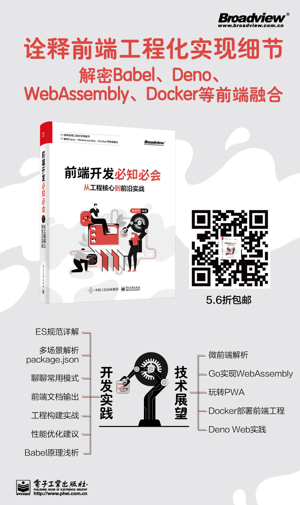

# 书名：前端开发必知必会：从工程核心到前沿实战

### 简介

历时一年多完成的一本前端书。本书以前端工程化和拓展前端视野为两条主线：一方面系统介绍工程化基础，结合开发中的细节系统讲解，夯实工程化的基础，更注重实战。详细介绍日常开发中的常用工具和配置。提高前端开发者的技术含量，让前端开发更有价值。

另一方面拓展前端视野，介绍以single-spa为基础的微前端实践、PWA实例，快捷方便部署方式和Docker结合。为了提高前端代码的执行效率，把Go语言的代码编译成JavaScript代码，想在这几个方面提高都可以从本书中找到参考。

* ES规范，Deno web实现
* 前端核心要素
* 构建必知必会（webpack, Parcel，Rollup，Vite）
* 前端性能优化
* 模块化规范
* 微前端、webassembly，Docker与前端结合

### 进度

| Note:  |
| :----- |
| 已出版 |

### 购买地址

当当、淘宝也均有销售，欢迎下单，并添加微信18191976090 加入读者群

### 计划

| 章节  | 开始时间 | 结束时间 | 当前状态 | 是否有延期 | 计划完成 | 第二轮润色| 计划完成 |
|:---:| ---- | ---- | ---- |:-----:|:-----:| :-----:| :-----:|
| 第一章 |      |      |   已完成   |  -  | - | -  |-  |
| 第二章 | - |      | 已完成  |   -   |  - | -  | -  |
| 第三章 | - |     |   已完成   |  -  |   -  | -  | -  |
| 第四章 | 2.5  | 3.15 | 已完成 | -    |  - | -  | -  |
| 第五章 | 3.28 | 4.30 | 已完成 | -     |  -  | -  | -  |
| 第六章 | 5.18 | 6.18 | 已完成 | -    |  - | -  | -  |

### 目录

- [第 1 章: 前端开发核心及Deno Web实战](https://github.com/houyaowei/front-end-complete-book/blob/master/chapters/01-frameworks-and-tendency.md)
- [第 2 章：前端工程化核心](https://github.com/houyaowei/front-end-complete-book/blob/master/chapters/02-front-end-process.md)
- [第 3 章: 前端必会的构建工具实战](https://github.com/houyaowei/front-end-complete-book/blob/master/chapters/03-css-have-to-say.md)
- [第 4 章: 前端核心模块的设计与实现](https://github.com/houyaowei/front-end-complete-book/blob/master/chapters/04-arc-core.md)
- [第 5 章: 性能优化指南](https://github.com/houyaowei/front-end-complete-book/blob/master/chapters/05-perfermance.md)
- [第 6 章: 实践：从0开发微前端和WebAssembly](https://github.com/houyaowei/front-end-complete-book/blob/master/chapters/06-expaction.md)

## License

© houyaowei  

本作品采用[知识共享署名-非商业性使用 4.0 国际许可协议](https://creativecommons.org/licenses/by-nc/4.0/)进行许可。
