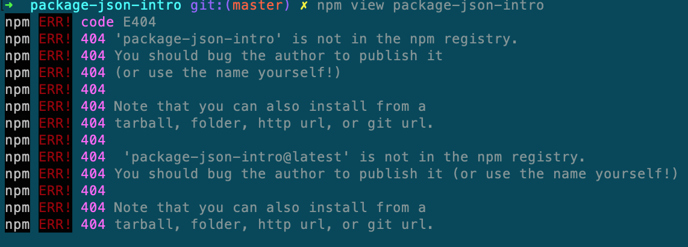
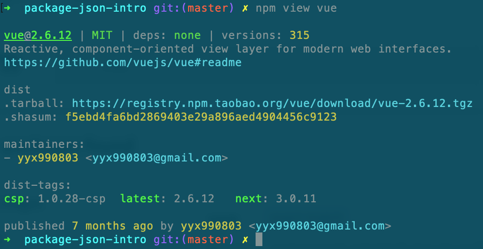
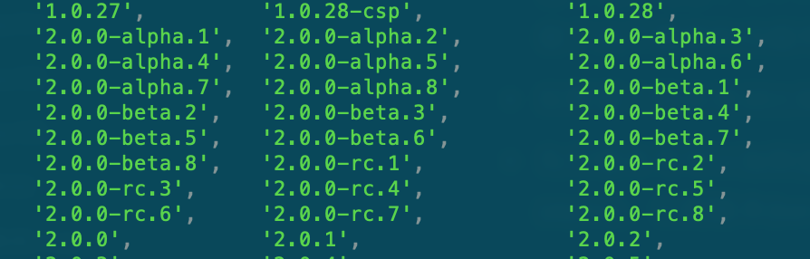
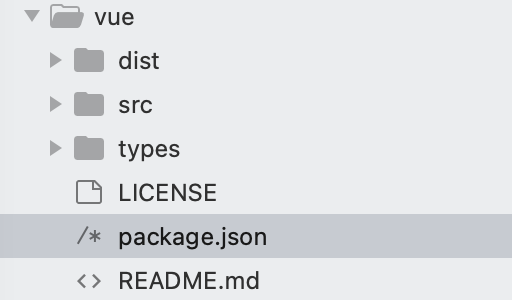
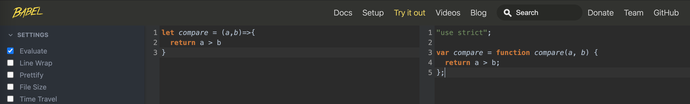
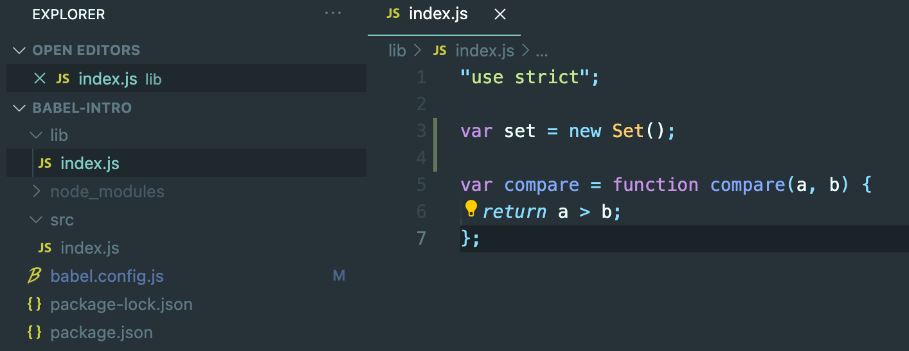

## 第1章 前端开发基础

先省略，还没想好内容。

主要涉及到：

1. 重温package.json。

2. 配置babel7。

3. 走过不能错过的ES规范。

4. 使用Deno换一种方式开发。

   


#### 1.1 重温package.json

如果问任何一位前端开发“你对package.json文件熟悉吗？”，你可能会得到一个斩钉截铁的回答，“很熟悉啊，每个前端项目都有这个文件，配置项目启动、打包命令，声明依赖的npm包。” 这样的配置很适合常见的web工程。如果你打开一个npm包的package.json，那么你可能会发现，比常见的web工程的配置要多一些，我们就以vue@2.6.12版本为例，看下它的package.json都包含了哪些配置。

```json
{
  "name": "vue",
  "version": "2.6.12",
  "description": "",
  "main": "dist/vue.runtime.common.js",
  "module": "dist/vue.runtime.esm.js",
  "unpkg": "dist/vue.js",
  "jsdelivr": "dist/vue.js",
  "typings": "types/index.d.ts",
  "files": [],
  "sideEffects": false,
  "scripts": {},
  "gitHooks": {},
  "lint-staged": {},
  "repository": {},
  "keywords": [],
  "author": "Evan You",
  "license": "MIT",
  "bugs": {},
  "homepage": "https://github.com/vuejs/vue#readme",
  "devDependencies": {},
  "config": {
    "commitizen": {
      "path": ""
    }
  }
}

```

这么多的配置项不知道和你预想的有没有差距？

package.json做为web工程的入口到底有多少配置是和我们的日常相关？哪些配置是和npm包相关的？又有什么配置会和其他三方工具有交集？怎么和三方工具配合能给日常开发提供便利？下面我们一点一点来剖析这个文件。

先使用npm或者yarn生成一个最简单的package.json文件:

> 备注：笔者npm版本为 6.12.0

```shell
yarn init -y
```

```json
{
  "name": "package-json-intro",
  "version": "1.0.0",
  "main": "index.js",
  "license": "MIT",
  "scripts": {
    "test": "echo \"Error: no test specified\" && exit 1"
  },
  "keywords": [],
  "author": "",
  "description": ""
}
```

这是一个JSON对象，每一项都是该项目的配置。各个配置代表的意思如下：

- name：项目名称，必须字段。 
- version：项目版本，必须字段。
- main：入口文件
- license: 项目遵守的许可证
- scripts： 可运行的npm命令
- keywords：关键词
- author：作者
- description: 项目描述

package.json中有两个字段比较特殊，name和version，规范要求是必须字段。需要对这两个字段做下详细说明。先看下name字段：

- 长度须小于等于214个字符，不能以"."或者"_"开头，不能包含大写字母。

- 名字可以作为参数被传入require("")，用来导入模块，所以尽量语义化。

- 字段不能与其他模块名重复，可以使用**npm view <packageName>**查询是否重复

  如果不重复，就提示404

  

<center>图1-1</center>      

如果npm上有对应的包，会显示包的详细信息:



<center>图1-2</center>

再看下version字段：

- 遵守语义化版本 2.0.0（ SemVer）规范。格式为： **主版本号.次版本号.修订号**。主版本号表示做了不兼容的 API 修改，次版本号表示做了向下兼容的功能性新增，修订号表示做了向下兼容的bug修复。
- 如果某个版本改动比较大、并且不稳定，可能无法满足预期的兼容性需求时，还是要先发布先行版本。
- 先行版本号可以加到**主版本号.次版本号.修订号**的后面，通过 `-` 号连接以点分隔的标识符和版本编译信息：内部版本(alpha)，公测版本(beta)，候选版本rc（即 Release candiate），如图1-3所示的vue发布的版本号：



<center>图1-3</center>

- 查看npm包的版本信息，以vue包为例：

  查看最新版本：npm view vue version

  查看所有版本：npm view vue versions

keywords： 包关键字，会对包中的 `description` 字段和 `keywords` 字段进行匹配，写好 `package.json`中的 `description` 和 `keywords` 将有利于增加包的曝光率。

依赖包：

npm包声明会添加到dependencies或者devDependencies中，dependencies中的包指定了项目在生产运行所必须的包。devDependencies中声明的是开发阶段需要的包，如webpack，eslint，babel等，用来辅助开发，打包上线时并不需要这些包。所以大家要根据包的实际用处声明到适当的位置。

若希望在包找不到或者安装失败时，npm继续运行，可将该包放在optionalDependencies对象中。optionalDependencies会覆盖dependencies中同名的，需要特别注意。

scripts脚本：

package.json内置脚本入口，是stage-value键值对配置，key为可运行的命令，通过npm run <stage>执行命令。除了运行基本的scripts命令，还可以结合pre和post完成前置、后续操作，该操作可以类比单元测试用的setUp和tearDown。我们先看一组scripts：

```javascript
"scripts": {
    "dev": "node index.js",
    "predev": "node beforeIndex.js",
    "postdev": "node afterIndex.js"
 },
```

这三个文件中都只有一句console语句：

```javascript
//index.js
console.log("scripts : index.js")

//beforeIndex.js
console.log("scripts: before index.js ")

//afterIndex.js
console.log("scripts: after index.js ")
```

现在我们只执行`npm run dev`,看下效果是什么样的：

```shell
$ node beforeIndex.js
scripts: before index.js 
$ node index.js
scripts : index.js
$ node afterIndex.js
scripts: after index.js 
```

这三个script都执行了，执行的顺序是 `predev-> dev -> postdev`。如果scripts命令存在一定的先后关系，采取这种pre&post scripts不失为一种好的方案。

files配置：

files是一个数组配置，用来描述作为依赖包安装时所描述的文件列表。当npm包release时，files指定哪些文件会被推送到npm服务器，如果指定的是文件夹，那么该文件夹下面的所有的文件都会被提交。

如果有文件不想提交，可以在.npmignore中说明。我们看下vue包中的配置：

```json
"files": [
    "src",
    "dist/*.js",
    "types/*.d.ts"
 ],
```



<center>图1-4</center>

入口文件main：

用来指定加载的入口文件，browser 、 node 环境均可使用。如果项目发布成了`npm` 包，用户安装后并且使用require('my-module')` 返回的就是 `main` 字段中所列出文件的 `module.exports` 属性。如果不指定该字段，node会尝试加载根目录的`index.js、index.json或index.node`，如果都没有找到，就会报错，只能通过require('my-module/dist/xxx.js')这种方式加载。

module配置：

定义 npm 包的 ESM 规范的入口文件，browser 环境和 node 环境均可使用。

browser配置：

npm 包在 browser 环境下的入口文件。

不知道读者有没有发现，main、module、browser这三项配置都是和入口文件相关，


我们之所以把main、module、browser三者放在一起介绍，是因为这几项间还是有差别的，特别是在不同的使用场景下。

在web环境下，如果使用loader加载的是ESM（ES module），那么这三项配置加载的顺序是browser > module > main，如果使用require加载的commonjs模块，加载的顺序并没有什么变化； 

webpack在进行项目构建的时候，有一个target选项，默认为 web，即构建web 应用。如果我们需要编译一些同构项目，如node 项目，我们只需要将 webpack.config.js的 `target` 选项设置为 `node` 进行构建即可。

如果是在node环境中，加载commonjs模块或者ESM，只有main字段有效；

engines配置：

我们平时在维护一些遗留项目都时候，对npm版本或者node的版本可能会有特殊的要求。如果不满足条件可能会出现各种各样奇怪的问题。为了让项目能开箱即用，可以在engines中说明具体的版本号。

```json
"engines": {
    "node": ">=8.10.3 <12.13.0",
    "npm": ">= 6.9.0"
 }
```

需要注意的是，engines属性仅起到说明的作用，即使用户安装的版本不符合也不影响依赖包的安装。

bin配置：

许多包都有一个或多个可执行文件，这鞋可以使用**npm link**命令导入到全局路径里面,可以在任意目录下执行。如脚手架工具create-react-app工具中react-scripts，

```js
"bin": {
    "react-scripts": "./bin/react-scripts.js"
 }
```

还有vue-cli脚手架中的@vue包，

```
"bin": {
    "vue": "bin/vue.js"
},
```

都是这样可以的道理。如上面两个配置在package.json提供一个映射到本地本地文件名的bin字段，定义后npm将软链接这个文件到prefix/bin里面,以便于全局引入,或者链接到本地的./node_modules/.bin/目录里在本项目中使用。

config配置：

该对象字段用来配置scripts运行的配置参数，如图:

```js
{
  "name": "package-json-intro",
  "scripts": {
    "dev": "node server.js"
  },
  "config": {
    "port": 9002
  }
}
```

如果运行**yarn run start**, 该port字段会映射到 npm_package_config_port环境变量，

```js
const http = require("http")
console.log(process.env.npm_package_config_port)
http.createServer(function (req, res) {
	res.end('Hello World\n');
}).listen(process.env.npm_package_config_port);
```

如果像改其他端口，可以使用：

```shell
npm config set foo:port 80
```

author、license、repository、homepage、bugs配置：

author：指明作者

license：该包或者工程需要遵守的协议。

repository：是一个对象配置，type说明是git库还是svn库，url说明该包或者工程源代码地址。

bugs：指明该包或者工程的bug地址或者反馈问题的email，可以指定一个或者两个，便于author快速搜集、处理问题。

```
{ 
  "url" : "https://github.com/owner/project/issues",
  "email" : "project@hostname.com"
}
```

os、cpu配置：

os:  如果我们开发的npm包只希望运行在darwin 系统下，避免发生不必要的异常windows用户不要安装，这时候os配置就可以帮我们实现这样的效果

```json
"os" : [ "darwin", "linux" ] #适用的系统
"os" : [ "!win32" ]          #黑名单系统
```

cup：该配置和os对配置类似，用 cpu字段更精准的限制用户安装环境。

```json
"cpu" : [ "x64", "AMD64" ] # 适用用
"cpu" : [ "!arm", "!mips" ] # 黑名单
```

publicConfig配置：

一组配置值，发布时使用。比如使用registry指定发布的地址，发布指定的tag，access（public，restricted）等配置。


以上咱们介绍的都是package.json的标准配置。但是在开发工程中项目牵涉到很多的三方包，如eslint，typings，webpack等，这些包怎么和package.json配合使用的，下面看下常见的几个配置：

unpkg配置：

npm上所有的文件都开启了cdn服务，该CDN服务由unpkg提供。

```json
"unpkg": "dist/vue.js",
```

默认访问文件`https://unpkg.com/vue@2.6.12/dist/vue.js`。

jsdelivr配置：jsdelivr免费CDN服务配置。

sideEffects配置：

该项为webpack的辅助配置，是v4开始新增了一个特性，声明该包/模块是否包含 sideEffects(副作用)。原理是 webpack 能将标记为 side-effects-free 的包由 `import {a} from xx` 转换为 `import {a} from 'xx/a'`，从而自动去掉不必要的模块。如果我们引入的 包/模块标记了 `sideEffects: false`了，那么不管它是否真的有副作用，只要它没有用到，整个模块/包同样都会被完整的移除。

typings配置：

ts的入口文件，作用同main配置。

lint-staged配置：

lint-staged 是一个在git暂存文件上运行linters的工具，配置后每次修改一个文件就给所有文件执行一次lint检查，通常配合githooks一起使用，并且配置好检查工具。

```json
"lint-staged": {
    "*.js": [
      "eslint --fix",
      "git add"
    ]
 }
```

gitHooks配置：

定义一个钩子，在提交(commit)之前执行eslint检查。当执行 lint 命令后，会自动修复暂存区的文件。修复之后的文件并不存在于暂存区中，所以需要用 `git add` 将修复后的文件重新加入到暂存区。`"pre-commit"` 执行完成后，如果没有错误，就会执行 `git commit` 操作。

```json
"gitHooks": {
    "pre-commit": "lint-staged",
}
```

standard配置：

standard是一个js代码检查和优化的工具库。也可以再package.json中增加相应的配置来优化代码。

```json
{
  "standard": {
    "parser": "babel-eslint",
    "ignore": [
      "**/out/",
      "/lib/xx/",
      "/lib2/xx/"
    ]
  }
}
```

browserlist配置：

设置浏览器的兼容情况

babel配置：

babel编译配置:

```json
"babel": {
    "presets": ["@babel/preset-env"],
    "plugins": [...]
}
```


#### 1.2 Babel7

babel是前端开发中最常见的三方工具了。功能就是转义ECMAScript2015+语法的代码，保证比较新的语法也可以旧版本的浏览器中运行，再者就是可以通过 `Polyfill`方式在目标环境中添加缺失的特性，第三就是源码转换功能。掌握babel的详细配置对我们日常开发和定位问题是大有裨益。

该部分我们详细介绍Babel的配置和用法，介绍每项配置的引入的原因，搞清楚@babel/runtime，`@babel/polyfill`，`@babel/plugin-transform-runtime`这些库到底是用来做什么的，介绍preset和plugin配置是什么作用。

babel官方了简单的界面操作，通过一个简单的compare函数看下简单的转换结果,如1-5所示：



<center>图1-5</center>

我们输入的是最基本的箭头函数，经过babel的转换后，转换成了基本的function。就是这么简单，它不会运行我们的代码，也不会去打包我们的代码。

我们搭建一个本地环境，先建立根目录并生成package.json文件。

```shell
~ mkdir babel-intro && cd babel-intro
~ npm init -y
```

先安装@babel/core和@babel/cli包，core是babel核心包，其他的@babel/cli、@babel/polyfill包都要在核心包上才能正常工作。@babel/cli是babel 提供的命令行工具，主要是提供 `babel` 命令。

```shell
npm install --save-dev @babel/core @babel/cli
```

接着安装@babel/preset-env和@babel/polyfill。@babel/preset-env 会根据你配置的目标环境，生成插件列表来编译。目标环境可以通过在package.json中的browserslist进行配置。Babel默认只转换新的JavaScript语法，但是不转换新的API，比如Iterator、Generator、Set、Maps、Proxy、Reflect、Symbol、Promise等全局对象，以及一些定义在Object对象上的方法（比如`Object.assign`）都不会转换。如果还想正常执行，就需要使用polyfill了。

```shell
npm install --save-dev @babel/preset-env @babel/polyfill
```

下一步在package.json统计目录下建一个配置文件，babel中配置文件有几种：

第一种是babel.config.js，配置内容格式大致如下：

```js
module.exports = function (api) {
  api.cache(true);

  const presets = [ ... ];
  const plugins = [ ... ];

  return {
    presets,
    plugins
  };
}
```

第二种是.babelrc，配置文件内容为json数据结构

```json
{
  "presets": [...],
  "plugins": [...]
}
```

第三种是在package.json中配置babel字段，该配置我们再1.1章节已经介绍过

```json
{
  "name": "babel-intro",
  "version": "1.0.0",
  "babel": {
    "presets": [ ... ],
    "plugins": [ ... ],
  }
}
```

最后一种是.babelrc.js，配置同.babelrc，但是需要使用JavaScript实现。

```js
const presets = [ ... ];
const plugins = [ ... ];

module.exports = { presets, plugins };
```

这四种添加配置文件的方式中，我们最常用的还是babel.config.js和.babelrc这两种方式，更加babel官方建议，推荐babel.config.js配置。因为该配置是项目级别的配置，会影响整个项目中的代码，包含node_modules，有了babel.config.js 就不会在去执行.babelrc的配置。.babelrc只影响本项目中的代码。

我们也采用babel.config.js的方式

```js
module.exports = function (api) {
  api.cache(true);
  const presets = ["@babel/preset-env"];
  const plugins = [];
  return {presets, plugins};
}
```

接下来在src目录下新建一个文件，并输入基本的测试代码，箭头函数：

```js
let compare= (a,b)=> {
  return a > b;
}
```

在package.json中配置scripts脚本

```
"build": "babel src --out-dir lib"
```

使用@babel/cli提供的babel命令，编译src目录下的js文件，将编译后的文件输出到lib目录下；

```shell
npm run build
```



<center>图1-6</center>

有人可能会有疑问"babel是怎么实现代码转换的呢？怎么才能快速掌握babel的编译过程呢？" 下面我们一点点介绍。

babel同大多数的编译器一样，它的工作过程也分成三部分：

- 解析（Parse）：将源代码转换成抽象语法树（abstract syntax tree），抽象语法树是源代码的抽象语法结构的树状表示形式，树上的每个节点都表示源代码中的一种结构。
- 转换（transfrom）：对AST做一些特殊处理，使其符合编译器的期望，babel中主要使用转换插件来实现。
- 代码生成（generate）：将第二步经过转换过的（抽象语法树）生成新的代码。

接下来就从上面简单的例子来说明下babel的工作工程。

```js
let { parse } = require("@babel/parser");
let {default: generate} = require('@babel/generator');

let code = "let compare= (a,b)=> {" +
  "return a > b;" +
"}";

let ast = parse(code);
let targetCode = generate(ast)
```

parse过程分为两个部分：词法分析、语法分析

词法分析：

编译器读取我们的代码，然后把按照预定的规则把分词后的内容合并成一个个的标识tokens。同时，移除掉空白符，注释等。最后，整个代码将被分割进一个tokens列表。compare函数被分割的token列表，如下：

```js
[
    { "type": "Keyword", "value": "let"},
    { "type": "Identifier", "value": "compare"},
    { "type": "Punctuator", "value": "="},
    { "type": "Punctuator", "value": "(" },
    { "type": "Identifier", "value": "a"},
    { "type": "Punctuator", "value": ","},
    { "type": "Identifier", "value": "b"},
    { "type": "Punctuator", "value": ")"},
    { "type": "Punctuator", "value": "=>"},
    { "type": "Punctuator", "value": "{" },
    { "type": "Keyword", "value": "return"},
    { "type": "Identifier", "value": "a" },
    { "type": "Punctuator", "value": ">"},
    { "type": "Identifier", "value": "b"},
    { "type": "Punctuator", "value": ";"},
    { "type": "Punctuator", "value": "}" }
]
```

语法分析：

也叫解析器。它会将词法分析出来的数组转化成树形的表达形式。同时，验证语法，语法如果有错的话，抛出语法错误。

```json
{
  "type": "Program",
  "start": 0,
  "end": 41,
  "body": [
    {
      "type": "VariableDeclaration",
      "start": 1,
      "end": 41,
      "declarations": [
        {
          "type": "VariableDeclarator",
          "start": 5,
          "end": 41,
          "id": {
            "type": "Identifier",
            "start": 5,
            "end": 12,
            "name": "compare"
          },
          "init": {
            "type": "ArrowFunctionExpression",
            "start": 14,
            "end": 41,
            "id": null,
            "expression": false,
            "generator": false,
            "async": false,
            "params": [
              {
                "type": "Identifier",
                "start": 15,
                "end": 16,
                "name": "a"
              },
              {
                "type": "Identifier",
                "start": 17,
                "end": 18,
                "name": "b"
              }
            ],
            "body": {
              "type": "BlockStatement",
              "start": 22,
              "end": 41,
              "body": [
                {
                  "type": "ReturnStatement",
                  "start": 26,
                  "end": 39,
                  "argument": {
                    "type": "BinaryExpression",
                    "start": 33,
                    "end": 38,
                    "left": {
                      "type": "Identifier",
                      "start": 33,
                      "end": 34,
                      "name": "a"
                    },
                    "operator": ">",
                    "right": {
                      "type": "Identifier",
                      "start": 37,
                      "end": 38,
                      "name": "b"
                    }
                  }
                }
              ]
            }
          }
        }
      ],
      "kind": "let"
    }
  ],
  "sourceType": "module"
}
```

这里，我们需要解释一下AST树中的关键字段，根节点"type": "VariableDeclaration"表示变量声明，"declarations": [ ]表示具体的声明，kind声明变量类型。

接着看declarations内部，声明了一个变量，并且知道了它的内部属性（id、init，start，end），然后我们再以此访问每一个属性以及它们的子节点。`id` 是一个 Idenrifier，name 属性表示变量名。

```json
{
    type: 'Identifier',
    name: 'add'
}
```

以上结构表示一个标识符。

接着看之后是init部分，init 也有好几个内部属性组成：

- type是`ArrowFunctionExpression`，表示这是一个箭头函数。
- `params` 是这个箭头函数的入参，其中每一个参数都是一个 `Identifier` 类型的节点。
- `body` 属性是这个箭头函数的主体，type是BlockStatement，表示这是一个块级声明BlockStatement。
- 内层的body的type为ReturnStatement,表示返回内容声明。
- argument这是一个 BinaryExpression二项式：lef`、operator、right，分别表示二项式的左边变量、运算符以及右边变量。

