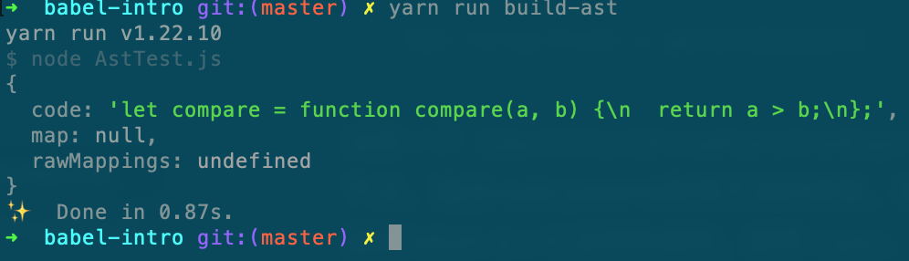
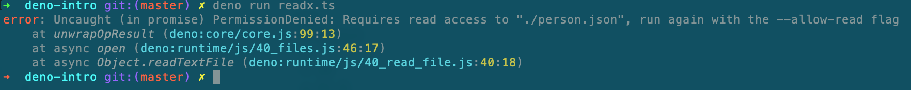
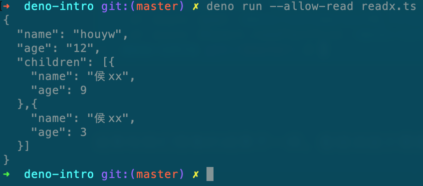
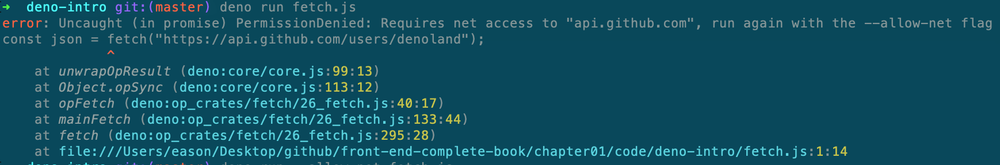
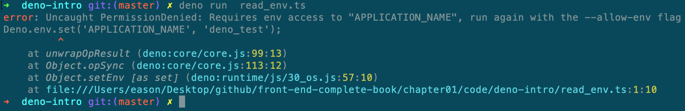
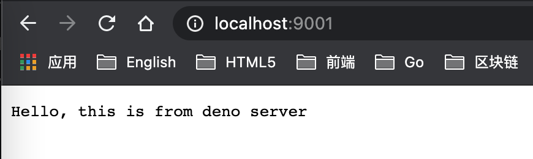
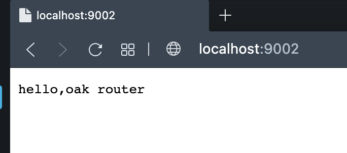
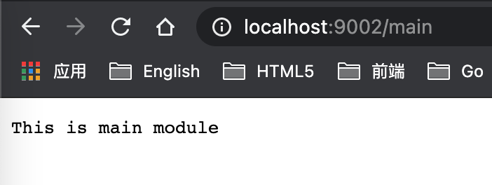

## 第1章 前端开发基础

在前端开发中，经常要和package.json文件、Babel和ES规范打交道，本章详细介绍这三部分的内容。另外，Deno给Web开发提供了新的开发方式，因此本章还会介绍Deno的基础模块、依赖模块、HTTP模块和Web开发。

本章主要内容如下：

1. package.json配置详述。

2. 配置babel7。

3. ES规范。

4. 使用Deno换一种方式开发。

   


#### 1.1 package.json配置详述

每个前端项目中都有package.json文件，在Web工程中，最常见的配置有配置项目启动、打包命令和声明依赖的npm包。如果打开一个npm包的package.json文件，则很可能会发现，它比常见的Web工程的配置要多一些。下面以vue@2.6.12版本为例，看一下它的package.json中都包含了哪些配置。

```json
{
  "name": "vue",
  "version": "2.6.12",
  "description": "",
  "main": "dist/vue.runtime.common.js",
  "module": "dist/vue.runtime.esm.js",
  "unpkg": "dist/vue.js",
  "jsdelivr": "dist/vue.js",
  "typings": "types/index.d.ts",
  "files": [],
  "sideEffects": false,
  "scripts": {},
  "gitHooks": {},
  "lint-staged": {},
  "repository": {},
  "keywords": [],
  "author": "Evan You",
  "license": "MIT",
  "bugs": {},
  "homepage": "https://github.com/vuejs/vue#readme",
  "devDependencies": {},
  "config": {
    "commitizen": {
      "path": ""
    }
  }
}

```

package.json文件作为Web工程的入口到底有多少配置是和我们的日常相关的？哪些配置是和npm包相关的？又有哪些配置和其他第三方工具有交集？怎么和三方工具配合能给日常开发提供便利？下面我们一点一点来剖析这个文件。

首先使用npm命令或者yarn命令生成一个最简单的package.json文件，注意，笔者的npm版本为 6.12.0。

```shell
yarn init -y
```

```json
{
  "name": "package-json-intro",
  "version": "1.0.0",
  "main": "index.js",
  "license": "MIT",
  "scripts": {
    "test": "echo \"Error: no test specified\" && exit 1"
  },
  "keywords": [],
  "author": "",
  "description": ""
}
```

这是一个JSON对象，每一项都是该项目的配置。各项配置的含义如下。

- name：项目名称，必需字段。 
- version：项目版本，必需字段。
- main：入口文件。
- license: 项目遵守的许可证。
- scripts： 可运行的npm命令。
- keywords：关键词。
- author：作者。
- description：项目描述。

package.json文件中有两个比较特殊的字段，即name和version，它们是必需字段。下面对这两个字段进行详细说明。

（1）name字段：

- 长度必须小于或等于214个字符，不能以“.”或者“_”开头，不能包含大写字母。

- 名字可以作为参数被传入require("")，用来导入模块，所以尽量语义化。

- 字段不能与其他模块名重复，可以使用**npm view <packageName>**查询是否重复。如果不重复，就提示404，如果1-1所示。

  

<center>图1-1</center>      

如果npm包上有对应的包，则会显示包的详细信息，如图1-2所示。


<center>图1-2</center>

（2）version字段：

- 遵守语义化版本 2.0.0（ SemVer）规范。格式为： **主版本号.次版本号.修订号**。主版本号表示做了不兼容的 API 修改，次版本号表示做了向下兼容的功能性新增，修订号表示做了向下兼容的bug修复。
- 如果某个版本的改动比较大、并且不稳定，可能无法满足预期的兼容性需求时，就需要发布先行版本。
- • 先行版本号可以加到***\*主版本号.次版本号.修订号\****的后面，通过 - 号连接以点分隔的标识符和版本编译信息：内部版本（alpha）、公测版本（beta）和候选版本rc（即 release candiate），图1-3所示的vue发布的版本号。


<center>图1-3</center>

- 查看npm包的版本信息，以vue包为例。

  查看最新版本：npm view vue version。

  查看所有版本：npm view vue versions。

keywords： 包关键字，会对包中的 `description` 字段和 `keywords` 字段进行匹配，写好 `package.json`中的 `description` 和 `keywords` 将有利于增加包的曝光率。

依赖包：

npm包声明会添加到dependencies或者devDependencies中，dependencies中的包指定了项目在生产运行所必需的包。devDependencies中声明的是开发阶段需要的包，如Webpack、eslint、babel等，用来辅助开发，打包上线时并不需要这些包。所以大家要根据包的实际用处声明到适当的位置。

若希望在包找不到或者安装失败时，npm能继续运行，可将该包放在optionalDependencies对象中。optionalDependencies会覆盖dependencies中同名的包，这点需要特别注意。

scripts脚本：

package.json内置脚本入口，是stage-value键值对配置，key为可运行的命令，通过npm run <stage>执行命令。除了运行基本的scripts命令，还可以结合pre和post完成前置、后续操作，该操作可以类比单元测试用的setUp和tearDown。

先看一组scripts：

```javascript
"scripts": {
    "dev": "node index.js",
    "predev": "node beforeIndex.js",
    "postdev": "node afterIndex.js"
 },
```

这三个文件中都只有一句console语句：

```javascript
//index.js
console.log("scripts : index.js")

//beforeIndex.js
console.log("scripts: before index.js ")

//afterIndex.js
console.log("scripts: after index.js ")
```

现在我们只执行npm run dev命令，看一下效果：

```shell
$ node beforeIndex.js
scripts: before index.js 
$ node index.js
scripts : index.js
$ node afterIndex.js
scripts: after index.js 
```

这三个script都执行了，执行的顺序是 `predev-> dev -> postdev`。如果scripts命令存在一定的先后关系，则采取这种pre&post scripts不失为一种好的方案。

files配置：

files是一个数组配置，用来描述作为依赖包安装时所描述的文件列表。当npm包release时，files指定哪些文件会被推送到npm服务器，如果指定的是文件夹，那么该文件夹下面的所有的文件都会被提交。

如果有文件不想提交，则可以在.npmignore中说明。首先看一下vue包中的配置，如图1-4所示

```json
"files": [
    "src",
    "dist/*.js",
    "types/*.d.ts"
 ],
```


<center>图1-4</center>

入口文件main：

用来指定加载的入口文件，在browser和node 环境中均可使用。如果项目发布成了npm 包，则用户安装并且使用require('my-module')后返回的就是main字段中所列出文件的module.exports属性。如果不指定该字段，则node会尝试加载根目录的index.js、index.json或index.node，如果都没有找到，就会报错，只能通过require('my-module/dist/xxx.js')这种方式加载。

module配置：

定义 npm 包的 ESM 规范的入口文件，在browser 环境和 node 环境中均可使用。

browser配置：

npm 包在 browser 环境下的入口文件。

不知道读者有没有发现，main、module、browser这三项配置都是和入口文件相关，

注意：main、module和browser这三项配置都和入口文件相关。之所以把它们放在一起介绍，是因为这几项之间是有差别的，特别是在不同的使用场景下。在Web环境下，如果使用loader加载ESM（ES module），那么这三项配置的加载顺序是browser > module > main；如果使用require加载CommonJS模块，则加载的顺序没有变化。 

Webpack在进行项目构建时，有一个target选项，默认为 Web，即构建Web 应用。如果需要编译一些同构项目，如node 项目，则只需将 webpack.config.js的 target 选项设置为 node 进行构建即可。

如果是在node环境中加载CommonJS模块或者ESM，则只有main字段有效。

engines配置：

日常在维护一些遗留项目时，对npm包的版本或者node的版本可能会有特殊的要求。如果不满足条件，则可能会出现各式各样奇怪的问题。为了让项目能开箱即用，可以在engines中说明具体的版本号。

```json
"engines": {
    "node": ">=8.10.3 <12.13.0",
    "npm": ">= 6.9.0"
 }
```

需要注意的是，engines属性仅起到说明的作用，即使用户安装的版本不符合，也不影响依赖包的安装。

bin配置：

许多包都有一个或多个可执行文件，可以使用***\*npm link\****命令把这些文件导入全局路径中，以便在任意目录下执行。如导入脚手架工具create-react-app的react-scripts中，

```js
"bin": {
    "react-scripts": "./bin/react-scripts.js"
 }
```

或是vue-cli脚手架的@vue包中。

```
"bin": {
    "vue": "bin/vue.js"
},
```

上面的两个配置在package.json中提供了一个映射到本地本地文件名的bin字段，之后npm将链接这个文件到prefix/bin里面，以便全局引入，或者链接到本地的./node_modules/.bin/目录中，以便在本项目中使用。

config配置：

该对象字段用来配置scripts运行的配置参数，如下所示。

```js
{
  "name": "package-json-intro",
  "scripts": {
    "dev": "node server.js"
  },
  "config": {
    "port": 9002
  }
}
```

如果运行**yarn run start** ，则该port字段会映射到 npm_**package****_**config_port环境变量:

```js
const http = require("http")
console.log(process.env.npm_package_config_port)
http.createServer(function (req, res) {
	res.end('Hello World\n');
}).listen(process.env.npm_package_config_port);
```

如果像改其他端口一样，则可以使用：

```shell
npm config set foo:port 80
```

author、license、repository、homepage、bugs配置。

author：指明作者。

license：该包或者工程需要遵守的协议。

repository：是一个对象配置，type说明是Git库还是svn库，URL说明该包或者工程源代码地址。

bugs：指明该包或者工程的bug地址或者反馈问题的email，可以指定一个或者两个，便于author快速搜集、处理问题。

```
{ 
  "url" : "https://github.com/owner/project/issues",
  "email" : "project@hostname.com"
}
```

os配置和CPU配置

os:  如果我们开发的npm包只希望运行在darwin 系统下，则为避免发生不必要的异常，建议Windows用户不要安装，这时候os配置就可以帮我们实现这样的效果。

```json
"os" : [ "darwin", "linux" ] #适用的系统
"os" : [ "!win32" ]          #黑名单系统
```

cup：该配置和os的配置类似，用 cpu字段可以更精准地限制用户的安装环境。

```json
"cpu" : [ "x64", "AMD64" ] # 适用用
"cpu" : [ "!arm", "!mips" ] # 黑名单
```

publicConfig配置：

一组配置值，在发布时使用。比如使用registry指定发布的地址来发布指定的tag，access（public，restricted）等配置。


以上咱们介绍的都是package.json的标准配置。但是在开发过程中，项目很可能涉及很多的第三方包，如eslint、typings、Webpack等，这些包怎样和package.json配合使用的，下面看下常见的几个配置。

unpkg配置：

npm上所有的文件都开启了CDN服务，该CDN服务由unpkg提供。

```json
"unpkg": "dist/vue.js",
```

默认访问文件`https://unpkg.com/vue@2.6.12/dist/vue.js`。

jsdelivr配置：jsdelivr免费CDN服务配置。

sideEffects配置：

该项为Webpack的辅助配置，是v4开始新增了一个特性，声明该包或模块是否包含 sideEffects（副作用）。原理是 Webpack 能将标记为 side-effects-free 的包由 import {a} from xx 转换为 import {a} from 'xx/a'，从而自动去掉不必要的模块。如果我们引入的 包或模块标记了 sideEffects: false，那么不管它是否真的有副作用，只要没有被用到，整个包或模块就会被完整地移除。

typings配置：

ts的入口文件，作用与main配置相同。

lint-staged配置：

lint-staged 是一个在Git暂存文件上运行linters的工具，配置后每次修改一个文件即可给所有文件执行一次lint检查，通常配合githooks一起使用，配置检查工具。

```json
"lint-staged": {
    "*.js": [
      "eslint --fix",
      "git add"
    ]
 }
```

gitHooks配置：

定义一个钩子，在提交（commit）之前执行eslint检查。当执行 lint 命令后，会自动修复暂存区的文件。修复之后的文件并不存储在暂存区中，所以需要用 git add 命令将修复后的文件重新加入暂存区。在执行完pre-commit 命令后，如果没有错误，就会执行 git commit 命令。

```json
"gitHooks": {
    "pre-commit": "lint-staged",
}
```

standard配置：

standard是一个js代码检查和优化的工具库，也可以在package.json中增加相应的配置来优化代码。

```json
{
  "standard": {
    "parser": "babel-eslint",
    "ignore": [
      "**/out/",
      "/lib/xx/",
      "/lib2/xx/"
    ]
  }
}
```

browserlist配置：设置浏览器的兼容情况

babel配置：这里是指babel编译配置，代码如下。

```json
"babel": {
    "presets": ["@babel/preset-env"],
    "plugins": [...]
}
```


#### 1.2 Babel7

Babel是前端开发中最常见的第三方工具，它的功能有三个。一是转义ECMAScript2015+语法的代码，保证比较新的语法也可以在旧版本的浏览器中运行；二是可以通过 Polyfill方式在目标环境中添加缺失的特性；三是源码转换功能。

本节详细介绍Babel的配置和用法，并介绍每项配置引入的原因，搞清楚@babel/runtime，`@babel/polyfill和@babel/plugin-transform-runtime`这些库到底是用来做什么的，介绍preset和plugin配置有什么作用。

下面通过一个简单的compare函数看看转换结果，如1-5所示。


<center>图1-5</center>

我们输入的是最基本的箭头函数，经过Babel的转换后，转换成了基本的function。就是这么简单，它不会运行我们的代码，也不会去打包我们的代码。

首先，搭建一个本地环境，先建立根目录并生成package.json文件。

```shell
~ mkdir babel-intro && cd babel-intro
~ npm init -y
```

先安装@babel/core和@babel/cli包，core是babel核心包，@babel/cli包和@babel/polyfill包都要在核心包上才能正常工作。@babel/cli是Babel 提供的命令行工具，主要是提供 Babel 命令。

```shell
npm install --save-dev @babel/core @babel/cli
```

其次，安装@babel/preset-env和@babel/polyfill。@babel/preset-env 会根据配置的目标环境生成插件列表来并进行编译。目标环境可以在package.json的browserslist中进行配置。Babel默认只转换新的JavaScript语法，但是不转换新的API，比如Iterator、Generator、Set、Maps、Proxy、Reflect、Symbol和 Promise等全局对象，以及一些定义在Object对象上的方法（比如Object.assign）都不会转换。如果还想正常执行，就需要使用polyfill了。

```shell
npm install --save-dev @babel/preset-env @babel/polyfill
```

再次，在package.json统计目录下新建一个配置文件，Babel中的配置文件有以下四种。

第一种是babel.config.js，配置内容大致如下：

```js
module.exports = function (api) {
  api.cache(true);

  const presets = [ ... ];
  const plugins = [ ... ];

  return {
    presets,
    plugins
  };
}
```

第二种是.babelrc，配置文件内容为JSON数据结构。

```json
{
  "presets": [...],
  "plugins": [...]
}
```

第三种是在package.json中配置babel字段，该配置我们在1.1节已经介绍过。

```json
{
  "name": "babel-intro",
  "version": "1.0.0",
  "babel": {
    "presets": [ ... ],
    "plugins": [ ... ],
  }
}
```

最后一种是.babelrc.js，配置与.babelrc相同，但是需要使用JavaScript实现。

```js
const presets = [ ... ];
const plugins = [ ... ];

module.exports = { presets, plugins };
```

在这四种添加配置文件的方式中，最常用的是babel.config.js和.babelrc，Babel官方推荐babel.config.js配置。因为该配置是项目级别的配置，会影响整个项目中的代码，包括node_modules。有了babel.config.js 之后，就不会去执行.babelrc的配置。.babelrc只影响本项目中的代码。

本节采用babel.config.js配置。

```js
module.exports = function (api) {
  api.cache(true);
  const presets = ["@babel/preset-env"];
  const plugins = [];
  return {presets, plugins};
}
```

接下来在src目录下新建一个文件，并输入基本的测试代码，箭头函数：

```js
let compare= (a,b)=> {
  return a > b;
}
```

在package.json中配置scripts脚本。

```
"build": "babel src --out-dir lib"
```

使用@babel/cli提供的babel命令，编译src目录下的JavaScript文件，将编译后的文件输出到lib目录下，如图1-6所示。

```shell
npm run build
```


<center>图1-6</center>

Babel的工作过程。

Babel与大多数的编译器一样，它的工作过程可分成三部分：

- 解析（Parse）：将源代码转换成抽象语法树（Abstract Syntax Tree，AST），抽象语法树是源代码的抽象语法结构的树状表示形式，树上的每个节点都表示源代码中的一种结构。
- 转换（transfrom）：对抽象语法树做一些特殊处理，使其符合编译器的期望。在Babel中主要使用转换插件来实现。
- 代码生成（generate）：将转换过的（抽象语法树）生成新的代码。

下面通过一个简单的例子说明一下Babel的工作工程。

```js
let { parse } = require("@babel/parser");
let {default: generate} = require('@babel/generator');

let code = "let compare=(a,b)=> a > b";

let ast = parse(code,{
  sourceType: "module"
});
```

解析过程可分为两个部分：词法分析和语法分析。

词法分析：

词法分析：编译器读取代码之后，按照预定的规则把分词后的内容合并成一个个标识（tokens）。同时，移除空白符、注释等。最后，整个代码被分割进一个tokens列表。例如，compare函数被分割的token列表如下：

```js
[
    { "type": "Keyword", "value": "const" },
    { "type": "Identifier", "value": "compare" },
    { "type": "Punctuator", "value": "=" },
    { "type": "Punctuator", "value": "(" },
    { "type": "Identifier", "value": "a" },
    { "type": "Punctuator", "value": "," },
    { "type": "Identifier", "value": "b" },
    { "type": "Punctuator", "value": ")" },
    { "type": "Punctuator", "value": "=>" },
    { "type": "Identifier", "value": "a" },
    { "type": "Punctuator", "value": ">" },
    { "type": "Identifier", "value": "b" }
]
```

语法分析：也叫解析器。它会将词法分析出来的数组转化成树形的表达形式，同时验证语法。如果语法有错，就抛出语法错误。

```json
{
  "type": "Program",
  "start": 0,
  "end": 25,
  "body": [
    {
      "type": "VariableDeclaration",
      "start": 0,
      "end": 24,
      "declarations": [
        {
          "type": "VariableDeclarator",
          "start": 4,
          "end": 24,
          "id": {
            "type": "Identifier",
            "start": 4,
            "end": 11,
            "name": "compare"
          },
          "init": {
            "type": "ArrowFunctionExpression",
            "start": 13,
            "end": 24,
            "id": null,
            "expression": true,
            "generator": false,
            "async": false,
            "params": [
              {
                "type": "Identifier",
                "start": 14,
                "end": 15,
                "name": "a"
              },
              {
                "type": "Identifier",
                "start": 16,
                "end": 17,
                "name": "b"
              }
            ],
            "body": {
              "type": "BinaryExpression",
              "start": 21,
              "end": 24,
              "left": {
                "type": "Identifier",
                "start": 21,
                "end": 22,
                "name": "a"
              },
              "operator": ">",
              "right": {
                "type": "Identifier",
                "start": 23,
                "end": 24,
                "name": "b"
              }
            }
          }
        }
      ],
      "kind": "let"
    }
  ],
  "sourceType": "module"
}
```

这里，我们需要解释一下抽象语法树中的关键字段，根节点"type": "VariableDeclaration"表示变量声明，"declarations": [ ]表示具体的声明，kind表示声明的变量类型。

接着看declarations内部声明了一个变量，并且知道了它的内部属性（id、init、start、end），然后再以此访问每一个属性及它们的子节点。id 是 Idenrifier的简写，name 属性表示变量名。

```json
{
    type: 'Identifier',
    name: 'add'
}
```

以上结构表示一个标识符。

接着看之后是init部分，init 由好几个内部属性组成：

- type是`ArrowFunctionExpression`，表示这是一个箭头函数。
- `params` 是这个箭头函数的入参，其中每一个参数都是一个 `Identifier` 类型的节点。
- `body` 是这个箭头函数的主体，type是BlockStatement，表示这是一个块级声明BlockStatement。
- 内层的body的type为一个 BinaryExpression二项式：left、operator、right，分别表示二项式的左边变量、运算符以及右边变量。

下面进行语法转换，前面我们介绍过，Babel的语法转换是通过插件完成的。没有插件，抽象语法树经过生成器生成的代码和源代码一摸一样。Babel默认提供了许多插件，让我们方便地对抽象语法树进行操作。下面介绍两个比较重要的插件，同时用这两个插件实现一个简单的操作抽象语法树的过程。

```js
let types = require('@babel/types');
```

第一个是@babel/types，它的作用是创建、修改、删除、查找抽象语法树的节点。抽象语法树的节点可分为多种类型，比如，ExpressionStatement（表达式）、ClassDeclaration（类声明）和VariableDeclaration（变量声明）等。同样的，这些类型都有对应的创建方法：t.expressionStatement、t.classDeclaration、t.variableDeclaration。types也提供了对应的判断方法：t.isExpressionStatement、t.isClassDeclaration、t.isVariableDeclaration。

不过，这些插件需要和traverse遍历插件一起使用，因为types只能对单一节点进行操作。下面要介绍的插件是@babel/traverse。

```js
let traverse = require("@babel/traverse").default;
```

这个插件可对抽象语法树的所有节点进行遍历，并使用指定Visitor来处理相关的节点。

继续按本节最初的例子补充转换过程。

```js
let { parse } = require("@babel/parser");
let traverse = require("@babel/traverse").default;
let types = require('@babel/types');
let generate = require('@babel/generator').default;

let code = "let compare=(a,b)=> a > b"

let ast = parse(code,{
  sourceType: "module"
});

traverse(ast, {
  ArrowFunctionExpression: (path, state) => {
    let node = path.node;
    let id = path.parent.id;
    let params = node.params;
    let body= types.blockStatement([
      types.returnStatement(node.body)
    ]);
    let functionExpression = types.functionExpression(id,params,body,false,false);
    path.replaceWith(functionExpression);
  }
})

let targetCode = generate(ast)
```

当有一个 Identifier(ArrowFunctionExpression) 成员方法的Visitor时，访问的就是路径而非节点。所以需要通过path.node找到对应的节点。通过node.params获得方法的参数。使用types.blockStatement创建“{ }”的结构，使用 types.returnStatement(node.body)返回'return a > b'这样的结构。使用types.functionExpression(id,params,body,false,false)创建一个如下面所示的结构。

```js
function(a,b){
  return a > b
}
```

至此，就完成了新结构的创建。接下来，把原来的节点替换成新生成的节点。

```js
path.replaceWith(functionExpression);
```

下一步就是进入到编译的最后一步，代码生成。

经过代码转换之后，抽象语法树已经变成期望的结构，现在需要用@babel/generator插件做代码合成，生成需要的代码，如图1-7所示。

```js
let targetCode = generate(ast)
console.log(targetCode)
```



<center>图1-7</center>

转换后的代码谅可以交付给浏览器执行了。以上过程的核心在于代码转换，转换过程的核心在于插件。所以在开发中，Babel的插件配置是非常关键的一环。

```js
//babel.config.js
module.exports = function (api) {
  const presets = [];
  const plugins = ["@babel/plugin-transform-arrow-functions",
                    "@babel/plugin-transform-runtime"
                  ];

  return {presets, plugins};
}
```

如果配置了多个插件，那么执行顺序是按照从前到后依次执行的。

#### @babel/polyfill

polyfill，中文名称叫垫片，在计算机科学中，指的是对未能实现的客户端上进行的"兜底"操作。对前端开发而言，如果部分js特性在个别浏览器（特别是IE）上不支持，但是这些浏览器又要需要兼容，那么就需要提供一种机制能够正常运行。

例如ES6 的 object.assign 方法，即使是在IE11中运行也会报错

```
Object doesn't support propery or method 'assign'
```

对于这样独立的polyfill包有很多可以选择，如core-js，object-assign包，babel的transform-object-assign，babel-loader，也可以选择使用Polyfill.io服务，服务器会判断浏览器 UA 返回不同的 polyfill 文件，你所要做的仅仅是在页面上引入这个文件，polyfill 这件事就自动以最优雅的方式解决了。

当然@babel/polyfill(7.4.0版本后已经废弃)也是一种选择，直接提供了通过改变全局来兼容新API。可以在入口文件中引入

```js
import "@babel/polyfill";
```

或者添加在webpack.config.js的entry数组中

```js
module.exports = {
  entry: ["@babel/polyfill", "./app/js"],
};
```

该包会在项目代码前插入所有的 polyfill 代码，因为它带来的改变是全局的。

> 7.4以后可以使用
>
> import "core-js/stable";
>
>  import "regenerator-runtime/runtime";

#### @babel/runtime和@babel/plugin-transform-runtime

当全局导入polyfill包时，会造成全局污染，这显然不是一个很好的解决方案。因为在浏览器支持特性时，polyfill也就不是必须的。

@babel/plugin-transform-runtime是对 Babel 编译过程中产生的 helper 方法进行重新利用(聚合)，以达到减少打包体积的目的。此外还有个作用是为了避免全局补丁污染，对打包过的 bunler 提供"沙箱"式的补丁。

```shell
npm install --save-dev @babel/plugin-transform-runtime
```

需要在生产环境中加入@babel/runtime，

```shell
npm install --save @babel/runtime
```

在babel的配置文件中增加配置

```json
"plugins": ["@babel/plugin-transform-runtime"]
```

也可以带具体的参数

```json
{
  "plugins": [
    [
      "@babel/plugin-transform-runtime",
      {
        "absoluteRuntime": false,
        "corejs": false,
        "helpers": true,
        "regenerator": true,
        "version": "7.0.0-beta.0"
      }
    ]
  ]
}
```


##### preset配置

`@babel/preset-env` 这是一个预设的插件集合，包含了一组相关的插件，会根据目标环境来进行编译和打补丁。具体来讲，是根据参数 `targets` 来确定目标环境，默认情况下它编译为ES2015，可以根据项目需求进行配置

```json
resets: [
       [
         '@babel/preset-env',
         {
           // 支持chrome 58+ 及 IE 11+
           targets: {
             chrome: '58',
             ie: '11',
             edge: "17",
             safari: "11.1"
           }
         },
       ],
]
```

在预设配置中以targets指定了es6向后兼容的浏览器的最低版本，根据兼容的浏览器的最低版本对es6最新语法的支持性提供需要的转换插件。


#### 1.3 ES规范

截止到2021年3月9日，EcmaScript规范已经发布到了2021版的候选版本，6月份发布GA版。该版本也包含了几个实用的特性。本章，我们总结下从2016（ES7）-2021各个规范的新增特性，便于大家综合参考。

##### ES2021

`String.prototype.replaceAll`

在replaceAll方法出现前，字符串替换可以使用replace配合正则使用，看两个例子：

```js
'aabbcc'.replace(/b/g, '_'); // aa__cc

const queryString = 'q=b+c+d';
ueryString.replace(/\+/g, ''); //q=bcd
```

将所有的b替换成下滑线，如果不加正则，则替换第一个字符。

使用replaceAll实现相同的功能

```js
'aabbcc'.replaceAll('b', '_'); // aa__cc
const queryString = 'q=b+c+d';
queryString.replaceAll('+', ''); //q=bcd
```

使用新api后，好处有两点：代码的可读性更好，特殊符号不需要再转义。


`逻辑运算符`

逻辑赋值运算符结合了逻辑运算符和赋值表达式。逻辑赋值运算符有三种：`&&=`, `||=`, 和??=`

| 逻辑运算符 | 等价操作       | a为x时赋值 |
| ---------- | -------------- | ---------- |
| a \|\|= b  | a \|\| (a = b) | Falsy      |
| a &&= b    | a && (a = b)   | Truthy     |
| a ??= b    | a ?? (a = b)   | Nullish    |

这个操作符也同样遵守逻辑短路（Short-circuiting）。当将逻辑操作与赋值组合起来时，因为赋值可能会导致副作用（side-effect），所以赋值操作应该是在某种条件下才进行赋值。无条件地造成副作用会对程序的性能甚至正确性产生负面影响。

```js
const deleteUsers = () => {
  return "users is empty";
};

const user = {
  id: "71002",
  name: "houyw",
  isAdmin: true
};
let users = user.isAdmin &&= deleteUsers(); // users is empty
```

```js
let goCode =" I go to coding"
const user2 = {
  id: "71002",
  name: "houyw",
  isSuperMan: false
};
let status = user2.isSuperMan ||= goCode;
console.log(status); // " I go to coding"
```

```js
let x = null;
let y = "hello";
console.log((x ??= y)); // "hello"
console.log((x = x ?? y)); // "hello
```


WeakRef

通常说，对js的对象都是强引用。就是说一旦保持对某个对象的引用，这个对象就不会被垃圾回收。但是在ES6中引入了WeakMap，WeakSet，这两者中的对象都是弱引用，垃圾回收机制不考虑 WeakSet 、WeakMap对集合中对象的引用，如果这些对象只要不再被引用，垃圾回收机制会自动回收该对象的内存，不考虑该对象是否还存在于 Weak集合之中。

```js
const wm = new WeakMap();

const ref = {};
const metaData = 'foo';
wm.set(ref, metaData);
wm.get(ref);
// → metaData
```

此时，在该代码块中不再保持对象ref的引用，垃圾回收机制随时可以对它进行回收。

WeakMap和WeakSet不是真正的弱引用，只要key是活动的，还是会保持这强引用。 一旦key被垃圾回收，Weak集合仅弱引用其内容。

WeakRef是一个高级api提供了真正的弱引用，允许创建对象的弱引用，跟踪现有对象时不会阻止对其进行垃圾回收。对于缓存和对象映射非常有用。浏览器需要运行垃圾回收时，如果对该对象的唯一引用是来自WeakRef变量，则JavaScript引擎可以安全地从内存中删除该对象并释放空间。

```js
const myWeakRef = new WeakRef({ 
  name: 'Cache', 
  size: 'unlimited' 
}) 
console.log(myWeakRef.deref()) 
```

使用WeakRef的构造方法构造一个实例，通过实例的deref方法访问变量。

`FinalizationRegistry` 接收一个注册器回调函数，可以利用该注册器为指定对象注册一个事件监听器，当对象被垃圾回收之后，会触发监听的事件。首先，创建一个注册器：

```js
const registry = new FinalizationRegistry((v) => {
  // ....
});
```

接着，注册一个指定对象，同时指定给注册器回调传递的参数：

```js
registry.register(taget, "some value");
```


数字分隔符

数字分隔符提供了一种能使大数字更易于阅读和使用的简单方法。

```
1000000000000      1_000_000_000_000
1019436871.42      1_019_436_871.42
```


Promise.any

接收几个Promise 对象，只要其中任意一个 promise 成功，就返回那个已经成功的 promise。如果所有的promise都失败，就返回一个失败的 promise。

```js
const promise1 = new Promise((resolve, reject) => {
  reject("失败");
});
const promise2 = new Promise((resolve, reject) => {
  setTimeout(resolve, 500, "slower");
});
const promise3 = new Promise((resolve, reject) => {
  setTimeout(resolve, 100, "faster");
});

const promises = [promise1, promise2, promise3];
Promise.any(promises).then((value)=>console.log(value));
// faster
```

和Promise.all 和Promise.race做下简单对比。Promise.all：只要有一个promise失败，就会返回失败；当所有的promise都成功后才会返回成功。Promise.race: 只要有一个promise状态发生改变，就会返回该promise。


##### ES2020

String.protype.matchAll

matchAll方法返回一个正则表达式在字符串的所有匹配。先实现一个例子匹配16进制的字符：

```js
const string = 'Magic hex numbers: DEADBEEF CAFE';
const regex = /\b\p{ASCII_Hex_Digit}+\b/gu;
for (const match of string.matchAll(regex)) {
  console.log(match);
}
```

返回结果：

```js
[
  'DEADBEEF',
  index: 19,
  input: 'Magic hex numbers: DEADBEEF CAFE',
  groups: undefined
]
[
  'CAFE',
  index: 28,
  input: 'Magic hex numbers: DEADBEEF CAFE',
  groups: undefined
]
```


动态导入（dynamic import）

动态导入提供了一种类似函数的新导入形式，与静态导入相比，有更多的新功能。

先看下静态导入：

```js
//utils.mjs
export default () => {
  console.log('Hi from the default export!');
};

// Named export `doStuff`
export const doStuff = () => {
  console.log('do something');
};
```

接下来就可以在script中导入

```js
<script type="module">
  import * as module from './utils.mjs';
  module.default();
  // 'Hi from the default export!'
  module.doStuff();
  // 'do something'
</script>
```

这种导入模块的语法形式是一个静态声明：它仅接受字符串文字作为模块标识，通过运行前的“链接”过程，引入bindings到本地作用域中。 静态导入只能在文件的顶层使用。

`import(specifier)`函数，支持动态加载模块, `import` 函数的参数 `specifier`，指定所要加载的模块的位置，返回promise对象。

```js
<script type="module">
  const moduleSpecifier = './utils.mjs';
  import(moduleSpecifier)
    .then((module) => {
      
    });
</script>
```


##### BigInt 

它提供了一种方法来表示大于 `2^53 - 1` 的整数，可以表示任意大的整数。具体用法是在一个整数字面量后面加 `n` 的方式定义一个 `BigInt`类型。

```js
let bn = BigInt(Number.MAX_SAFE_INTEGER) + 2n;
console.log(bn) // 9007199254740993n
const alsoHuge = BigInt(9007199254740991);
console.log(alsoHuge) //9007199254740991n
const hugeString = BigInt("9007199254740991");
console.log(hugeString) //9007199254740991n
const hugeHex = BigInt("0x1fffffffffffff");
console.log(hugeHex) //9007199254740991n

console.log("is BigInt:", typeof 2n === 'bigint')
```


##### Optional Chaining(可选链操作符)

?.` 也叫链判断运算符。允许开发读取深度嵌套在对象链中的属性值，而不必验证每个属性是否都存在。当引用为空时，返回 `undefined

```js
var travelPlans = {
  destination: "xi'an",
  monday: {
    location: "shangxi",
    time: "23:20",
    no: "mu5716"
  },
};
console.log(travelPlans.tuesday?.location); //undefined
console.log(travelPlans.monday?.location); //shangxi
```


##### Nullish coalescing(空位操作符)

`??` 运算符被称为空位操作符。如果第一个参数不是 falsely，将返回第一个参数，否则返回第二个参数。

```js
console.log(false ?? true);   // => false
console.log(0 ?? 1);         // => 0
console.log('' ?? 'default');  // => ''
console.log(null ?? []);      // =>[]
console.log(undefined ?? []); // => []
```


globalThis

获取不同环境的`this`,在ES2020规范之前，可以封装一层：

```js
const getGlobalThis = () => {
  // 适用webworker、service worker
  if (typeof self !== "undefined") return self;

  // 浏览器
  if (typeof window !== "undefined") return window;

  // Node.js
  if (typeof global !== "undefined") return global;

  // JavaScript shell
  if (typeof this !== "undefined") return this;

  throw new Error("Unable to locate global object");
};
```

现在就可以按照如下使用：

```js
const theGlobalThis = getGlobalThis();
```


##### 模块命名空间导出（module namespace export）

```js
import * as utils from './utils.mjs';
export { utils };
```


##### Promise.allSettled

Promise.allSettled 接受一组 Promise，返回新的 Promise 实例。等到所有这些参数实例都返回结果，不管是`fulfilled`还是`rejected`。

```js
const promise1 = Promise.resolve(3);
const promise2 = new Promise((resolve, reject) => setTimeout(reject, 100, 'foo'));
const promises = [promise1, promise2];

Promise.allSettled(promises).
  then((results) => results.forEach((result) => console.log(result.status)));
```


#### ES2019

Array.flat Array.flatMap

如果数组的成员还是数组，`flat()`将嵌套的数组“拉平”，变成一维的数组，参数指定。该方法返回一个新数组，对原数据没有影响。

```js
let origin = [1, ['aa','bb'], [3, ['cc','dd']]]
let _flat = origin.flat(2);
console.log(_flat)  //[ 1, 'aa', 'bb', 3, 'cc', 'dd' ]
console.log(origin) // [ 1, [ 'aa', 'bb' ], [ 3, [ 'cc', 'dd' ] ] ]
```

`flatMap()`只能展开一层数组

```js
const duplicate = (x) => [x, x];
let result = [2, 3, 4].flatMap(duplicate); // [ 2, 2, 3, 3, 4, 4 ]
```


Object.fromEntries

Object.fromEntries()，将键值对数组转为对象

```js
let _entry = Object.entries({ name:"ass", age:22})
console.log(_entry) //[ [ 'name', 'ass' ], [ 'age', 22 ] ]

let putorigin = Object.fromEntries(_entry);
console.log(putorigin) //{ name: 'ass', age: 22 }
```


String.trimStart   String.trimEnd

trimStart 去掉字符串头部的空格，`trimEnd去掉尾部的空格。它们都返回新字符串，不影响原始字符串。

```js
const s = "  houyw  ";

console.log(s.trim()); //houyw
console.log(s.trimStart()); // 'houyw  '
console.log(s.trimEnd()); // '  houyw'
```


Arrary.sort

```js
const doggos = [
  { name: 'Abby',   rating: 12 },
  { name: 'Bandit', rating: 13 },
  { name: 'Choco',  rating: 14 },
  { name: 'Daisy',  rating: 12 },
  { name: 'Elmo',   rating: 12 }
];
doggos.sort((a, b) => b.rating - a.rating);
```


JSON.stringfy改造

如果遇到 `0xD800` 到 `0xDFFF` 之间的单个码点，或者不存在的配对形式，会返回转义字符串。


Symbol description属性

ES2019为Symbol 提供了一个实例属性`description`，可以查看Symbol 的描述。

```js
const sym = Symbol("des");

sym.description; // "des"
```


##### ES2018

对象的Rest/Spread

ES6中 为数组引入了扩展运算符的功能，从ES2018 中，对象也开始支持。

```js
const person = {
  firstName: 'yw',
  lastName: 'hou',
  country: 'henan',
  state: 'cn',
};
const { firstName, lastName, ...rest } = person;
console.log(firstName); //yw
console.log(lastName); //hou
console.log(rest); //{ country: 'henan', state: 'cn' }

// Spread properties for object literals:
const personCopy = { firstName, lastName, ...rest };
console.log(personCopy); //{ firstName: 'yw', lastName: 'hou', country: 'henan', state: 'cn' }
```

Promise.finally

 该方法用于指定不管 Promise 对象最后状态如何，都会执行的操作。

```js
fetch(url)
.then(result => {···})
.catch(error => {···})
.finally(() => {···});
```

异步迭代器

循环遍历异步可迭代对象以及同步可迭代对象，包括: 内置的 `String`, `Array`，类似数组对象 (例如 arguments或 `NodeList`，`TypedArray`,`Map`, `Set` 和用户定义的异步/同步迭代器。

```
async function* asyncGenerator() {
  var i = 10;
  while (i < 3) {
    yield i++;
  }
}

(async function() {
  for await (num of asyncGenerator()) {
    console.log(num);
  }
})();
```


正则表达式

ES2018 引入 `s `修饰符(`dotAll`模式)，使`.`可以匹配任意单个字符。

```js
/obj.name/s.test("obj\nname"); // true
```

ES2018 为正则也引入了具名组匹配（Named Capture Groups），为每一组匹配指定一个名字，既便于阅读代码，又便于引用。

```js
const RE_DATE = /(?<year>\d{4})-(?<month>\d{1,2})-(?<day>\d{2})/;

let matchObj = RE_DATE.exec("2021-4-24");
console.log(matchObj.groups.year); //2021
console.log(matchObj.groups.month); //4
console.log(matchObj.groups.day); //24
```


#### ES2017

Object.values/Object.entries

`Object.values` 方法返回一个数组，返回对象自身的（不含继承的）所有可遍历（enumerable）属性的值。

```js
const obj = { foo: "bar", baz: 42 };
console.log(Object.values(obj)); //[ 'bar', 42 ]
```

`Object.entries`方法返回一个数组，返回对象自身的（不含继承的）所有可遍历（enumerable）属性的键值对数组，该方法也适合数组。

```js
const person = { name: "houyw", age: 19 };
console.log(Object.entries(person));

const people = ['Fred', 'Tony']
console.log(Object.entries(people)) //[ [ '0', 'Fred' ], [ '1', 'Tony' ] ]
```


字符串补全

`padStart(targetLength [, padString)`用于头部补全，`padEnd(targetLength [, padString)`用于尾部补全

```js
"x".padStart(4, "ab"); // 'abax'
"x".padEnd(5, "ab"); // '
```


异步函数（asnyc）

异步函数是 promises 和 generators(生成器) 的组合，简化了 promises 调用，提高了代码的可读性。

```js
async function getData() {
  const res = await fakeRequest();
  console.log(res);
}
```


Object.getOwnPropertyDescriptors

该方法返回对象的自身属性，不包括继承的。

```js
const person = { name: "houyw", age: 19 };
Object.getOwnPropertyDescriptors(person)
//输出
{
  name: {
    value: 'houyw',
    writable: true,
    enumerable: true,
    configurable: true
  },
  age: { value: 19, writable: true, enumerable: true, configurable: true }
}
```


#### 1.4 Deno开发入门

 deno是nodejs作者Ryan Dahl在2017年创立的项目，到现在已经发布到了1.9.2版本。这是一个安全的TS/js运行时，该运行时仍然是在V8的基础上使用rust开发，同时也内置了tsc引擎，用来解释typescript。event-loop由tokio提供支持。由于Rust原生支持WebAssembly，所以也能直接运行 WebAssembly。

deno主要有如下几个特性：

- 默认安全，外部代码没有文件系统、网络、环境的访问权限，除非显式开启。

- 支持开箱即用的 TypeScript的环境。

- 只分发一个独立的可执行文件（deno）。

- 有内建的工具箱，比如依赖信息查看器（deno info）和代码格式化工具（deno fmt）。

- 有一组经过审计的标准模块，保证能在 Deno 上工作。

- 脚本代码能被打包为一个单独的 JavaScript 文件。

Deno和node虽然出自一个人的手笔，但是是面向的对象是不同的。众所周知，node面向的是服务端，而Deno是要面向浏览器生态的。所以，Deno并不是要取代 Node.js，也不是下一代 Node.js，也不是要放弃 npm 重建 Node 生态。下面我们通过一个表格来对两者进行简单的对比。

|          | nodejs           | Deno                   |
| -------- | ---------------- | ---------------------- |
| API引入  | 模块导入         | 全局                   |
| 模块类型 | commonjs，ESM    | ESM,也可以是远程的模块 |
| 安全策略 | 默认无安全限制   | 默认安全               |
| TS支持   | 需要其他模块支持 | 开箱即用               |
| 包管理   | npm包            | 原生ESM支持，不需要npm |
| 包分发   | npm 仓库         | 去中心话               |
| 入口文件 | package.json     | 直接引入文件           |

先通过一个例子看下看下Deno是怎么运行的：

```js
//hello-world.js
function say(){
  console.log("hello,world")
}
say()
```

使用`deno run <文件名>`运行文件

```js
hello,world
```

下面再测试一下TS，验证下是否是开箱即用，新建一个ts-test.ts文件，输入一下内容：

```typescript
interface Person {
  name: string;
  age: number;
}

function greeter(person: Person) {
  return "I'm " + person.name + ", age: " + person.age;
}

let _name: string = "houyw";
let _age: number = 18;

let info = greeter({
  name: _name,
  age: _age
});

console.log(info)
//输出： I'm houyw, age: 18
```

经测试，不需要对TS文件进行任何配置即可正常执行。

Deno是如何import，export呢？我们前面介绍过，Deno是遵从ES module规范的，所以可以通过export暴露模块，使用import导入模块。先在module中暴露add和multiply两个方法。

```typescript
export function add(a: number, b: number): number {
  return a + b;
}
export function multiply(a: number, b: number): number {
  return a * b;
}
```

在入口文件中导入该模块

```typescript
import { add, multiply } from "../libs/utils.ts";

console.log(add(19, 51));      //70
console.log(multiply(10, 10)); //100
```


下面看下Deno怎么读取文件，新建person.json、readx.ts文件：

```json
{
  "name": "houyw",
  "age": "12",
  "children": [{
    "name": "侯xx",
    "age": 9
  },{
    "name": "侯xx",
    "age": 3
  }]
}
```

```typescript
const text = Deno.readTextFile("./person.json");

text.then((response) => console.log(response));
```

我们先按照上面的执行方法执行下readx.ts文件,看能否正常执行

```shell
deno run readx.ts
```



<center>图1-8</center>

结果和我们想象的结果不一样。前面我们介绍过，Demo默认没有模块、文件、网络权限。所以在执行的时候添加需要开启读文件权限。

```
deno run --allow-read readx.ts
```



<center>图1-9</center>

在Deno中除了读权限，还有其他的权限：

- **-A, --allow-all** 开启所有权限，屏蔽了所有的权限
- **--allow-env** 设置环境变量权限，例如读取和设置环境变量。
- **--allow-hrtime** 允许高精度时间测量，高精度时间能够在计时攻击和特征识别中使用。
- **--allow-net=<allow-net>** 允许网络访问权限。、多个域名用逗号分隔，来提供域名白名单。
- **--allow-plugin** 允许加载插件权限
- **--allow-read=<allow-read>** 允许读取文件系统权限。多个目录或文件用逗号分隔，来提供文件系统白名单。
- **--allow-run** 运行执行子进程权限，需要注意的是子进程并不是在沙箱中执行，所以需要特别注意。
- **--allow-write=<allow-write>** 允许写入文件系统。多个目录或文件用逗号分隔，来提供文件系统白名单。

再来看下几个需要制定权限的例子。

先看个使用fetch方法请求Deno REST API的例子，如下面的代码：

```js
//fetch.js
const res = await fetch("https://api.github.com/users/denoland");
const data = await res.json();
console.log(data);
```

运行该文件：

```shell
deno run fetch.js
```



<center>图1-10</center>

加上必要的参数。

```shell
deno run --allow-net fetch.js
```

```json
{
  login: "denoland",
  id: 42048915,
  node_id: "MDEyOk9yZ2FuaXphdGlvbjQyMDQ4OTE1",
  avatar_url: "https://avatars.githubusercontent.com/u/42048915?v=4",
  gravatar_id: "",
  url: "https://api.github.com/users/denoland",
  html_url: "https://github.com/denoland",
  followers_url: "https://api.github.com/users/denoland/followers",
  following_url: "https://api.github.com/users/denoland/following{/other_user}",
  gists_url: "https://api.github.com/users/denoland/gists{/gist_id}",
  starred_url: "https://api.github.com/users/denoland/starred{/owner}{/repo}",
  subscriptions_url: "https://api.github.com/users/denoland/subscriptions",
  organizations_url: "https://api.github.com/users/denoland/orgs",
  repos_url: "https://api.github.com/users/denoland/repos",
  events_url: "https://api.github.com/users/denoland/events{/privacy}",
  received_events_url: "https://api.github.com/users/denoland/received_events",
  type: "Organization",
  site_admin: false,
  name: "Deno Land",
  company: null,
  blog: "https://deno.land",
  location: "NYC, USA",
  email: "deploy@deno.com",
  hireable: null,
  bio: null,
  twitter_username: "deno_land",
  public_repos: 26,
  public_gists: 0,
  followers: 0,
  following: 0,
  created_at: "2018-08-02T22:47:41Z",
  updated_at: "2021-03-31T14:25:32Z"
}
```

从这个例子可以知道，如果需要网络权限，必须显示指定。如果不指定具体的域名，默认可以访问全部的域名。如果指定，表示只能访问指定的域名。

```shell
deno run --allow-net=api.github.com fetch.js
```

接下面看下怎么设置环境变量：

```js
//read_env.ts
Deno.env.set('APPLICATION_NAME', 'deno_test');
console.log(Deno.env.get("APPLICATION_NAME"))
```

```
deno run read_env.ts
```



<center>图1-11</center>

```
deno run --allow-env read_env.ts
```

打印出`deno_test`.


##### 加载三方包

在前面比较Deno和nodejs的时候说过，Deno没有包管理工具。所以不需要创建package.json。Deno提供了通过URL引入三方包的形式。Deno提供官方的资源库：https://deno.land/x，到目前为止，已经有2170个模块可以选择。

我们用BCrypt为例，说明下怎么引入三方库。

```typescript
import * as bcrypt from "https://deno.land/x/bcrypt/mod.ts";
const hash = await bcrypt.hash("hello,world");
console.log(hash)
```

需要说明的是，三方库都是以“https://deno.land/x”开头，后面跟三方库标识和入口文件。

```shell
➜  deno-intro git:(master) ✗ deno run --allow-net --unstable module.ts
Check file:///Users/eason/Desktop/github/front-end-complete-book/chapter01/code/deno-intro/module.ts
Download https://deno.land/x/bcrypt@v0.2.4/src/worker.ts
Check https://deno.land/x/bcrypt@v0.2.4/src/worker.ts
$2a$10$NPIstDpWGv90.99/Xjz3euey/eVvyjKpDC6cys508aiqT3NIWCaKi
```

引用三方库的时候，先从资源库中下载文件，然后执行。


创建服务器

Deno中也有和web相关的模块，即http服务。该模块和node的http模块功能相同，都是提供一套封装级别很低的API，仅仅是流控制和简单的解析。

```typescript
import { serve } from "https://deno.land/std@0.95.0/http/server.ts";
const server = serve({ port: 9001 });
console.log("http://localhost:9001/");
for await (const req of server) {
  req.respond({ body: "Hello, this is from deno server" });
}
```

首先导入serve模块，并指定端口`9001`,在返回的Server实例中遍历出Listener对象，为每个请求指定返回的内容体。



<center>图1-12</center>

Deno web开发

做过 Node.js web开发的朋友，对 Express、Koa 这些 Web 应用开发框架都不会陌生，特别巧合的是这两者也是师出同门，koa是 Express 原班人马在 ES6 新特性重新开发的框架，主要基于 co 中间件，框架自身不包含任何中间件，很多功能需要借助第三方中间件实现。

同样在 Deno 平台中如果你也想做 Web 应用开发，还是有几个轮子可以选择，可以考虑使用以下现成的框架：

- oak（start数：3.2K）
- deno-drash（start数：829）
- servest（start数：704）
- abc（start数：528）
- pogo（start数：359）
- deno-express（start数：242）

GitHub上star的数量能感性地反应出开发人员对框架的接受程度。我们使用oak作为目标工具详细介绍下怎么用该工具开发一个web应用。

仔细看oak的官网介绍会看到一句让人眼前一亮的描述，如下：

> A middleware framework for Deno’s [http](https://github.com/denoland/deno/tree/master/std/http#http) server, including a router middleware.
>
> This middleware framework is inspired by [Koa](https://github.com/koajs/koa) and middleware router inspired by [@koa/router](https://github.com/koajs/router/). -来自oak官网

它的灵感来自于 Koa，而路由中间件的灵感来源于 koa-router 。这不就是我们需要的工具吗？框架提供底层能力，功能由三方的中间件实现，把最大的灵活性留给开发者，给开发者提供最大的灵活性。所以如果你以前使用过 Koa 的话，那么你也会很容易就能上手 oak。

oak使用mod.ts中的Application声明一个应用。

```typescript
import { Application } from "https://deno.land/x/oak/mod.ts";
const app = new Application();
```

mod.ts中提供了很多功能可以用，如Router，request，response，FormDataBody，Cookie等。

Application初始化后，就可以使用app.use引用我们需要的中间件，如日志模块，权限模块，路由模块等。使用app.listen注册应用程序端口。

web应用中一个很重要的模块是路由，URL根据path匹配结果渲染指定的页面或者返回对应的数据。

先声明一下路由主文件：

```typescript
import { Router } from "https://deno.land/x/oak/mod.ts";
import sayHello from "./handlers/hello.ts";
import main from "./handlers/main.ts"
const router = new Router();

router.get("/", sayHello);
router.get("/main", main);
export default router;
```

当path为“/”时，调用sayHello模块;当path为"/main"时，渲染main模块。

然后看下两个模块的具体实现：

```typescript
//handlers/hello.ts
import { Response, RouteParams } from "https://deno.land/x/oak/mod.ts";
export default async ({
  params,
  response
}: {
  params: RouteParams;
  response: Response;
}) => {
  response.body = { msg: "hello,oak router" };
};
```

```typescript
// handlers/main.ts
import { Response, RouteParams } from "https://deno.land/x/oak/mod.ts";
export default async ({
  params,
  response
}: {
  params: RouteParams;
  response: Response;
}) => {
  response.body = "This is main module" ;
};
```

接着，使用app.use在应用中加入路由中间件，使得路由生效。

```typescript
import router from "./routing.ts";
app.use(router.routes());
await app.listen({ port: 9002 });
```

现在启动页面进行测试

```shell
deno run --allow-net web/index.ts
```



<center>图1-13</center>	



<center>图1-14</center>

