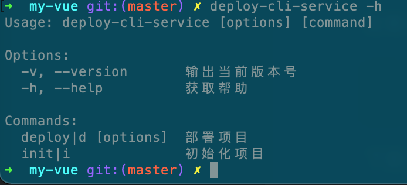
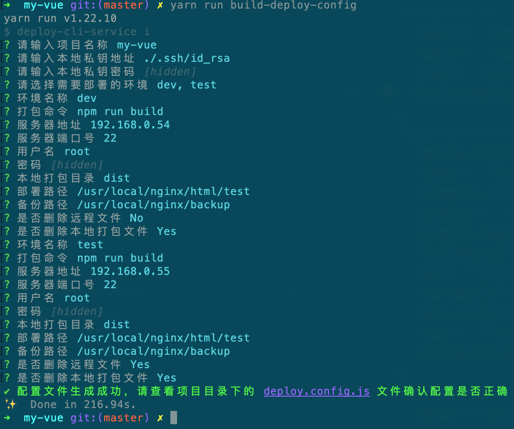
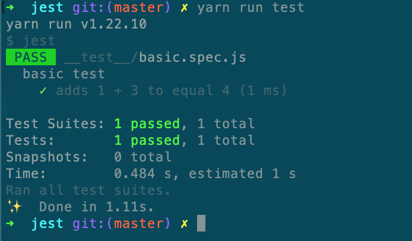
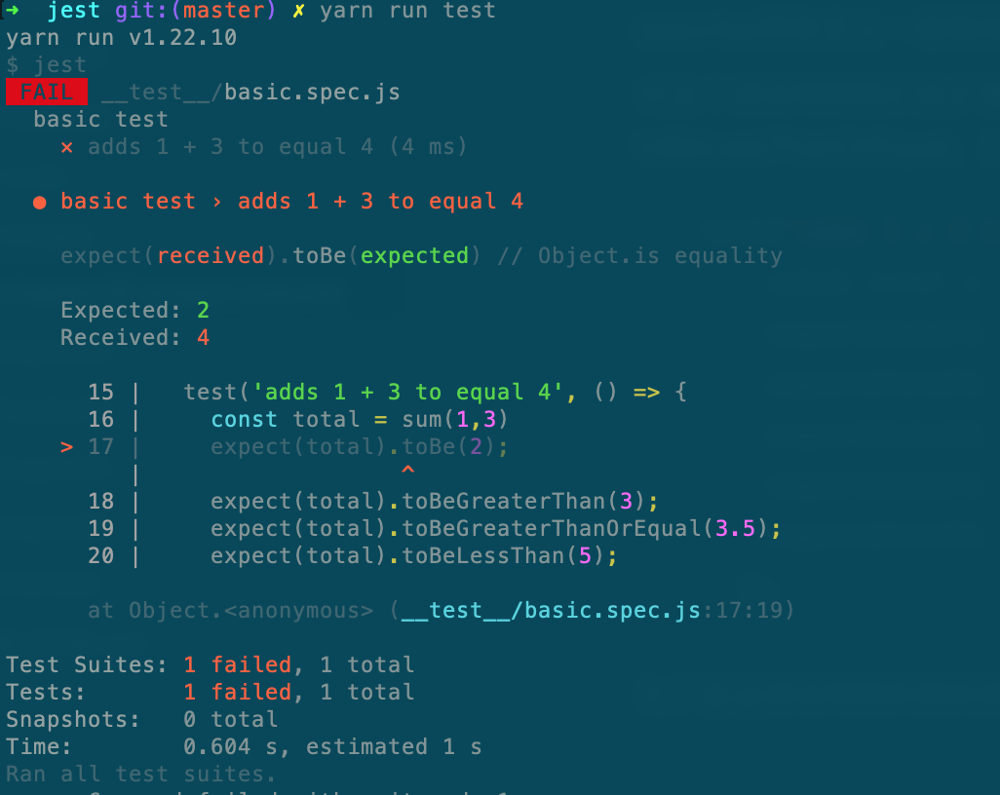
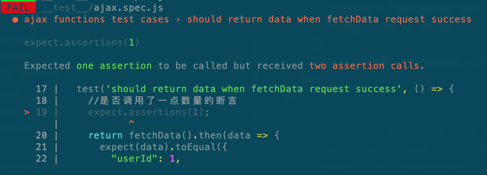
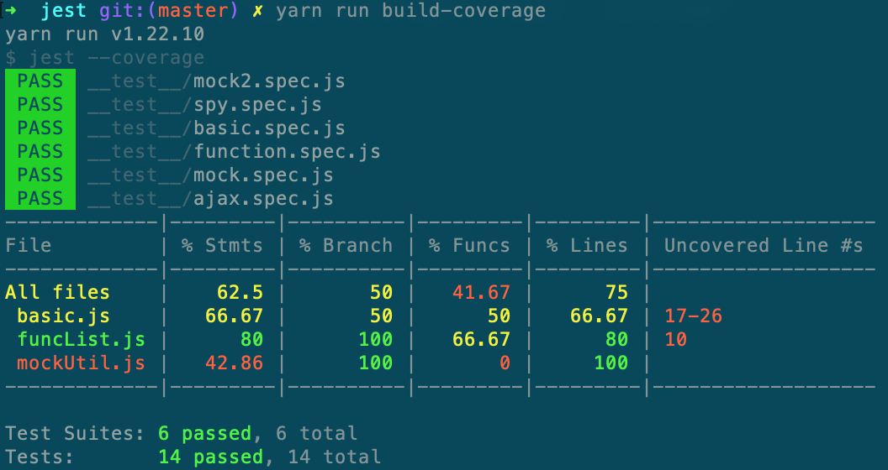
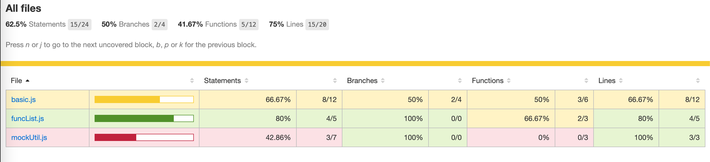
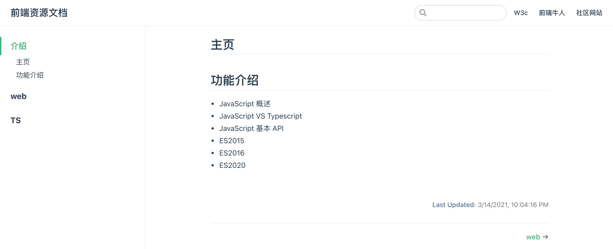
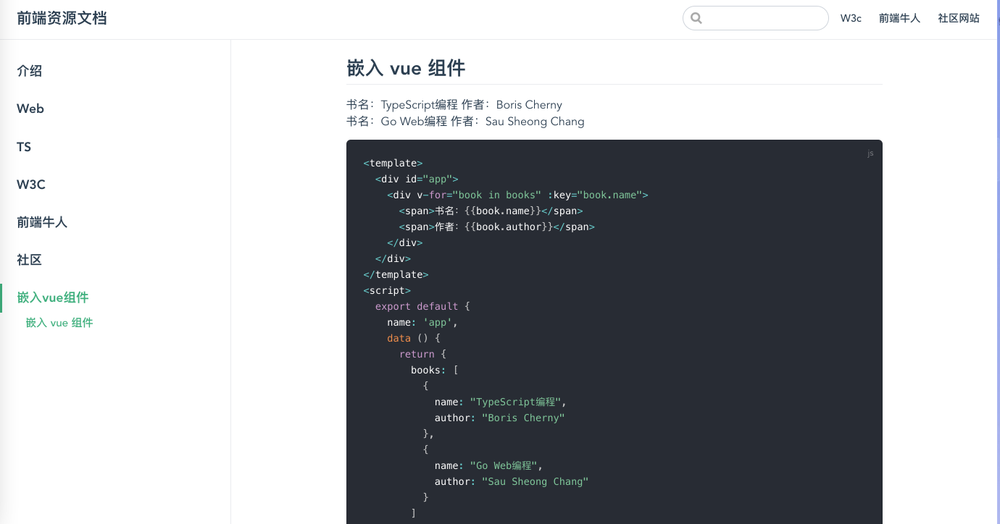

## 第2章 前端工程化核心

Web工程化在前端日常开发中的重要性不言而喻，它涉及到多个规范，开发规范、Git提交规范等多个规范。本章我们将从工程化的角度介绍一下前端工程中几个比较重要的几个环节，主要包括以下内容：

1. 生成脚手架。

2. 自动化部署。

3. 前端开发过程中需要了解的Nginx核心知识。

4. Jest测试框架核心。

5. 前端文档生成。

   

   #### 2.1 前端工程化概述

   前端开发队伍越大，工程化能发挥的作用就越大，规范开发、测试、部署等环节。可有效避免在开发过程中因开发人员过多的自我发挥而引发的不可控。

   从前端的开发流程来看，工程化主要包括技术选型、统一规范、测试、部署、监控、性能优化、重构和文档。技术选型是这几个环节中最简单的，只需从几个框架（如React、Angular、Vue等）中选择一个即可，在选择框架时需主要考虑以下两个因素：

   - 团队或者技术负责人对所选框架的熟悉程度，是否有快速解决疑难问题的能力。
   - 框架的流行度比较高的，有更多的“轮子”可以用。最简便的判断方法是看Google Trends，GitHub start的数量和npm上相关相关库的数量，这些都是可参考的数据。

   

   在开发过程中，代码规范一直占着比较大的权重，因为代码规范主要有几个明显好处：一致的代码规范能促进团队更好地协作、降低代码维护的成本、更好地促进项目成员的成长，  并且更容易构建和编译代码，对代码进行检视和重构。

   在前端社区中，较为成熟的规范如下：

   - AAirbnb的规范：GitHub star数量107K+，也足见它的受欢迎程度。这套规范不仅包含了JavaScript的，还包含了React、CSS、Ruby、Css-in-JavaScript和Sass的，非常方便。

   - standard规范： GitHub start数量25.3k+。这个规范是通过npm包的形式安装的，然后在package.json的scripts中添加如下命令进行检查：

     ```js
      npm install standard --save-dev
     //package.json
     "code-standard": "npx standard"
     ```
   
   standard规范也被许多知名项目和公司所采用, 比如Nodejs、npm、Express、Electron、Karma、Nuxt.js、MongoDB、Atom、Webstorm、Heroku和 LandRover等。该规范库也提供了相应的开发工具插件和snippets，开发效率更高，质量更有保证。

   - 京东凹凸实验室规范:  里面的HTML、CSS、JavaScript,images和React规范比较完整，值得参考。

   - 腾讯前端规范：PC端专题、移动端专题和双端。这些规范更偏业务。

   - 百度前端规范：整齐程度可以和Airbnb的规范相媲美。

     

   规范的代码不仅解决了日常开发中代码层面的问题，而且给提交代码带来了好处，是减少不必要沟通的一个重要方式。

   提交代码可分为以下几种情况：工程结构变更、功能（feature）开发、bug修复、性能优化、代码文档变更、测试用例变更、代码回退和持续集成文件变更等。这么多的场景如果不能通过代码提交记录快速辨别出提交的修改内容，那么会让问题追踪变得复杂和低效。

   因此在用 Git代码提交时，我们可以为每一次的提交增加一个业务表示，形式如下：

   ```
   [业务表示][提交人][描述]
   ```

   

   #### 2.2 生成脚手架

   只要是做过Vue或React开发的，对脚手架就应该不会再感到陌生，vue-cli3和create-React-App都是很好的选择。

   脚手架的实现有两种方式：
   
   - 第一种是是新建一个Git仓库，然后包装一个脚手架的壳子，在命令启动后通过git clone仓库。严格地说，这个更像是一种模板方法，这样实现方法存在一个比较严重的问题，即对脚手架的升级无法反映到工程结构上。
- 提供需要安装的插件，根据用户的选择创建 `package.json` 文件，并添加对应的依赖项，生成项目模板和工程的核心配置。

下面介绍创建Vue工程脚手架的详细过程，项目结构如图2-1所示。

```
├── bin
|  └── tiny.js
├── core
|  ├── ConfigTransform.js
|  ├── Creator.js
|  ├── Generator.js
|  ├── create.js
|  ├── generator
|  |  ├── babel
|  |  ├── linter
|  |  ├── router
|  |  ├── vue
|  |  ├── vuex
|  |  └── webpack
|  ├── requireModules
|  |  ├── babel.js
|  |  ├── linter.js
|  |  ├── router.js
|  |  └── vuex.js
|  ├── requireModulesAPI.js
|  └── utils
|     ├── clearConsole.js
|     ├── codemods
|     ├── configTransforms.js
|     ├── executeCommand.js
|     ├── normalizeFilePaths.js
|     ├── sortObject.js
|     ├── stringifyJS.js
|     └── writeFileTree.js
├── package-lock.json
├── package.json
├── readme.md
└── yarn.lock
```

<center>图2-1</center>

   首先，定义package.json，在bin中定义我们使用哪个命令创建新工程：

   ```json
   "bin": {
       "tiny-cli": "./bin/tiny.js"
    }
   ```

 上面我们定义了一个**tiny-cli**命令。

   ```js
   // bin/tiny.js
   const program = require('commander')
   const create = require('../core/create')
   
   program.version('0.0.1').command('create <name>').description('create a new project')
   .action(name => { 
       //create(name)
      console.log(name)
   })
   ```

   在tiny.js中定义了脚手架的第一个功能，即用commander处理用户的命令，提取用户输入（比如工程名称）交给脚手架处理。通过command定义一个create命令。

  效果如图2-2所示，看能否如期执行。执行npm link，将npm 模块链接到对应的运行项目中，可以在本地进行模块测试。


<center>图2-2</center>   

   也可以通过 **tiny-cli --help** 命令查看已经注册的事件，如图2-3所示。


<center>图2-3</center>

接下来，我们定义需要安装的组件babel、 lint,、vuex和router，在core目录下新建一个目录requireModules，为每个模块新建独立的模块：

```js
// babel.js
module.exports = (api) => {
    api.injectFeature({
        name: 'Babel',
        value: 'babel',
        short: 'Babel',
        description: 'Transpile modern JavaScript to older versions (for compatibility)',
        link: 'https://babeljs.io/',
        checked: true,
    })
}
```

下面是router.js的配置，linter.js和vuex.js的配置与其类似，不再赘述，具体的请查阅源码。

```js

const chalk = require('chalk')
module.exports = (api) => {
    api.injectFeature({
        name: 'Router',
        value: 'router',
        description: 'Structure the app with dynamic pages',
        link: 'https://router.vuejs.org/',
    })
    api.injectPrompt({
        name: 'historyMode',
        when: answers => answers.features.includes('router'),
        type: 'confirm',
        message: `Use history mode for router?`,
        description: `By using the HTML5 History API, the URLs don't need the '#' character anymore.`,
        link: 'https://router.vuejs.org/guide/essentials/history-mode.html',
    })
}

```

   使用inquirer询问用户选择哪些项目：

```json
{
 type: String, // 提问的类型，有input、number、 confirm、 list、rawlist、 expand、checkbox、password、editor
 name: String, // 把最后获取到的answers回答对象中，作为当前这个问题的键
 message: String|Function, // 问题标题
 default: String|Number|Array|Function, // 用户不输入回答时，问题的默认值。
 choices: Array|Function, // 给出的选择列表，给出的选择列表，如果是一个函数，则第一个参数为当前问题的输入答案。如果数组时，则数组的每个元素都可以为基本类型中的值。
 validate: Function, // 校验用户输入的输入，如果符合则返回true。当函数返回false时，会提供一个默认的错误信息给用户。
 filter: Function, // 接受用户输入，并将值转化后返回填充到最后的answers对象内。
 when: Function|Boolean, // 接受当前用户输入的answers对象，并且通过返回true或者false来决定是否显示询问列表。
 pageSize: Number, // 改变渲染list,rawlist,expand或者checkbox时的行数的长度。
}
```

这里需要解释的是，使用injectFeature方法保存第一级需要的提示，用injectPrompt来提示二级操作。有了上面的配置之后，就可以在Creator类中进行组装了：

```js
class Creator {
  constructor() {
    this.featurePrompt = {
        name: 'features',
        message: 'select the features for your project:',
        pageSize: 10,
        type: 'checkbox',
        choices: [],
    }
    this.injectedPrompts = []
  }
  getFinalPrompts() {
    this.injectedPrompts.forEach(prompt => {
        const originalWhen = prompt.when || (() => true)
        prompt.when = answers => originalWhen(answers)
    })
    const prompts = [
        this.featurePrompt,
        ...this.injectedPrompts,
    ]
    return prompts
  }
}
```

声明完成后，可以通过creator.getFinalPrompts()方法获得所有需要提示的选项。但是这里有一个前提，把这几个都要加载进来并且执行。所以需要在core/create.js中加上一下部分，这样就保证了各部分的数据集中在Creator类中进行了保存。

```js
function getPromptModules() {
  return [
    'babel',
    'router',
    'vuex',
    'linter',
  ].map(file => require(`./requireModules/${file}`))
}
const _promptModules = getPromptModules()
const _promptAPI = new RequireModulesAPI(_creator)
  //执行注入各模块的提示语
_promptModules.forEach(m => m(_promptAPI))
```

RequiredModuleAPI.js

```js
class RequiredModuleAPI {
  constructor(creator) {
      this.creator = creator
  }
  injectFeature(feature) {
      this.creator.featurePrompt.choices.push(feature)
  }
  injectPrompt(prompt) {
      this.creator.injectedPrompts.push(prompt)
  }
}
```


为了保证效果能实现，需要先引入inquirer库

  ```js
const _answers = await inquirer.prompt(_creator.getFinalPrompts())
  ```

 先测试一下，看看效果，如图2-4所示。


   <center>图2-4</center>

我们在featurePrompt中指定了type为CheckBox，多选，所以可以使用空格键选择多个，返回的值如下：

```js
{ features: ['babel', 'linter'] }
```

其中，features是上面问题中的name属性。features` 数组中的值是每个选项中的 `value。

还有就是上一个问题选择了指定的选项，下一个问题怎样会显示出来？这个是选择的相关性。仔细看下router.js中有一个when配置

```
 when: answers => answers.features.includes('router'),
```

当选中router时，这个提示项才会显示。

在Vue的标准化项目中，Vue、Vue-router、Vuex、Babel、Webpack、ESLint这几项是标配。这里我们把Vue和Webpack做成默认的，这样就不需要用户选择了。

```js
_answers.features.unshift('vue', 'webpack')
```

用户选择特性后，就需要生成package.json、编译模板、生成配置文件。在create.js中定义package.json的默认值：

```json
{
  name,
  version: '0.1.0',
  dependencies: {},
  devDependencies: {},
}
```

各个模板都在generator目录下。

下面是Babel的相关配置：

```js
module.exports = (generator) => {
    generator.extendPackage({
        babel: {
            presets: ['@babel/preset-env'],
        },
        dependencies: {
            'core-js': '^3.8.3',
        },
        devDependencies: {
            '@babel/core': '^7.12.13',
            '@babel/preset-env': '^7.12.13',
            'babel-loader': '^8.2.2',
        },
    })
}
```

模板调用generator对象的extendPackage()方法向 package.json注入了babel 相关的所有依赖，接下来看一下extendPackage()是怎么实现的。

```js
extendPackage(fields) {
        const pkg = this.pkg
        for (const key in fields) {
            const value = fields[key]
            const existing = pkg[key]
            if (isObject(value) && (key === 'dependencies' || key === 'devDependencies' || key === 'scripts')) {
                pkg[key] = Object.assign(existing || {}, value)
            } else {
                pkg[key] = value
            }
        }
    }
```

注入过程其实是遍历模板的所有配置加到package.json。

看完怎么生成package.json，下面看一下是怎么编译模板的？我们以router为例进行说明。

```js
module.exports = (generator, options = {}) => {
    generator.injectImports(generator.entryFile, `import router from './router'`)
    generator.injectRootOptions(generator.entryFile, `router`)
    generator.extendPackage({
        dependencies: {
            'vue-router': '^3.5.1',
        },
    })
    generator.render('./template', {
        historyMode: options.historyMode,
        hasTypeScript: false,
        plugins: [],
    })
}
```

```
generator.injectImports(generator.entryFile, `import router from './router'`)
```

使用generator.injectImports把导入的router注入到src的main.js中，注入的过程分为三步：

1. 使用vue-codemod将代码解析成语法抽象树 AST。
2. 将要插入的代码变成AST节点插到上面生成的 AST 中。
3. 将新的AST重新渲染成代码

```js
const { runTransformation } = require('vue-codemod')

runTransformation(
  { path: file, source: files[file] },
  require('./utils/codemods/injectOptions'),
  { injections },
)
```

```js
generator.injectRootOptions(generator.entryFile, `router`)
```

generator.injectRootOptions把router实例注入到入口文件src/main.js中。

```js
generator.extendPackage({
  dependencies: {
    'vue-router': '^3.5.1',
  },
})
```

把router的依赖也加入到package.json中。generator.render负责渲染模板。

具体的渲染过程可抽象概括成图2-5所示。


<center>图2-5</center>

提取babel配置，生成babel.config.js。

在前面生成package.json配置时，我们把下面的代码也写了进去：

```json
babel: {
    presets: ['@babel/preset-env'],
}
```

实际上把该项配置放到babel的配置文件才比较标准，所以需要提取一下。我们可以调用 `generator.extractConfigFiles()` 将内容提取出来并生成 `babel.config.js` 文件中。

```js
module.exports = {
    presets: [
        '@babel/preset-env'
    ]
}
```

模板文件渲染后还在内存中，需要进一步把文件写到硬盘。utils也提供了writeFileTree()方法来写文件：

```js
async function writeFileTree(dir, files) {
    Object.keys(files).forEach((name) => {
        const filePath = path.join(dir, name)
        fs.ensureDirSync(path.dirname(filePath))
        fs.writeFileSync(filePath, files[name])
    })
}
```

下载依赖

我们使用execa调用子进程来安装依赖包：

```js
function executeCommand(command, cwd) {
    return new Promise((resolve, reject) => {
        const child = execa(command, [], {
            cwd,
            stdio: ['inherit', 'pipe', 'inherit'],
        })
        child.stdout.on('data', buffer => {
            process.stdout.write(buffer)
        })
        child.on('close', code => {
            if (code !== 0) {
                reject(new Error(`command failed: ${command}`))
                return
            }
            resolve()
        })
    })
}
```

最后进行测试，如图2-6所示。

```shell
tiny-cli create demo
```


<center>图2-6</center>

空格选择这三项后，按“Enter”键，如图2-7所示。


<center>图2-7</center>

输入Y，继续，按“Enter”键，如图2-8所示。


<center>图2-8</center>

选择一项ESLint校验规则，按“Enter”键，如图2-9所示。


<center>图2-9</center>

选择规则生效时间，继续按“Enter”键，如图2-10所示。


<center>图2-10</center>

至此脚手架生成，npm包安装完成。


#### 2.3 自动化部署

前端的部署方式很大程度依赖于公司的运维和公司的资源的投入方式。如果公司有自己的服务器，那么前端既可以部署到公司的服务器上，也可以部署到第三方（阿里云、华为云、腾讯云等）云上。如果公司没有自己的服务器，就把前端直接部署到第三方云上。

第三方云平台给给开发提供了完整的功能，包括代码库、集成服务、代码检查和自动部署等服务。其中，自动部署部分可以完成本节要介绍的功能。如果服务器是自己维护的，则在代码自动部署方面，Jenkins和Gitlab依然是主力军，前端能够干预得依然很少，并且配置比较繁琐。

还有一种部署服务是做成Docker镜像，具体内容请参考第6章。

这部分我们从前端的角色出发，看是否能提供一站式的代码部署服务。

代码的部署流程大致如下：

- 前端工程打包。
- 配置服务器（如Nginx）
- 确定服务器地址、端口、用户名、密码。
- 拷贝包到服务器指定目录。
- 解压缩。
- 重启前端服务

这是一个挺繁琐的过程，如果能提供一站式服务，在配置好需要的参数后一键完成部署，那么会极大地提高前端的效率。

下面我们借助**deploy-cli-service** 来提供一站式服务。

首先安装npm服务：

```shell
yarn add deploy-cli-service -D
```

下面运行服务查看下提供的具体功能，如图2-11所示。

```
deploy-cli-service -h
```




<center>图2-11</center>

配置scripts脚本：

```js
"build-deploy-config": "deploy-cli-service i"
```

先生成配置文件，如图2-12所示：



<center>图2-12</center>

根据选择的环境配置部署参数项目名称、密钥地址、打包命令、服务地址，端口、用户名、密码、本地打包目录和配置部署目录等。部署后在项目根目录下生成deploy.config.js。

```js
module.exports = {
  projectName: "my-vue",
  privateKey: "./.ssh/id_rsa",
  passphrase: "123456",
  cluster: [],
  dev: {
    name: "dev",
    script: "npm run build",
    host: "192.168.0.54",
    port: 22,
    username: "root",
    password: "123456",
    distPath: "dist",
    webDir: "/usr/local/nginx/html/test",
    bakDir: "/usr/local/nginx/backup",
    isRemoveRemoteFile: false,
    isRemoveLocalFile: true
  },
  test: {
    name: "test",
    script: "npm run build",
    host: "192.168.0.55",
    port: 22,
    username: "root",
    password: "123456",
    distPath: "dist",
    webDir: "/usr/local/nginx/html/test",
    bakDir: "/usr/local/nginx/backup",
    isRemoveRemoteFile: true,
    isRemoveLocalFile: true
  }
};

```

> 也可以手动创建该文件，只要字段能对应上即可。

在部署文件初始化时，可以根据选择的环境生成相应的配置字段。有了配置文件之后，就可以用下面的命令部署服务了。

```shell
deploy-cli-service deploy --mode
```

```
"deploy:dev": "deploy-cli-service deploy --mode dev",
"deploy:test": "deploy-cli-service deploy --mode test",
"deploy:prod": "deploy-cli-service deploy --mode prod"
```

> --mode 后的参数需要和deploy.config.js的key一致。

运行部署命令开始打包、部署。


#### 2.4 Nginx常用配置

Nginx是一种轻量级、高性能、低内存的Web服务器和反向代理服务器。传统的Web服务器对于客户端的每一个连接都会创建一个新的进程或线程来处理，也创建了新的运行时，会消耗额外的内存。随着连接的增多，Web服务器的响应速度开始变慢，延迟增加。Nginx对传统服务而言，即优化了服务器资源的使用，也支持连接的动态增加。

Nginx有如下几个比较显著的优点：

- 热部署：因为Nginx的master进程和worker进程是独立设计的（通常是一个master进程和多个worker进程），所以可以在不间断服务的前提下升级可执行文件和配置文件等。
- 高并发：经官方测试，Nginx支持的连接数能够支撑5万并发连接，在实际生产环境中可以支撑2万~4万并发连接数。如果是clustered，则支持的连接数会更高。
- 内存消耗少。
- 高可靠性。
- 响应迅速。

正向代理和反向代理

正向代理： 客户端向代理服务器发送请求，并指定目标服务器地址，然后由代理服务器和原始服务器通信，转交请求并获得响应，再返回给客户端。正向代理隐藏了真实的客户端，为客户端收发请求，使真实客户端对服务器不可见，如图2-13所示。


<center>图2-13</center>

反向代理：是指以代理服务器来接收互联网上的连接请求，然后将连接请求转发给内部网络上的服务器，并将从服务器上得到的结果返回给客户端，此时的代理服务器对外就表现为一个反向代理服务器，如图2-14所示。


<center>图2-14</center>

接下来我们看一下如何安装和配置Nginx。

Mac系统可以借助工具brew安装Nginx：

```shell
brew install nginx
```

安装成功后，可以通过下面的命令查看安装的位置：

```shell
brew list nginx

/usr/local/Cellar/nginx/1.19.7/.bottle/etc/ (15 files)
/usr/local/Cellar/nginx/1.19.7/bin/nginx
/usr/local/Cellar/nginx/1.19.7/homebrew.mxcl.nginx.plist
/usr/local/Cellar/nginx/1.19.7/html -> ../../../var/www
/usr/local/Cellar/nginx/1.19.7/share/man/man8/nginx.8
/usr/local/Cellar/nginx/1.19.7/share/nginx/ (2 files)
```

配置文件目录在 /usr/local/etc/nginx目录下。

Nginx常用命令：

```shell
nginx                              #启动Nginx
nginx -s quit                      #快速停止
nginx -V                           #查看版本，以及配置文件地址
nginx -v                           #查看版本
nginx -s reload|reopen|stop|quit   #重新加载配置、重启、停止、安全关闭
nginx -h                           #帮助
nginx -t                           #校验配置文件
```

首先分析一下配置文件的结构，以便修改配置。nginx.config的默认文件如下：

```
worker_processes  1;

#pid        logs/nginx.pid;

events {
    worker_connections  1024;
}

http {
    include       mime.types;
    default_type  application/octet-stream;

    #access_log  logs/access.log  main;
    sendfile        on;
    #tcp_nopush     on;
    keepalive_timeout  65;

    #gzip  on;

    server {
        listen       9003;
        server_name  localhost;
        location / {
            root   /examples/nginx-test;
        		try_files $uri $uri/ /index.html;
            #index  index.html index.htm;
        }
        location /mydir {
            alias  html/mydir;
        }
        #error_page  404              /404.html;

        # redirect server error pages to the static page /50x.html
        #
        error_page   500 502 503 504  /50x.html;
        location = /50x.html {
            root   html;
        }
    }

    include servers/*;
}

```

events 和http指令驻留在主上下文中，server在http中，而location在server块中，server和location都可以有多个配置。多个server代表多个服务，location代表多个匹配规则。

该server监听了9003端口，location块指定与请求中的URI的“/”前缀相比较；对于匹配请求，URI将被添加到root指令中指定的路径，以形成本地文件系统上所请求文件的路径。try_files的作用是按顺序检查文件是否存在，返回第一个找到的文件或文件夹（结尾加斜线表示为文件夹），如果所有的文件或文件夹都找不到，则内部重定向到最后一个参数。

例如，客户端请求http://localhost:9003/，那么Nginx会映射到/examples/nginx-test/index.html文件。


##### 配置反向代理

在前端开发中经常配置反向代理，以解决跨域问题, 我们修改下上面的location配置

```
location / {
  proxy_pass https://www.baidu.com
}
```

这样再刷新页面时就代理到百度了。

思考一个问题，如果部署的服务是内网地址，如192.168.0.160:7300，那么这里又该如何定义呢？

这时候我们需要定义upstream 指令，upstream指令可用来定义一组服务器。 这些服务器可以监听不同的端口。

```
upstream demo-java-backend {
    server 192.168.0.160:7300;
}
```

这时候，location要改成下面的样子：

```
location / {
  proxy_pass http://demo-java-backend
}
```


开启gzip压缩

gzip 是一种常用的网页压缩技术，传输的网页经过 gzip 压缩之后，体积通常可以变为原来的一半甚至更小。更小的网页体积意味着带宽的节约和传输速度的提升。使用 gzip压缩不仅需要配置Nginx ，浏览器端也需要配合，需要在请求消息头中包含 Accept-Encoding: gzip。

Nginx 在收到请求的时候，如果有相应配置，就会返回经过 gzip 压缩过的文件给浏览器，并在 response 相应的时候加上 `content-encoding: gzip，以告诉浏览器自己采用的压缩方式。

```
gzip on; # 默认off，是否开启gzip
gzip_types text/plain text/css application/json application/x-javascript text/xml application/xml application/xml+rss text/javascript;
```

gzip_types表示要采用 gzip 压缩的 MIME 文件类型。


Ngin支持WebSocket：

```
map $http_upgrade $connection_upgrade {  
    default upgrade;  
    '' close;  
}  
upstream websocket_api {  
    server 192.168.0.161:8888;  
} 
location / {  
  proxy_pass http://websocket_api;  
  proxy_http_version 1.1;  
  proxy_set_header Upgrade $http_upgrade;  
  proxy_set_header Connection "Upgrade";  
} 
```

Nginx配置负载均衡

负载均衡的主要思想就是把负载按照权重配置合理地分发到多个服务器上，实现压力分流，减轻服务器宕机的概率。主要配置如下：

```js
http {
  upstream myserver {
    server 192.168.0.161:8081;  
    server 192.168.0.161:8080;
    server 192.168.0.160:8081 weight=5;  
  }
 
  server {
    location / {
    	proxy_pass http://myserver;
    }
  }
}

```

如果不指定weight，则默认为1。也就是说，如果有7个连接请求服务，那么5个连接会分配到server 192.168.0.160:8081上。

Nginx提供了以下几种分配方式：

1. **轮询**，默认方式，每个请求按顺序逐一分配到不同的server。如果某个服务“挂”了，则能被自动去除。

2. **weight**，权重分配，指定轮询概率，权重越高，被访问的概率越大，用于后端服务器性能不均的情况。

3. **ip_hash**，每个请求按访问 IP 地址的 hash 结果分配，这样每个访客固定访问一个后端服务器，可以解决动态网页的session共享问题。

   

Nginx配置动静分离

动静分离是指把静态文件独立成单独的域名，然后放在独立的服务器上，实现资源共享。需要搭配expire配置使用。

   

图片防盗配置

由于图片链接可以跨域访问，所以当图片被其他网站引用时，无形中就增加了服务器的负担。

   ```js
server {
  # 图片防盗链
  location ~* \.(jpg|jpeg|png|gif)$ {
    valid_referers none blocked server_names ~\.test\. ~\.test2\. *.qq.com; 
    if ($invalid_referer){
        return 403;
      }
     }
   }
   ```

过滤请求

```js
# 如果是非指定请求，则全返回403
if ( $request_method !~ ^(GET|POST|HEAD)$ ) {
  return 403;
}
location / {
 #  IP地址访问限制（只允许IP地址为 192.168.0.2 的机器访问）
  allow 192.168.0.2;
  deny all;
}
```

   

   #### 2.5 Jest测试核心

   关于单元测试，有些前端同学可能会问了，为什么要写单元测试呢？总结起来有以下几点原因，首先，测试一下我们的代码是否能达到预期的要求。例如，我们想要一个1加1等于2的方法，结果变成了1加1等于11，这个结果肯定不是我们想要的。其次，如果我们的模块被别人改动过，那么单元测试保证已有的功能不被破坏。最后，当有了几个功能项的单元测试后，可以对这几个功能做集成测试，从而减少测试人员的工作量，保证功能的正确性   

   从测试阶段看，测试主要分为以下几种：

   - 单元测试：主要是研发人员对最小可用功能的检查与验证。

   - 集成测试：在单元测试后，对几个子功能进行集中验证。

   - 回归测试：在修改代码后，重新进行测试以确认修改没有引入新的错误或导致其他代码产生错误。

   - 系统测试：在产品发布前做的测试，是对整个系统进行的完整测试。

在本章中，我们只介绍单元测试相关的内容。在前端领域，目前主流测试框架有Jest、 Mocha和Jasmine。Jest是Facebook开源的一个前端测试框架，它集成了expect、 chalk、 jsdom、 jasmine、 sinon 等测试库，可用于React、Angular、vue、Node和TS的单元测试。

  Jest的特点如下：

   - 易用：开箱即用，即使没有配置。

   - 隔离：测试程序拥有自己独立的进程，极大地提高了性能。

   - 快照测试：可轻松追踪大型对象的测试。 快照既可以与测试代码放在一起，也可以集成进代码行内。

   - Mock系统：Jest实现了一个强大的Mock系统，支持自动和手动mock。

   - 异步代码测试友好。

   

  下面讲解如何用Jest测试基本的功能，先生成package.json，安装Jest核心库：

   ```shell
   yarn init -y 
   
   yarn install jest
   ```

   并配置scripts命令：

   ```json
"scripts": {
  "test": "jest",
  "build-coverage": "jest --coverage"
},
   ```
我们从最简单的开始测试。新建一个basic.js文件，并把该方法暴露出去：

```javascript
  function sum(a,b){
   const na = a || 0;
   const nb = b || 0;
   return na + nb;
 }
 module.exports = {
   sum
 }
```

注意，要遵守CommonJS规范，因为是在node环境中运行的。初始方法已经有了，下面该如何测试呢？测试用例应该放到什么地方呢？Jest能识别三种测试用例，分别是以test.js结尾的，如app.test.js；以spec.js结尾的，如app.spec.js; 以及在***\*test\****文件中的。

Jest 在运行测试用例的时候，提供一种机制，在整个项目会查找这三种情况，只要识别出任一一种都会执行。

 我们选择最后一种存放测试用例。在根目录下新建一个***\*test\****文件夹，并新建第一个测试文件basic.spec.js。

   ```js
   const { sum } = require("../source/basic")
   
   describe("basic test", ()=> {
     test('adds 1 + 3 to equal 4', () => {
       const total = sum(1,3)
       expect(total).toBe(4);
     });
   }  
   ```

   运行如下命令，效果如图2-15所示。

   ```shell
   yarn run  test
   ```

   

   <center>图2-15</center>

  从这个用例可以看出，测试分为三步：导入测试内容、运行测试内容，以及断言并比较。上面的require部分为导入测试内容，sum(1,3)为运行测试内容，expect为断言部分，判断是否是预期的效果。

Jest的单元测试用，使用test（或者it，it是test的别名）定义一个测试用例，使用expect定一个断言，判断total值是否和4相等。describe用来定义一组相关的测试用例，对一个功能进行测试，只有这一组用例都测试通过之后，才能说明这个功能是好的。

​    下面我们扩展一下这个测试用例，再增加几个和数字相关的断言，如toBeGreaterThan、toBeGreaterThanOrEqual、toBeLessThan和toBeLessThanOrEqual，分别表示大于、大于等于、小于和小于或等于。

   ```js
   test('adds 1 + 3 to equal 4', () => {
       const total = sum(1,3)
       expect(total).toBe(2);
       expect(total).toBeGreaterThan(3);
       expect(total).toBeGreaterThanOrEqual(3.5);
       expect(total).toBeLessThan(5);
       expect(total).toBeLessThanOrEqual(4.5);
     });
   ```

为了验证测试用例失败的情况，这里改一下第一个断言结果，再次运行测试，结果如图2-16所示。

   

   <center>图2-16</center>

   测试结果如我们所料，第一个断言执行失败，并且通过红色字体提示了错误用例位置，期望值和实际得到的值

   ```
    basic test › adds 1 + 3 to equal 4
   ```

   这条信息表示断言判断失败的用例位置。

   ```
   expect(received).toBe(expected)
   Expected: 2
   Received: 4
   ```

这条消息提示了断言中的期望值和实际获得的值，更方便我们定位具体的错误信息。

我们再定义一个新的基本测试用例，对已有对象赋值后判断两个对象是否相等：

```js
test('object assignment', () => {
    const data = {name: "hyw"};
    data['age'] = 24;
    expect(data).toEqual({name: "hyw", age: 24});
});
```

```
PASS  __test__/basic.spec.js
  basic test
    ✓ adds 1 + 3 to equal 4 (2 ms)
    ✓ object assignment (1 ms)

Test Suites: 1 passed, 1 total
Tests:       2 passed, 2 total
Snapshots:   0 total
Time:        0.482 s, estimated 2 s
Ran all test suites.
✨  Done in 1.43s.
```

依然是正常的。第一个测试用例是数字型的，下面看一个布尔型测试用例：

```js
test('null test cases', () => {
    const n = null;
    expect(n).toBeNull();
    expect(n).toBeDefined();
    expect(n).not.toBeUndefined();
    expect(n).not.toBeTruthy();
    expect(n).toBeFalsy();
  });
```

null值在JavaScript中表示false，在这个测试用例中也得到了印证。

Jest的测试不近仅可以判断具体的值，还可以使用toMatch判断字符串的子串，使用toContain判断数组是否包含某个元素：

```javascript
test('string matches ', () => {
    expect('administration').toMatch(/admin/);
})
```

```js
  const shoppingList = [
    'apple',
    'orange',
    'fish',
    'biscuit',
    'milk'
  ];

  test('the shopping list has apple on it', () => {
  	expect(shoppingList).toContain('apple');
  }); 
```

这两个match对于前端开发在接口调试中判断是否返回关键字段将会起到重大的作用。数组的expect甚至提供了可以对整个集合是否匹配来判断。

```
test('test array', () => {
    expect(shoppingList).toEqual(
      expect.arrayContaining(['tea', "rice"])
    )
})
```

在介绍了基本测试方法后，下面介绍如何测试异步运行的代码。在Web开发中，异步代码随处可见，所以重点介绍对这部分代码的测试。

首先实现一个axios的请求方法，安装该npm包，再借助公共的AJAX服务进行测试。

```javascript
let url = 'https://jsonplaceholder.typicode.com/todos/1';
function fetchData() {  
  return axios.get(url)
      .then(res => res.data)
      .catch(error => console.log(error));
}
```

下面开始构造AJAX的测试用例，在Jest中异步代码测试有三种测试形式：

- 回调函数。
- Promise式验证
- 使用async/await。

（1）回调函数：

```javascript
const { fetchData } = require("../source/basic")

test('test asyn code with cb', () => {
  function callback(data) {
    expect(data.userId).toBe(1);
  }
  fetchData(callback);
});
```

这种测试方法是最容易想到的，可以达到预想的测试目的，但是不推荐使用，因为这种测试方法增加了对其他其他函数的依赖，职责不够单一。另外，当fetchData执行完成时，测试也执行完成了，然后才去执行回调函数。这不是我们所期望的结果。正常的测试结果是等断言执行完成后才能代表这个测试用例的完成。所以我们需要对这个测试用例做一下改造。

```
test('test asyn code with cb', done => {
  function callback(data) {
    expect(data.userId).toBe(1);
    done();
  }
  fetchData(callback);
});
```

如果“done”永远不被调用，那么该测试将失败，这才符合完整的测试流程。

（2）Promise式验证。

Promise设计的初衷是使用链式解决回调炼狱（callback hell）的问题，在Jest的单元测试中同样适用，也让测试变得更加简单。Jest的断言可以放到Promise的回调中，等Promise被resolve时再执行。代码如下所示：

```js
test('should return data when fetchData request success', () => {
    expect.assertions(1);
    fetchData().then(data => {
      expect(data).toEqual({
        "userId": 1,
        "id": 1,
        "title": "delectus aut autem",
        "completed": false
      })
      expect(data.completed).toBeFalsy();
    });
  })
```

在异步测试中，需要增加一个配置：

```javascript
expect.assertions(number);
```

该配置用来验证在测试期间是否调用了一定数量的断言，如果未调用到指定的数量则测试失败。例如，在上面的测试用例中，把expect.assertions设置成了1，但是却有两个断言,，结果如图2-17所示。



 <center>图2-17</center>

还可以在 expect 语句中使用resolves matcher（匹配器）， Jest 等待该 promise 被resolve。

```javascript
test('should return data when fetchData with request ', () => {
      return expect(fetchData()).resolves.toEqual({
        "userId": 1,
        "id": 1,
        "title": "delectus aut autem",
        "completed": false
    }) 
  })
```

如果 promise 被reject，则测试将自动失败。

```
test('fetchData fails with an error', () => {
  expect.assertions(1);
  return expect(fetchData()).rejects.toMatch('error');
});
```

（3）使用async/await。

async/await彻底解放了异步代码，它可以让异步代码的执行看起来像同步代码一样。在测试时只需要在传递给test的函数前加上async关键字即可。

```js
test("test fetchData function with async/await ", async ()=> {
    const res = await fetchData()
    expect(res.completed).toBeFalsy()
})
```


##### setup和teardown

setUp：前置函数，是众多函数中最先被调用的函数，而且每执行完一个函数都要从setUp()调用开始后再执行下一个函数，有几个函数就调用它几次，与位置无关，无论放在哪里都是它先被调用。

在Jest中对应的函数是beforeEach和beforeAll。

```js
beforeEach(()=> {
   console.log("before each")
})
beforeAll(() => {
  console.log("before all")
});
```

每个测试用例在执行前都会打印***\*before each\****， 如果只想执行一次，则可以使用beforeAll。

tearDown：后置函数，是在众多函数执行完后它才被执行，即不管这个类里面有多少函数，它总是最后一个被执行的，与位置无关。

在Jest中对应的函数是afterEach和afterAll。

```js
afterEach(()=> {
   console.log("after each")
})
afterAll(() => {
  console.log("after all")
});
```

每个测试用例在执行前都会打印***\*after each\****， 如果只想执行一次，则可以使用afterAll。


##### Mock方法

在开发过程中，一个方法依赖另一个或者几个方法是很常见的场景。但是从单元测试的角度来看，我们只关心要测试的方法和依赖的方法要怎样处理才能顺利进行测试，这时候通用的选择是用Mock方法实现依赖。

先看一个循环遍历一个数组的例子，该方法有一个依赖项——callback，即每次循环都要执行一次回调方法。

```js
function forEach(arr, callback) {
  for (let index = 0,iLen=arr.length; index < iLen; index++) {
    callback(arr[index]);
  }
}
```

首先使用Jest提供的fn方法把这个callback方法模拟出来。

```js
const mockCallback = jest.fn();
```

此时，forEach的方法就变成了下面的样子：

```js
forEach(["hou", "yw"], mockCallback); 
```

接下来就可以实现测试用例了。

```js
test('mock function calls test cases ', () => {
      const mockCallback = jest.fn();
      forEach(["hou", "yw"], mockCallback); 
      console.log(mockCallback.mock.instances)
      //调用两次
      expect(mockCallback.mock.calls.length).toBe(2);
      // 第一次调用函数时的第一个参数是 hou
      expect(mockCallback.mock.calls[0][0]).toBe('hou');
  })
```

mock 函数带有 mock属性，它保存了函数被调用的信息，如函数实例、calls等。

```json
{
        calls: [ [ 'hou' ], [ 'yw' ] ],
        instances: [ undefined, undefined ],
        invocationCallOrder: [ 4, 5 ],
        results: [
          { type: 'return', value: undefined },
          { type: 'return', value: undefined }
        ]
  }
```

Jest的mock函数还可以附带具体实现。

```javascript
test('test jest.fn with implement', () => {
    let mockFn = jest.fn((num1, num2) => {
      return num1 / num2;
    })
    // 断言mockFn执行后返回1
    expect(mockFn(10, 10)).toBe(1);
})
```

如果测试的环境需要依赖函数返回的参数，也可以通过给mock函数 指定返回值来模拟。

```js
test('test jest.fn with default value', () => {
    let mockFn = jest.fn().mockReturnValue('houyw');
    // 断言mockFn执行后返回值为default
    expect(mockFn()).toBe('houyw');
})
```

我们再来思考一个问题，在实际开发中，一个文件中通常有多个方法，每个方法都mock一次显得有些笨拙，有没有更好的方法可以一次性完成mock呢？当然有，例如下面的代码：

```js
//mockUtil.js
exports.getName = () => { name: "123"};
exports.subtract = (a, b) => a -b;
exports.multiply = (a, b) => a * b;
```

Jest 提供了一个mock方法，第一个参数是要mock的模块，可以自动mock这个模块。自动mock模块是什么意思呢？就是把模块暴露出来的方法，全部自动转换成mock函数jest.fn()。

```
jest.mock("../source/mockUtil.js")
```

相当于变成如下：

```js
exports.getName = jest.fn();
exports.subtract = jest.fn();
exports.multiply = jest.fn();
```

现在看一下测试用例的实现。

```javascript
jest.mock("../source/mockUtil.js")

const { getName } = require("../source/mockUtil")
describe("mock functions continued",()=> {
  test('getName function test case ', () => {
    getName.mockReturnValueOnce({name: "123"})
    expect(getName()).toEqual({name: "123"})
  })
})
```

需要注意的是，我们需要为每个需要测试的方法mock返回值。用这样的方法也可以mock整个AJAX请求，检查AJAX请求是否正常，而不是真正去发请求。

```js
// funcList.js
const axios = require("axios")
function listApps() {
  return axios.get("http://sss.test.socm/getApps")
      .then(res => res.data)
      .catch(error => console.log(error));
}
module.exports = {
  getApplist: listApps
}
```

测试用例如下：

```js
const axios = require("axios")
const { getApplist} = require("../source/funcList")
jest.mock('axios');

describe("function test cases", ()=> { 
  expect.assertions(1); 
  test('getApplist  should return value ', async ()=> {
    const apps = [{
      appId: '1',
      appName: 'android'
    },{
      appId: '2',
      appName: 'ios'
    }]
    //模拟返回数据
    const resData = {
      status: 0,
      data: apps
    }
    axios.get.mockResolvedValue(resData); //get方法mock返回值
    const data = await getApplist();
    expect(data).toEqual(apps)
  })
  
})
```

前面我们总结了mock返回值的场景，除返回值外，还可以指定输入参数。

```js
test('jest.fn should be invoked ', () => {
      let mockFn = jest.fn();
      let result = mockFn('houyw', 2, false);
      // 断言mockFn的执行后返回undefined
      expect(result).toBeUndefined();
      // 断言mockFn被调用
      expect(mockFn).toBeCalled();
      // 断言mockFn被调用了一次
      expect(mockFn).toBeCalledTimes(1);
      // 断言mockFn传入的参数为1, 2, 3
      expect(mockFn).toHaveBeenCalledWith('houyw', 2, false);
  })
```

##### 测试覆盖率

有了单元测试后，我们需要用一种方法统计出来各个模块的语句覆盖率（%stmts）、分支覆盖率（%Branch）、函数覆盖率（%Funcs）和行覆盖率（%Lines）的情况，这几个指标的含义如下：

- 语句覆盖率（%stmts）：每个语句是否都执行了。

- 分支覆盖率（%Branch）：每个if代码块是否都执行了。

- 函数覆盖率（%Funcs）：每个函数是否都执行了。

- 行覆盖率（%Lines）：每一行是否都执行了。

Jest提供了测试覆盖率的功能：

```
"scripts": {
    "test": "jest",
    "build-coverage": "jest --coverage"
}
```

执行**yarn run build-coverage**后，命令行生成的报告如图2-18所示。



 <center>图2-18</center>

同时会在coverage/icov-report文件夹中生成html文件，如图2-19所示，可以用可视化的方式查看，更直观。



 <center>图2-19</center>


#### 2.5前端规范终结者：前端文档

文档的生成的目的是为了知识传递，特别是规范类的需要文档化，完整、准确，不容易产生歧义，降低了团队的协作成本和维护成本，提高了开发效率和质量，保证不会因为开发人员的变动而产生较大的影响。

前端生成的文档还是有不少，如jsdoc、tj大神的dox，以 Markdown 为中心的vuepress、docsify。我们选择简单易上手的vuepress作为前端方根，它的优点如下：

- 界面简洁。
- 容易上手。
- 可以更好地兼容、扩展 Markdown 语法。
- 响应式布局，支持PC端和手机端。
- Google Analytics 集成。
- 支持 PWA。

下面，我们新建一个vuepress工程来看下前端文档的创建过程。

```shell
mkdir fe-doc
cd fe-doc
yarn init -y 
yarn add vuepress
```

配置前端开发脚本。

```json
"scripts": {
    "dev": "vuepress dev docs",
    "build": "vuepress build docs"
 }
```

我们把 `docs` 目录作为 targetDir，并新建相应的目录，如图2-20所示。

```json
├── README.md           //项目说明
├── deploy.sh           //部署脚本
├── docs                //文档主目录
|  ├── .vuepress        //存放全局的配置、组件、静态资源等
|  |  ├── components    //该目录中的 Vue 组件将会被自动注册为全局组件
|  |  ├── config.js     //配置文件的入口文件
|  |  ├── enhanceApp.js //客户端应用的增强
|  |  ├── public        //静态资源目录
|  |  ├── styles        //样式文件
|  |  ├── templates     //模板
|  |  └── theme         //主题文件
|  ├── README.md        //主目录文档配置
|  └── guide            //模块文档配置
|     ├── ts            //模块
|     └── web           //模块
├── index.html          
├── package.json
└── yarn.lock
```

 <center>图2-20</center>

接下来修改docs/.vuepress/config.js文件，增加相关配置。

```js
  title: '前端资源文档', 
  description : 'fe doc',
  base : '/',
  head: [
    ['link', { rel: 'icon', href: '/favicon.ico' }] 
  ],
  themeConfig : {
    nav : [
        { text: 'W3c', link: '/guide/w3c/' },
        { text: '前端牛人', link: '/guide/superman/' },
        { text: '社区网站', link: '/guide/community/' }
    ],
    sidebar: [
      ['/', '介绍'],
      ['/guide/web/', 'web'],
      ['/guide/ts/', 'TS'],
    ],
    sidebarDepth: 2,
    lastUpdated: 'Last Updated',
  }
```

title用来说明网站的title，base表示部署站点的基础路径，head表示需要被注入到当前页面的 HTML `<head>` 中的标签，themeConfig表示网站当前主题的配置。themeConfig/nav用来配置导航菜单，themeConfig/sidebar表示侧边栏功能项配置，themeConfig/sidebarDepth表示侧边栏功能项目深度配置(显示几级)。

为了看到效果，我们先在guide/web和guide/ts下分别建立README.md文件，分别输入以下内容：

```markdown
## Web 历史及概述

- Web 发展史
- Web 核心要素

```

```markdown
## Number

- **属性说明:**
  - 数字类型
- **类型:**
  - Number
- **示例:**
  - let aa: number = 6;

## Array

- **属性说明:**
  - 数组类型
- **类型:**
  - Array
- **示例:**
  - let arr: number[] = [1, 2]
```

并在docs/README.md输入以下内容：

```markdown
## 主页

## 功能介绍

- JavaScript 概述
- JavaScript VS TypeScript
- JavaScript 基本 API
- ES2015
- ES2016
- ES2020
```

先用命令yarn run dev 命令启动项目，如图2-21所示。



 <center>图2-21</center>

从图2-22中可以看出，vuepress会读取docs目录下的README.md，并把它作为主目录，把guide中的md文件作为侧边栏。

markdown是一种轻量级标记语言，排版语法简洁，让人们更多地关注内容本身而非排版。对web开发者更加友好，学习成本低。它使用易读易写的纯文本格式编写文档，不仅可以与HTML混编，还可以导出 HTML、PDF格式的文件，简洁、高效、易读、易写。

vuepress内置了markdown loader，可以方便地把 markdown 转成 Vue，再通过 vue-loader 解析为最终的 HTML。因此，在markdown中也可以嵌入vue逻辑。

我们先编辑docs/.vuepress/components下的books.vue文件，计划输出books列表。前面介绍过，该目录下的Vue 组件会被自动注册为全局组件。输入以下内容：

输入以下内容：

```javascript
<template>
  <div id="app">
    <div v-for="book in books" :key="book.name">
      <span>书名：{{book.name}}</span>
      <span>作者：{{book.author}}</span>
    </div>
  </div>
</template>
<script>
  export default {
    name: 'app',
    data () {
      return {
        books: [
          {
            name: "TypeScript编程",
            author: "Boris Cherny"
          },
          {
            name: "Go Web编程",
            author: "Sau Sheong Chang"
          }
        ]
      }
    }
  }
</script>

<style>
</style>
```

在guide目录下新建examples文件夹和README.md文件。在md文件中直接引入**boos**组件，同时嵌入代码。

```markdown
## 嵌入 vue 组件

<Books />

​```javascript
 这里输入books.vue的源码
​```
```

效果如图2-23所示。



<center>图2-22</center>

vuepress是对前端开发比较友好的文档生成工具，只需熟悉markdown和vue，就可以开发出比较完善的前端文档，入门门槛极低，大家可以一试，让团队的开发文档规范起来。

