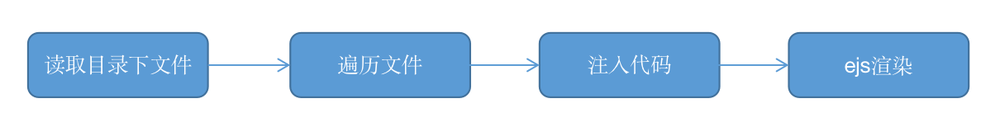

## 第3章 前端工程核心知识

web工程化在前端日常开发的重要性不言而喻，因为涉及到多个规范，开发规范、git提交规范等。本章我们将从工程化的角度介绍一下工程比较重要的几个环节，主要涉及到：

1. 前端开发脚手架统一。

2. 怎么做前端自动化部署，让部署流程最简洁。

3. 前端开发需要了解的Nginx核心知识。

4. jest测试核心。

5. 前端文档生成。

   

   #### 3.1 概述

   前端开发队伍越大，工程化就越能发挥它的作用，规范开发、测试、部署等环节。避免开发过程中在这些过程中过多的自我发挥而引起了不可控。

   从前端的开发流程上看，工程化主要包含技术选型、统一规范、测试、部署、监控、性能优化、重构、文档。技术选型是这几个环节中最简单的，只是从三个框架（React，angular，Vue）中选一个即可，选框架主要需要考虑两个因素：

   - 团队或者技术负责人对所选技术的熟悉程度，对疑难问题有快速修复的能力。
   - 流行度比较高的，有更多的”轮子“可以用。最简便的判断方法可以通过Google trends，github start数，npm上相关相关库的数量都是参考的数据。

   

   在开发过程中，代码规范一直占着比较大的权重，因为代码规范主要有几个明显好处：一致的代码规范能促进团队更好协作；降低代码维护的成本；规范的代码能更好促进项目成员的成长；也更好促进代码检视和重构；也容易构建、编译。

   如果你所在的团队还没有比较成熟的代码规范标准，也不用着急。在前端社区中有几个比较成熟的规范供大家参考：

   - airbnb的规范, star数高达107K，也足见它的受欢迎程度。这套规范不但包含了JavaScript的，还包含了React，CSS，Ruby，Css-in-JavaScript，Sass的。非常方便。

     > 地址：https://github.com/airbnb/javascript

   - standard规范：start数25.3k。这个规范是通过npm包的形式安装，然后在package.json的scripts添加命令进行检查，

     ```js
     npm install standard --save-dev
     //package.json
     "code-standard": "npx standard"
     ```

   这个库也被许多知名项目和公司采用, 比如nodejs，npm，express, electron，karma，nuxt.js，MongoDB，atom，webstorm，HEROKU, LandRover等。

   该规范库也提供了相应的开发工具插件和snippets，开发效率会更高，质量也更有保证。

   > 地址：https://github.com/standard/standard

   - 京东凹凸实验室规范:  HTML、css、Javascript,images和React规范比较完整，值得参考。

     > 地址：https://guide.aotu.io/index.html

   - 腾讯前端规范规范：PC端专题，移动端专题，双端。但是这些规范更偏业务，这就要看你们的业务契合度了。

   - 百度前端规范：整齐程度可以和Airbnb的想媲美。

     > https://github.com/ecomfe/spec

   

   代码开发规范对齐了日常开发代码层面的问题，那么关于代码提交是不有必要做呢？规范的代码提交会带来什么样的好处呢？

   开发人员提交代码有几种情况：工程结构变更，功能（feature）开发，bug修复，性能优化，代码文档变更，测试用例变更，代码回退，持续集成文件变更等。这么多的场景如果不能从提交记录一下就能辨别提交的修改内容，那么会让问题追踪变得不是那么方便和高效。

   所以在git代码提交时，对commit内容规范化是减少不必要沟通的一个重要方式。为每一次的提交增加一个业务表示，形式可以是这样的。

   ```
   [业务表示][提交人][描述]
   ```

   

   #### 3.1脚手架入门

   只要是做过vue，React开发，脚手架就应该不会再感到陌生，vue-cli3和create-React-APP都是很好的选择。

   脚手架的实现有两种方式：

   - 第一种是是新建一个Git仓库，然后包装一个脚手架的壳子，命令启动后从git clone仓库。严格说，这个更像是一种模板方法，这样的实现存在一个比较严重的问题就是对脚手架的升级无法反应到工程结构上。
- 第二种是提供需要安装的插件、根据用户的选择创建 `package.json` 文件，并添加对应的依赖项，生成项目模板和工程的核心配置。
  

  

下面我们看下创建vue工程脚手架的详细过程。

```
├── bin
|  └── tiny.js
├── core
|  ├── ConfigTransform.js
|  ├── Creator.js
|  ├── Generator.js
|  ├── create.js
|  ├── generator
|  |  ├── babel
|  |  ├── linter
|  |  ├── router
|  |  ├── vue
|  |  ├── vuex
|  |  └── webpack
|  ├── requireModules
|  |  ├── babel.js
|  |  ├── linter.js
|  |  ├── router.js
|  |  └── vuex.js
|  ├── requireModulesAPI.js
|  └── utils
|     ├── clearConsole.js
|     ├── codemods
|     ├── configTransforms.js
|     ├── executeCommand.js
|     ├── normalizeFilePaths.js
|     ├── sortObject.js
|     ├── stringifyJS.js
|     └── writeFileTree.js
├── package-lock.json
├── package.json
├── readme.md
└── yarn.lock
```


   首先，我们先在定义package.json，先在bin中定义我们使用哪个命令创建新工程

   ```json
   "bin": {
       "tiny-cli": "./bin/tiny.js"
    }
   ```

   我们定义了一个**tiny-cli**命令。

   ```js
   // bin/tiny.js
   const program = require('commander')
   const create = require('../core/create')
   
   program.version('0.0.1').command('create <name>').description('create a new project')
   .action(name => { 
       //create(name)
      console.log(name)
   })
   ```

   在tiny.js中定义了脚手架的第一个功能，用commander处理用户的命令，提取用户输入比如说工程名称交给脚手架处理。通过command定义了一个create命令。

  我们先看下效果，看是否能如期执行。进行执行npm link,将npm 模块链接到对应的运行项目中去。


<center>图2-1</center>   

   也可以通过 **tiny-cli --help** 查看已经注册的事件


<center>图2-2</center>

接下来，我们定义需要安装的组件babel, lint, vuex,router，在core目录下新建一个目录requireModules，为每个模块新建独立的模块：

```js
// babel.js
module.exports = (api) => {
    api.injectFeature({
        name: 'Babel',
        value: 'babel',
        short: 'Babel',
        description: 'Transpile modern JavaScript to older versions (for compatibility)',
        link: 'https://babeljs.io/',
        checked: true,
    })
}
```

下面是router.js，linter.js和vuex.js的配置和这两个配置类似，所以忽略显示，具体的请查阅源码。

```js

const chalk = require('chalk')
module.exports = (api) => {
    api.injectFeature({
        name: 'Router',
        value: 'router',
        description: 'Structure the app with dynamic pages',
        link: 'https://router.vuejs.org/',
    })
    api.injectPrompt({
        name: 'historyMode',
        when: answers => answers.features.includes('router'),
        type: 'confirm',
        message: `Use history mode for router?`,
        description: `By using the HTML5 History API, the URLs don't need the '#' character anymore.`,
        link: 'https://router.vuejs.org/guide/essentials/history-mode.html',
    })
}

```

   使用inquirer询问用户选择哪些项目，

```json
{
 type: String, // 提问的类型，有input, number, confirm, list, rawlist, expand, checkbox, password, editor
 name: String, // 在最后获取到的answers回答对象中，作为当前这个问题的键
 message: String|Function, // 问题标题
 default: String|Number|Array|Function, // 用户不输入回答时，问题的默认值。
 choices: Array|Function, // 给出选择的列表，如果是一个函数的话，第一个参数为当前问题的输入答案。为数组时，数组的每个元素可以为基本类型中的值。
 validate: Function, // 校验用户输入的输入，如果符合返回true。当函数返回false时，一个默认的错误信息会被提供给用户。
 filter: Function, // 接受用户输入并且将值转化后返回填充入最后的answers对象内。
 when: Function|Boolean, // 接受当前用户输入的answers对象，并且通过返回true或者false来决定是否当前的问题应该去问
 pageSize: Number, // 改变渲染list,rawlist,expand或者checkbox时的行数的长度。
}
```

这里需要解释的是，使用injectFeature方法保存第一级需要的提示，用injectPrompt来提示二级操作。有了上面的配置后，可以在Creator类中进行组装

```js
class Creator {
  constructor() {
    this.featurePrompt = {
        name: 'features',
        message: 'select the features for your project:',
        pageSize: 10,
        type: 'checkbox',
        choices: [],
    }
    this.injectedPrompts = []
  }
  getFinalPrompts() {
    this.injectedPrompts.forEach(prompt => {
        const originalWhen = prompt.when || (() => true)
        prompt.when = answers => originalWhen(answers)
    })
    const prompts = [
        this.featurePrompt,
        ...this.injectedPrompts,
    ]
    return prompts
  }
}
```

都声明完成后，可以通过creator.getFinalPrompts()方法获得所有需要提示的选项。但是这个需要一个前提，把这几个都要require进来并且执行。所以需要在core/create.js中加上一下部分，这样就保证了各部分的数据集中在Creator类中进行了保存。

```js
function getPromptModules() {
  return [
    'babel',
    'router',
    'vuex',
    'linter',
  ].map(file => require(`./requireModules/${file}`))
}
const _promptModules = getPromptModules()
const _promptAPI = new RequireModulesAPI(_creator)
  //执行注入各模块的提示语
_promptModules.forEach(m => m(_promptAPI))
```

RequiredModuleAPI.js

```js
class RequiredModuleAPI {
  constructor(creator) {
      this.creator = creator
  }
  injectFeature(feature) {
      this.creator.featurePrompt.choices.push(feature)
  }
  injectPrompt(prompt) {
      this.creator.injectedPrompts.push(prompt)
  }
}
```


为了保证效果能实现，需要先引入inquirer库

  ```js
const _answers = await inquirer.prompt(_creator.getFinalPrompts())
  ```

 先进行下测试，看效果是怎么样的？


   <center>图2-3</center>

我们在featurePrompt中指定了type为CheckBox，多选，所以可以使用空格键选择多个，返回的值为

```js
{ features: ['babel', 'linter'] }
```

其中 `features` 是上面问题中的 `name` 属性。`features` 数组中的值则是每个选项中的 `value`。

还有就是上一个问题选择了指定的选项，下一个问题怎么才会显示出来？这个是选择的相关性。仔细看下router.js中有一个when配置

```
 when: answers => answers.features.includes('router'),
```

当选中router时这个提示项才会显示。

在vue的标准化项目中，vue，vue-router，vuex，babel，webpack，eslint这几项基本都是标配。我们把vue和webpack做成默认的，

```js
_answers.features.unshift('vue', 'webpack')
```

不需要用户选择。

用户选择特性后，就需要生成package.json、编译模板、生成配置文件。在create.js中定义package.json的默认值

```json
{
  name,
  version: '0.1.0',
  dependencies: {},
  devDependencies: {},
}
```

各个模板都在generator目录下。

下面是babel相关配置

```js
module.exports = (generator) => {
    generator.extendPackage({
        babel: {
            presets: ['@babel/preset-env'],
        },
        dependencies: {
            'core-js': '^3.8.3',
        },
        devDependencies: {
            '@babel/core': '^7.12.13',
            '@babel/preset-env': '^7.12.13',
            'babel-loader': '^8.2.2',
        },
    })
}
```

模板调用 `generator` 对象的 `extendPackage()` 方法向 package.json 注入了 `babel` 相关的所有依赖，接下来看下`extendPackage()`是怎么实现的

```js
extendPackage(fields) {
        const pkg = this.pkg
        for (const key in fields) {
            const value = fields[key]
            const existing = pkg[key]
            if (isObject(value) && (key === 'dependencies' || key === 'devDependencies' || key === 'scripts')) {
                pkg[key] = Object.assign(existing || {}, value)
            } else {
                pkg[key] = value
            }
        }
    }
```

注入过程其实遍历模板的所有配置加到package.json。

看完怎么生成package.json,现在看下是怎么编译模板的？我们就以router为例说明。

```js
module.exports = (generator, options = {}) => {
    generator.injectImports(generator.entryFile, `import router from './router'`)
    generator.injectRootOptions(generator.entryFile, `router`)
    generator.extendPackage({
        dependencies: {
            'vue-router': '^3.5.1',
        },
    })
    generator.render('./template', {
        historyMode: options.historyMode,
        hasTypeScript: false,
        plugins: [],
    })
}
```

```
generator.injectImports(generator.entryFile, `import router from './router'`)
```

使用generator.injectImports把导入router注入到src的main.js中，注入的过程分为3步：

1. 使用 vue-codemod 将代码解析成语法抽象树 AST。
2. 将要插入的代码变成 AST 节点插入到上面生成的 AST 中。
3. 将新的 AST 重新渲染成代码

```js
const { runTransformation } = require('vue-codemod')

runTransformation(
  { path: file, source: files[file] },
  require('./utils/codemods/injectOptions'),
  { injections },
)
```

```js
generator.injectRootOptions(generator.entryFile, `router`)
```

generator.injectRootOptions把router配置注入到入口文件 `src/main.js` 的 new Vue() 注入 router配置。

```js
generator.extendPackage({
  dependencies: {
    'vue-router': '^3.5.1',
  },
})
```

把router的依赖也加入到package.json中。generator.render负责渲染模板。

具体的渲染过程可以用下图的图进行抽象概括



<center>图4-4</center>

提取babel配置，生成babel.config.js。

在前面生成package.json配置时，我们把

```json
babel: {
    presets: ['@babel/preset-env'],
}
```

也写了进去，其实把该项配置放到babel的配置文件才比较标准。所以需要提取一下。我们可以调用 `generator.extractConfigFiles()` 将内容提取出来并生成 `babel.config.js` 文件中

```js
module.exports = {
    presets: [
        '@babel/preset-env'
    ]
}
```

模板文件渲染后还在内存中，需要进一步把文件写到硬盘。utils也提供了writeFileTree()方法来写文件

```js
async function writeFileTree(dir, files) {
    Object.keys(files).forEach((name) => {
        const filePath = path.join(dir, name)
        fs.ensureDirSync(path.dirname(filePath))
        fs.writeFileSync(filePath, files[name])
    })
}
```

下载依赖

下载依赖我们使用比较execa，调用子进程来安装依赖包。

```js
function executeCommand(command, cwd) {
    return new Promise((resolve, reject) => {
        const child = execa(command, [], {
            cwd,
            stdio: ['inherit', 'pipe', 'inherit'],
        })
        child.stdout.on('data', buffer => {
            process.stdout.write(buffer)
        })
        child.on('close', code => {
            if (code !== 0) {
                reject(new Error(`command failed: ${command}`))
                return
            }
            resolve()
        })
    })
}
```

