## 第4章 前端架构核心思想

扎实的基础是学习架构（或js框架）的关键，如果基础掌握得不牢固，则在学习js库或框架时，必然觉得代码晦涩难懂，无从下手。正所谓“工欲善其事，必先利其器”， 本章将围绕以下内容进行详细阐述：

1. 框架中比较重要的6种设计模式。
2. 前端开发人员必须了解的v8知识点。
3. 宏任务和微任务的处理过程。
4. 异步加载规范。
5. 函数式编程基础。
6. 通过案例深入剖析状态原理的实现过程。

### 4.1 常用设计模式介绍

#### 4.1.1状态模式

状态模式是一个比较有用的模式，它是指当一个对象的内部状态发生变化时，会产生不同的行为。程序在任意时刻都处在任意一种状态中。

比如某电灯，按一下按钮打开弱光, 按两下按钮打开强光, 按三下按钮关闭灯光，基本模型如图4-1所示。


<center>图4-1

状态模式允许对象在内部状态改变时，改变其行为，从对象的角度看好像进行了改变。实际开发中，某处文字可能和模型中的一字段进行关联，根据某一个状态显示不同的内容，这时候状态模式可能是你需要的（当然 switch-case, if-else可以继续）。

状态模式中有几个角色，分别是Context、State，以及各个子状态的实现。Context中既保存了Client端的操作接口，也保存子状态的实现，代表着当前状态。抽象类State声明了子状态应该实现的各个方法，如图4-2所示。

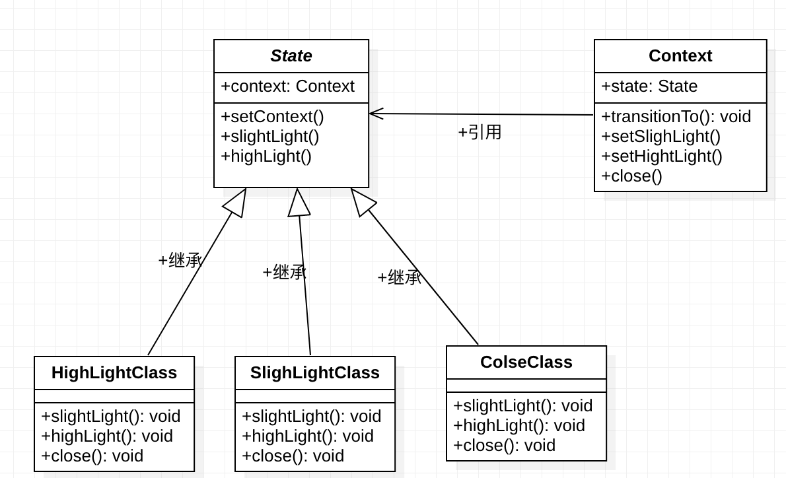

<center>图4-2

Context的实现如下：

```ts
export default class Context {
    private state: State;
    constructor(state: State) {
        this.transitionTo(state);
    }

    public transitionTo(_s: State): void {
        console.log(`Context: transition to ${(<any>_s).constructor.name}`);
        this.state = _s;
        this.state.setContext(this);
    }

    public setSlighLight(): void {
        this.state.slightLight();
    }

    public setHightLight(): void {
        this.state.highLight();
    }

    public close(): void {
        this.state.close();
    }

}
```

在transitionTo方法中改变当前状态，参数为实例化的子状态类。如果需要将上下文转换为另一个状态，只需要将当前活动的状态对象替换为新的状态对象即可。需要说明的是，如果想采用这种方式，状态的各子类必须保证实现相同的接口。

> 为什么要实现相同的接口呢？大家可以类比下面向对象中的多态特性。多态具体说就是在父类中定义的属性和方法被子类继承之后，子类就具有表现不同的数据类型或表现的能力。它可以消除类型之间的强耦合关系，让子类具有了可替换性，所以就更加的灵活。

再来看State的实现及其SlightLightClass的实现，限于篇幅，这里只贴出部分代码，完整的代码参考外链<4-1>[https://github.com/houyaowei/front-end-complete-book/tree/master/chapter04/code/4.1DesignPattern/State](https://github.com/houyaowei/front-end-complete-book/tree/master/chapter04/code/4.1DesignPattern/State)。

```ts
export default abstract class State {
    protected context: Context;
    public setContext(_c: Context) {
        this.context = _c;
    }
    public abstract slightLight(): void;
    public abstract highLight(): void;
    public abstract close(): void;    

}
```

>  注意，如果对TypeScript的抽象类语法还不是很理解，则可以参考官网的class部分：

```ts
export default class SlighLightClass extends State {

    public slightLight(): void {
        console.log("state in SlighLightClass, I will change state to highLight");
        //切换到新的状态
       this.context.transitionTo(new HighLight());
    }

    public highLight(): void {
        console.log("hightstate state in SlighLightClass");
    }

    public close(): void {
        console.log("close state in SlighLightClass");
    }

}
```

下面来测试一下：

```ts
import Context from "./Context";
import SlightLight from "./SlightLightClass";
import CloseLight from "./CloseClass";

// const context = new Context(new SlightLight());
//我们先用close状态初始化
const context = new Context(new CloseLight());
context.close();
context.setSlighLight();
context.setHightLight();
```

结果如下：

`

Context: transition to ColseClass

state in closeClass, I will change state to slight

Context: transition to SlighLightClass

state in SlighLightClass, I will change state to highLight

Context: transition to HighLightClass

highLight state in HighLightClass

`

现在把初始状态调整为SlightState，重新编译并运行：

`

Context: transition to SlighLightClass

state in SlighLightClass, I will change state to highLight

Context: transition to HighLightClass

highLight state in HighLightClass

state in hightLight, I will change state to close

Context: transition to ColseClass

`

状态模式封装了转换规则，并枚举了所有可能的状态。当把所有的与某个状态有关的行为放到一个类中时，即可方便地增加状态。

状态模式的使用必然会增加系统类和对象的个数。 状态模式的结构与实现都较为复杂，如果使用不当，则程序结构和代码都将变得混乱。 
状态模式对"开闭原则"的支持并不太好，准确说的话是代码的侵入性比较高，对于可以切换状态的状态模式，在增加新的状态类时要求必须修改那些负责状态转换的源代码，否则无法切换到新增的状态。如果需要修改某个状态类的行为，则同样需修改对应类的源代码。

最后一点需要说明的是，如果是状态比较少，并且状态之间很少发生改变，那么使用状态模式是不是显得小题大做了？大家可以根据实际的业务场景再决定看是否必要。


#### 4.1.2策略模式

策略模式是一种行为模式，它允许定义一系列算法，并将各个算法分别放入独立的类中，在运行时可以相互替换。它的主要作用是当多个算法较为相似时，可以减少if-else的使用。

策略模式的应用较为广泛，比如年终奖的发放，很多公司都是根据员工的薪资基数和年底绩效考评来计算的。以绩效比例3+6+1方式为例，绩效为3的员工，年终奖为2倍工资；绩效为6的员工年终奖为1.2倍工资；绩效为1的员工，年终奖为X.X倍工资。

下面以一个简单的字符串数组操作为例对改模式详细解释，对sort和reverse方法，定义两种策略，根据需要执行对应的策略。UML描述如下图4-3所示。

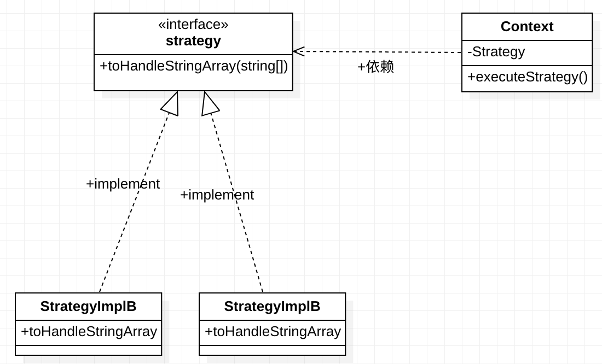

<center>图4-3</center>

首先，声明一个策略接口：

```ts
interface Strategy {
     toHandleStringArray(_d: string[]): string[];
}
```

然后，实现sort方法的策略实现（这里不讨论sort方法的缺陷）:

```ts
class StrategyAImpl implements Strategy {
    public toHandleStringArray(_d: string[]): string[] {
        //其他业务逻辑
        return _d.sort();
    }
}
```

接着，看看reverse方法的策略实现:

```ts
class StrategyBImpl implements Strategy {
    public toHandleStringArray(_d: string[]): string[] {
        //其他业务逻辑
        return _d.reverse();
    }
}
```
从上述代码可知，如果想实现数组的其他策略，则只需实现对应的接口，即可在不扩展类的情况下向用户提供能改变其行为的方法。

现在还缺少一个关键的零件，即改变策略的载体————Context类：

```ts
class Context {
    private strategy: Strategy;
    constructor(_s: Strategy) {
    this.strategy = _s;
}

public setStrategy(_s: Strategy) {
    this.strategy = _s;
}

//执行的方法是策略中定义的方法
public executeStrategy() {

    //标明是哪个策略类
    console.log(
`Context: current strategy is ${(<any>this.strategy).constructor.name}`
    );
     const result = this.strategy.toHandleStringArray(names);
     console.log("result:", result.join("->"));
    }

}
```

下面测试一下，看看效果。先假定Context类中的数组形式如下：

```ts
const names: string[] = ["hou", "cao", "ss"];
```

首先实例化reverse方法的策略：

```ts
const context = new Context(new StrategyB());

context.executeStrategy();
```

效果如下：

`

Context: current strategy is StrategyBImpl

result: ss->cao->hou

`


然后把策略方式切换为sort方法，效果如下：

`

Context: current strategy is StrategyAImpl

result: cao->hou->ss

`

这样的策略实现非常的方便，“任你策略千千万，我仍待你如初恋”。策略模式的程序至少由两部分组成。第一部分是一组策略类，里面封装了具体的算法，并负责算法的完整实现。第二部分是上下文(即Context)，上下文接收客户端的请求，随后被分发到某个策略类。

策略模式借助了组合等思想，可以有效地避免许多不必要的复制、粘贴。另外，它还支持对"开闭原则"，可以把算法封装到具体的策略实现中，易实现、易扩展。

在这里需要补充一下状态模式和策略模式的的微妙关系，状态可以被视为策略的扩展，两者都基于组合机制。它们都是通过将部分工作委派给其他类来改变其在不同场景下的行为。在策略模式下，对象相互之间完全独立。 状态模式没有限制具体状态之间的依赖，且允许它们自行改变在不同场景下的状态。


#### 4.1.3适配器模式

适配器是一种结构型模式，该模式的作用是解决两个接口不兼容的问题。将一种接口，转换成客户期望的另一种接口，即可实现相互通信的目的。

在现实中，适配器的应用比较广泛。比如，国外的电源插头的体积比国内的电源插头的体积要大一些，如果从国外买了一台Macbook Pro，则电源插头是无法直接插到国内家里的插座上的，为了一个电源插头而改造家中已经装修好的插座显然不太合适，此时就需要一个适配器了。


下面通过简单的代码来描述适配器模式。

假设想实现一个音乐播放的方法，常见的音乐文件格式有很多种，如mp3、mp4、wma、mpeg、rm和vlc等。常见的音乐播放文件也是五花八门，如MediaPlay、 千千静听、 RealPlay，等等。播放器并不是万能的，它不能播放所有的文件格式，如果使用适配器模式，则可以兼容播放所有格式的文件。

该模式的工作方式如下，UML如图4-4所示。

1、适配器要实现一个与目标对象兼容的接口。

2、目标对象可以使用该方法安全地调适配器接口。

3、调用适配器的方法后，会将另一个对象的兼容格式传给目标对象。

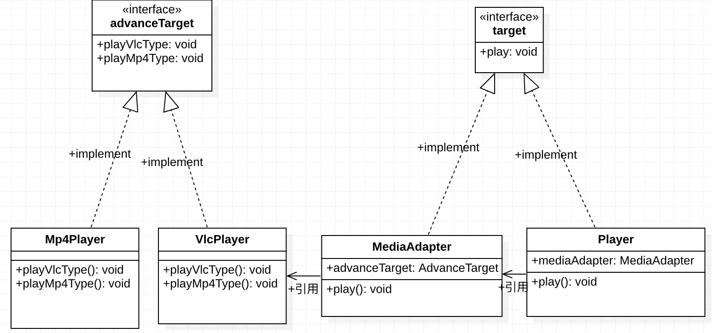

<center>图4-4<center>

首先，定义一个通用的播放接口：

```ts
export default interface Target {
    play(type: string, fileName: string): void;
}
```

play方法需要两个参数：文件类型和文件名。因为需要根据文件类型做适配，所以这两个参数是必需的。

播放接口要支持最常见的音乐文件格式（如mp3），当然建议支持更丰富的格式（如mp4），以便看视频。

然后，定义一个高级播放接口：

```ts
export default interface AdvanceTarget {

    playVlcType(fileName: string): void;

    playMp4Type(fileName: string): void;

}
```
下面实现两个具体的播放类，一个可播放vlc格式的文件，另一个可播放mp4格式的文件：

```ts
export default class VlcPlayer implements AdvancePlayer {

    public playVlcType(fileName : string) : void {

        console.log(`${fileName} is palying!`);

}

    public playMp4Type(fileName : string) : void {

        //假定vlc播放器不能播放mp4格式的文件

    }

}
```

```ts
export default class Mp4Player implements AdvancePlayer {

    public playVlcType(fileName: string): void {
        // 假定mp4播放器不能播放vlc格式的文件
    }

    public playMp4Type(fileName: string): void {
        console.log(`${fileName} is palying`);
    }

}
```

下面实现适配器类，以便更好地解释适配器是如何架起两种接口通信的：

```ts
class MediaAdatper implements Target {

    private advanceTarget: AdvanceTarget;

    constructor(type: string) {
        if (type === "vlc") {
            this.advanceTarget = new VlcPlayer();
        }
        if (type == "mp4") {
            this.advanceTarget = new Mp4Player();
        }
    }

public play(type: string, fileName: string): void {

    if (type === "vlc") {
        this.advanceTarget.playVlcType(fileName);
    }
    if (type == "mp4") {
        this.advanceTarget.playMp4Type(fileName);
    }

    }

}
```

适配器类中持有高级接口的引用，可根据文件类型初始化相应的类，因此在play方法中就有了相应的实例，可以调用具体的方法。

当适配器初始化好之后，即可使用播放器播放音乐：

```ts
class Player implements Target {

    mediaAdapter : MediaAdapter;
    play(type : string, fileName : string) : void {
        if(type == "mp3") {
          //mp3直接播放
        } else if (type === "vlc" || type == "mp4") {
            this.mediaAdapter = new MediaAdapter(type);
            this.mediaAdapter.play(type, fileName);
        }

    }

}
```

下面进行下测试：

```ts
const player = new Player();

player.play("mp4", "笑看风云.mp4");
player.play("vlc", "烟雨唱扬州.vlc");
player.play("mp3", "背水姑娘.mp3");
player.play("wma", "左手指月.mp3");
```

测试结果如下：

`

笑看风云.mp4 is palying

烟雨唱扬州.vlc is palying!

Mp3 as the basic format, can play at will

sorry,type wma is not support

`

从上面的测试结果可以看出，通过适配器，两个不同的接口可以通信了。

下面总结一下适配器的优点：

@它将接口或者数据转换代码分离了出来，使代码看起来非常清晰。
@它遵循“开闭原则”，能在不修改现有客户端代码的情况下在程序中添加新类型的适配器。

适配器模式使整体复杂度增加，这是因为每增加一种需要适配的类型，就需要增加相应的接口和实现类。

#### 4.1.4观察者模式

观察者模式（Observer Pattern）又叫作发布——订阅模式(Pub/Sub)模式或消息机制。它可以帮助对象知晓现状，以便对象及时响应订阅的事件，可以看成是一种一对多的关系。当订阅的对象的状态发生改变时，所有依赖它的对象都应得到通知。
观察者模式是松耦合设计的关键。
现实生活中，大家都经常在某宝上购物，下面通过一个购物例子来理解观察者模式。
当你在某宝上找到一款心仪的电脑时，比如16寸的Mackbook Pro，联系某卖家后发现没有现货，鉴于此店铺较好的信誉度和较大的优惠力度，你觉得还是在这家店铺买比较划算，于是就问卖家什么时候有货。卖家回复说需要等一周左右，还友情提示你:"亲，你可以先收藏我们的店铺，等有货了会再通知你的。"因此你收藏了这家店铺。电脑发烧友可不止你一个，小明、小华等陆陆续续也都收藏了该店铺。</br>
从上面的示例中可以看出，这是一个典型的观察者模式，卖家是发布者(Publisher)，你、小明、小华等是订阅者(subscribers)。当16寸的Mackbook Pro到货时（即状态发生了改变），卖家会使用旺旺等工具通知你、小明、小华等，依次给你们发送消息，"亲，货品已经到了，您可以下单了"。

基本模型如图4-5所示。

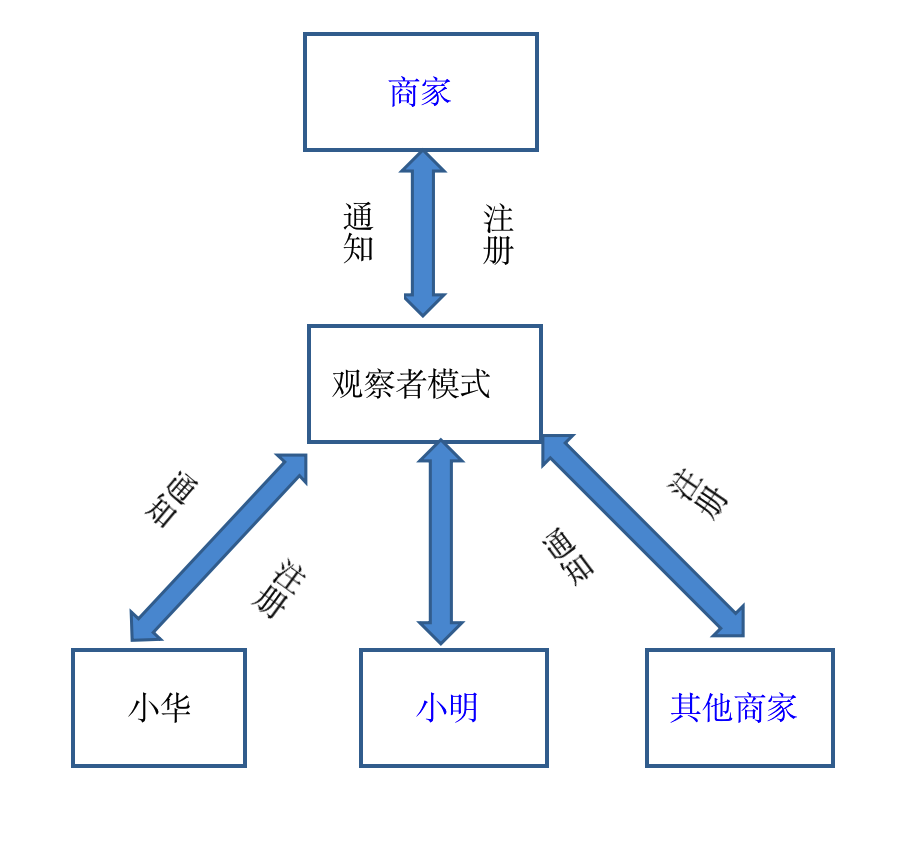

<center>图4-5</center>

在图4-5中可以看出，卖家（发布者）维护着和各位客户（订阅者）的引用关系，并且可以通过观察者模式添加、解除引用关系。比如，当某天某客户不再中意这款电脑时，卖家（发布者）就无法再引用这份关系了。

> 本书中所有的代码均是用Typescript编写的，众所周知，Typescript是JavaScript的超集，具有强类型约束，在编译期即可消除安全隐患。

UML描述如图4-6所示


<center>图4-6</center>

下面我们看看代码实现，首先看发布者、订阅者的接口定义：

观察者接口定义如下：

```typesript
export default interface IObserver{
  update(subject: Subject): void;
}
```

该接口只有一个update方法，用来在主题Subject状态改变时接收到通知。在稍后的例子中我们再展开，这里只配合说明接口定义。

发布者的接口

```ts
/**
 * subject，表示发布者操作的接口
 */
export default interface ISubject {
    state: number;
    //注册订阅
    register(observer: Observer): void;
    //取消订阅
    remove(observer: Observer): void;
    //通知订阅者
    notify(): void;
}
```

在发布着操作的接口中，使用register方法注册观察者，使用remove方法把目标观察者从列表中移除，这两个方法的参数都是观察者实例对象，这个后面我们再具体定义。

发布者要想真正实现操作，还需要有一个发布者实现类（实现该接口），以完成Pub/Sub的核心原理。

```ts
import Observer from "./Observer";
import Subject from "./Subject"

export default class SubjectA implements Subject {

  //状态码
  public state: number;
  //保存所有的订阅者
  private observers: Observer[] = [];

  //注册
  public register(observer: Observer): void {
    const isExist = this.observers.indexOf(observer);
    if (isExist != -1) {
        return console.log('订阅者已经存在');
    }
    this.observers.push(observer);
    console.log("订阅者添加完成");
  }
  //移出
  public remove(observer: Observer): void {
    const observerIndex = this.observers.indexOf(observer);
    if (observerIndex === -1) {
        return console.log('要删除的订阅者不存在');
    }

    this.observers.splice(observerIndex, 1);
    console.log('订阅已删除');
  }
  public notify() {
    for (const observer of this.observers) {
      // console.log(this)
      observer.update(this);
    }
  }
  public setSteateToNotify(): void {
    this.state = Math.floor(Math.random() * 10);
    console.log(`state已经更新为: ${this.state}，开始通知所有观察者....`);
    this.notify();
  }
}

```

实现ISubject接口，就要实现该接口中的所有方法（这是接口实现的约定）。定一个Observer类型私有变量observers，暂存所有的观察者。为了演示，在register方法和remove方法中只是做简单的indexOf判断，并不严谨。在notify方法中遍历观察者列表，通知各观察者。我们在方法setSteateToNotify中使用Math的random方法产生随机数，模拟状态的动态改变，并继续通知所有观察者。

下面，看下观察者的具体实现

```ts
import Observer from "./Observer"
import Subject from "./Subject"
import SubjectInstance from "./SubjectA"

export default class ObserverB implements Observer {
  public update(subject: Subject): void {
    if (subject instanceof SubjectInstance && (subject.state < 8)) {
        console.log('--观察者B收到通知--');
    }
  }
}
```

在Subject的实现类中通过notify通知各个观察者，` observer.update(this)` ，如果满足条件就执行对应的逻辑。

已经有了观察者模式所需要的两个主要元素：发布者（卖家）和订阅者（各位客户），就具备了观察者模式的核心。另外就是我们前面也提到过，一旦发布者（商家）的状态发生改变，新的数据就会以某种形式推送给观察者。

下面我们来测试前面的几段代码：

```ts
import SubjectA from "./SubjectA"
import ObserverA from "./ObserverA"
import ObserverB from "./ObserverB"
//发布者对象
const subject = new SubjectA();

//订阅者声明并增加到观察者列表
const observer1 = new ObserverA();
subject.register(observer1);

const observer2 = new ObserverB();
subject.register(observer2);
console.log("---------------")
//通知两次
subject.setSteateToNotify();
console.log("---------------")

subject.remove(observer2);

subject.setSteateToNotify();
```

得到的结果如下：

`

订阅者添加完成

订阅者添加完成

\---------------

state已经更新为: 6，开始通知所有观察者....

--观察者A收到通知--

--观察者B收到通知--

\---------------

订阅已删除

state已经更新为: 8，开始通知所有观察者....

--观察者A收到通知--

`

从测试代码看，我们给依赖列表增加两个观察者：A和B，调用setSteateToNotify()，这两个观察者都能收到相应的通知，然后再从观察者列表中把B项移除，就只能有A有通知了。这个效果是我们期望的。

主题和观察者之间是一对多的关系。观察者依赖整个主题（卖家），因为要从主题那里获得通知。主题是有状态的，并且（主语是谁？）可以控制这些状态。

观察者模式定义了主题和观察者之间的松耦合关系，并且可以让两者进行交互，而不用太关注对方的细节，即"keep it simple"。观察者模式的缺点是， 如果过多地使用发布——订阅模式, 会增加维护的难度。

#### 4.1.5代理模式

代理模式是一种结构性模式，作用是提供一个中间对象，为其他对象提供控制这个对象的能力。

代理模式在现实生活中有很多的示例，比如，信用卡是银行账号的代理，银行账号则是现金的代理，它们都有相同的功能（接口）————付款。使用信用卡付款可以让用户和商户都比较满意，因为他们都不用再随身携带大量的现金，无须担心出现现金丢失的情况，可以减少很多的麻烦。

电视剧《西游记》中也有代理模式的影子，在《计收猪八戒》中，孙悟空为了给高家“除妖”，扮成高翠兰的模样。从代理模式的角度来看，孙悟空把高翠兰的外貌和行为抽象成了接口，高翠兰和孙悟空都使用了这个接口，可以说孙悟空就是高翠兰的代理类。

下面我们用一个例子进行说明，一位男士想向他女朋友求婚，但由于各种原因不好意思说出口，就想请他的好朋友帮忙传话，如图4-4所示。

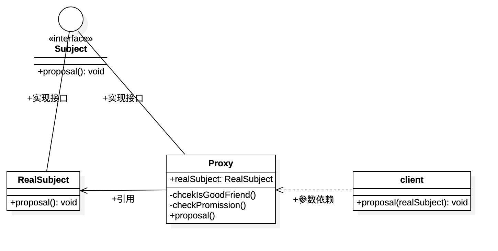

接口：

```ts
interface Subject {
    proposal() : void;
}
```

实现类：

```ts
class RealSubject implements Subject {
    public proposal(): void {
        console.log("Darling, Can you marray me?");
    }

}
```

代理类：

```ts
class Proxy implements Subject {

    private realSubject : RealSubject;

    private chcekIsGoodFriend() : boolean {
        console.log("It's is checking if good friend");
        const r = Math.ceil(Math.random() * 10);
        //只有够意思才给你传话
        if (r > 6 || r == 6) {
            return true;
        } else {
            return false;
        }

    }

    private checkPromission() {
        console.log("It's checking the promission");
        if (this.chcekIsGoodFriend()) {
            return true;
        }
        return false;
    }

    public proposal() : void {
         if(this.checkPromission()) {
            this.realSubject.proposal();
        }

    }

}
```

首先，帮忙传话需要征得当事人的同意(checkPromission)；其次，这必须是一个靠谱的朋友(chcekIsGoodFriend)。

现在我们测试一下：

```ts
let realSubject = new RealSubject();

let subject : Subject = new Proxy(realSubject);

subject.proposal();
```
PS:这里先给一个测试结果？
具体请自行检测。

代理模式的优点和缺点：PS： 这里不是少内容了。

代理模式可以代理目标对象，并且是在毫无觉察的情况下进行。
可以在不修改服务或客户端的情况下，创建新代理。

#### 4.1.6装饰者模式

装饰者模式能够在不改变对象自身的前提下，在运行期给对象增加额外的功能。提到增强对象，我们的第一印象是使用继承扩展这个类，但是继承有如下两个问题：

1.继承是静态的，无法在运行时更改已有对象的行为。

2.在某些编译型语言中(如Java)是不允许同时继承多个类的。

下面我们通过一个简单的示例进行说明，如图4-5所示。

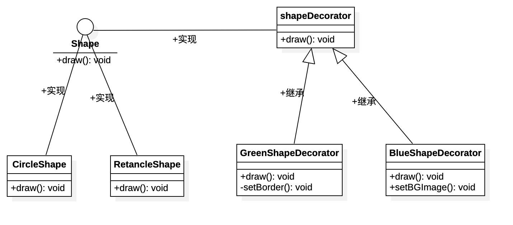

首先，在接口中定义一个基本的draw方法：

```typescript
interface Shape {

    draw(): void;

}
```

然后，用两个类实现该接口：

```ts
CircleShape implements Shape {

    public draw(): void {
       console.log("the drow method in class CircleShape");
    }
}

class RectangleShape implements Shape {

    public draw(): void {
        console.log("the drow method in class RectangleShape");
    }

}
```

接着，定义装饰类的基类：

```ts
class ShapeDecorator implements Shape {

    protected shape: Shape;

    constructor(s: Shape) {
        this.shape = s;
    }

    public draw() {
        this.shape.draw();
    }

}
```

protected属性保存着Shape对象的引用，调用draw方法，就相当于调用该对象的该方法（ps：哪个对象的哪个方法 最好指明）。接下来定义扩展后的装饰类：

```ts
class BlueShapeDecorator extends ShapeDecorator {

    public draw(): void {
        super.draw();
        this.setBGImage();
    }

    private setBGImage(): void {
        console.log("set background Image im BlueShapeDecorator");
    }

}

class GreenShapeDecorator extends ShapeDecorator {

    public draw(): void {
        super.draw();
        this.setBorder();
    }

    private setBorder(): void {
        console.log("set border in GreenShapeDecorator");
    }

}
```

“万事俱备，只欠东风”，下面进行测试：

`

let shape:  Shape  =  new  CircleShape();

let shape2:  Shape  =  new  RectangleShape();

const decorator1 =  new  BlueShapeDecorator(shape);

const decorator2 =  new  GreenShapeDecorator(shape2);

decorator1.draw();

console.log("---------------------");

decorator2.draw();

`

输出结果如下：

`

the drow method in class CircleShape

set background Image im BlueShapeDecorator

---------------------

the drow method in class RectangleShape

set border in GreenShapeDecorator

`

小结：装饰者和被装饰者相互对立，不是相互耦合。装饰者模式是继承的替代品，可以动态扩展一个实现类。

### 4.2 V8引擎

V8，这个词对很多前端程序员来说，既熟悉又陌生。熟悉的是它师出名门，它是由Google开发的高性能引擎。大名鼎鼎的node.js就是基于V8开发的，对前端开发比较友好的Chrome浏览器也有它的影子，甚至它还实现了前端的ECMAScript和WebAssembly规范。陌生的是它就像个黑盒子。本节我们将简单介绍V8的基本情况（这块的表达再需要调整下）。

V8可以运行在各个主流平台上，如Windows、macOS、Linux等。它既可以单独运行，也可以嵌入其他C++程序中。

V8是Webkit的子集。关于这个由来，我们需要简单介绍一下两次浏览器大战。

1993年，浏览器Mosaic诞生，它是由Marc Andreessen领导的团队开发的，这就是后来大名鼎鼎的Netscape（网景）浏览器（该浏览器只能显示静态的HTML元素，并不支持JavaScript和CSS）。在当时，它十分受网民的欢迎，并且在世界范围内得到认可，市场占有率甚至达到90%。然而，从1995年开始，事情变得有些不一样，这一年微软推出了IE浏览器，鉴于和windows绑定的天然优势，IE浏览器获得空前的成功，并逐渐取代了网景浏览器。至2006年年底，Netscape的市场占有率已下降至不到1%，并于2008年年初停止对网景浏览器的研发。网景公司从1998年开始成立Mozilla基金会，重新发力，研发FireFox（火狐浏览器），并于2004年发布FireFox 1.0版，正式拉开第二次浏览器大战的序幕。Firefox自推出以来，因为插件丰富、功能完善、兼容性更好，市场占有率不断攀升，而IE浏览器则因为自身原因，发展较慢。

浏览器之间的纷纷扰扰好像永无停歇。2003年，苹果公司发布了Safari浏览器，并在2005年开源了该浏览器的内核，发起了一个叫作Webkit的开源项目。浏览器的春天来了。2008年，Google以Webkit为内核，创建了一个新的项目，叫作Chromium（删外链，官网：http://www.chromium.org/ ，Chromium本身也是一个浏览器），在这个项目的基础上发布了自己的浏览器Chrome。Chromium就像一个开源实验室，它会尝试较新的技术，待这些技术稳定之后，Chrome才会把它们集成进来。

2013年，Google发布了Blink内核。Blink内核其实是从Webkit复制出去独立运作的，因为Google和苹果公司之间出现了一些分歧。Webkit将与Chromium相关的代码都删除了，同时，Blink内核也删除了chromium相关的移植代码（这句估计改错了）。Chrome从28.0.1469.0版本开始正式使用该引擎。

#### 4.2.1 Webkit架构

Webkit的大致架构如图4-5所示。

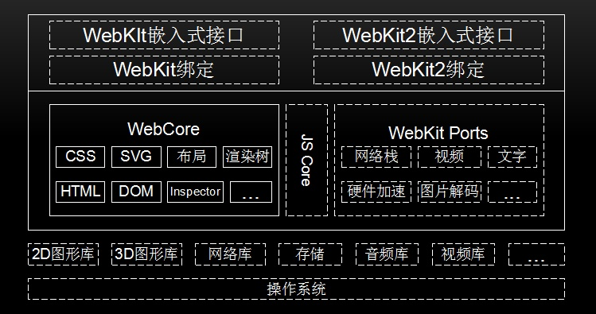

Webkit的一个比较显著的特征就是它支持不同的浏览器，微软的Edge也加入了这个阵营。图4-5中的虚线部分表示该模块在不同浏览器中使用的Webkit内核实现可能是不一样的。实线部分标记的模块表示它们基本上是共享的。

Webkit中默认的JavaScript引擎指的是JS Core，而在Chromium中默认的JavaScript引擎则是V8。什么是JavaScript引擎？就是能够处理JavaScript代码并执行的运行环境。渲染引擎提供了渲染网页的功能，渲染引擎主要包含HTML解析器、CSS解释器、布局和JavaScript引擎，如图4-6所示。


- HTML解析器：主要负责解释HTML元素，将HTML元素解析成DOM。

- CSS解释器：负责解析CSS文本，计算DOM中各元素的样式信息，为布局提供样式基础。

- 布局：把DOM信息和CSS信息结合起来，计算出它们的元素大小及位置信息，形成具有所有信息的表示模型。

- JavaScript引擎：使用JavaScript既可以操作网页的内容，也可以修改CSS的信息。JavaScript引擎能够解释JavaScript代码，可以操作网页内容及样式信息。

上面的表述较为抽象，下面我们用一张图来描述网页是如何呈现到用户眼前的，如图4-7所示。

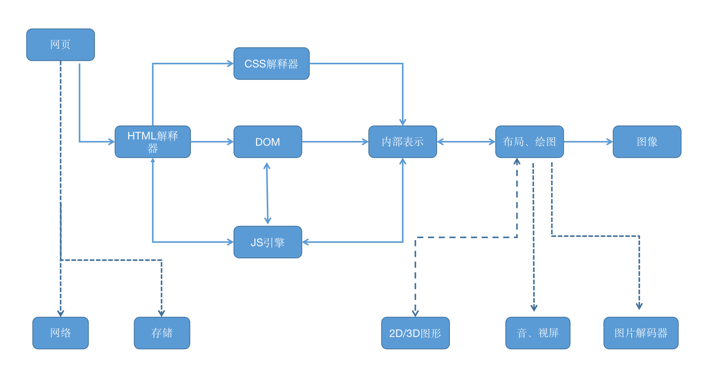

> 虚线表示在渲染过程中该阶段可能依赖其他模块。比如在网页的下载过程中，需要用到网络和存储。

##### 4.2.2 隐藏类和对象表示


虽然在JavaScript中没有明确定义类型，但是V8是在C++的基础上开发完成的，它可以为JavaScript的对象构造类型信息。V8借用了类和偏移位置的思想，将本来通过属性名匹配来访问属性值的方法进行了改进，使用类似C++编译器的偏移位置机制来实现，这就是隐藏类。

隐藏类将对象分为不同的组，在同一个组的对象如果有相同的属性名和属性值，则会将这些属性名和对应的偏移位置保存在一个隐藏类中。
这样介绍还是比较抽象的，下面通过一个简单的例子进行解释，如图4-8所示。

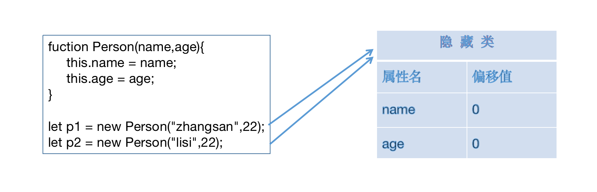

图4-8中创建了两个对象，即p1和p2, 它们有相同的属性name和age.，在v8中，它们被“安排”在同一个组中（即隐藏类中），并且这些属性有相同的偏移值。这样p1和p2可以共享这个类型信息。访问这些属性时就根据隐藏类的偏移值就可以知道它们的值继而进行访问。如果在某个p1运行时为其添加了新的属性，比如加入以下代码：

`p1.address='xi，an'`

那么，p1对应的就是一个新的隐藏类。

在了解了隐藏类之后，下面看看代码是如何使用这些隐藏类来高效访问对象的属性的。我们用以下代码进行说明：

```js
function getName(person){
 if(person && person.name){
 return person.name
 }
}
```

访问的基本过程是这样的：首先获取隐藏类的地址，然后根据属性值查找偏移值，计算出属性的地址。遗憾的是，这个过程是比较耗时的。那么是否可以使用缓存机制呢？答案是肯定的，这套缓存机制叫作内联缓存(inline-cache)，主要思想就是将之前查找的结果缓存起来，避免方法和属性被存取时出现的因哈希表查找带来的问题。最后一句我没读懂^^

在上面的getName方法中，如果要查找的name属性未缓存，则退回到前面，通过查找哈希表的方式进行查找，否则直接读取缓存。

##### 4.2.3 对象在内存中的表示

JavaScript中有6种基础类型，分别是String、Number、 Boolean、Null、 Undefined和Symbol，这些类型的值都有固定的存储大小，往往保存在栈中，由系统自动分配存储空间，我们可以直接按值访问这部分的值。
其他类型为引用类型，比如对象，内存中分配的值就不是固定的。引用类型的变量值是保存在堆内存中的（堆是非结构化区域，堆中的对象占用分配的内存。这种分配是动态的，因为对象的大小、寿命、数量是未知的，所以需要在运行时分配和释放），这部分的值是不允许直接访问的。

```js
var name="houyw";
var age = 23;
var isMale = true;
var empty = null;

var person = {
 name: "houyw",
 age: 23,
 isMale: true;
}
```


变量在内存分配空间中的宏观观察如图4-9所示，具体的实现细节对我们来说是个黑盒，接下来我们将详细介绍具体的实现过程。
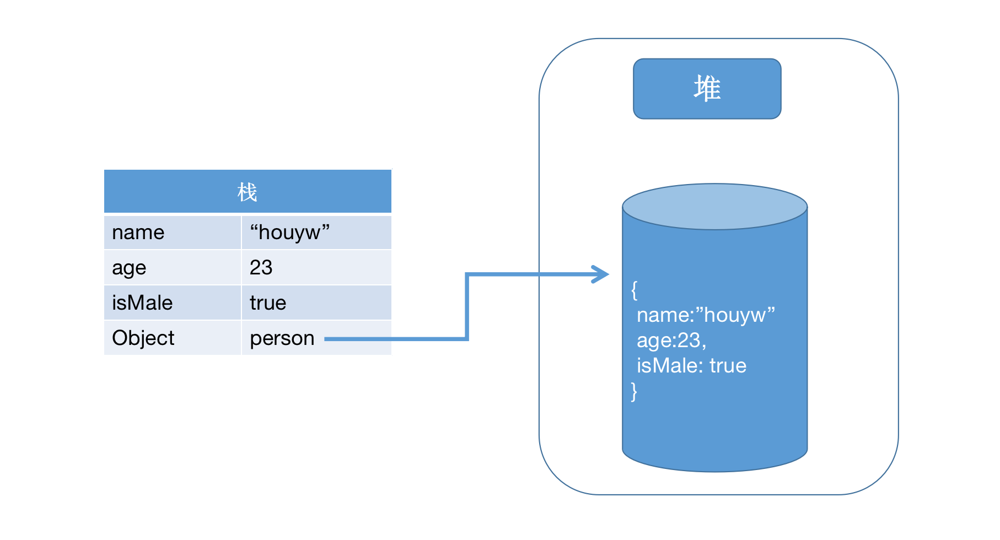

在默认情况下，JavaScript对象会在堆上分配固定大小的空间存储内部属性，当预分配空间不足时（无空闲slot），新增属性就会存储在properties中。而数字则存储在element中。如果properties和elements空间不足，则会创建一个更大的FixedArray。为了便于说明问题，下面我们举例说明：

```js
var obj ={};
```

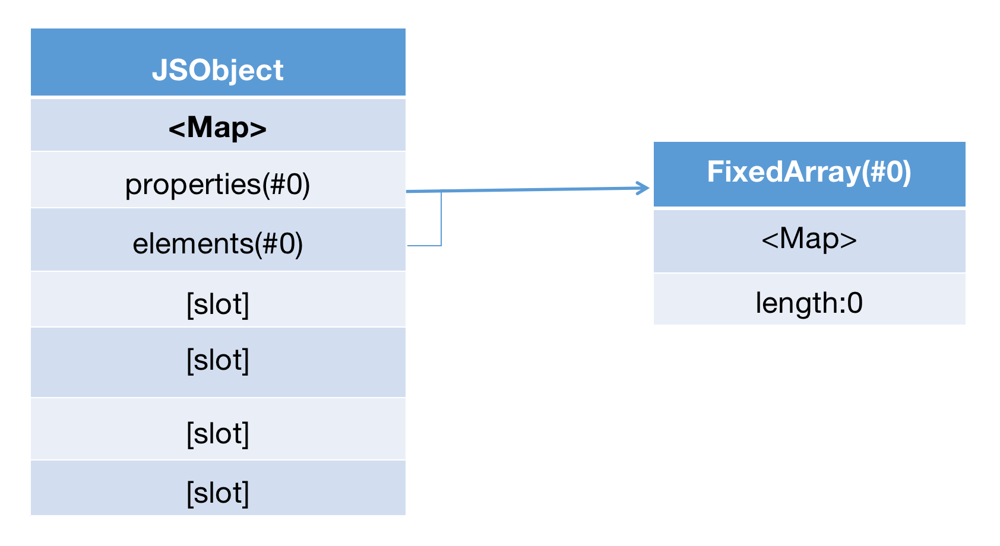

> V8使用map结构来描述对象。map结构可以理解为像table一样的描述结构。

通过对象字面量创建的空属性为对象默认分配4个内部属性存储空间。 这句对不对哈哈哈

首先添加两个属性：

```js
obj.name="houyw";

obj.age =23;
```

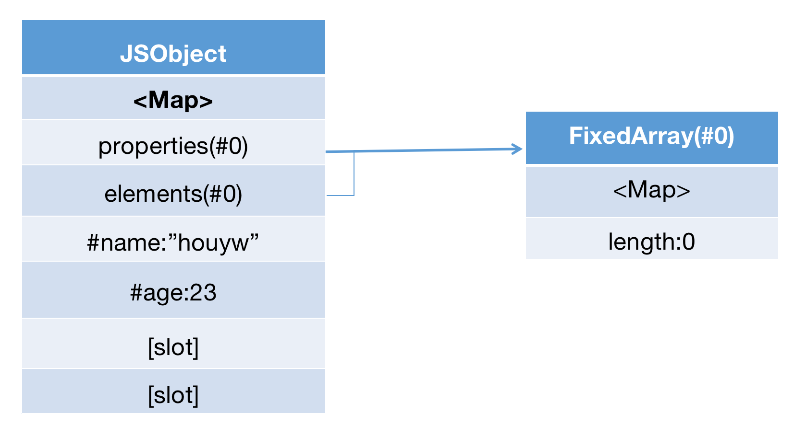

name和age属性默认存储在对象的内部属性中。再添加两个数字属性，如图4-10所示。

```js
obj[0]="aaa";

obj[1] = "bbb";
```

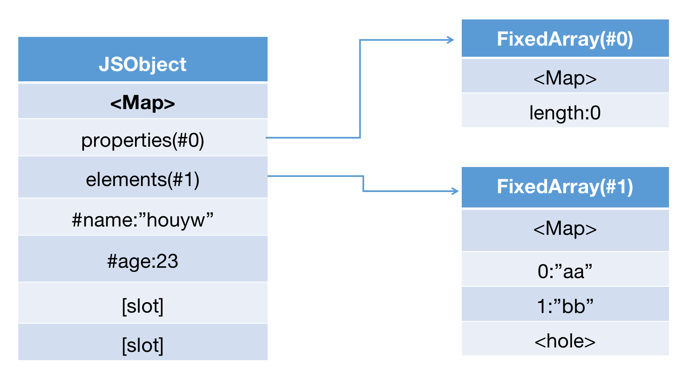

##### 4.2.4 内存管理

v8的内存管理只有两点：一是V8内存的划分，二是V8对JavaScript代码的垃圾回收。

V8的内存划分如下：

- Zone类：该类主要管理小块内存。当一块小内存被分配之后，不能被Zone回收，只能一次性回收Zone分配的所有小块内存。当一个过程需要很多内存时，Zone将分配大量的内存，却又不能及时释放，结果就导致内存不足。

- 堆：管理JavaScript使用的数据、生成的代码和哈希表等。为方便实现垃圾回收，堆被分为了三部分，如图4-11所示。
  
  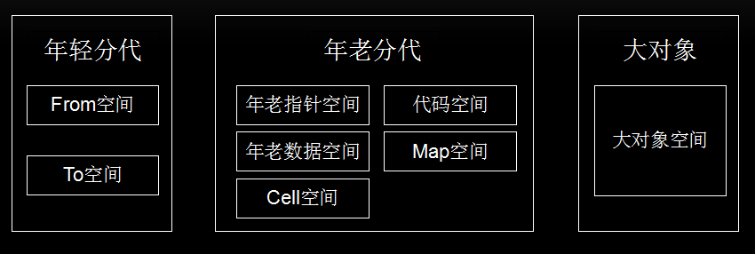
  
  需要说明的是，年轻分代主要是为新创建的对象分配的内存，新创建的对象很容易被回收。为了方便垃圾回收，使用了复制的形式，将年轻分代分成两半，一半用来分配，另一半在回收的时候负责将之前保留的对象复制过来。年老分代主要是将年老分代的对象、指针等数据在使用内存较少时进行回收。而对于大对象空间来说，主要是用来为那些需要较多内存的大对象分配的，每个页面只能分配一个对象。

V8使用了精简整理算法，标记那些还有引用关系的对象，回收没有被标记的对象，最后对这些对象进行整理和压缩。

垃圾回收机制是通过客户机或者程序代码是否可以触达此对象来判断对象是否存活的。可以这样理解可触达性（Reachability），即另一个对象是否可以获得它，如果可以，那么该对象所需的内存会被保留。

#### 

#### 4.3 宏任务和微任务

JavaScript是单线程语言，单线程意味着JavaScript代码在执行时，只能有一个主线程来处理所有的任务。

单线程是有必要的，因为最初最主要的执行环境是浏览器。JavaScript面对的是各种各样的操作DOM、操作CSS。如果是多线程执行，则很难在频繁操作的情况下保证一致性。即便保证了一致性，对性能也有较大的影响。

后来，为了实现多线程，引入了webworker，但是该技术的使用却有诸多限制：

1.新线程都受主线程的完全控制，不能独立执行，只能隶属于主线程的子线程；

2.子线程没有操作I/O的权限。

尽管js（JavaScript）是单线程的，但也是“非阻塞”的。js是如何实现的呢？其实就是由和本小节相关联的event loop（这里主要讨论浏览器版的实现）实现的。

脚本在执行时 ，js引擎会解析代码，并将其中同步执行的代码依次加入执行栈中，从头开始执行。如果当前执行的是一个方法，那么js会向执行栈添加这个方法的执行环境，然后进入这个执行环境继续执行其中的代码。当这个执行环境中的代码执行完毕并返回结果后，js会退出并销毁这个执行环境，回到上一个方法的执行环境。这个过程反复进行，直到执行栈中的代码全部执行完毕，如图4-12所示。

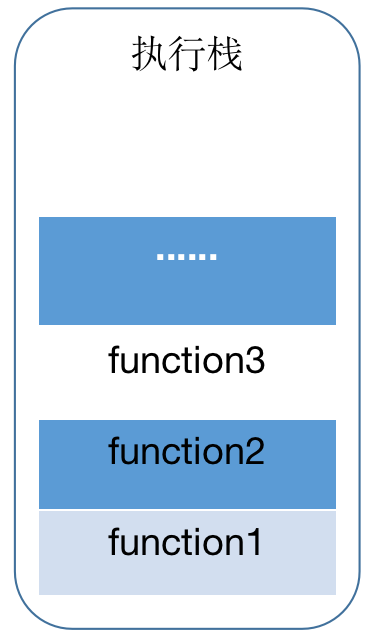

前面曾提到过，执行栈中存放的是同步代码，那么当异步代码执行时情况又是怎样的呢？既然是非阻塞的，又是通过什么机制保证的呢？这里不得不提到事件队列（Task Queue）。

熟悉JavaScript的都知道，对于异步请求，JavaScript引擎可能并不会及时返还结果，而是将这个事件挂起，继续执行执行栈内的其他方法。当异步请求返还结果时，JavaScript引擎会将这个事件推入另一个队列，叫作事件队列。放入该队列的事件并不会被立即执行，而是要等到执行栈内无可执行的方法，主线程处于空闲状态时，主线程才会去查找事件队列是否有任务。如果有，则主线程会取出第一位的事件，并把事件对应的回调函数放入执行栈中，然后执行。如此反复，就形成了无限执行的过程，这个过程被称为"事件循环(Event Loop)"。


上面的介绍十分有利于我们去了解宏任务和微任务。

前面介绍过，对于异步请求，JavaScript引擎会把这个事件推入事件另一个队列中。实际上，JavaScript引擎是根据异步事件的类型，把对应的异步事件推到对应的宏任务队列或者微任务队列中的。当主线程空闲时，主线程会先查看微任务队列中是否有事件，如果有就取出一条执行，如果没有，就从宏任务队列中取出一条执行。

现在，我们总结一下：**在同一次事件循环中，微任务的执行优先级会高于宏任务**。

下面来看一下代码的执行情况，看看在哪种情况下会被推入微任务队列，又在哪种情况下会被推入宏任务队列。

 我们来看一个例子：

```js
console.log("console-1");

setTimeout(() => {
  console.log("settimeout-1");
  Promise
    .resolve()
    .then(() => {
      console.log("promise-1")
    });
});

new Promise((resolve, reject) => {
  console.log("promise-2")
  resolve("promise-2-resolve")
}).then((data) => {
  console.log(data);
})

setTimeout(() => {
  console.log("settimeout-2");
})

console.log("console-2");
```

在浏览器中执行后，执行结果如下：

> console-1
> promise-2
> console-2
> promise-2-resolve
> settimeout-1
> promise-1
> settimeout-2

下面来看具体的执行过程，第1步执行的是全局的代码：

```js
console.log("console-1");
```

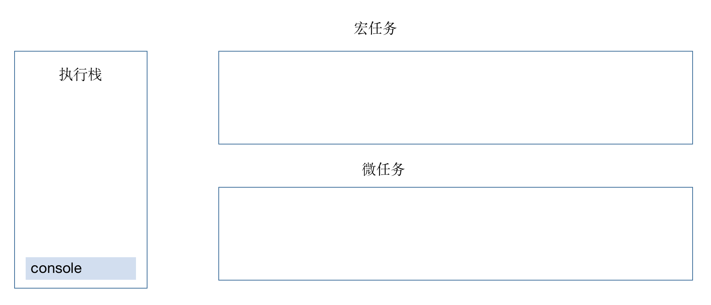

执行结果如下：

 console-1

第2步：

```js
setTimeout(() => {
 //这里定义为callback1
 console.log("settimeout-1");
 Promise
 .resolve()
 .then(() => {
 console.log("promise-1")
 });
});
```

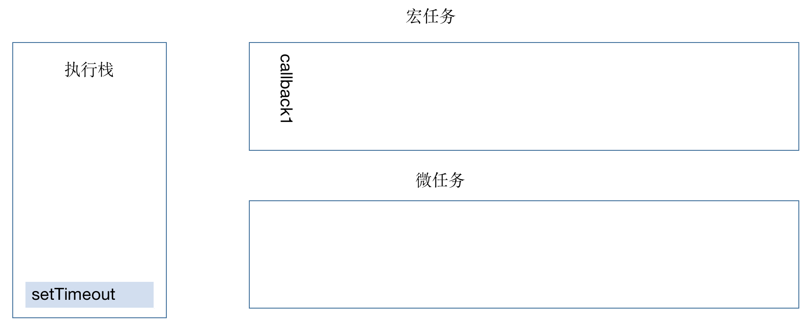

因为setTimeout会被认为是宏任务，会被加入宏任务队列中，所以打印结果仍然是：

> console-1

第3步：

```js
new Promise((resolve, reject) => {
 console.log("promise-2")
 resolve("promise-2-resolve")
}).then((data) => {
//这里定义为callback2
 console.log(data);
})
```

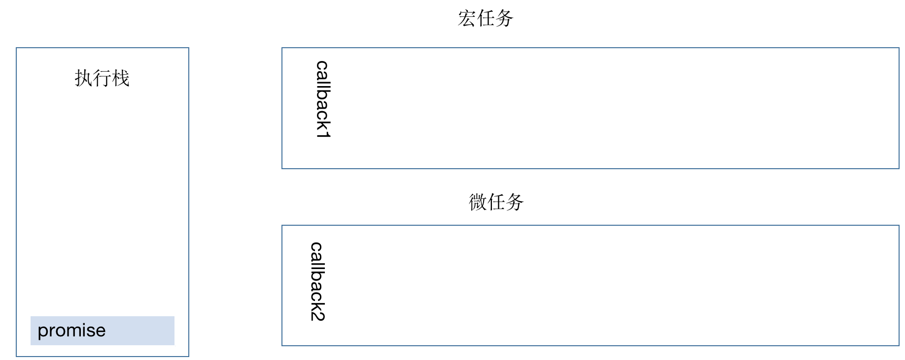

Promise的构造函数是同步执行的，会立即执行。而then中的回调函数被认为是微任务，所以会被加入微任务队列中。打印结果如下：

> console-1
> promise-2

第4步：

```js
setTimeout(() => {
   //这里定义为callback3
  console.log("settimeout-2");
});
```

setTimeout中的回调函数继续被推到宏任务。

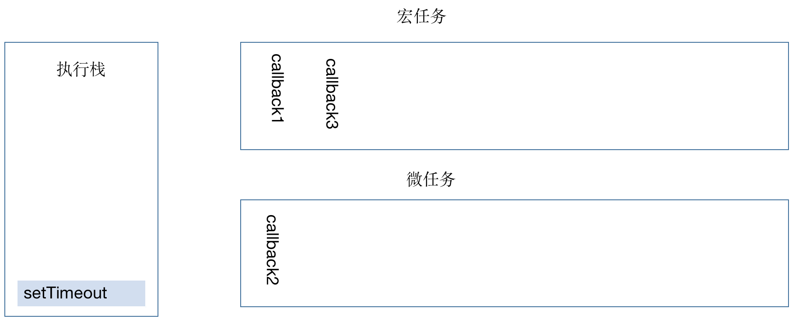

执行结果如下：

> console-1
> promise-2

第5步：

```js
console.log("console-2");
```

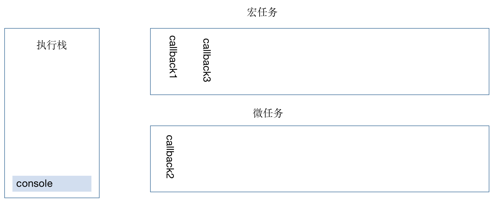

执行结果如下：

> console-1
> promise-2
> 
> console-2

第6步：全局代码已执行完毕，此时JavaScript引擎会从微任务队列中取出一个微任务执行。

```js
console.log(data);
```

执行then中的回调函数，数据为resolve后的值：

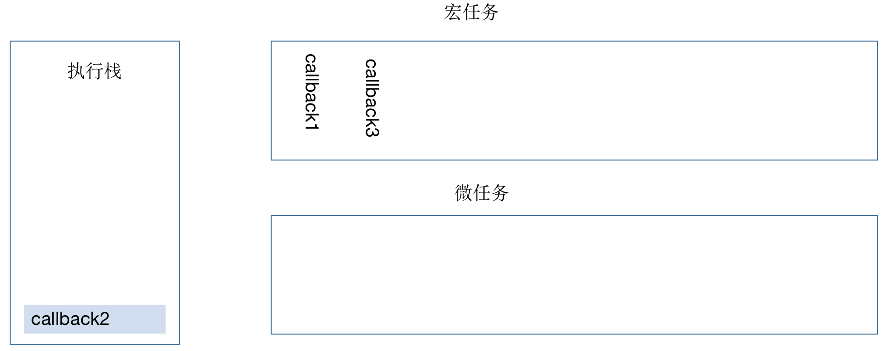

执行结果如下：

> console-1
> 
>  promise-2
> console-2
> promise-2-resolve

第7步：微任务队列中只有一个任务，执行完毕后，会从宏任务队列中取出一个任务（callback1）执行。

```js
console.log("settimeout-1");
Promise
 .resolve()
 .then(() => {
 //这里定义为callback4
 console.log("promise-1")
 });
```

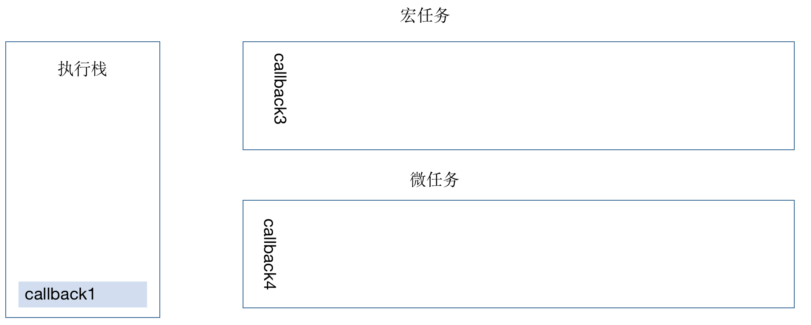

执行结果如下：

> console-1
> 
> promise-2
> 
> console-2
> 
> promise-2-resolve
> 
> settimeout-1

执行完同步任务后，又遇到另一个Promise，异步执行完后又在微任务队列中加入一个任务。

第8步：微任务队列中有任务，继续从该队列中取一个任务执行。

```js
console.log("promise-1")
```

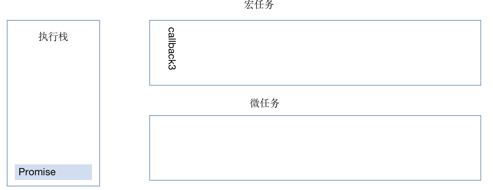

执行结果如下：

> console-1
> 
> promise-2
> 
> console-2
> 
> promise-2-resolve
> 
> settimeout-1
> 
> promise-1

第9步：从宏任务中取一个任务执行。

```js
console.log("settimeout-2");
```

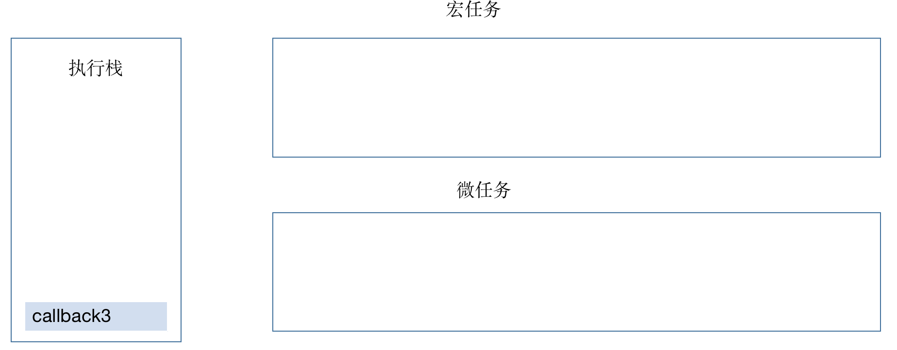

最终执行结果如下：

> console-1
> promise-2
> console-2
> promise-2-resolve
> settimeout-1
> promise-1
> settimeout-2

我们再看一个关于async/await的例子，该特性已经被广泛应用，所以有必要看一下它的执行情况。

```js
setTimeout(() => console.log("setTimeout"))

async function main() {
  console.log("before resovle")
  await Promise.resolve();
  console.log("after resovle")
}
main()
console.log("global console");
```

在async函数体内，在await之前的代码都是同步执行的，可以理解为是给Promise构造函数传入的代码。在await之后的所有代码都是在Promise.then中的回调，会被推入微任务队列中。 

> before resovle
> 
> global console
> 
> after resovle
> 
> setTimeout

总结，在浏览器端，会被推入宏任务和微任务队列中的方法的回调如下：

宏任务：I/O、setTimeout、setInterval和requestAnimationFrame。

微任务：Promise.then、catch、 finally和await(后)。

该部分的内容相对比较抽象，希望读者可以结合更多的资料加深理解，以便更深入地了解JavaScript的执行过程。

#### 4.4 异步加载规范

模块化的热度一直未退，这是因为模块化可以有更好的代码约定，方便依赖关系的管理，规范前端开发规范，提高代码的可复用性，更重要的是，模块化是前端工程化的重要因素。工程化不是具体的某一项技术，而是一种较高的层次思维。前端工程化就是把前端项目作为一个完整的工程进行分析、组织、构建、优化，在相应的过程中进行优化配置，达到项目结构清晰、边界清晰，各开发人员分工明确、配合默契、提高开发效率的目的。

模块化的贯彻执行离不开相应的约定，即规范。这是能够进行模块化工作的重中之重，正所谓“不以规矩，不能成方圆”。

下面介绍目前流行的前端模块规范：Amd，Cmd,ES6 module和CommonJS。

##### 4.4.1 Amd和requirejs

amd(Asynchronous Module Definition，异步模块定义）规范地址见链接<4-4>[https://github.com/amdjs/amdjs-api/wiki/AMD](https://github.com/amdjs/amdjs-api/wiki/AMD)。该规范通过define方法定义模块，通过require方法加载模块。

RequireJS 既想成为浏览器端的模块加载器，也想成为 Rhino/Node 等环境的模块加载器。

首先看一下define的API定义：

```js
define(id?, dependencies?, factory);
```

该方法接受3个参数，？表示可选项，定义模块时可以不用指定。第一个参数id表示该模块的ID；第二个参数dependencies表示该模块所依赖的模块，该参数是一个数组，表示可以依赖多个模块；第三个参数factory是一个函数（也可以是对象），既然是函数，就可以有参数，那么参数是如何传递进来的呢？这时就需要看dependencies这个参数了，依赖模块的声明顺序和factory函数参数的声明顺序一致，示例代码如下：

```js
define([ 'service', 'jquery' ], function (service, $) {
    //业务
}
   return { }

})
```

依赖模块service和jquery在工厂方法执行前完成依赖注入，即依赖前置。

下面看一下完整的例子，以AMD规范的requirejs实现为例，首先在HTML文件中加入如下代码：

```js
<script data-main="js/main" src="js/libs/require.js"></script>
```

data-main属性用于指定工程文件入口，在main.js中配置基础路径并进行模块声明：

```js
requirejs.config({
    //基础路径
    baseUrl: "js/",
    //模块定义与模块路径映射
    paths: {
        "message": "modules/message",
        "service": "modules/service",
        "jquery": "libs/jquery-3.4.1"

    }

})

//引入模块

requirejs(['message'], function (msg) {
    msg.showMsg()

})
```

在message模块中引入依赖模块service和jquery：

```js
define(['service', 'jquery'], function (service, $) {

    var name = 'front-end-complete-book';

    function showMsg() {
        $('body').css('background', 'gray');
        console.log(service.formatMsg() + ', from:' + name);
    }
    return {showMsg}

})
```

service代码如下：

```js
define(function () {

    var msg = 'this is service module';
    function formatMsg() {
        return msg.toUpperCase()
    };
    return {formatMsg}

})
```

详细代码请参考本书的代码示例。

##### 4.4.2  cmd和seajs

requirejs在声明依赖的模块时会第一时间加载并执行。cmd（Common Module Definition，通用模块定义）规范地址见链接<4-5>[https://github.com/seajs/seajs/issues/242](https://github.com/seajs/seajs/issues/242)），它是另一种模块加载方案，和amd的不同之处在于：amd推崇依赖前置，提前执行。cmd是就近依赖，延迟执行。

seajs则专注于Web浏览器，同时可以通过Node扩展的方式在Node环境中运行。

> 扩展阅读：
> 
> seajs与requirejs的不同参见链接<4-6>。[https://github.com/seajs/seajs/issues/277](https://github.com/seajs/seajs/issues/277)
> 
> seajs和requirejs对比参见链接<4-7>。[https://www.douban.com/note/283566440/](https://www.douban.com/note/283566440/)
> 
> seajs规范文档参见链接<4-8>。[https://github.com/seajs/seajs/issues/242](https://github.com/seajs/seajs/issues/242)
> 
> require书写规范参见链接<4-9>。[https://github.com/seajs/seajs/issues/259](https://github.com/seajs/seajs/issues/259)

seajs官方文档参见链接<4-10>，[https://github.com/seajs/seajs](https://github.com/seajs/seajs)

seajs是cmd规范的实现，这里对规范部分不做详细的介绍，下面通过一个例子来说明。

用一般引入js文件的方法导入对seajs的支持：

```js
<script src="./js/libs/sea.js"></script>
```

> alias：当模块标识很长时，可以用这个简化，让文件的真实路径与调用标识分开。
> 
> paths：当目录比较深，或需要跨目录调用模块时，可以使用 `paths` 来简化。

下面对seajs做基本的配置，并声明模块：

```js
seajs.config({

    charset: "utf-8",
    base: "./js/",
    alias: {
        jquery: "libs/jquery-3.4.1",
        message: "modules/message",
        service: "modules/service"
    },
    paths: {}
});

seajs.use("./js/main.js");
```

使用seajs.use方法在页面中加载任意模块时， base指定seajs的基础路径，该属性结合alias中的模块路径配置一起指向某一模块，这里需要注意路径的解析方法。

(1)相对标识

 在http://example.com/modules/a.js 的require模块中('./b')引入b模块后（ps:这句看不懂），解析后的路径为 http://example.com/modules/b.js。

(2)顶级标识

顶级标识**不以点（"."）或斜线（"/"）开始**， 会相对seajs的base路径来解析。假如base路径为http://example.com/modules/libs/ ，则在某模块的require('jquery/query-3.4.1')模块中引入jquery模块后，解析后的路径为 http://example.com/modules/libs/jquery/jquery-3.4.1.js。

(3)普通路径

在某个模块中引入模块require('http://example.com/modules/a') 后，根据普通路径的解析规则，会相对当前页面进行解析。

继续回到js/main.js中，引入message模块：

```js
define(function (require, exports, module) {

    require("message").showMsg();

})
```

message模块中的serivce模块和jquery模块如下：

```js
define(function (require, exports, module) {

    var service = require("service");
    var $ = require("jquery");
    var name = 'front-end-complete-book';

    function showMsg() {
        $('body').css('background', 'gray');
        console.log(service.formatMsg() + ', from:' + name);
    }
    exports.showMsg = showMsg;
})
```

> 在seajs中引入jquery模块时需要进行简单的改造，因为jquery遵循amd规范，改造方式如下：
> 
> define(function(){
> 
>     //jquery源代码
> 
>     return jQuery.noConflict();
> 
> });

完整的代码请参考源代码部分。（这个和上面的本书代码都在哪里提供？）

##### 4.4.3 Umd

兼容amd和CommonJS规范的同时，还兼容全局引用的方式, 规范地址参见链接<4-11>[https://github.com/umdjs/umd](https://github.com/umdjs/umd)，常用写法如下：

`

```js
(function (root, factory) {    
 if (typeof define === 'function' && define.amd) {        
     //AMD        
     define(['jquery'], factory);
 } else if (typeof exports === 'object') {       
  //Node, CommonJS支持       
  module.exports = factory(require('jquery'));
 } else {        
    //浏览器全局变量（root即window）     
    root.returnExports = factory(root.jQuery);
 }}(window, function ($) {       
    function myFunc(){};
    //暴露公共方法    
    return myFunc;
}));
```

`

##### 4.4.4 ES6 module

ES6在语言标准的层面上引入了module，因而更加规范。ES6 module首先在编译时加载需要的模块，使用export方法或者export.default方法暴露出方法、类、变量等，然后使用import方法导入需要的模块。

下面看一个例子。

定义3个模块：moduleA, moduleB和moduleC。其中，moduleA为主模块，在浏览器中以module的方式导入。

```js
 import name, { msg, person } from "./moduleA.js";
```

在moduleA中可以导出各种数据结构：

```js
export var msg = "msg from moduleA";

var obj = {
  name: "hyw",
  age: 23
};

export { obj as person };

export default name = "module-A";
```

 可以把这些数据输出到页面上，看看能否能被正确导入，如图4-13所示。（图号需要顺一下哈哈）

```js
<script type="module">
      import name, { msg, person } from "./moduleA.js";

      document.getElementById("test").innerHTML =
        msg + ",person name:" + person.name + ", module name is:" + name;
</script>
```

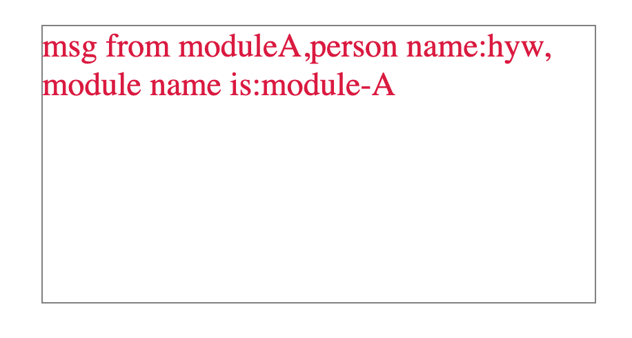

（谁）可以在浏览器Chrome、Safari、Opera或Firefox中正常执行。

另外，import方法会返回Promise对象，因而也可以写成如下所示样式（这句没改好）：

```js
if (true) {
  import("./moduleB.js").then(res => {
    console.log(res.obj.name + ", module name:" + res.default);
  });
}

Promise.all([import("./moduleB.js"), import("./moduleC.js")]).then(
  ([moduleB, moduleC]) => {
    console.log( moduleB.obj.name + ", module name:" +
        moduleB.default + ", another module is :" + moduleC.default
    );
  }
);
```

moduleC模块中的代码较为简单，具体如下：

```js
export default name = "module-C";
```

刷新浏览器，可以输出如下代码：

`

czn, module name:module-B
 czn, module name:module-B, another module is :module-C

`

> 需要注意的是，ES6 module输出的模块是引用的，即当原始值发生变化时，import加载的值也会跟着改变。

##### 4.4.5 CommonJS规范

CommonJS规范(官网参见链接<4-12>[http://www.commonjs.org/](http://www.commonjs.org/)) 是以在浏览器环境之外构建 JavaScript 生态系统为目标而产生的项目，比如在服务器和桌面环境(nw.js, electron)中。CommonJS的前身叫作Serverjs，是由Mozilla的工程师Kevin Dangoor于2009年1月创建的，同年正式更名为CommonJS。

CommonJS规范是为了解决JavaScript的作用域问题而产生的，它可以使每个模块在它自身的命名空间中执行。该规范的主要内容是，模块必须通过module.exports导出对外的变量或接口，通过require方法在运行时加载其他模块的输出到当前模块中。

> 扩展阅读：Google group参见链接<4-13> [https://groups.google.com/forum/#!forum/commonjs](https://groups.google.com/forum/#!forum/commonjs)

下面看一个简单点的例子：

```js
module.exports = function(num) {
  if (typeof num != "number") {
    return 0;
  } else {
    return num * num;
  }
};
```

该模块中暴露了一个方法，即计算一个数字的平方，在主文件引入这个模块：

```js
var square = require("./moduleA");
console.log(square(4));
```

> exports和module.exports的关系如下：
> 
> 1. module.exports的初始值为一个空对象；
> 2. exports是指向 module.exports的引用；
> 3. require方法返回的是module.exports。

> 另外需要注意的是，CommonJS模块输出的是值的拷贝，模块内部的变化不会影响已经导出的值。

#### 

#### 4.5 函数式编程入门

函数式编程是一种编程范式，它提供一种如何编写程序的方法论，主要思想是把运算过程尽量写成一系列嵌套的函数并进行调用。常见的编程范式有命令式编程、函数式编程、面向对象编程、指令式编程等。

在JavaScript中，函数作为一等公民可以在任何地方被定义，无论是在函数内还是在函数外。除此之外，它既可以被赋值给一个变量，也可以作为参数传递，或者作为一个返回值返回。

##### 4.5.1 引子 

下面通过两个简单的例子引入函数式编程。

1.对数组中的每个元素进行平方计算

```js
let array = [1,2,3,4,5,6]

for(let i =0, iLen = array.length; i <iLen; i++){
  array[i] = Math.pow(array[i],2)
}
```

这是一个典型的命令式编程，需要一步一步说明应如何实现功能。这样的写法显然有些过时了，下面进行简单的改造：

```js
[1,2,3,4,5,6].map(num => Math.pow(num,2))
```

使用map函数之后，一方面代码逻辑简化了许多，另一方面引入了函数式编程。

结合上面的例子可总结如下：

> **命令式编程**是告诉计算机具体工作步骤。
> 
> **声明式编程**是将程序的描述与求值分离，关注如何用表达式描述程序逻辑。

再来看一个对变量进行加一的例子，借此引入函数式编程的第二个特性：

```js
let counter = 0;

function increment(){
    return ++counter
}
```

这个increment方法是有一定缺陷的，该方法对其他作用域有副作用（side-effect），会影响其他作用域变量的值，所以需要进行适当的改造：

```js
let increment = counter => ++counter
```

改造后，函数内的修改只能影响传入的参数，不会对影响其他作用域的值。

需要知道的是，改造后的increate函数是一个纯函数，纯函数有以下特性：

1.函数返回值仅取决于输入参数。
2.不能造成超出作用域外的状态变化。

以上两个例子介绍了函数式编程的两个基本特性：声明式、纯函数行。函数式编程旨在帮助我们编写干净的、模块化的、可测试的、简洁的代码，提高代码的无状态性和不变性。它遵循以下原则：

   声明式（Declarative）
   纯函数（Pure Function）
   数据不可变性（Immutablity）

##### 4.5.2 函数式编程的优点

函数式编程的优点可总结如下：

1.把任务分解成简单的函数

假设我们要在页面上根据学号显示学生的姓名、年级。在拿到题目后，脑子里立刻产生的代码可能是这样的:

```js
function showStudent(stuNum){
  //stub（这是啥），假设有这样一个store，可以根据学号获得学生对象
  var student = store.get(stuNum);
  if(student){
    document.querySelector("${target}").innerHTML = '${student.name},${student.grade}'
  }
}
showStudent（'011526'）
```

这个函数从功能上看是没有问题的，能够满足功能要求。但有两个问题比较突出：
第一，代码是强耦合的，测试会变得较为复杂；
第二，代码无法复用。这与函数编程的组合思想相冲突。
下面给它做个“手术”：

```js
var find = curry(function(store,stuNum){
  var student = store.get(stuNum);
  if(student != null){
    return student;
  }
});

var objToString = function(student){
  return `${student.name},${student.grade}`
}

var append = curry(function(target,info){
  document.querySelector(target).innerHTML = info;
});

var showStudent= compose(append("target_id", objToString,find(store)));

showStudent('222')
```

这时你可能会想，curry函数和compose函数是什么样子的呢？先不要着急，在稍后介绍的函数式编程基础部分会详细介绍这两个方法。"手术后"的代码变化较大，由刚开始的1个函数变成了4个，各个函数的职责也更加清晰，find方法负责从持久化对象中获得学生对象，objToString方法负责输出学生信息，append方法负责把信息添加到目标对象上，compose方法负责把各个方法组合起来。

> 提示：职责单一不仅是函数式编程的重要特点，也是软件设计SOLID中非常重要的一个原则。

2.接近自然语言，方便理解

函数式编程的自由度较高，可以实现接近自然语言的代码。比如要计算一个数学表达式 (2+4)*15+72的值，翻译成代码语句可能要编程下面这样：

```js
add(multiply(sum(2,4), 15))
```

这样的实现方式是不是更容易理解了。

3.更容易的代码管理

函数式编程的原则之一是纯函数，状态不受外部因素的影响，同时不会改变外部状态。只要传入的参数相同，得到的结果一定是相同的（幂等）。也就是说，每个函数都是独立的，测试会变得非常轻松。

##### 4.5.3 函数式编程基础

前文介绍了函数式编程的诸多好处，那么如何才能编写出好的函数式代码呢？下面讲解函数式编程的基础。

1.高阶函数（higher-order function，HOF）

在数学和计算机科学中，高阶函数至少要满足下列一个条件：

> （1）可接收一个或多个函数作为输入；
> 
> （2）返回一个函数。

首先编写一个过滤器的高阶函数：

```js
const filter = (predicate, xs) => xs.filter(predicate)
```

然后增加一个类型判断辅助函数：

```js

const is = (type) => (x) => Object(x) instanceof type
```

测试一下：

```js
filter(is(Number), [0, '1', 2, null,"name","33"])
```

输出[0, 2]，这是我们想要的结果。

2.柯里化(Currying)

 柯里化是将多个参数的函数(多元函数) 转换为一元函数的过程。每当函数被调用时，它仅仅接收一个参数并且返回带有一个参数的函数，直到所有的参数传递完毕。

下面定义一个柯里化求值函数 curriedSum：

```js
 const curriedSum = (a) => (b) => a + b
```

简单看一下这个函数的执行过程，第一次调用：

```
curriedSum(16)
```

返回：

```js
(b) => 16 + b
```

继续调用：

```js
curriedSum(16)(24)
```

最后得到结果：40

3.闭包(Closure)

闭包是指有权访问另一个函数作用域中的变量的函数。闭包形成的最常见的方式是在一个函数内创建另一个函数，通过另一个函数访问这个函数的局部变量。

总体来说，闭包有3个特性：  
（1）函数嵌套；  
（2）内部函数可以引用外部函数的参数、变量和函数表达式； 
（3）闭包不会被垃圾回收机制回收，常驻内存。

先声明一个简单的闭包形式：

```js
function init() {
  var name = '首席coder'; 
  var innerCount = 0;
  function displayName() { 
    innerCount++;
    alert(name);    
  }
  function getCount(){
    alert(innerCount)
  }
  displayName(); 
  displayName();   
  getCount(); //2
}
```

方法displayName声明在init方法内形成闭包。通过两次调用displayName方法将innerCount增加，通过显示的值可以看出，闭包涉及的变量会常驻内存，不会被释放。所以说闭包数量过多时会导致内存泄漏。

4.函数组合(Function Composition)

函数组合是函数式编程中非常重要的部分，函数式编程崇尚细粒度的函数实现，细粒度实现后，应如何把这些函数组织起来有效的工作呢？

这就是函数的组合功能，先来看一下函数组合的雏形：

```js
const compose = (f, g) => (a) => f(g(a)) 
```

compose中接收了两个函数（为了简单起见，这里对参数进行类型校验，默认为函数类型）作为参数，对传进来的参数先用函数进行运算，再把运算结果作为f函数的入参继续运算。

有了函数组合之后，还需要定义规则，说明想要实现的功能。比如，想要把数字四舍五入后并转换为字符串，就需要两个方法，一个是Math的round方法，另一个是toString方法。下面把这两个方法整合成一个方法floorAndToString：

```js
const floorAndToString = compose((val) => val.toString(), Math.round)
```

测试结果如下：

```js
floorAndToString(121.212121) // '121'
floorAndToString(121.512121) // '122'
```

测试顺利通过。至此，函数式编程中最重要的原则已全部介绍完毕，再来看4.5.2节中优化后的代码，是不是变得更容易理解了？

5.其他原则

函数式编程还有其他原则，限于篇幅这里不再详细介绍，感兴趣的读者可以自行查阅：

    幂等 （Idempotent)

    偏应用函数（Partial Application)

    断言 （Predicate)

    自动柯里化（Auto Currying)

> 笔者整理的相关内容参见链接<4-14>。http://www.houyuewei.cn/2018/08/23/js-func-program-term

#### 

#### 4.6 实践：状态原理解析

 前端技术的发展日新月异，经过几年的沉淀，逐渐形成了以React、Vue、Angular为“领袖”的三大开发框架和各自的全家桶，带来了全新的开发体验。

随着页面复杂度的升级，对应的localstorage、vuex、redux和mobx等数据存储和管理方案也渐渐复现。所以对状态管理的原理进行一定的了解还是很有必要的，了解基本原理也方便理解其他的管理库。

下面通过一个简单的例子，一步一步解析一下state是如何工作的。

基本的原理图如图4-14所示。

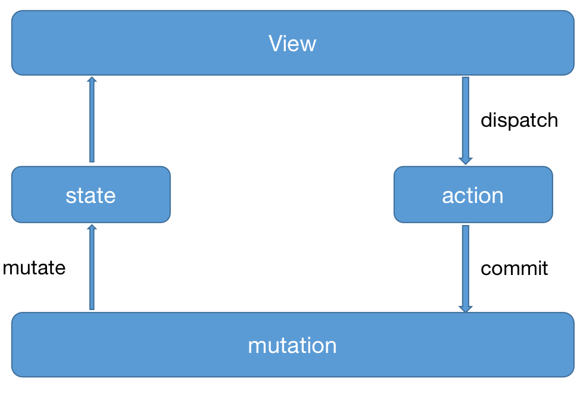

数据流向有单向（如vuex、redux）和双向（mobx）之分，与双向数据流相比，单向数据流更具可维护性，所以以此模型进行说明。

事件默认都是从UI页面开始发起的，dispatch一个action，也就是说，在单向数据流模型中，状态的改变都是以触发action作为入口条件的，在action中commit（提交）一个mutation来更新state中的数据，状态改变会自动更新页面。


阐述完状态的基本原理后，下面实现一个如图4-15所示的页面（数据不持久化）。

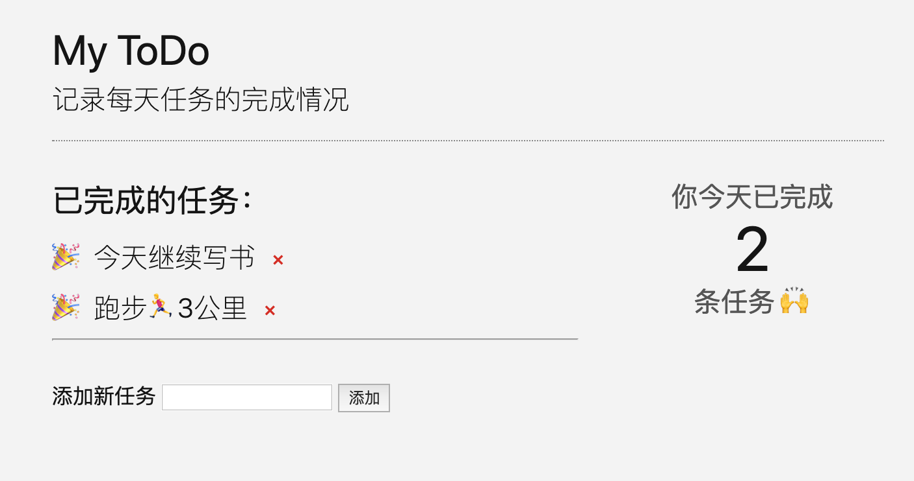

已完成任务部分（List组件）和右侧（未）完成任务（count组件）部分分别对应两个组件。


先来看View组件，定义一个component的基类：

```js
export default class Component {
  constructor(props = {}) {
  
    // 继承该类的组件应该实现该方法，用来渲染组件
    this.render = this.render || function() {};

    if (props.store instanceof Store) {
      props.store.events.subscribe("stateChange", () => self.render());
    }

    //如果element（用中文）元素，就把该元素设置为元素挂载节点
    if (props.hasOwnProperty("element")) {
      this.element = props.element;
    }
  }
}
```

我们约定各子组件要实现的render方法，然后在render方法中实现DOM结构。this.element指定DOM结构的挂载位置。为了实现页面的自动更新，子组件借助发布/订阅模式订阅stateChange事件。在store中，当state中的数据更新时，会发布该事件，子组件收到通知后会重新渲染。该行为类似React中的setState中的效果。

再看一下组件的具体实现，Count.js（大小写确认一下，代码中没看到？）：

```js
import Component from "../lib/component.js";
import store from "../store/index.js";
import _ from "../lib/utils.js";

export default class Count extends Component {
  constructor() {
    super({
      store,
      element: _.$(".js-count") //获得dom节点
    });
  }

  render() {
    let emoji = store.state.items.length > 0 ? "🙌" : "😢";

    this.element.innerHTML = `
            <small>你今天已完成</small>
            <span>${store.state.items.length}</span>
            <small>条任务 ${emoji}</small>
        `;
  }
}
```

子组件中通过调用父组件的构造函数完成了事件订阅。

```js
export default class PubSub {
  constructor() {
    this.events = {};
  }

  /**
   * 订阅事件，并注册回调方法
   */
  subscribe(event, callback) {
    let self = this;

    if (!self.events.hasOwnProperty(event)) {
      self.events[event] = [];
    }

    return self.events[event].push(callback);
  }
}
```

下面梳理一下store的情况，store由action、mutation和state三部分组成。action用来标识每个请求，它是触发state变化的唯一因素。mutation类似于事件，每个mutation都有一个事件类型和回调函数，这个回调函数是进行状态改变的地方，可接收state和payload作为参数。

```js
export default new Store({
    actions,
    mutations,
    state
});
```

store.js

```js
export default class Store {
  constructor(params) {
    let self = this;
    //定义actions（这里有s，上面的没有，是否需要统一）、mutations和state
    //在初始化中，需要把action和mutation都初始化进来
    self.actions = {};
    self.mutations = {};
    self.state = {};

    // A status enum to set during actions and mutations
    self.status = "resting";

    // 初始化发布——订阅模型
    self.events = new PubSub();

    //如果传入actions，就使用传入的actions
    if (params.hasOwnProperty("actions")) {
      self.actions = params.actions;
    }

    if (params.hasOwnProperty("mutations")) {
      self.mutations = params.mutations;
    }

    //对state的值设置拦截
    self.state = new Proxy(params.state || {}, {
      set: function(state, key, value) {
        state[key] = value;
        // 发布 stateChange通知
        self.events.publish("stateChange", self.state);

        return true;
      }
    });
  }
  }
```

把store中的state设置成全局state数据模型的代理，这是因为我们要让state扮成状态机的角色，state的变化引发页面的渲染，此时Proxy是一个很好的选择。

> 对Proxy不是很熟悉的读者可以参见链接<4-15>。https://developer.mozilla.org/zh-CN/docs/Web/JavaScript/Reference/Global_Objects/Proxy


在Proxy的set钩子里，一旦state发生变化，就会发布stateChange通知各个子组件。


store又是如何分发action的呢？我们来探究一下，看看store中定义的dispatch函数，它可接收type类型和数据对象：

```js
dispatch(actionKey, payload) {

    // 校验action（注意是否为actions）是否存在
    if (typeof self.actions[actionKey] !== "function") {
      console.error(`Action "${actionKey} doesn't exist.`);
      return false;
    }

    // 分组显示action信息
    console.groupCollapsed(`ACTION: ${actionKey}`);

    // 设置action，说明我们正在dispatch（中译文）一个action
    self.status = "action";

    //调用actions
    self.actions[actionKey](self, payload);

    // Close our console group to keep things nice and neat
    console.groupEnd();

    return true;
  }
```

在view组件中，通过下面的代码

```js
store.dispatch(types.ADDITEM, value);
```

派发action，这里需要为每个action指定类型，使用该字段为区分是什么类型的action。因为所有的action在store初始化时已经注入，所以只需根据action type来判断对应的action是否存在即可。

action.js

```js
export default {
  addItem(context, payload) {
    context.commit(types.ADDITEM, payload);
  },
  clearItem(context, payload) {
    context.commit(types.CLEARITEM, payload);
  }
};

```

如果能找到对应的action，则立即执行。注意：

```js
self.actions[actionKey](self, payload);
```

因为action在执行时需要把self传进来，所以action中方法的第一个参数还是指向store的。store继续commit（这个词用中文）：

```js
commit(mutationKey, payload) {

    // 校验mutation是否存在
    if (typeof .mutations[mutationKey] !== "function") {
      console.log(`Mutation "${mutationKey}" doesn't exist`);
      return false;
    }
    ...
    // 创建一个新的state，并将新的值附在state上
    let newState = this.mutations[mutationKey](this.state, payload);

    // 替换旧的state值
    this.state = Object.assign(this.state, newState);

    return true;
  }
```

commit中的mutationKey是从action顺延下来的。与action的处理过程相似，对应的mutation也是初始化加载，需要根据key值处理对应的mutation：

mutation.js

```js
export default {
    addItem(state, payload) {
        state.items.push(payload);
        
        return state;
    },
    clearItem(state, payload) {
        state.items.splice(payload.index, 1);
        
        return state;
    }
};

```

state带对应addItem类型的mutation，在state数组中push一条记录。至此，我们就了解了state的状态机是如何工作的，Proxy的set钩子是如何被触发的，子组件是在何种情况下重新工作的。

一切都变得顺理成章。现在可以启动一下示例代码或者按照这个思路重新实现一遍，看看效果是怎样的。

ps：在后续编写中，注意：
1.英文大小写前后一致，与代码中的也要一致。
2.给图加上图号，外链也要顺一下号。
3.过于口语的部分建议删掉。
4.写的非常工整啦，特别赞一下。


