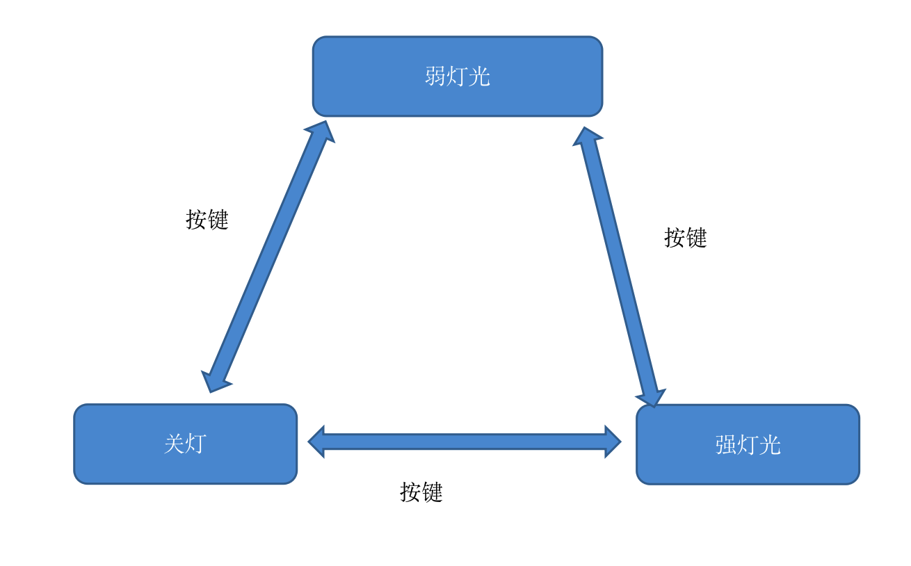

## 第4章: 前端架构核心思想

掌握牢固的基础是了解架构（或js框架）关键。正所谓“工欲善其事，必先利其器”。如果你有读过js库或框架的经验，你是否有过因为架构基础不牢固而觉得代码晦涩难懂。很明显本章内容将是你需要的。
本章将围绕以下内容进行详细阐述：

1. 框架中常用的6种设计模式。
2. 作为一个标准的前端开发，需要了解的v8知识点。
3. 宏任务和微任务的处理过程是怎么样的。
4. 介绍有哪些异步加载规范。
5. 函数式编程基础
6. 以v-dom和状态原理两个例子入手，深入剖析两者的实现过程。

### 4.1 常用设计模式介绍

#### 4.1.1状态模式

状态模式是一个比较有用的模式，意思是指当一个对象的内部状态发生变化时，会产生不同的行为。

比如说某某牌电灯,按一下按钮打开弱光, 按两下按钮打开强光, 按三下按钮关闭灯光。在我们的想象中，基本的模型应该是如下描述

状态模式允许对象在内部状态改变时，改变其行为，从对象的角度看好像进行了改变。实际开发中，某处文字可能和模型中的一字段进行关联，根据某一个状态显示不同的内容，这时候状态模式可能是你需要的（当然 switch-case, if-else可以继续）。

状态模式中有几个角色，分别是Context，State，各个子状态的实现。Context中保存了Client端的操作接口，同时也保存子状态的实现，代表着当前状态。抽象类State声明了子状态应该实现的各个方法。

先看下Context的实现

`

 export  default  class  Context  {

   private  state:  State;

   constructor(state:  State)  {

   this.transitionTo(state);

}

public  transitionTo(_s:  State):  void  {

  console.log(`Context: transition to ${(<any>_s).constructor.name}`);

  this.state  =  _s;

  this.state.setContext(this);

}

public  setSlighLight():  void  {

   this.state.slightLight(); 

}

public  setHightLight():  void  {

  this.state.highLight();

}

public  close():  void  {

  this.state.close();

  }

 }

`

在transitionTo方法中改变当前状态，参数为实例化的子状态类。

再看下State的实现及其SlightLightClass的实现，为了篇幅考虑，我们在这里只贴出部分的代码，完整的代码参考[https://github.com/houyaowei/front-end-complete-book/tree/master/chapter04/code/4.1DesignPattern/State](https://github.com/houyaowei/front-end-complete-book/tree/master/chapter04/code/4.1DesignPattern/State)。

`

export  default  abstract  class  State  {

  protected  context:  Context;

  public  setContext(_c:  Context)  {

   this.context  =  _c;

}

public  abstract  slightLight():  void;

public  abstract  highLight():  void;

public  abstract  close():  void;

}

`

`

export  default  class  SlighLightClass  extends  State  {

  public  slightLight():  void  {

   console.log("state in SlighLightClass, I will change state to highLight");

   //切换到新的状态

   this.context.transitionTo(new  HighLight());

}

public  highLight():  void  {

  console.log("hightstate state in SlighLightClass");

}

public  close():  void  {

  console.log("close state in SlighLightClass");

 }

}

`

我们来测试下：

`

import Context from  "./Context";

import SlightLight from  "./SlightLightClass";

import CloseLight from  "./CloseClass";

// const context = new Context(new SlightLight());

//我们先用close状态初始化

const context =  new  Context(new  CloseLight());

context.close();

context.setSlighLight();

context.setHightLight();

`

结果如下：

`

Context: transition to ColseClass

state in closeClass, I will change state to slight

Context: transition to SlighLightClass

state in SlighLightClass, I will change state to highLight

Context: transition to HighLightClass

highLight state in HighLightClass

`

现在我们把初始状态调整为SlightState,重新编译、运行

`

Context: transition to SlighLightClass

state in SlighLightClass, I will change state to highLight

Context: transition to HighLightClass

highLight state in HighLightClass

state in hightLight, I will change state to close

Context: transition to ColseClass

`

状态模式封装了转换规则，并枚举了可能的状态。将所有的与某个状态有关的行为放到一个类中，所有可以方便地增加状态。

状态模式的使用必然会增加系统类和对象的个数。 状态模式的结构与实现都较为复杂，如果使用不当将导致程序结构和代码的混乱。 状态模式对"开闭原则"的支持并不太好，对于可以切换状态的状态模式，增加新的状态类需要修改那些负责状态转换的源代码，否则无法切换到新增状态，而且修改某个状态类的行为也需修改对应类的源码。

#### 4.1.2策略模式

#### 4.1.3适配器模式

#### 4.1.4观察者模式

观察者模式（Observer Pattern）又叫做发布-订阅模式(Pub/Sub)模式或消息机制。帮你的对象知悉现状，能及时响应订阅的事件，可以看成是一种一对多的关系。当一个对象的状态发生改变时，所有依赖它的对象都应得到通知。 
观察者模式是松耦合设计的关键。 
我们用淘宝购物中的一个例子来理解观察者模式： 
你在淘宝上找到一款心仪的电脑，是最新发布的16寸的Mackbook Pro,但是联系卖家后发现没货，鉴于商铺比较好的信誉度和比较大的优惠力度，你觉得还是在这家买比较划算，所以就问卖家什么时候有货，商家告诉你需要等一周左右，还友情提示你:"亲，你可以先收藏我们的店铺，等有货了会再通知你的"，你收藏了店铺。电脑发烧友可不止你一个，小明、小华等陆陆续续也都收藏了该店铺。 
从上面的故事中可以看出，这是一个典型的观察者模式，店铺老板是发布者，你、小明、小华都是订阅者。Mac电脑到货(即状态改变)，会依次通知你、小明，小华等，使用旺旺等工具依次给他们发布消息。

下面我们看下基本的模型：

在上面的模型中可以看出，商家维护着和各位客户的引用关系，通过观察者添加、解除引用关系，就好比说，某天某客户不再中意这款电脑，商家就再无引用这份关系了。

> 本书中所有的代码均是由Typescript描述，周所周知，Typescript为Js的超集，具有强类型约束，在编译期就可以消除安全隐患，具体的介绍可以参考管网，[https://www.typescriptlang.org/](https://www.typescriptlang.org/), 也可以联系笔者可以共享的电子书

下面我们看下代码模型，先看下商家的代码实现：

`

import Customer from  "{path}/CustomerModal";

export  default  class  Seller  {

  customers:  Customer[];

  register(customer):  void  {

   this.customers.push(customer);

}

remove(id:  number):  void  {

  this.customers.forEach(c  =>  {

  if (c.getId() ===  id) {

   console.log(`this id: ${id} should be removed`);

  }

  });

}

notifyAll():  void  {

  this.customers.forEach(cus  =>  {

   cus.dealOrder();

   });

   }

}

`

customers属性维护着所有订阅者，数组中的 每个元素都是Customer对象，我们从模拟对象出发，抽象出该对象：

`

export  default  class  Customer  {

  private  id:  number;

  private  name:  string;

  private  address:  string;

  private  telNum:  string;

  private  orders:  Order[];

constructor(_id:  number, _name:  string, _address:  string, _telNum:  string)  {

  this.id  =  _id;

  this.name  =  _name;

  this.address  =  _address;

  this.telNum  =  _telNum;

}

getId():  number  {

  return  this.id;

}

dealOrder():  void  {

  //make a order

   console.log(`I am + ${this.name}， I have got message from seller`);

  }

}

`

看了商家的模型后，来看下观察者模式的模型：

`

import Seller from  "./Seller";

import Customer from  "./CustomerModal";

export  default  class  Observer  {

  constructor()  {

   this.seller  =  new  Seller();

  }

  private  seller:  Seller;

  register(customer:  Customer):  void  {

   console.log("");

   this.seller.register(customer);

  }

fire():  void  {

  this.seller.notifyAll();

}

remove(customerId:  number):  void  {

  this.seller.remove(customerId);

}

}

`

上面的代码中，是从OOP的实现方式出发进行设计。已经有了观察者模式所需要的两个主要元素：主题（商家）和观察者（各位客户），一旦数据改变，新的数据就会以某种形式推送到观察者的手上。

现在我们来测试下这几段代码：

`

import Customer from  "./CustomerModal";

import Observer from  "./Observer";

let customer1 =  new  Customer(1101,  "caozn",  "shanxi",  "12900000");

let os =  new  Observer();

os.register(customer1);

let customer2 =  new  Customer(1102,  "houyw",  "henan",  "12900001");

os.register(customer2);

console.log(os.getAllCustomers().length);

os.fire();

`

得到的结果如下：

`

现在商家有 2 个客户订阅

I am caozn， I have got message from seller

I am houyw， I have got message from seller

`

主题和观察者之间定义了一对多的关系。观察者依赖整个主题（商家），毕竟要从主题那里获得通知。并且主题是具有状态的，也可以控制这些状态。

观察者模式定义了主题和观察者之间的松耦合关系，并且还可以让两者进行交互，而不用太关注对方的细节。"keep it simple".当然缺点也不是完全没有的， 如果过多的使用发布订阅模式, 会增加维护的难度。

#### 4.1.5代理模式

#### 4.1.6装饰者模式

#### 4.2 V8引擎该了解的

#### 4.3 任务详解

#### 4.4 异步加载规范

#### 4.5 函数式编程入门

#### 4.6 实践

  4.6.1 v-dom原理剖析

  4.6.2 状态原理解析
