#### 第五章 性能优化指南

性能优化是前端开发里非常重要的一部分。为了实现资源的快速加载，各个前端开发团队都是使用浑身解数争取更好的用户体验。本章我们着重从浏览器运行机制出发，介绍浏览器缓存相关机制，让大家明白各个优化点的背后的原理，形成系统的知识点。

到目前为止由于大部分的主流浏览器都向webkit靠拢，Edge已由Chromium开发并已发布81.0.416.53版本，之前的IE6到IE11版本都是Trident内核。Firefox浏览器使用的是Gecko内核。Safari也是有最初的webkit内核升级到了webkit2。Opera也追随到到了webkit阵营，抛弃了Presto，于2013年4月采用Google发布的Blink内核(Blink是Google在webkit基础上为了分离组件而建立的新的分支)。所以还是以webkit作为主线进行介绍。

本章包含如下内容：

1、浏览器的运行机制

2、浏览器的缓存机制

3、性能分析涉及各模块解释

4、从具体细节出发介绍优化策略

##### 5.1 浏览器运行机制

浏览器背后的运行机制非常复杂，是由多个进程协作完成。  为了更好的说明浏览器的运行机制，我们从一道经典的面试题开始：

从地址栏输入URL到页面加载完成，中间都经历了什么？

正式介绍前，我们需要先看下Chrome的多进程架构，有助于更形象地说明这个过程。

> 关于进程和线程的wikipedia解释：用户下达运行程序的命令后，就会产生进程。同一程序可产生多个进程（一对多关系），以允许同时有多位用户运行同一程序，却不会相冲突。
> 
> 进程需要一些资源才能完成工作，如[CPU](https://zh.wikipedia.org/wiki/CPU "CPU")使用时间、[存储器](https://zh.wikipedia.org/wiki/%E8%A8%98%E6%86%B6%E9%AB%94 "存储器")、文件以及[I/O](https://zh.wikipedia.org/wiki/I/O "I/O")设备，且为依序逐一进行，也就是每个CPU核心任何时间内仅能运行一项进程。
> 
> 进程与线程的区别：进程是计算机管理运行程序的一种方式，一个进程下可包含一个或者多个线程。线程可以理解为子进程。一个进程可以有很多线程，每条线程并行执行不同的任务，并且同一进程中的多条线程将共享该进程中的全部系统资源。

Chrome是多进程的，两个进程之间可以通过IPC(Inter Process Communication)的方式进行通信，顶层由一个Browser process用来协调浏览器的其他进程。

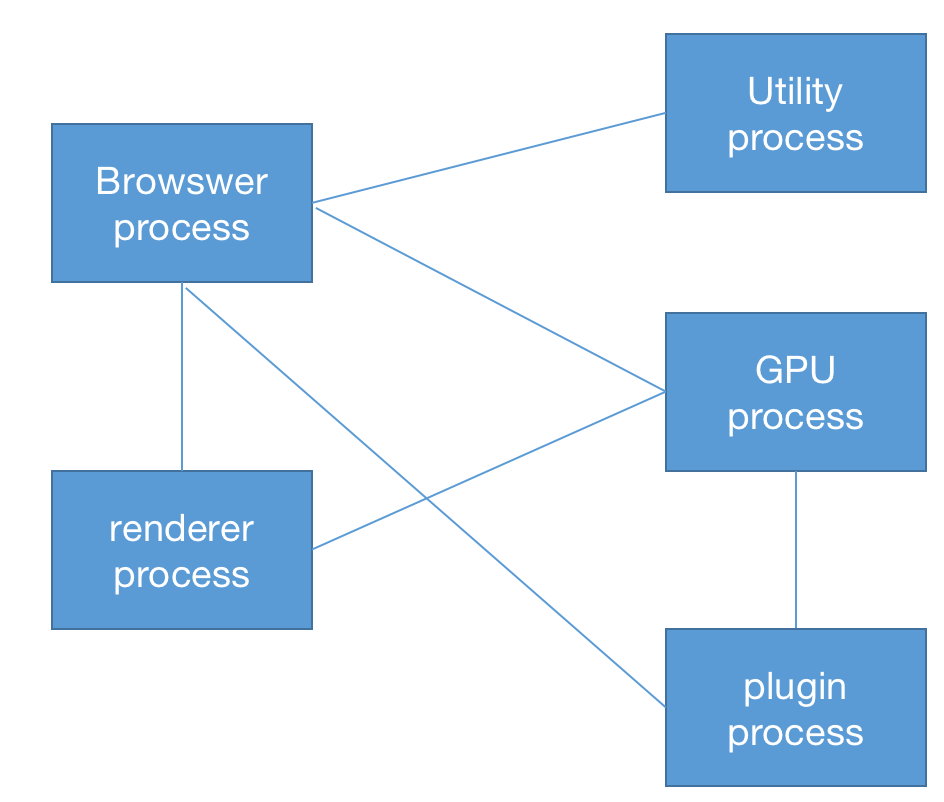

具体来说，Chrome的主要进程及其职责如下：

Browser Process：负责包括地址栏，书签栏，前进后退按钮等的工作；负责处理浏览器的一些不可见的底层操作，比如网络请求和文件访问。

Renderer Process：主要负责一个 tab 内关于网页渲染的所有事情。

Plugin Process：管理一个网页用到的所有插件，比如说逐渐被淘汰的flash。

GPU Process：处理 GPU 相关的任务。

从上面各个进程的职责上来看，Browser Process主要协调Tab之外的工作，它并且又对这些工作进行了细粒度的划分，其主要是使用不同的线程进行处理：

- UI 线程 ： 控制浏览器上的按钮及输入项等。

- network 线程: 处理网络请求，从网上获取数据。

- storage 线程: 控制文件等的访问；
  
  现在，我们回到上面那个面试题。当在地址栏中输入网址敲回车键后到看到整个页面大概分成这几步。

**处理用户输入**

先由UI线程判断用户输入的是一个网址还是一个要查询的关键字。因为Chrome中地址栏同时也是一个输入框。UI线程去解析内容并判断是需要把输入的内容交给查询引擎呢还是要导航到你需要的网站。

**开始导航**

敲击回车键，UI 线程 通知 network 线程 获取网页内容，并控制 tab 上的 spinner 展现，表示正在努力加载中。

network 线程 会执行 DNS 查询，随后为请求建立 TLS 连接。

> DNS(运行在UDP协议上)是互联网上域名和IP地址相互映射的分布式数据库，有了DNS，用户不用在记住每个域名的IP地址就可以上网。比如当在地址栏输入http://developer.mozilla.org ，DNS服务器就可以解析该主机名得到IP地址，该过程就叫做域名解析。
> 
> 主机到IP地址的映射一般是两种方式：静态映射和动态映射。区别在于：静态映射方式是每台设备上分别配置映射关系，各自维护各自的，只能独享；动态映射是建立一套DNS系统，只需要在该系统上配置映射关系，各域名解析都用这套系统，达到共享的目的。

如果network线程接收到了301状态码重定向请求头 ，那么network线程会通知UI线程 "服务器要求重定向"，随后就加载新的URL。

**读取响应体**

一旦服务器返回内容，network 线程会读取响应主体中的MIME类型信息，"Content-Type"字段说明返回内容的格式，"Content-Length"描述响应主体的内容长度。

网页的MIME的类型信息为"test/html"。下一步把这些数据传递给 renderer process，如果是 压缩文件或者其它文件，会把相关数据传输给下载管理器。

[Safe Browsing](https://link.zhihu.com/?target=https%3A//safebrowsing.google.com/) 检查也会在此时触发，如果域名或者请求内容匹配到已知的恶意站点，network线程会展示一个警告页。此外 [CORB](https://link.zhihu.com/?target=https%3A//www.chromium.org/Home/chromium-security/corb-for-developers) (Cross Origin Read Blocking)检测也会触发,确保敏感数据不会被传递给渲染进程。

> Safe Browsing: https://safebrowsing.google.com/
> 
> CORB:  https://www.chromium.org/Home/chromium-security/corb-for-developers

**查找渲染进程（renderer process）**

 当上述所有检查完成，并且通过安全检查，network 线程确信浏览器可以导航到请求的页面，network线程就会通知 UI 线程数据已经就绪，这时UI 线程会查找到一个renderer process 进行网页渲染。其实，为了能快速响应，UI线程会预查找和启动一个渲染线程，如果可以访问，该渲染进程继续。如果有重定向，准备好的线程就会废弃而重启一个线程。

**确认导航**

经过上面的步骤，数据已就绪，渲染线程也已经创建，可以说是万事俱备只欠东风了，这个东风是什么呢？就是前面咱们提到的进程间的通信，IPC消息。Browser Process 会给 renderer process 发送 IPC 消息来确认导航，一旦 Browser Process 收到 renderer process 的渲染确认回复，导航过程结束，页面加载过程开始。

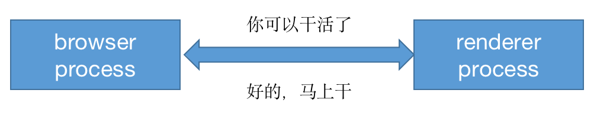

此时，地址栏已更新为新网址，呈现出新网页内容。history tab同样会更新，此刻可通过返回键返回到原来的页面。为了让tab页签 或者窗口关闭后能够恢复，这些信息都会保存到硬盘中。

**额外的操作**

一旦导航被确认，renderer process 会加载资源并渲染页面，渲染流程是怎么工作的，这里先不展开了，后面我们将重点介绍渲染流程。当 renderer process 渲染完所有的页面，并且触发了所有帧的onload事件，会到 Browser process发送 IPC 信号， UI 线程停止展示 tab 中的 spinner。

当输入另一个URL加载新页面的时候，上面的加载流程当然会重新执行，当出现新的导航请求时，Browser Process 需要通知 renderer Process 进行相关的检查，对相关事件进行处理，毕竟所以代码的执行都是有renderer process来完成的。

如果通过js代码(window.location="http://xxx.com")导航到新站点的时候,renderer process会首先检查beforeunload事件，导航请求由 renderer process 传递给 Browser process。

> Google官网关于页面生命周期的帖子：https://developers.google.com/web/updates/2018/07/page-lifecycle-api

**关于service worker**

有些页面注册有 Service Worker，可以通过该方案实现网络代理，让开发者对本地缓存及判断何时从网络上获取信息有了更多的控制权，如果 Service Worker 设置为从本地 cache 中拿数据，那就没必要从网上从新请求了。

值得注意的是 service worker 也是运行在renderer process中的代码，但是上述流程有少许的不同。

当有 Service Worker 被注册时，其作用域会被保存，当有导航时，network线程会在注册过的 Service Worker 的作用域中查找相关域名，如果存在对应的存在，UI线程会查找一个renderer process来处理相关代码，Service Worker 可能会从 cache 中加载数据，终止对网络的请求，也可能从网上请求新的数据。 

看了上面浏览器渲染的基本过程，其工作的复杂性可见一斑。在上面的几个流程中，和web开发紧密相关的就是渲染进程了。下面我们会重点看下渲染进程(renderer process)是怎么工作的。

前面提到过，渲染进程负责 Tab页内的所有事情，其职责是转换 HTML，CSS 和javascript代码， 为用户可交互的 web 页面。渲染进程中主要包含以下线程：

主线程Main thread：处理用户输入的大部分代码。

工作线程 Worker thread：如果使用web worker或者service worker, 该线程负责处理一部分的js代码。

排版线程 Compositor thread

4、光栅线程 Raster thread

后面我们会逐步详细介绍这几个线程，还是先重点介绍渲染进程。

1、构建DOM树

导航到确认信息收到后，渲染进程开始接受字符串HTML文档数据，主线程也开始把字符串解析成DOM(Document Object Modal)，解析方法也是由HTML官方规范提供了一览表(https://html.spec.whatwg.org/)。

2、加载子资源

网页中常常包含诸如image，CSS和JavaScript，这些资源通常从网上下载或者cache中获取。主进程可以在构建 DOM 的过程中逐个加载各个资源，但为了加速访问， preload scanner 也会同时运行。如果 html 中存在``<link>` 等标签，preload scanner 会把这些请求传递给 Browser process 中的 network thread 进行相关资源的下载。

3、对JavaScript代码的处理

当HTML地解析过程中发现有<Script>标签，它就会暂停解析HTML文档，转而去加载、解析和执行JavaScript代码。为什么会这样呢？因为js代码可能会改变HTML的结果，比如我们属性的document.write、obj.append等。所以必须等到JavaScript执行完后再进行HTML解析的原因。

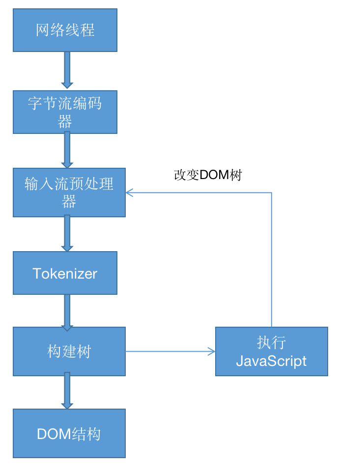

通常情况下，在Tokenizer阶段处理的HTML数据流是来自网络线程，也可以是客户端的代码。比如说上面说的两个API。开发者其实也有多种方式来告知浏览器应对如何应对某个资源，比如说如果在`<script>`标签上添加asyn或 `defer` 等属性，浏览器会异步的加载和执行JS代码，而不会阻塞渲染。

> `defer`和`async`的区别是：`defer`要等到整个页面正常渲染结束（DOM 结构完全生成，其他脚本也执行完），才会执行；async是如果脚本下载完，渲染引擎就中断渲染，执行这个脚本，然后再回到渲染流程。
> 
> 需要注意的是如果有多个defer脚本，会按照它们在页面定义的顺序加载，而多个async脚本是不能保证加载顺序的。

4、CSS样式计算

仅仅渲染 DOM 还不足以获得页面的样式信息，主进程还会基于CSS选择器解析 CSS 获取每一个节点的最终的计算样式值。

web开发者应该都比较属性，即使不为元素提供任何 CSS，浏览器也会对每个元素添加默认的样式值。最简单的<h1>就会比<h2>的元素值要大。

5、布局

树的结构渲染完成后将执行布局处理(layout process)，这也意味着给每个节点设置在浏览器上显示的坐标。

通过遍历 DOM 及相关元素的计算样式，主线程会构建出包含每个元素的二维坐标（x,y）信息及盒子大小的布局树。布局树和 DOM 树类似，但是其中包含页面可见的元素，如果一个元素设置了 `display:none` ，这个元素不会出现在布局树上。伪元素虽然在 DOM 树上不可见，但是在布局树上却是可见的。

6、绘制

即使有了DOM元素、样式信息、布局树信息也不能正确地绘制各元素。因为还需要知道各元素的绘制先后顺序才能准确地绘制出整个页面。在绘制阶段，主线程会遍历布局树以创建绘制记录。绘制记录可以看做是记录各元素绘制先后顺序的笔记，比如说先绘制背景，再绘文本，再绘长方形。如果你有canvas开发经验的话，可能更容易理解这个过程。

7、合成帧

复合是一种分割页面为不同的层，并单独栅格化，随后组合为帧的技术。不同层的组合由 合成器线程(compositor)完成。

主线程会遍历布局树来创建层（layer tree），添加了 `will-change` CSS 属性的元素，会被看做单独的一层，你可能会想给每一个元素都添加上 `will-change`，不过组合过多的层也许会比在每一帧都栅格化页面中的某些小部分更慢。

一旦层创建，渲染顺序确定后，主线程会把这些信息通知给合成器线程，合成器线程会把各层栅格化。有的层的可以达到整个页面的大小，因此，合成器线程将它们分成多个磁贴，并将每个磁贴发送到栅格线程，栅格线程会栅格化每一个磁贴并存储在 GPU的显存 中

一旦磁贴被光栅化，合成器线程会收集称为绘制四边形的磁贴信息以创建合成帧。

合成帧随后会通过 IPC 消息传递给浏览器进程，由于浏览器的 UI 改变或者其它拓展的渲染进程也可以添加合成帧，这些合成帧会被传递给 GPU 用以展示在屏幕上，如果滚动发生，合成器线程会创建另一个合成帧发送给 GPU。

合成器的优点在于，其工作无关主线程，合成器线程不需要等待样式计算或者 JS 执行，这就是为什么[合成器相关的动画](https://link.zhihu.com/?target=https%3A//www.html5rocks.com/en/tutorials/speed/high-performance-animations/) 最流畅，如果某个动画涉及到布局或者绘制的调整，就会涉及到主线程的重新计算，自然会慢很多。

8、事件处理

浏览器通过对不同事件的处理进行交互。浏览器的输入性事件是平时开发经常接触的，一般分为三类：键盘事件、手势事件、鼠标事件。

当用户在屏幕上触发 touch 等手势时，首先收到手势信息的是 Browser process， 不过 Browser process 只会感知到在哪里发生了手势，而tab 内容的处理是还是由渲染进程处理的。事件产生时，浏览器进程会给渲染进程发送事件类型(touch)及相应的坐标，渲染进程随后找到事件对象并执行所有绑定在目标对象上的处理函数，主线程就不得不出来工作了。如果页面中没有绑定相关事件，组合器线程可以独立于主线程创建组合帧。这时候合成器线程会怎么处理呢？接着往下看。

9、理解非快速滚动区域(non-fast scrollable region)

众所周知，js是单线程的，当页面合成时，合成器线程会标记页面中绑定有事件处理器的区域为 **non-fast scrollable region** ，合成器线程会把发生在此处的事件发送给主线程，如果事件不是发生在这些区域，合成器线程则会直接合成新的帧而不用等到主线程的响应。

web开发中常用的事件处理是事件委托，基于事件冒泡和捕捉机制。实际开发中我们常常在body上绑定事件：

```js
document.body.addEventListener('touchstart', event => {
    if (event.target === area) {
        event.preventDefault();
    }
});
```

> DOM二级事件规定的事件流包含三个阶段：事件捕获阶段，处于目标阶段和时间冒泡阶段。

从整个浏览器的角度看，整个页面都被标记成了非快速滚动区域。这就意味着无需关注输入事件的来源，合成器线程也需要和主线程通信并等待反馈。然而，流畅的合成器独立处理合成帧的模式就失效了。

为了优化，我们可以为事件处理函数传递 `passive: true` 做为参数，这样就能让浏览器即监听相关事件，又让组合器线程在等主线程响应前构建新的组合帧。

```js
document.body.addEventListener('touchstart', event => {
    if (event.target === area) {
        event.preventDefault()
    }
 }, {passive: true});
```

不过上述写法可能又会带来另外一个问题，假设某个区域只想横向滚动，使用 passive: true可以实现平滑滚动，但是垂直方向的滚动可能会早于event.preventDefault()执行，所以要通过 event.cancelable 来防止这种情况的发生。

```js
document.body.addEventListener('pointermove', event => {
    if (event.cancelable) {
        event.preventDefault(); // 防止滚动
    }
}, {passive: true});
```

另外，还可以通过css样式实现:

```css
#area {
  touch-action: pan-x;
}
```

10、查找事件源

当组合器线程发送输入事件给主线程时，主线程首先会进行命中测试（hit test）来查找对应的目标事件，命中测试会基于渲染过程中生成的绘制记录（ paint records ）查找事件发生坐标下存在的元素。

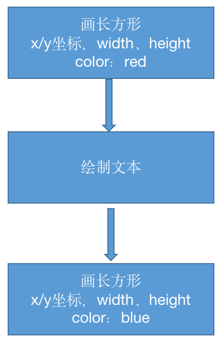

11、事件优化

一般我们屏幕的刷新速率为 60fps，但是某些事件的触发量会不止这个值，出于优化的目的，Chrome 会合并连续的事件(如 wheel, mousewheel, mousemove, pointermove, touchmove )，并延迟到下一帧渲染时候执行 。

而如 keydown, keyup, mouseup, mousedown, touchstart, 和 touchend 等非连续性事件则会立即被触发。合并事件虽然能提示性能，但是如果你的应用是绘画等，则很难绘制一条平滑的曲线了，此时可以使用 `getCoalescedEvents` API 来获取组合的事件。示例代码如下：

```js
window.addEventListener('pointermove', event => {
    const events = event.getCoalescedEvents();
    for (let event of events) {
        const x = event.pageX;
        const y = event.pageY;
        // draw a line using x and y coordinates.
    }
});
```


##### 5.2 浏览器缓存机制

缓存是可以自动保存文档副本的HTTP设备。总的来说，使用缓存有下面几个优点：

- 减少冗余的数据传输
- 提高接口响应效率
- 降低了对服务器的要求
- 缓存降低了距离时延

客户端访问一个原始服务器页面时，服务器如果多次传输同一份文档，那么一些相同内容在网络中一次又一次的传输，额外增加了服务器的压力、增加了无畏的带宽消耗。现在的网络条件下，网络带宽已不是多大的问题，但是距离还是一个不容小觑的问题，因为没增加一台路由器都会增加网络的时延。再者在平时的应用开发时，我们也总是把不常变动的数据采取合适的缓存策略进行缓存，避免不必要的开销。

那么，问题来了，如果原始服务器的内容发生变化了，缓存岂不是要不停的对缓存进行检测，检测是否和服务器上的版本保持同步。这个过程称为HTTP再验证(revalidation)。由于缓存中包含大量的文件，就以Chrome为例，在地址栏输入chrome://version, 在显示的信息中查找**个人资料路径**key值

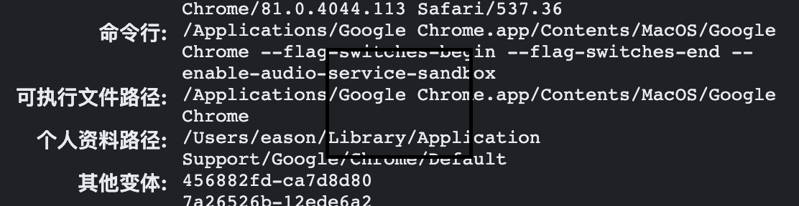

在目录/Users/用户名/Library/Application Support/Google/Chrome/Default/Application Cache/Cache目录下存放着缓存文件，缓存文件的个数因人而异，但是我详细数目还是很"可观"的。如果把大量的文件进行频繁的检测，不但效率比较低，而且对带宽也是一种损耗。所以，大部分缓存只有在客户端发起请求并且副本旧得足以需要检测的时候，才会进行再验证。

那么HTTP是如何做新鲜度检测的呢？大概的过程如下：

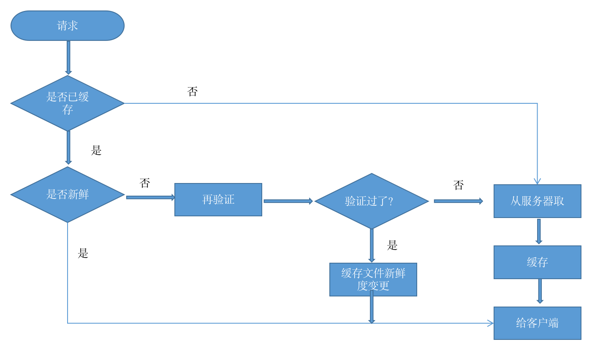

1、文档过期

通过设置Cache-control和Expires首部，其实两者差距不大，前者是HTTP1.1才加入的，后者是1.0都已经支持，**两者同时存在的话，Cache-Control优先级高于Expires**。HTTP让服务器向每个文档附件一个过期时间，在文档过期前，这些文件可以以任意的频率使用，也不需要和服务器联系。但是一旦过期，缓存就必须和服务器进行核对，询问服务器上的文档是否有修改，如果有修改，就重新获取一份，并附上新的过期时间。

Cache-control是对已经缓存的内容进行控制：

- **Cache-control:public** 表示响应可以被任何对象(如客户端、代理服务器等)缓存。
- **Cache-control:private**  表示响应只能被单个用户缓存，不能作为共享缓存（即代理服务器不能缓存它）。私有缓存可以缓存响应内容，比如：对应用户的本地浏览器 
- **Cache-control:no-cache** 表示在缓存提供给客户端之前，强制要求缓存把请求提交给原始服务器进行验证。即协商缓存。 
- **Cache-control:no-store**表示缓存不应存储有关客户端请求或服务器响应的任何内容，即不使用任何缓存。
- **max-age=<seconds>** 设置缓存存储的最大周期，超过这个时间缓存被认为过期(单位秒)。时间是相对于请求的时间。
- s-maxage=<seconds>** 覆盖max-age,作用同max-age,只不过该配置项只在代理服务器中生效。
- **max-stale=<seconds>** 表示客户端愿意接收一个已经过期的资源。

2、服务器再验证

资源过期并不代表着整个资源真正过期，因为在这个时间段内服务器上的资源未发生过变化。所以为了确认资源是否真的过期，需要向服务器确认。如果资源已发生改变，缓存会获取一份新的文档副本，并将旧的文档覆盖，然后将资源发给客户端。如果资源没有改变，缓存只需要获取新的首部，包括一个新的过期日期，并对缓存中的旧文件的首部进行更新。

HTTP要求缓存正确的返回符合以下内容之一：

- “足够新鲜”的已缓存
- 与服务器进行再验证，确认其仍然新鲜的已缓存副本
- 如果需要进行再验证的服务器出现了故障，则返回一条错误报文
- 附有警告信息说明内容可能不正确的资源副本

3、条件方法进行再验证

http可以使用条件方法高效的再验证。协议允许缓存向服务器发送一条**条件GET**，服务器也只有文档和缓存中的副本不同时才会返回新的资源对象。

HTTP定义了5种请求头部。其中If-Modified-Since和If-None-Match对服务再验证最有用，下面我们详细介绍一下：

 If-Modified-Since：如果从指定日期之后资源被修改过了，那么就返回新的资源，可以与Last-Modified首部配合使用。

 If-None-Match：服务器可以为每一个资源定义一个特定的标签(ETag)，如果说进行再验证的副本资源的标签与当前服务器上的标签不同，则返回新的资源。

最常用的是If-Modified-Since，包含If-Modified-Since的请求一般被称为IMS请求，由字面意思可知，它表明自某个日期之后资源发生了变换之后，服务器才会返回新的资源。如果自指定日期之后，资源被修改了，那么服务器就会返回一条包括新的首部新的过期日期和新的资源的响应报文。如果资源没有被修改过，那么服务器就不会发送资源，只会发送新的报头（304 Not Modified）和过期时间。

If-Modified-Since还可以与Last-Modified首部配合使用，服务器会将最后修改时间附加到返回的报文上去。当进行再验证的时候，可以使用If-Modified-Since:<最后修改时间> 这种方式来进行验证，这个就表示看该资源在上一次修改之后有没有发生变化。如果资源没有发生变化的话，服务器就会回送一个304 Not Modified响应。

有时候仅适用上述再验证方式是不完善的，比如说有些文档可能是被周期性的重写，包含的数据可能是一样的，数据相同但是最后修改时间有变化。或者是有时候文档内容发生改变了，但是修改的内容无关紧要，比如增加注释、删除空格、增加console等，这种情况下实际上是不需要再验证的。为了解决这样的问题，HTTP允许使用实体标签(ETag)进行比较，该标签是附件到文档上的任意标签，他们可能包含了文档的序列号或者版本号，也可能是对文档内容的校验。所以当修改文档时，可以修改文档的ETag来说明这个是新的版本。这样缓存就可以用If-Not-Match条件来GET新文档。

##### 什么时候使用实体标签和最近修改日期呢？

​    如果服务器回送一个ETag，客户端就必须使用实体标签验证器了，如果服务器回送了一个Last-Modified值，客户端就可以使用 If-Modified-Since验证。如果都提供了的话，那么客户端就可以随意选择了。


##### 5.3 性能分析

性能分析是前端工作中非常重要的一环，目的是分析包含页面渲染、网络传输以及文件加载等综合因素在内的页面加载时间指标，对该页面性能进行评估分析，找出影响性能的主要因素和瓶颈，并在此基础上，针对性能目标给出优化建议和解决方案，从而提升用户体验。特别是在移动端，虽然网络质量是一个很大的瓶颈，但是随着功能的增加，页面性能也就变成了关注的对象。

性能分析如此重要，但是在迭代开发过程中由于各种原因(如工期太短、任务量太大)往往会被忽视，直到影响较大时才会作为一个专题任务进行解决。下面我们就以Chrome为例，以一个非官方的加载例子为原型分析Chrome在性能优化方面提供的便利工具。

用过Chrome的Dev tools都知道，用它来在日常开发中进行调试，同时Chrome自带了性能分析功能，大概有这几部分组成：

- Elements: 查看和调整页面元素，编辑样式、编辑DOM
- Console: 命令行交互
- Sources：断点调试、使用Workspaces进行持久化保存
- Network: 查看文件加载情况、时间轴，进行网络限制
- Perfermance: 分析运行时性能，诊断强制的同步布局
- Memory: js cpu分析，堆分析器
- Application： 离线数据管理
- Security: 安全相关的管理，比如说证书，(非)安全站点

接下来，我们打开一个https://googlechrome.github.io/devtools-samples/jank/, 初始内容如下：

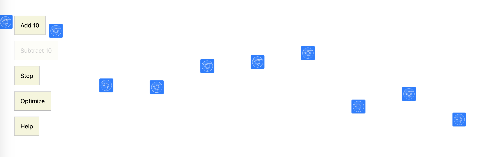

页面有多个蓝色小方块在上下移动。为了对比优化前后优化后的效果，我们做以下处理：

1、在performance选项卡中，找到CPU选项，选择降低4倍性能或6倍性能


这是因为现在CPU的性能都比较高，借助该选项能更清楚模拟出好的效果。

2、在打开的性能分析页面中，点击 “add 10”再增加30个蓝色小方块，原理同上，方块越多效果越明显。

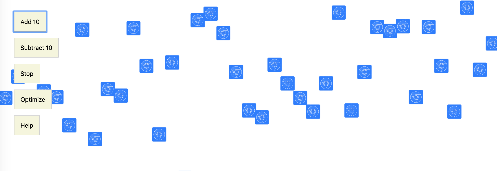

这时候看到的效果应该会比页面初始化时的有明显卡顿的现象。当然你可以继续添加，让效果更明显。

下面，我们点击下“optimize”按钮试试，明显感觉会流畅许多。到这里大家能够通过现象发现性能的差异了，接下来我们分析下现象。

在performance标签，点击 “Record”,录制6秒左右，就能看到录制的效果：

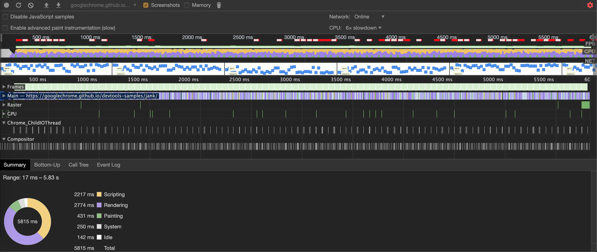

我们发现录制效果中有几个比较重要的名词：FPS,CPU,NET

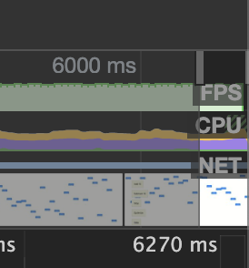

这几个指标是性能分析的关键，我们先简单解释一下：

FPS(Frames Per Second): 每秒传输的帧数，由于人类眼睛的特殊生理结构，该值大于等于60会被识别为比较流畅，所以说液晶显示器的刷新通常是这个值。再者就是有些电影会以更高的帧数拍摄，比如李安执导的电影《比利林恩的中场战事》则是以120FPS进行拍摄的。

FPS包含两部分：红色部分和绿色部分

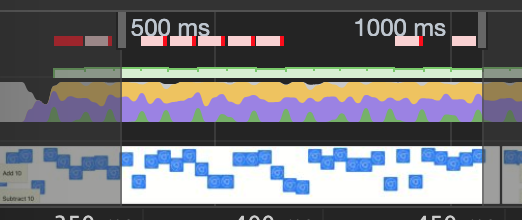

现在我们点击“optimize”,重新录制，发现红条少了很多或者消失,并且绿色条的高度也增加了

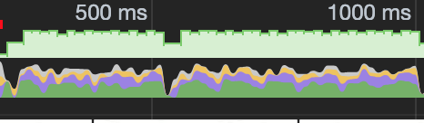

这说明，长时间帧Chrome已经帮你做了标注，这里需要注意了，比较影响用户体验。绿色的条是FPS指数，越高代表性能越好。

下面看下CPU,表示资源消耗CPU的情况， 这里按照以下方式进行彩色编码：

- HTML 文件为**蓝色**。
- 脚本为**黄色**。
- 样式表为**紫色**。
- 媒体文件为**绿色**。
- 其他资源为**灰色**。

Net部分是将屏幕逐帧录制下来，可以帮助观察页面的状态，帮助分析渲染速度。

下面再看下frames，鼠标悬停到某个帧上，查询该帧的简要信息

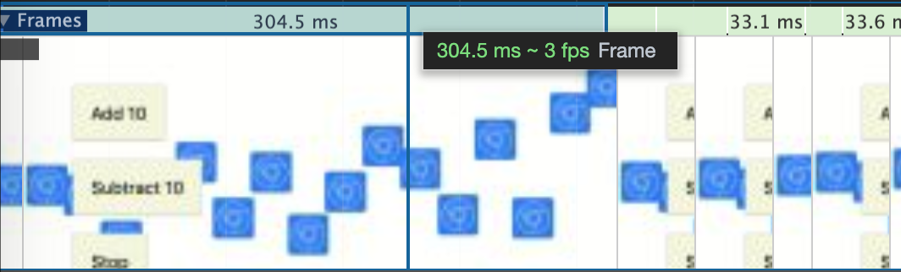

304.5ms表示该帧的传输时间，3fps（1000/304.5 =3.28）表示当前的fps。也在可以在summary中看到该帧的详细信息。

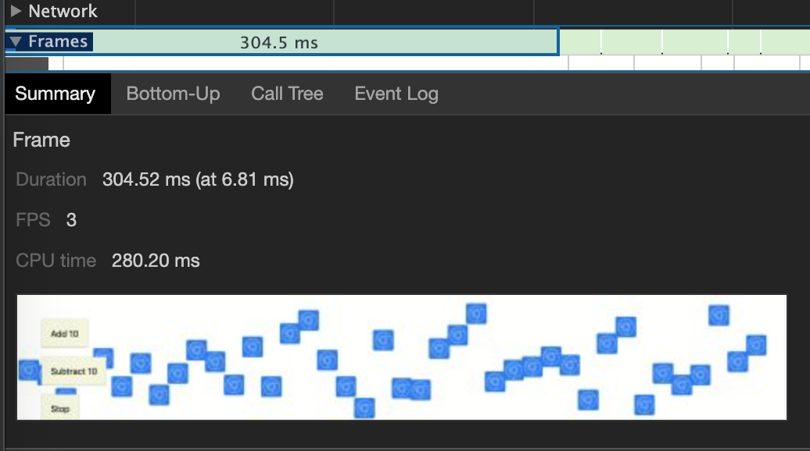

在刚录制完成的summary标签中，记录了全程信息


summary记录了从第17ms到第5.83m之间的摘要信息，排行在前三的主要是：脚本执行耗时2217ms，渲染耗时2774ms，painting重绘耗时431ms，有这些信息还是不够的，因为太笼统了，不能准确地定位到到底是哪里出了问题。这时候我们需要看下main中的信息了。

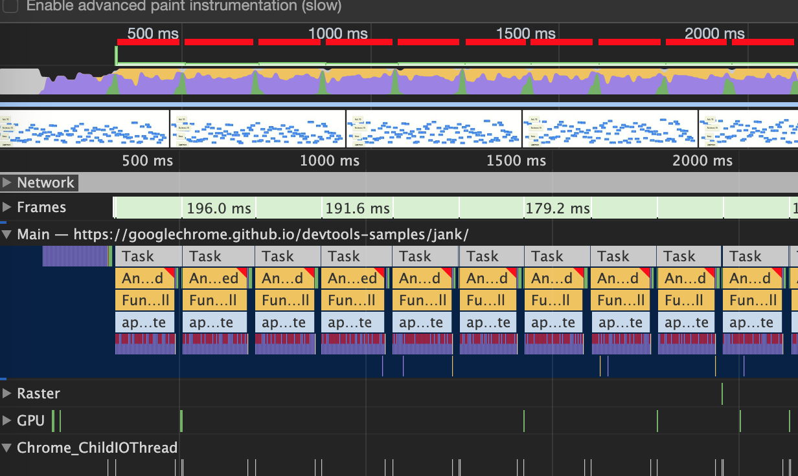

每个task就是一个帧做的事情。为了便于分析每个task，我们选择NET中的某一个帧，显示对应的火焰图,也就是函数调用的堆栈。

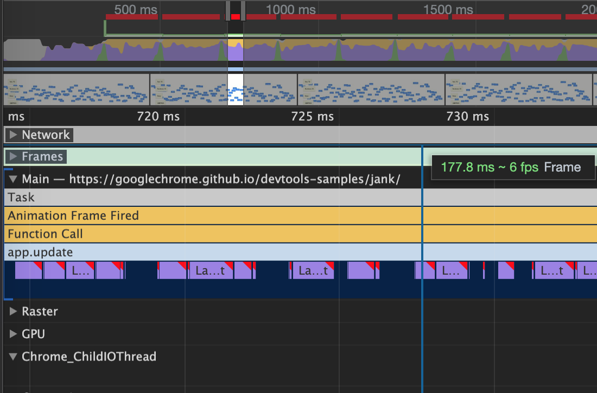

上图中，可以看到Animation Frame Fired右上角有个红色三角号，这就是Chrome自动帮助识别出**有问题的部分**。怎么样？是不是很智能？点击该条，可以在summary中看到具体的信息，以红色warning进行提示。

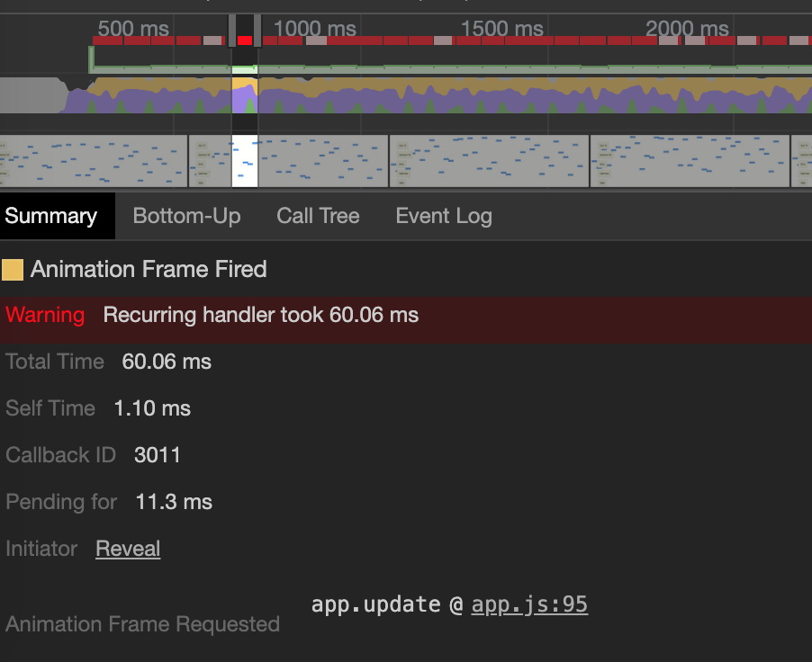

下面就可以定位到代码的位置了，根据上图提示，问题出在app.js的95行app.update处，下面就可以点解该链接查看该处代码到底是什么问题了。

到这里，我们主要看了Chrome定位js的问题，还有一个就是css对性能的影响，我们知道js操作样式会引发DOM回流，那么在Chrome中怎么才能看到这个问题呢？继续看app.update下方的紫色部分，前面我们介绍过，紫色部分是和样式渲染相关，现在找到一个右上角带有红色三角形的部分，并进行放大

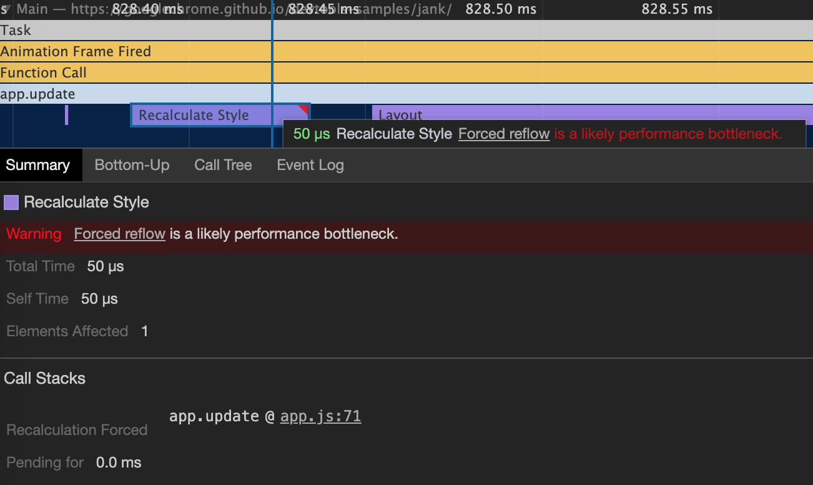

有了上面分析js的经验，我们可以看到这是因为强制回流引起的性能瓶颈，并在app.js文件的第71行，点开文件该行


发现动态改变了DOM元素的css属性，也就是说在每帧中，它都会更改每个方块的样式。由于样式发生了变化，因此必须重新布局方块以计算其位置。


##### 5.3 前端优化策略

5.3.1 图片优化和DOM优化建议，

图片在日常的开发中占了很大的比重，比如说，背景图，logo，替换按钮，广告位，头像等，如果说图片过多或者过大对用户体验都会有很大的影响。在平时的开发中，我们该怎么恰当的运用图片即能做到美观又能不过多的影响用户体验呢，

下面就这个问题我们详细展开，

第一，分析下是否真的需要那么多的图片？

图片需求对企业级系统和互联网系统的要求是不同的。企业级应用(也不绝对，如果是以图片展示为主的还是得需要文件服务器或者CDN网络支持)是以简单、易用、交互更好的标准去设计、开发系统，从这个角度看图片质量在部分功能上(如表格展示、导航等)的优先级就不是那么高了。但是在登陆页，导航页上依然还是以高质量图作为背景为主。电商类的系统对图片的要求很高，上亿个的商品缩略图、预览图(一个商品的预览图通常是多张)，广告图、商品评论图等类型的图片，这个量级可以通过简单的“脑补”。

对于非图片展示为主的系统，可以自行分析是不是可以去掉无意义的装饰类的图片。是否可以在不过分使用图片的情况下让界面更加简洁，交互性更好。

第二，效果可以通过CSS效果完成

暂时抛开css3之前的特性不提，css3提供了大量好用的特性，圆角、半透明、边框，阴影、动画等，纯css实现的效果以及变得非常多样，并且以支持主流的浏览器。

Css 各特性在各浏览器中支持的情况不尽相同，通常情况下可以通过 CanIUse(http://www.caniuse.com)在线查询各个特性各浏览器的支持,我们以border-radius为例

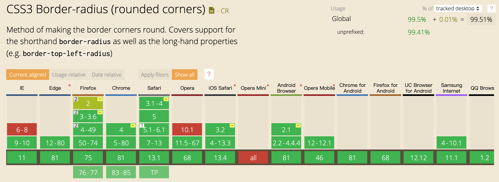

红色表示浏览器完全不支持，浅色表示只支持部分的特性，深绿色表示特性完全支持。

对部分支持的浏览器的特性说明可以在浏览器版本上悬停，会弹出该特性在该版本上的支持情况和bug情况供开发参考。

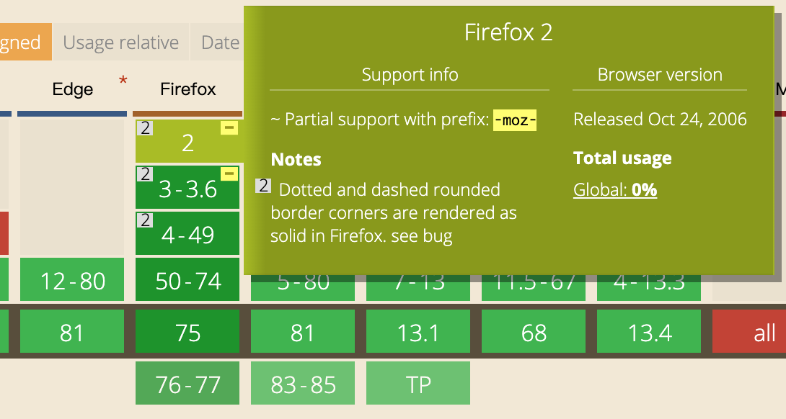

第三、使用合适的图片格式

我们常见的图片格式有很多种，PNG,JPG,JPEG,GIF,WebP,SVG。这几种图片应该分别在哪种场景下使用？各种图片又有什么特点？我们一点一点介绍。

> 其实图片还有很多其他格式，如bmp,mng,完整的可以参看Wikipedia 图形文件格式比较

图片分为两大类：位图和矢量图。位图又有有损压缩和无损压缩之分。

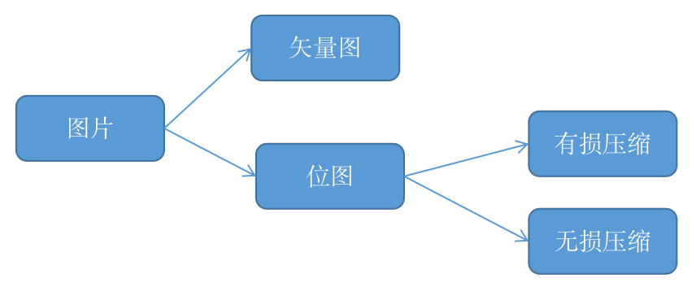


矢量图，由数学向量来记录的图像，常见的就是SVG,它是记录画面上每一点的信息，而是纪录了元素形状及颜色的算法，当你打开或者放大一幅矢量图的时候，软件对图形对应的函数进行运算，所以这种图片不会有失真，体积也更小，也不需要提供多套尺寸，所以比较适合绝大多数的图案、图标等。

咱们上面列出来的格式除了SVG都属于位图，位图也叫做点阵图，像素图。构成点阵图的最小单位是像素，位图就是由像素阵列的排列来实现其显示效果的，所以放大会看到像素点，呈现锯齿状，dpi(Dots Per Inch)决定了图像的清晰度。

PNG: Portable Network Graphics，便携式网络图形，是一种无损压缩的位图图形格式。支持索引、灰度、RGB三种颜色方案以及Alpha通道等特性。PNG的开发目标是改善并取代GIF作为适合网络传输的格式而不需专利许可，并且压缩比高，生成文件体积较小。

JPG/JPEG: 是有损压缩，用较少的磁盘空间得到较好的图像品质,但存在一定的失真。

webP:是由Google推出的一种有损压缩利用预测编码技术，这种格式的主要优势是在于高效率，在质量相同的情况下，webP格式图像的格式要比JPEG图像小40%。WebP团队还在开发WebKit内核补丁，用于在Google Chrome浏览器中提供对WebP格式的原生支持。除了Chrome，支持该格式的浏览器还有Edge,Firefox,Opera。


5.3.2 JavaScript优化建议

js代码优化是前端性能优化环境中比较重要的一环。从人员定岗的角度讲，这是作为高级研发必备的技能，是在开发过程中定位疑难问题的根本，俗话说的“知其然知其所以然”就是这个道理；从产品优化的角度讲，代码优化又让产品有更好的可能性。

js代码优化大的环节来看，主要概括为几个方面：js文件加载、缓存，js代码细节优化，上线前优化。本小节我们着重从这几个方面说明。

1、js文件加载

前面我们在浏览器渲染过程中，当浏览器遇到<script>标签时，这时浏览器会停止处理页面，让出当前主线程，转去执行 JavaScript代码，等js代码执行完成后再继续解析和渲染页面。同样的情况也发生在使用 src 属性加载 JavaScript的过程中，浏览器必须先花时间下载外链文件中的代码，然后解析并执行它。在这个过程中，页面渲染和用户交互完全被阻塞了。所以推荐将所有<script>标签尽可能放到<body>标签的底部，以尽量减少对整个页面下载的影响。

```js
<html>
<head>
    <title>front end complete book</title>
    <link rel="stylesheet" type="text/css" href="styles.css">
</head>
<body>
    <script type="text/javascript" src="main.js"></script>
</body>
</html>
```

每个浏览器都有最大连接数,说有尽量减少js文件的加载数量是一个比较常用的手段。但是这个方法的作用是有限的，原因有两个，第一是大型项目中把js文件合并成一个bundle的概率不是很现实，第二就是合成的bundle文件如果过大，那么文件加载还是不能解决解决浏览器长时间无响应的问题。

其实从IE8、Firefox3.5，Chrome2和Safari4都已经开始支持js文件的并行下载，执行一个script标签并不会阻塞其他script标签。JavaScript 下载过程仍然会阻塞其他资源的下载，比如样式文件和图片，尽管下载过程相互独立，但是页面还是要等到js代码完全下载并执行完才能继续。

script标签有两个扩展属性：defer(HTML4引入)和async(HTML5引入)。

- defer：延迟加载脚本，在文档完成解析完成开始执行，并且在DOMContentLoaded事件之前执行完成。
- async：异步加载脚本，下载完毕后再执行，在window的load事件之前执行完成

再总结一下：`defer`是“渲染完再执行”，`async`是“下载完就执行”。

```js
<script type="text/javascript" src="./async/async.js" async></script>
<script type="text/javascript" src="./async/defer.js" defer></script>
<script type="text/javascript">
		console.log('normal');
		window.addEventListener("load", function () {
			console.log('onload')
		})
		document.addEventListener("DOMContentLoaded", function () {
			console.log('DOMContentLoaded')
		})
</script>
```

在async.js 打印简单的一句：

```js
console.log('async');
```

在defer.js中同样打印一句：

```js
console.log('defer')
```

打印结果

```js
normal 
async 
defer 
DOMContentLoaded 
onload
```

除了上面的异步加载外，还可以使用IntersectionObserver api进行懒加载,该api虽然还处在草案阶段，但是Edge,Chrome, Firefox,opera,safari都已经支持，所以值得期待下它的效果。

> 针对不支持IE的情况下，w3c也有Polyfill支持，https://github.com/w3c/IntersectionObserver/tree/master/polyfill

IntersectionObserver接口提供了一种异步观察目标元素与祖先元素或顶级文档[viewport](https://developer.mozilla.org/en-US/docs/Glossary/viewport)的交集中的变化的方法。祖先元素与视窗viewport被称为根(root)。举个栗子，我们希望某些静态资源（比如图片），只有在进入视口时才加载，以节省带宽，提高网页性能。

下面我们以一个图片懒加载为例，图片元素只有在进入到视图范围内才加载。

先在视图范围外定义3张图片

```html
<div class="images">
		<br>
		<br>
		
</div>
```

IntersectionObserver以new的形式声明对象，接收两个参数callback和options，

```js
const io = new IntersectionObserver(callback, options)
io.observe(DOM)
```

现在看下图片加载是怎么实现的，

```js
const imgList = Array.from(document.getElementsByTagName("img"))

var io = new IntersectionObserver((entries) =>{
  entries.forEach(item => {
    // isIntersecting是一个Boolean值，判断目标元素当前是否可见
    if (item.isIntersecting) {
      item.target.src = item.target.dataset.src
      // 图片加载后即停止监听该元素
      io.unobserve(item.target)
    }
  })
}, {
  root: document.querySelector('.images')
});

imgList.forEach(img => io.observe(img))
```


、js文件缓存

文件缓存策略，我们在5.2章节进行了详细的介绍，这里不在赘述。下面我们介绍领一种缓存文件的方式：service worker。这个也是PWA的核心，在第六章中，我们将详细介绍PWA。

Service worker是由事件驱动的,具有生命周期，并且独立于浏览器的主线程。可以拦截处理页面的所有网络请求(fetch)，可以访问cache和indexDB，支持推送，并且可以让开发者自己控制管理缓存的内容以及版本，为离线弱网环境下的 web 的运行提供了可能。

service worker有几个基本特征：

- 无法操作DOM

- 只能使用HTTPS以及localhost

- 拦截全站请求

- 与主线程独立不会被阻塞（不要再应用加载时注册sw）

- 完全异步，无法使用XHR和localStorage

- 一旦被 install，就永远存在，除非被 uninstall或者dev模式手动删除

- 独立上下文

- 响应推送

- 后台同步

我们先建一个基本的web页面main.html，并建立对应的主文件main.js, serviceWorker文件sw.js，用来做XHR请求的json文件。

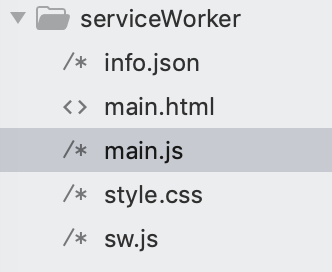


在main.js中注册serviceWorker,

```js
if ("serviceWorker" in navigator) {
	navigator.serviceWorker.register("./sw.js").then(cb => {
		console.log('service worker register successfully:', cb.scope);
	  if (cb.installing) {
          serviceWorker = cb.installing;
          document.querySelector('.result').innerHTML = 'installing';
      } else if (cb.waiting) {
          serviceWorker = cb.waiting;
          document.querySelector('.result').innerHTML = 'waiting';
      } else if (cb.active) {
          serviceWorker = cb.active;
          document.querySelector('.result').innerHTML = 'active';
      }
	}).catch(error => {
		console.log('register error:',error)
	});
}
```

使用特性检测浏览器是否支持serviceworker。接下来在service woker文件中定义缓存的文件。

```js
const PRECACHE = 'precache-v1';
const RUNTIME = 'runtime';

const PRECACHE_URLS = [
  'main.html',
  './', // Alias for index.html
  'style.css',
  'main.js'
];

//缓存文件
self.addEventListener('install', event => {
	console.log('install');
  event.waitUntil(
    caches.open(PRECACHE)
      .then(cache => cache.addAll(PRECACHE_URLS))
      .then(self.skipWaiting())
  );
});
```

PRECACHE_URLS数组定义需要缓存的文件列表。在这个例子中，我们把main.html, main.js和style.css进行。

上面的代码中，我们通过caches.open打开我们指定的cache文件名，然后我们调用cache.addAll并传入我们的文件数组。这是通过一连串promise（caches.open 和 cache.addAll）完成的。event.waitUntil拿到一个promise并使用它来获得安装耗费的时间以及是否安装成功。

如果所有的文件都被缓存成功了，那么service worker就安装成功了。如果任何一个文件下载失败，那么安装步骤就会失败。这个方式允许你依赖于你自己指定的所有资源，但是这意味着你需要非常谨慎地决定哪些文件需要在安装步骤中被缓存。指定了太多的文件的话，就会增加安装失败率。。

缓存的文件可以在 Chrome Dev tool 的 Application选项中看到

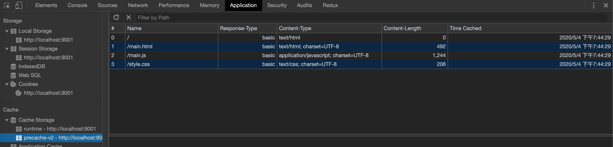

或者刷新页面时，显示来自service worker。

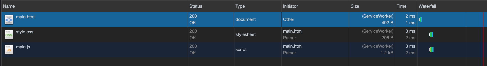


3、js代码细节优化

- 减少回流(重排)和重绘

  在render线程在渲染树的基础上渲染颜色、背景色等。 当渲染树中的一部分(或全部)因为元素的规模尺寸，布局，可见性(这里可见性特指visibility: hidden, 这样不改变元素位置,在真是DOM结构中依然存在、只是对可见性的操作，而display:none对元素隐藏后在DOM结构中是不存在的)等改变而需要重新构建，这时浏览器需要重新计算元素的几何属性(很显然文档流中的其他属性也会跟着受影响)。这就称为回流。每个页面至少需要一次回流，就是在页面第一次加载的时候。

  当渲染中的一些元素需要更新属性，而这些属性只是影响元素的外观，风格，而不会影响元素的几何属性，比如color、background-color。这个操作称为重绘。从描述可以发现，回流必将引起重绘，而重绘不一定会引起回流。因为回流比重绘做的事情更多，带来的开销更大。

  要避免回流与重绘的发生，最直接的做法是避免掉可能会引发回流与重绘的 DOM 操作。下面先看看如何规避回流：

  

  ##### 操作DOM的几何属性

  操作DOM的几何属性，会引发“多米诺”效应，所有和该元素相关的元素都会受到影响。这些元素的几何属性重新计算，试想一下这是多大量的计算。

  元素的几何属性通常包含：height、width、margin、padding，left，border等等。属性太多了，不方便一一列举，完全可以通过调试工具看到各元素的影响。

  

  ##### 改变DOM结构

  这里涉及的操作主要就是增加、修改、删除节点。

  

  ##### 获得一些特殊的值

  当我们用到像client* （top, left,width,height）, offset*， scroll*属性和getComputedStyle方法时，也会触发回流。因为这些属性都是通过即时计算得到的，

  

  现在我们看下该如果避免回流和重绘。

  ##### 缓存计算的部分，避免频繁改动

  先看一个反例

  ```js
  <div id="target"></div>
  <script>
    const el = document.querySelector('#target');
    for(let i=0; i< 20; i++) {
        el.style.top  = el.offsetTop  + 10 + "px";
        el.style.left = el.offsetLeft + 10 + "px";
    }
  </script>
  ```

  这个例子是非常糟糕的，每次循环都会触发回流。现在我们进行简单的优化，先缓存目标属性，使用js计算变化的部分，最后再将结果附到DOM上，

  ```js
  let el = document.querySelector('#target') 
  let offLeft = el.offsetLeft, offTop = el.offsetTop;
  for(let i=0; i<20; i++) {
    offLeft += 10;
    offTop += 10;
  }
  // 将结果附到目标元素上
  el.style.left = offLeft + "px"
  el.style.top = offTop  + "px"
  ```

  ##### 使用classList合并属性

  如果你要像这样操作元素的多个样式，

  ```js
  let container = document.querySelector('.container')
  container.style.width = '100px'
  container.style.height = '200px'
  container.style.border = '10px solid red'
  container.style.color = '#fff'
  ```

  这种情况下，可以把这些属性定义成一个样式，然后通过classList加入

  ```js
  <style>
      .container {
        width: 100px;
        height: 200px;
        border: 10px solid red;
        color: #fff;
      }
  </style>
  let container = document.querySelect('.container')
  container.classList.add('container')
  ```

  这种方法需要注意的是，如果你现在的系统还在视频IE6-IE9，那么很遗憾，该属性还不能支持。

  

  ##### 将元素离线处理

  刚才我们讲过，如果元素设置为display:none 后，该元素都从当前的文档流“抽离”，从这个角度出发，我们也使用这个方法作为优化的一个手段。

  ```js
  let container = document.querySelector('.container')
  container.style.display = 'none'
  //样式处理
  container.style.display = 'block'
  ```

- 节流和防抖

  在有些场景下，回调方法会反复执行多次，比如说窗口的resize时间，滚动条的scroll事件，键盘的keydown、keyup事件，反复执行的结果是导致大量的计算从而引发页面卡顿，这不是我们想要的结果。为了应付这种场景，节流(throttle)和防抖(debounce)就诞生了。

  

  ##### 节流(throttle)：当持续触发事件时，保证一定时间段内只调用一次事件处理函数。

  

5.3.3 webpack优化

5.3.4  http2.0

5.3.5 websocket

