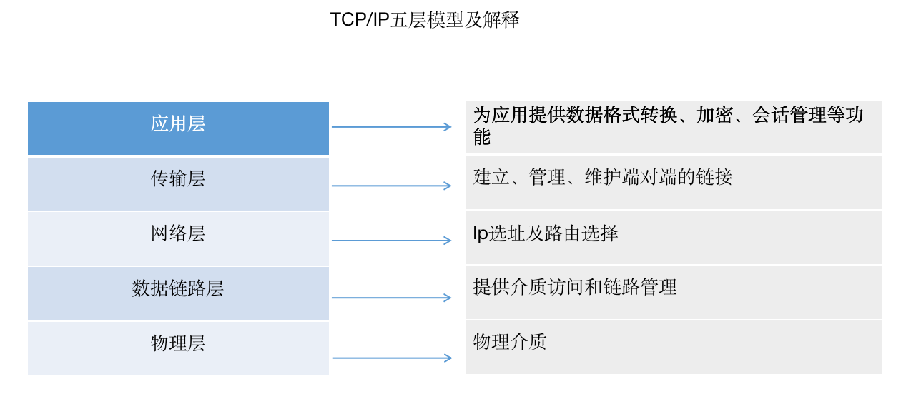

#### 第五章 性能优化指南

性能优化是前端开发里非常重要的一部分。为了实现资源的快速加载，各个前端开发团队都是使用浑身解数争取更好的用户体验。本章我们着重从浏览器运行机制出发，介绍浏览器缓存相关机制，让大家明白各个优化点的背后的原理，形成系统的知识点。

本章包含如下内容：

1、浏览器的运行机制

2、浏览器的缓存机制

3、性能分析涉及各模块解释

4、从具体细节出发介绍优化策略

##### 5.1 浏览器运行机制

浏览器背后的运行机制非常负责，是由多个进程协作完成。  为了更好的说明浏览器的运行机制，我们从一道经典的面试题开始：

> 从地址栏输入URL到页面加载完成，中间都经历了什么？

总体来说，这个过程需要经历如下几个过程：

1、DNS解析

2、TCP连接

3、发送HTTP请求

4、服务端处理完成并返回内容

5、浏览器解析返回的内容结构并渲染

DNS

先说DNS，DNS(运行在UDP协议上)是互联网上域名和IP地址相互映射的分布式数据库，有了DNS，用户不用在记住每个域名的IP地址就可以上网。比如当在地址栏输入http://developer.mozilla.org ，DNS服务器就可以解析该主机名得到IP地址，该过程就叫做域名解析。

主机到IP地址的映射一般是两种方式：静态映射和动态映射。区别在于：静态映射方式是每台设备上分别配置映射关系，各自维护各自的，只能独享；动态映射是建立一套DNS系统，只需要在该系统上配置映射关系，各域名解析都用这套系统，达到共享的目的。

TCP 连接

HTTP是应用层协议，位于TCP/IP五层模型的最顶层，由TCP/IP承载。HTTP连接实际上就是TCP连接及应用规则。

> 各层协议：
> 
> 应用层：HTTP,FTP,SMTP,Telnet,POP3等
> 
> 传输层：TCP, UDP
> 
> 网络层: IP, ICMP,RIP等
> 
> 数据链路层：ARP, IEEE802.3,PPP等

HTTP要传送一条报文时，会以流动形式把报文数据的内容通过一条打开的TCP连接按序传输。TCP收到数据流后，会将数据流分成称为段的小数据块，把每段封装到IP分组中，通过因特网进行传输。下面我们简单介绍下TCP的连接过程，需要经历以下几个步骤：

(1)有新的TCP连接时，客户端向服务器发送一个小的TCP分组。这个分组中设置一个特殊的SYN标记，说明这是一个连接请求。

(2)服务器接受连接，会对一些连接参数计算，向客户端返回一条TCP分组，这个分组中的SYN和ACK标记都被置位，说明连接已接受。

(3)最后，客户端向服务器返回一条确认信息，确认连接已经建立，都可以通过这个确认分组中发送数据了。

该部分在程序员眼中是不可见的。

发送HTTP请求

客户端发送

##### 5.2 浏览器缓存机制

##### 5.3 性能分析各模块解释

##### 5.3 前端优化策略

5.3.1 图片优化和DOM优化建议

5.3.2 JavaScript优化建议

5.3.3 webpack优化

5.3.4  http2.0

5.3.5 websocket
