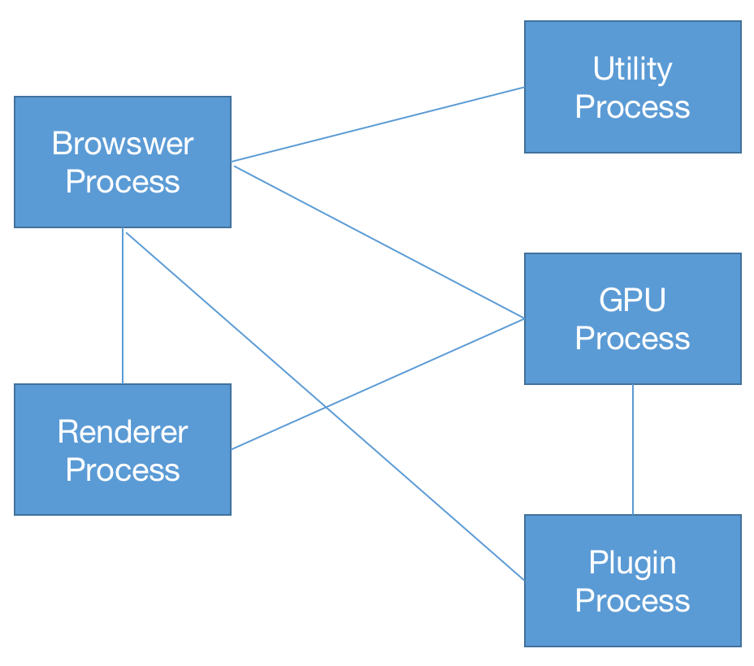

第5章 性能优化指南

性能优化是前端开发中非常重要的部分，为了实现资源的快速加载，各个前端开发团队都使用浑身解数争取得到更好的用户体验。本章我们着重从浏览器的运行机制出发，介绍浏览器的缓存机制，让读者明白各个优化点背后的原理，进而形成系统的知识网络。

到目前为止，大部分的主流浏览器都已向WebKit靠拢，如Safari由最初的WebKit内核升级到了WebKit2内核。Opera也追随到了WebKit阵营，抛弃了Presto，于2013年4月采用Google发布的Blink内核（Blink是Google在WebKit基础上为了分离组件而建立的新分支）。Edge已由Chromium开发并已发布81.0.416.53版本，IE6到IE11版本都是Trident内核。Firefox浏览器使用的是Gecko内核。本章以WebKit作为主线进行介绍。

本章包含如以下内容：

（1）浏览器的运行机制。

（2）浏览器的缓存机制。

（3）性能分析涉及的各个模块。

（4）从具体细节出发介绍前端优化策略。

5.1 浏览器的运行机制

浏览器背后的运行机制非常复杂，它是由多个进程协作完成的。 为了更好地说明浏览器的运行机制，我们从一道经典的面试题开始：

从地址栏输入URL到页面加载完成，中间都经历了什么？

在正式介绍之前，我们先来看一下Chrome的多进程架构，这有助于更形象地说明这个过程。

> 关于进程和线程的维基百科解释：用户下达运行程序的命令后，就会产生进程。同一程序可以产生多个进程（一对多关系），即允许同时有多位用户运行同一程序，却不会产生冲突。
> 
> 进程需要一些资源才能完成工作，如[CPU](https://zh.wikipedia.org/wiki/CPU "CPU")使用时间、[存储器](https://zh.wikipedia.org/wiki/%E8%A8%98%E6%86%B6%E9%AB%94 "存储器")、文件以及[I/O](https://zh.wikipedia.org/wiki/I/O "I/O")设备，且为依序逐一进行，也就是说，每个CPU核心在任意时间内仅能运行一项进程。
> 
> 进程与线程的区别：进程是计算机管理运行程序的一种方式，一个进程下可能包含一个或者多个线程。线程可以理解为子进程。一个进程下可以有多个线程，每个线程并行执行不同的任务，并且同一进程中的多个线程将共享该进程中的全部系统资源。

Chrome是多进程的，两个进程之间以IPC（Inter Process Communication）的方式进行通信，顶层由一个Browser Process（浏览器进程）来协调浏览器的其他进程，如图5-1所示。



<center>图5-1</center>

具体来说，Chrome的主要进程及其职责如下：

- Browser Process（浏览器进程）：负责包括地址栏、书签栏，以及前进或后退按钮等工作；负责处理浏览器的一些不可见的底层操作，比如网络请求和文件访问等。

- Renderer Process（渲染进程）：主要负责tab页内网页渲染。

- Plugin Process（插件进程）：管理一个网页用到的所有插件，比如逐渐被淘汰的Flash插件等。

- GPU Process（GPU进程）：处理GPU相关的任务。

从上面各个进程的职责来看，浏览器进程主要协调Tab之外的工作，并且它对这些工作进行了细粒度的划分，主要使用不同的线程进行处理：

- UI线程： 控制浏览器上的按钮及输入项等。

- network线程: 处理网络请求，从网上获取数据。

- storage线程: 控制文件等的访问。

现在，我们回到前面那个面试题——从地址栏输入URL到页面加载完成，中间都经历了什么？在地址栏中输入网址并单击“Enter”键后到看到整个页面大概可分成如下几步。

第1步，处理用户输入。

先由UI线程判断用户输入的是一个网址还是一个要查询的关键字。因为Chrome中的地址栏也是一个输入框。UI线程负责解析内容，并判断是把输入的内容交给查询引擎，还是导航到具体的网站。

第2步，开始导航。

单击“Enter”键，UI线程通知network线程获取网页内容，并控制Tab上的spinner展现，表示正在努力加载中。network线程会执行DNS查询，随后为请求建立TLS连接。

> DNS（运行在UDP上）是互联网上域名和IP地址相互映射的分布式数据库。有了DNS，用户无须记住每个域名的IP地址就可以上网。比如，当在地址栏中输入http://developer.mozilla.org时，DNS服务器就可以解析该主机名得到IP地址，该过程就叫作域名解析。
> 
> 主机到IP地址的映射一般有两种方式：静态映射和动态映射。区别在于：静态映射是在每台设备上分别配置映射关系，各自维护，只能独享；动态映射是建立一套DNS系统，并在该系统上配置映射关系，各域名解析都用这套系统，达到共享的目的。

如果network线程接收了301状态码并重定向了请求头，那么network线程会通知UI线程“服务器要求重定向”，随后加载新的URL。

第3步，读取响应体。

一旦服务器返回内容，network线程就会读取响应主体中的MIME类型信息，“Content-Type”字段为返回内容的格式，“Content-Length”字段为响应主体的内容长度。

网页的MIME类型信息为“test/html”。接下来把这些数据传递给渲染进程。如果是压缩文件或者其他文件，就把相关数据传输给下载管理器。

[Safe Browsing](https://link.zhihu.com/?target=https%3A//safebrowsing.google.com/) 检查也会在此时触发，如果域名或者请求内容匹配到已知的恶意站点，则network线程会显示一个警告页。此外， [CORB](https://link.zhihu.com/?target=https%3A//www.chromium.org/Home/chromium-security/corb-for-developers) （Cross Origin Read Blocking）检测也会被触发，确保敏感数据不会被传递给渲染进程。

> Safe Browsing: https://safebrowsing.google.com/
> 
> CORB:  https://www.chromium.org/Home/chromium-security/corb-for-developers

第4步，查找渲染进程。

  当上述所有检查完成并且通过安全检查后，network线程确信浏览器可以导航到请求的页面，就会通知UI线程数据已经就绪，这时UI线程会查找一个渲染进程进行网页渲染。其实，为了能快速响应，UI线程会预查找和启动一个渲染线程，如果可以访问，则该渲染进程继续。如果有重定向，则废弃准备好的线程并重启一个线程。

第5步，确认导航。

经过上面的步骤，数据已就绪，渲染线程也已经创建，可以说是“万事俱备只欠东风”了。这个“东风”是什么呢？就是前面提到的进程间的通信，IPC消息。浏览器进程会给渲染进程发送 IPC 消息来确认导航，一旦浏览器进程收到渲染进程的渲染确认回复，导航过程就结束，页面加载过程开始，如图5-2所示。


<center>图5-2</center>

此时，地址栏已更新为新网址，呈现出新网页内容。History Tab同样会更新，此时可以通过返回键返回到原来的页面。为了让Tab页签或者窗口关闭后能够恢复，这些信息都会保存到硬盘中。

第6步，额外的操作。

一旦导航被确认，渲染进程会加载资源并渲染页面。渲染流程会在后面重点介绍。渲染进程在渲染完所有的页面并且触发所有帧的onload事件后，回到 浏览器进程发送 IPC 信号， UI 线程停止展示Tab中的 Spinner。

当输入另一个URL加载新页面时，上面的加载流程会重新执行；当出现新的导航请求时，浏览器进程会通知渲染进程进行相关检查，并对相关事件进行处理，毕竟所有代码的执行都是由渲染进程完成。

当通过js代码（window.location="http://xxx.com"）导航到新站点时，渲染进程会首先检查beforeunload事件，导航请求由渲染进程传递给浏览器进程。

> Google官网关于页面生命周期的帖子：https://developers.google.com/web/updates/2018/07/page-lifecycle-api

**关于Service Worker**

如果页面注册了Service Worker，则可以通过该方案实现网络代理，让开发者对本地缓存及判断何时从网络上获取信息有更多的控制权(这句主成分拎出来是不是不通，比如开发者对本地缓存有更多的控制权)。如果Service Worker设置为从本地缓存中获取数据，那么就没必要从网上重新请求了。

值得注意的是，Service Worker也是运行在渲染进程中的代码，但是与上述流程略有不同。

当Service Worker被注册时，其作用域会被保存。当有导航时，network线程会在注册过的Service Worker的作用域中查找相关域名。如果存在相关域名，则UI线程会查找一个渲染进程来处理相关代码。Service Worker既可以只从缓存中加载数据，终止对网络的请求，也可以从网络上请求新的数据。 

上述是浏览器渲染的基本过程，其工作的复杂度可见一斑。在上述流程中，与Web开发紧密相关的是渲染进程。下面重点介绍渲染进程是如何工作的。

前面提到，渲染进程负责Tab页内的所有事情，其职责是把HTML、CSS和JavaScript代码转换为可与用户交互的Web页面。在渲染进程中主要包含以下线程：

- 主线程（Main Thread）：处理用户输入的大部分代码。
- 工作线程（Worker Thread）：如果使用Web Worker或者Service Worker， 则该线程负责处理一部分的JavaScript代码。
- 排版线程（Compositor Thread）：主要负责渲染页面。
- 光栅线程（Raster Thread）:负责组合不同的层形成帧。

后面会详细介绍这几个线程，下面重点介绍渲染进程。

1.构建DOM树

导航在确认信息收到后，渲染进程开始接收字符串HTML文档数据，主线程也开始把字符串解析成DOM（Document Object Modal）树，解析方法是由HTML官方规范提供了一览表(https://html.spec.whatwg.org/)。

2.加载子资源

网页中常常包含image、CSS和JavaScript等，这些资源通常从网上下载或者从缓存中获取。主进程可以在构建 DOM树的过程中逐个加载各个资源。为了加速访问， preload scanner 也会同时运行。如果HTML中存在`<link> 等标签，则preload scanner 会把这些请求传递给 浏览器进程 中的 network thread 进行相关资源的下载。

3.对JavaScript代码的处理

当HTML在解析过程中发现标签时，它会暂停解析HTML文档，转而去加载、解析和执行JavaScript代码。这是因为JavaScript代码可能会改变HTML的结果，比如属性的document.write、obj.append等，所以必须执行JavaScript代码后再解析HTML。如图5-3所示。


<center>图5-3</center>

通常情况下，在Tokenizer阶段处理的HTML数据流既可能来自网络线程，也可能是客户端的代码，比如上面的两个API。实际上，开发者可以用多种方式告知浏览器应如何应对某个资源，比如在<script>标签上添加asyn或 defer等属性，浏览器会异步加载和执行JavaScript代码，而不会阻塞渲染。

> `defer`和`async`的区别是：`defer`是在整个页面正常渲染结束后（DOM 结构完全生成，其他脚本也执行完）才会执行；而async是只要脚本下载完，渲染引擎就中断渲染，先执行这个脚本，再回到渲染流程。
> 
> 需要注意的是，如果有多个defer脚本，则会按照它们在页面中定义的顺序进行加载；如果有多个async脚本，则不能保证加载顺序。

4.CSS样式计算

仅仅渲染 DOM 还不足以获得页面的样式信息，主进程还会基于CSS选择器解析CSS，获取每一个节点的最终计算样式值。

在Web开发过程中，即使不为元素提供任何CSS，浏览器也会为每个元素添加默认的样式值。比如最简单的`<h1>`就比`<h2>`的样式值要大。

5.布局

在树的结构渲染完成后将执行布局处理（Layout Process），即为每个节点设置它在浏览器上显示的坐标。

通过遍历DOM及相关元素的计算样式，主线程会构建出包含每个元素的二维坐标（x，y）信息及盒子大小的布局树。布局树和DOM树类似，但是其中包含页面可见的元素。如果一个元素设置了 `display:none` ，那么这个元素不会出现在布局树上。伪元素虽然在DOM树上不可见，但是在布局树上却是可见的。

6.绘制

即使有了DOM元素、样式信息和布局树信息，也不能正确地绘制各元素。因为必须知道绘制各元素的先后顺序，才能准确地绘制出整个页面。在绘制阶段，主线程会遍历布局树来创建绘制记录。绘制记录可以看成是记录各元素绘制先后顺序的笔记，比如先绘制背景，再绘制文本，接着绘制长方形，等等。

7.合成帧

复合是一种把页面分割为不同的层并单独栅格化，随后组合为帧的技术。不同层的组合由合成器线程（Compositor）完成。

主线程会遍历布局树来创建层（Layer Tree）。添加了 will-change CSS 属性的元素会被看成单独的一层，注意，如果给每一个元素都加上 will-change 属性的元素，则组合过多的层可能会比在每一帧都栅格化页面中的某些部分更慢。

创建层之后，即渲染顺序确定后，主线程会把这些信息通知给合成器线程，合成器线程会把各层栅格化。因为有的层的可以达到整个页面的大小，所以合成器线程会将它们分成多个磁贴，并将每个磁贴发送给栅格线程，栅格线程会栅格化每一个磁贴并存储在GPU的显存中。

一旦磁贴被光栅化，合成器线程就会收集绘制四边形的磁贴信息来创建合成帧。

合成帧可以通过IPC消息传递给浏览器进程。浏览器的UI改变或者其他拓展的渲染进程也可以添加合成帧，而这些合成帧会被传递给GPU，以便展示在屏幕上。如果发生滚动，则合成器线程会创建另一个合成帧并发送给GPU。

合成器的优点在于，其工作无关主线程，合成器线程不需要等待样式计算或者JavaScript代码的执行，这也是[合成器相关的动画](https://link.zhihu.com/?target=https%3A//www.html5rocks.com/en/tutorials/speed/high-performance-animations/)最流畅的原因。如果某个动画涉及布局或者绘制的调整，就会涉及主线程的重新计算，自然会慢得多。

8.事件处理

浏览器通过对不同事件的处理进行交互。浏览器的输入性事件是平时开发经常接触的，一般分为三类：键盘事件、手势事件和鼠标事件。

当用户在屏幕上触发touch等手势时，首先收到手势信息的是浏览器进程， 不过浏览器进程只会感知在哪里发生了手势，而对Tab内容的处理是由渲染进程处理的。当事件发生时，浏览器进程会给渲染进程发送事件类型（touch）及相应的坐标，随后渲染进程找到事件对象并执行所有绑定在目标对象上的处理函数，这时主线程就不得不出来“工作”了。如果页面中没有绑定相关事件，则组合器线程可以独立于主线程创建组合帧。

9.理解非快速滚动区域(non-fast scrollable region)

众所周知，JavaScript是单线程的，当页面合成时，合成器线程会标记页面中绑定事件处理器的区域为非快速滚动区域（non-fast scrollable region），合成器线程会把发生在此处的事件发送给主线程。如果事件不是发生在这些区域，则合成器线程会直接合成新的帧，而不用等主线程的响应。

在Web开发中常用的事件处理是事件委托，基于事件冒泡和捕捉机制。在实际开发中我们常常在body上绑定事件：

```js
document.body.addEventListener('touchstart', event => {
    if (event.target === area) {
        event.preventDefault();
    }
});
```

> DOM二级事件规定的事件流包含三个阶段：事件捕获阶段、处于目标阶段和时间冒泡阶段。

从整个浏览器的角度来看，整个页面都被标记成了非快速滚动区域。这意味着无须关注输入事件的来源，合成器线程也需要和主线程通信并等待反馈，这时流畅的合成器独立处理合成帧的模式就失效了。

为了优化，我们可以为事件处理函数传递 passive: true参数，这样浏览器就能既监听相关事件，又让组合器线程在等主线程响应前构建新的组合帧了。

```js
document.body.addEventListener('touchstart', event => {
    if (event.target === area) {
        event.preventDefault()
    }
 }, {passive: true});
```

不过上述写法可能会带来另一个问题，假设某个区域只想横向滚动，则使用passive: true可以实现平滑滚动，但是垂直方向的滚动可能会早于event.preventDefault()的执行，这时就需要通过event.cancelable来阻止这种情况的发生。

```js
document.body.addEventListener('pointermove', event => {
    if (event.cancelable) {
        event.preventDefault(); // 阻止滚动
    }
}, {passive: true});
```

	另外，还可以通过CSS样式实现:

```css
#area {
  touch-action: pan-x;
}
```

10.查找事件源

当组合器线程发送输入事件给主线程时，主线程首先会进行命中测试（hit test）来查找对应的目标事件。命中测试会基于渲染过程中生成的绘制记录（paint records）查找事件发生坐标下存在的元素，如图5-4所示。


<center>图5-4</center>

11.事件优化

一般来说，屏幕的刷新速率为60fps，但是某些事件的触发量不止这个值，出于优化的目的，Chrome会合并连续的事件（如 wheel、 mousewheel、mousemove、 pointermove和touchmove 等），并延迟到下一帧渲染时候执行。

而如keydown、keyup、 mouseup、 mousedown、touchstart和touchend等非连续性事件则会立即被触发。合并事件虽然能提升性能，但如果是绘画等应用，则很难绘制一条平滑的曲线，此时可以使用 getCoalescedEvents API 来获取组合事件，示例代码如下。

```js
window.addEventListener('pointermove', event => {
    const events = event.getCoalescedEvents();
    for (let event of events) {
        const x = event.pageX;
        const y = event.pageY;
        // draw a line using x and y coordinates.
    }
});
```


5.2 浏览器的缓存机制

缓存是可以自动保存文档副本的HTTP设备，总体来说，使用缓存有以下几个优点：

- 减少了冗余的数据传输。
- 提高了接口响应效率。
- 降低了对服务器的要求。
- 减少降低了距离时延。

当客户端访问一个原始服务器页面时，服务器如果多次传输同一份文档，那么一些相同内容就会在网络中一次又一次的传输，增加了服务器的压力和带宽消耗。虽然现在网络带宽已不是什么大问题，但是距离还是一个不容小觑的问题，因为每增加一台路由器，就会增加网络的时延。另外，在日常开发过程中，我们总是把不常变动的数据用合适的缓存策略进行缓存，避免不必要的开销。

如果原始服务器的内容发生了变化，那么岂不是要不停地对缓存进行检测，看缓存是否和服务器上的版本保持同步。这个过程称为HTTP再验证（revalidation）。由于缓存中包含大量的文件，以Chrome为例，在地址栏输入chrome://version，在显示的信息中查找***\*个人资料路径\****key值，如图5-5所示。


<center>图5-5</center>

在目录/Users/用户名/Library/Application Support/Google/Chrome/Default/Application Cache/Cache下存放着缓存文件，缓存文件的个数因人而异。如果对大量的文件进行频繁的检测，则不但效率较低，而且对带宽也是一种损耗。因此，大部分缓存只在客户端发起请求并且不得不对旧副本进行检测时，才会进行再验证。

HTTP做新鲜度检测的大致过程如图5-6所示。


<center>图5-6</center>

1.文档过期

通过设置Cache-control和Expires首部，HTTP让服务器为每个文档附上一个过期时间，在文档过期之前，这些文件可以以任意的频率使用，且不需要和服务器联系。一旦文档过期，缓存就必须和服务器进行核对，询问服务器上的文档是否有修改。如果有修改，就重新获取一份，并附上新的过期时间。
注意：Cache-control和Expires两者差距不大，前者是HTTP1.1加入的，后者是HTTP1.0以上都支持，当两者同时存在时，Cache-Control的 优先级高于Expires。

Cache-control是对已经缓存的内容进行控制：

- **Cache-control:public** 表示响应可以被任意对象（如客户端、代理服务器等）缓存。
- **Cache-control:private**  表示响应只能被单个用户缓存，不能作为共享缓存（即代理服务器不能缓存它）。私有缓存可以缓存响应内容，比如对应用户的本地浏览器等。
- **Cache-control:no-cache**表示在缓存提供给客户端之前，强制要求缓存把请求提交给原始服务器进行验证，即协商缓存。 
- **Cache-control:no-store**表示缓存不应存储与客户端请求或服务器响应相关的任何内容，即不使用任何缓存。
- **max-age**用来设置缓存存储的最大周期，若超过这个时间，则缓存被认为已过期（单位秒）。时间是相对于请求的时间。
- s-maxage=<seconds>** 覆盖了max-age，作用与max-age相同，该配置项只在代理服务器中生效。
- **max-stale** 表示客户端愿意接收一个已经过期的资源。

2.服务器再验证

资源过期并不代表着整个资源真的过期，因为在这个时间段内服务器上的资源并未发生变化，因此我们需要向服务器确认资源是否真的已过期。如果资源已发生改变，则缓存会获取一份新的文档副本，并覆盖旧的文档，然后将资源发送给客户端。如果资源没有发生改变，则缓存只需要获取新的首部，并在首部中包含一个新的过期日期，然后更新缓存中旧文件的首部即可。

HTTP要求缓存正确的返回需符合以下内容之一：

- “足够新鲜”的已缓存。
- 与服务器进行再验证，确认其为仍然新鲜的已缓存副本。
- 如果需要进行再验证的服务器出现故障，则返回一条错误报文。
- 若附有警告信息，则说明内容可能不是正确的资源副本。

3.条件方法进行再验证

HTTP可以使用条件方法高效的再验证。协议允许缓存向服务器发送一条条件GET，只有当服务器中的文档和缓存中的副本不同时才会返回新的资源对象。

HTTP定义了5种请求头部，其中If-Modified-Since和If-None-Match对服务再验证最有用。

 If-Modified-Since：如果从指定日期之后资源被修改过了，那么就返回新的资源，可以与Last-Modified首部配合使用。

 If-None-Match：服务器可以为每一个资源定义一个特定的标签（ETag），如果进行再验证的副本资源的标签与当前服务器上的标签不同，则返回新的资源。

最常用的是If-Modified-Since，包含If-Modified-Since的请求一般被称为IMS请求，从字面意思可知，它表明自某个日期资源发生了变换之后，服务器才会返回新的资源。如果自指定日期之后，资源被修改了，那么服务器就会返回一条包括新的首部新的过期日期和新的资源的响应报文。如果资源没有被修改，服务器就不会发送资源，只发送新的报头（304 Not Modified）和过期时间。

If-Modified-Since还可以与Last-Modified首部配合使用，服务器会将最后修改时间附加到返回的报文中。当进行再验证时，可以使用If-Modified-Since:<最后修改时间> 这种方式进行验证，这就表示该资源在上一次修改之后有没有发生变化。如果资源没有发生变化，则服务器会回送一个304 Not Modified响应。

有时候仅使用上述再验证方式是不完善的，比如，有些文档可能会被周期性地重写，包含的数据可能是一样的，数据相同但是最后修改时间有变化。或者有时候文档内容改变了，但是修改的内容无关紧要，比如增加注释、删除空格、增加console等，这种情况实际上是不需要再验证的。为了解决这样的问题，HTTP允许使用实体标签（ETag）进行比较，该标签是附件到文档上的任意标签，它们可能包含了文档的序列号或者版本号，也可能是对文档内容的校验。所以当修改文档时，可以修改文档的ETag来说明这是新的版本。这样缓存就可以用If-Not-Match条件来获取新文档。

##### 什么时候使用实体标签和最近修改日期呢？

​    如果服务器回送一个ETag，则客户端必须使用实体标签验证器。如果服务器回送了一个Last-Modified值，则客户端可以使用 If-Modified-Since验证。如果都提供，那么客户端就可以随意选择。


##### 5.3 性能分析

性能分析是前端工作中非常重要的一环，目的是分析包含页面渲染、网络传输以及文件加载等综合因素在内的页面加载时间指标，对该页面性能进行评估分析，找出影响性能的主要因素和瓶颈，并在此基础上，针对性能目标给出优化建议和解决方案，从而提升用户体验。特别是在移动端，虽然网络质量是一个很大的瓶颈，但是随着功能的增加，页面性能也变成了关注的对象。

性能分析如此重要，但是在迭代开发过程中由于各种原因(如工期太短、任务量太大)往往会被忽视，直到影响较大时才会作为一个专题任务进行解决。下面我们就以Chrome为例，以一个非官方的加载例子为原型分析Chrome在性能优化方面提供的便利工具。

用过Chrome的Dev tools都知道，用它来在日常开发中进行调试，Chrome自带了性能分析功能，主要由以下几部分组成。

- Elements：查看和调整页面元素，编辑样式、编辑DOM
- Console：命令行交互
- Sources：断点调试、使用Workspaces进行持久化保存
- Network：查看文件加载情况、时间轴，进行网络限制
- Perfermance：分析运行时性能，诊断强制的同步布局
- Memory：js cpu分析，堆分析器
- Application： 离线数据管理
- Security：安全相关的管理，比如说证书，(非)安全站点

接下来，我们打开一个Chrome官网提供的例子（具体的网址请参考该章的readme文件）, 初始内容如图5-7所示。


<center>图5-7</center>

页面中有多个蓝色小方块在上下移动。为了对比优化前后的效果，我们做以下处理：

（1）在Performance选项卡中，找到CPU选项，选择4×slowdown（降低4倍性能）或6×slowdown（降低6倍性能），如图5-8所示。


<center>图5-8</center>

借助该选项可以更好地模拟出效果。

（2）在打开的性能分析页面中，单击“Add 10”按钮，再增加30个蓝色小方块，原理同上，方块越多效果越明显，如图5-9所示。


<center>图5-9</center>

这时候看到的效果与页面初始化时的效果相比，有明显卡顿的现象。当然，我们可以继续增加蓝色小方块，以便让效果更明显。

单击“Optimize”按钮，明显感觉会流畅许多。至此，大家就能够通过现象发现性能的差异了，接下来我们分析一下现象。

在Performance选项卡中，单击“Record”按钮，录制6秒左右，录制效果如图5-10所示。


<center>图5-10</center>

在录制效果中有几个比较重要的名词，即FPS、CPU和NET，如图5-11所示。


<center>图5-11</center>

这几个指标是性能分析的关键，我们先简单解释一下。

fps（frames per second）: 每秒传输帧数，由于人类眼睛的特殊生理结构，当该值大于或等于60时会被识别为比较流畅，因此液晶显示器的刷新通常是这个值。除此之外，有些电影会以更高的帧数拍摄，比如电影《比利林恩的中场战事》是以120FPS进行拍摄的。

FPS包含红条和绿条两部分，如图5-12所示。


<center>图5-12</center>

现在我们点击“Optimize”,重新录制，发现红条少了很多，有的地方甚至消失了，而绿条的高度增加了，如图5-13所示。


<center>图5-13</center>

这说明，长时间帧Chrome已经帮我们做了标注，这里需要注意了，比较影响用户体验。绿条是fps指数，越高代表性能越好。

下面看一下CPU，即资源消耗CPU的情况， 这里按照以下方式进行彩色编码：

- HTML 文件为**蓝色**。
- 脚本为**黄色**。
- 样式表为**紫色**。
- 媒体文件为**绿色**。
- 其他资源为**灰色**。

Net部分是将屏幕逐帧录制下来，可以帮助观察页面的状态，分析渲染速度。

下面再看一下frames，当鼠标悬停在某个帧上时，可查询该帧的简要信息，如图5-14所示。


<center>图5-14</center>

304.5ms表示该帧的传输时间，3fps（1000/304.5 =3.28）表示当前的fps,也可以在summary中看到该帧的详细信息，如图5-15所示。


<center>图5-15</center>

在刚录制完成的summary标签中，记录了全程信息，如图5-16所示。


<center>图5-16</center>

summary记录了从第17ms到第5.83m之间的摘要信息，排行前三的主要是：脚本执行耗时2217ms、渲染耗时2774ms和painting重绘耗时431ms。仅有这些信息是不够的，因为太笼统了，不能准确地定位到底是哪里出了问题。这时候我们需要看一下main中的信息，如图5-17所示。


<center>图5-17</center>

每个task就是一个帧做的事情。为了便于分析每个task，我们选择NET中的某一个帧，显示对应的火焰图，即函数调用的堆栈，如图5-18所示。


<center>图5-18</center>

在图5-18中，可以看到Animation Frame Fired右上角有个红色三角号，这就是Chrome自动帮助识别出的***\*有问题的部分\****。单击该条，可以在summary中看到具体的信息，以红色warning进行提示，如图5-19所示。


<center>图5-19</center>

下面就可以定位到代码的位置了，根据图5-18中的提示，问题出现在app.js的95行app.update处。下面单击该链接查看该处代码到底有什么问题。

至此，我们主要分析了Chrome定位JavaScript的问题，以及CSS对性能的影响。我们知道，JavaScript操作样式会引发DOM回流，那么在Chrome中怎样才能看到这个问题呢？继续看app.update下方的紫色部分，前面我们介绍过，紫色部分和样式渲染相关，现在找到一个右上角带有红色三角形的部分，并进行放大，如图5-20所示。


<center>图5-20</center>

从图5-20中可以看出，这是因为强制回流引发的性能瓶颈，问题出现在app.js文件的第71行，单击打开该链接，显示如图5-21所示。


<center>图5-21</center>

从图5-21中我们发现了动态改变DOM元素的CSS属性，也就是说，在每一帧中，它都会更改每个方块的样式。由于样式发生了变化，因此必须重新布局方块以计算其位置。


5.4 前端优化策略

5.4.1 图片优化和DOM优化建议

图片在前端的日常开发中占了很大的比重，比如，背景图、logo、替换按钮、广告位和头像等。当图片过多或者过大时，会对用户体验产生较大的影响。在日常开发中，我们应怎样恰当地运用图片，使其既美观又不过多地影响用户体验呢？

第一，减少图片。

图片需求对企业级系统和互联网系统的要求是不同的。企业级应用（也不绝对，如果是以图片展示为主的，还需要文件服务器或者CDN网络支持）是以简单、易用、交互更好的标准去设计、开发系统的，从这个角度看，图片质量在部分功能上（如表格展示、导航等）的优先级就不是那么高了。但是在登录页、导航页上依然还是以高质量图作为背景为主。电商类的系统对图片的要求很高，上亿个的商品缩略图、预览图（一个商品的预览图通常是多张）、广告图、商品评论图等类型的图片，这个量级可以通过简单的“脑补”。

对于非图片展示为主的系统，可以自行分析是不是可以去掉无意义的装饰类的图片，是否可以在不过分使用图片的情况下让界面更加简洁，交互性更好。

第二，效果可以通过CSS效果完成。

暂时抛开CSS3之前的特性不提，CSS3提供了大量好用的特性，圆角、半透明、边框，阴影、动画等，纯CSS实现的效果以及变得非常多样，并且以支持主流的浏览器。

CSS各特性在各浏览器中支持的情况不尽相同，通常情况下可以通过 CanIUse在线查询各个特性对各浏览器的支持，这里以border-radius为例，如图5-22所示。


<center>图5-22</center>

红色表示浏览器完全不支持，浅色表示浏览器只支持部分特性，深绿色表示浏览器对特性完全支持。

对部分支持的浏览器的特性说明可以在浏览器版本上悬停，弹出该特性在该版本上的支持情况和bug情况供开发人员参考，如图5-23所示。


<center>图5-23</center>

第三，使用合适的图片格式。

我们常见的图片格式有很多种，如PNG、JPG、JPEG、GIF、WebP和SVG等。在不同的场景下应使用不同格式的图片。

> 其实图片还有很多其他格式，如bmp,mng等，完整的可以参看Wikipedia 图形文件格式比较

图片分为两大类：位图和矢量图。位图又可以分为有损压缩和无损压缩两种，如图5-24所示。


<center>图5-24</center>

矢量图，用数学向量来记录的图像，常见的就是SVG，它不是记录画面上每一点的信息，而是记录了元素形状及颜色的算法，当你打开或者放大一幅矢量图时，软件是对图形对应的函数进行运算，所以这种图片不会失真，体积也更小，并且不需要提供多套尺寸，适合绝大多数的图案、图标等。

上面列出来的格式除SVG外都属于位图，位图也叫作点阵图、像素图。构成点阵图的最小单位是像素，位图就是由像素阵列的排列来实现其显示效果的，所以放大会看到像素点，呈现锯齿状，dpi（Dots Per Inch）决定了图像的清晰度。

PNG：Portable Network Graphics，便携式网络图形，是一种无损压缩的位图图形格式，支持索引、灰度、RGB三种颜色方案及Alpha通道等特性。PNG的开发目标是改善并取代GIF作为适合网络传输的格式而不需要专利许可，并且压缩比高，生成文件体积较小。

JPG/JPEG：是有损压缩，用较少的磁盘空间得到较好的图像品质，但存在一定的失真。

WebP：Google推出的一种有损压缩利用预测编码技术，这种格式的主要优势是高效率，在质量相同的情况下，WebP格式图像的体积比JPEG图像小40%。WebP团队还在开发WebKit内核补丁，用于在Google Chrome浏览器中提供对WebP格式的原生支持。除了Chrome，支持该格式的浏览器还有Edge、Firefox和Opera。


5.4.2 JavaScript代码优化建议

JavaScript代码优化是前端性能优化环境中比较重要的一环，是在开发过程中定位疑难问题的根本。从人员定岗的角度讲，这是高级研发必备的技能，常说的“知其然，知其所以然”就是这个道理；从产品优化的角度讲，代码优化又让产品有更好的可能性。

JavaScript代码优化从大的环节来看，主要概括为几个方面：JavaScript文件加载、JavaScript文件缓存、JavaScript代码细节优化和上线前优化。

1、JavaScript文件加载

在浏览器渲染过程中，当浏览器遇到标签时，浏览器会停止处理页面，让出当前主线程，转去执行 JavaScript代码，等JavaScript代码执行完成后再继续解析和渲染页面。同样的情况也发生在使用 src 属性加载 JavaScript代码的过程中。浏览器必须先花时间下载外链文件中的代码，然后解析并执行它。在这个过程中，页面渲染和用户交互完全被阻塞了。所以推荐将所有标签尽可能放到标签的底部，以尽量减少对整个页面下载的影响。

```js
<html>
<head>
    <title>front end complete book</title>
    <link rel="stylesheet" type="text/css" href="styles.css">
</head>
<body>
    <script type="text/javascript" src="main.js"></script>
</body>
</html>
```

每个浏览器都有最大连接数，所以尽量减少JavaScript文件的加载数量是一个比较常用的手段。但是这个方法的作用是有限的，原因有两个。第一，在大型项目中把JavaScript文件合并成一个bundle不是很现实；第二，合并成的bundle文件如果过大。因此文件加载不能解决解决浏览器长时间无响应的问题。

其实从IE8、Firefox3.5、Chrome2和Safari4都已经开始支持对JavaScript文件的并行下载，执行一个script标签并不会阻塞其他script标签。但JavaScript 文件在下载过程中仍然会阻塞其他资源的下载，比如样式文件和图片等，尽管下载过程相互独立，但是页面还是要等到JavaScript代码完全下载并执行完才能继续。

script标签有两个扩展属性：defer（HTML4引入）和async（HTML5引入）。

- defer：延迟加载脚本，在文档完成解析完成后开始执行，并且在DOMContentLoaded事件之前执行完成。
- async：异步加载脚本，需下载完毕后再执行，在window的load事件之前执行完成。

总结一下：defer是“渲染完再执行”，async是“下载完就执行”。

```js
<script type="text/javascript" src="./async/async.js" async></script>
<script type="text/javascript" src="./async/defer.js" defer></script>
<script type="text/javascript">
		console.log('normal');
		window.addEventListener("load", function () {
			console.log('onload')
		})
		document.addEventListener("DOMContentLoaded", function () {
			console.log('DOMContentLoaded')
		})
</script>
```

在async.js 打印简单的一句：

```js
console.log('async');
```

在defer.js中同样打印一句：

```js
console.log('defer')
```

打印结果如下：

```js
normal 
async 
defer 
DOMContentLoaded 
onload
```

除上面的异步加载外，还可以使用IntersectionObserver API进行懒加载，该API虽然还处在草案阶段，但是Edge、Chrome、 Firefox、Opera、Safari都已经支持，所以值得期待。

IntersectionObserver API提供了一种异步观察目标元素与祖先元素或视窗（viewport）的交集中的变化的方法。祖先元素与视窗被称为根（root）。举个例子，我们希望某些静态资源（比如图片），只有在进入视口时才加载，以节省带宽，提高网页性能。

下面我们以一个图片懒加载为例，让图片元素在进入视图范围内才加载。

先在视图范围外定义3张图片：

```html
<div class="images">
		<br>
		<br>
		
</div>
```

IntersectionObserver以new的形式声明对象，接收callback和options两个参数。

```js
const io = new IntersectionObserver(callback, options)
io.observe(DOM)
```

下面看看图片加载是怎样实现的：

```js
const imgList = Array.from(document.getElementsByTagName("img"))

var io = new IntersectionObserver((entries) =>{
  entries.forEach(item => {
    // isIntersecting是一个Boolean值，用来判断目标元素当前是否可见
    if (item.isIntersecting) {
      item.target.src = item.target.dataset.src
      // 图片加载后即停止监听该元素
      io.unobserve(item.target)
    }
  })
}, {
  root: document.querySelector('.images')
});

imgList.forEach(img => io.observe(img))
```


2.JavaScript文件缓存

在5.2节对文件缓存策略进行了详细介绍，这里不再赘述。下面我们介绍领一种缓存文件的方式：service worker。它是PWA的核心，在第6章中，我们将详细介绍PWA。

Service worker是由事件驱动的具有生命周期并且独立于浏览器的主线程。它可以拦截处理页面的所有网络请求（fetch)，可以访问cache和indexDB，支持推送，并且可以让开发者自己控制管理缓存的内容以及版本，为离线弱网环境下的 web 的运行提供了可能。

service worker有几个基本特征：

- 无法操作DOM。

- 只能使用HTTPS和localhost。

- 拦截全站请求。

- 与主线程独立，不会被阻塞（不用在应用加载时注册sw）。

- 完全异步，无法使用XHR和localStorage。

- 一旦安装，就永远存在，除非卸载或者使用dev模式手动删除。

- 独立上下文。

- 响应推送。

- 后台同步。

首先新建一个基本的Web页面main.html，并新建对应的主文件main.js、serviceWorker文件sw.js，以及用来做XHR请求的json文件，如图5-25所示。


<center>图5-25</center>

在main.js中注册serviceWorker：

```js
if ("serviceWorker" in navigator) {
	navigator.serviceWorker.register("./sw.js").then(cb => {
		console.log('service worker register successfully:', cb.scope);
	  if (cb.installing) {
          serviceWorker = cb.installing;
          document.querySelector('.result').innerHTML = 'installing';
      } else if (cb.waiting) {
          serviceWorker = cb.waiting;
          document.querySelector('.result').innerHTML = 'waiting';
      } else if (cb.active) {
          serviceWorker = cb.active;
          document.querySelector('.result').innerHTML = 'active';
      }
	}).catch(error => {
		console.log('register error:',error)
	});
}
```

使用特性检测浏览器是否支持serviceworker。接下来在service woker文件中定义缓存的文件。

```js
const PRECACHE = 'precache-v1';
const RUNTIME = 'runtime';

const PRECACHE_URLS = [
  'main.html',
  './', // Alias for index.html
  'style.css',
  'main.js'
];

//缓存文件
self.addEventListener('install', event => {
	console.log('install');
  event.waitUntil(
    caches.open(PRECACHE)
      .then(cache => cache.addAll(PRECACHE_URLS))
      .then(self.skipWaiting())
  );
});
```

PRECACHE_URLS数组定义了需要缓存的文件列表。在这个例子中，我们把main.html、main.js和style.css进行缓存。

在上面的代码中，我们通过caches.open打开了我们指定的cache文件名，然后调用cache.addAll并传入我们的文件数组。这是通过一连串promise（caches.open 和 cache.addAll）完成的。event.waitUntil拿到一个promise并使用它来获得安装耗费的时间，并确认是否安装成功。

如果所有的文件都被缓存成功了，那么service worker就安装成功了。如果任何一个文件下载失败，那么安装步骤就会失败。这个方式允许你依赖于你自己指定的所有资源，但是这意味着你需要非常谨慎地决定哪些文件需要在安装步骤中被缓存。如果指定了太多的文件，就会增加安装失败的风险。

缓存的文件可以在 Chrome Dev tool 的 Application选项中看到，如图5-26所示。


<center>图5-26</center>

或者刷新页面时，显示来自service worker，如图5-27所示。


<center>图5-27</center>

3、JavaScript代码细节优化

（1）减少回流（重排）和重绘。

render线程在渲染树的基础上渲染颜色、背景色等。 当渲染树中的一部分（或全部）因为元素的规模尺寸、布局、可见性（这里的可见性特指visibility: hidden,，即不改变元素位置，在真实的DOM结构中元素依然存在，只是对可见性进行操作。而display:none对元素隐藏后，元素在DOM结构中就不存在了）等发生改变而需要重新构建时，浏览器需要重新计算元素的几何属性（很显然文档流中的其他属性也会跟着受影响），这就称为回流。在页面第一次加载时每个页面至少需要一次回流。

当渲染中的一些元素需要更新属性，而这些属性只是影响元素的外观、风格，而不会影响元素的几何属性，比如color、background-color。这个操作称为重绘。从描述可以发现，回流必将引起重绘，而重绘不一定会引起回流。因为回流比重绘做的事情更多，带来的开销更大。

要避免回流与重绘的发生，最直接的做法是避免可能会引发回流与重绘的 DOM 操作。下面先来看看如何规避回流。

操作DOM的几何属性。操作DOM的几何属性会引发“多米诺”效应，所有与该元素相关的元素都会受到影响，也就是说，这些元素的几何属性都需要重新计算，工作量巨大。元素的几何属性通常包含height、width、margin、padding、left和border等。

改变DOM结构。这里涉及的操作主要就是增加、修改和删除节点。

获得一些特殊的值。当我们用到像client* （top, left,width,height）、 offset**、** scroll属性和getComputedStyle方法时，也会触发回流。因为这些属性都是通过即时计算得到的。


下面看一下应如何避免回流和重绘。

缓存计算的部分，应避免频繁改动。先看一个反例：

```js
<div id="target"></div>
<script>
  const el = document.querySelector('#target');
  for(let i=0; i< 20; i++) {
      el.style.top  = el.offsetTop  + 10 + "px";
      el.style.left = el.offsetLeft + 10 + "px";
  }
</script>
```

这个例子是非常糟糕的，每次循环都会触发回流。现在我们进行简单的优化，先缓存目标属性，  使用JavaScript计算变化的部分，最后将结果附到DOM上。

```js
let el = document.querySelector('#target') 
let offLeft = el.offsetLeft, offTop = el.offsetTop;
for(let i=0; i<20; i++) {
  offLeft += 10;
  offTop += 10;
}
// 将结果附到目标元素上
el.style.left = offLeft + "px"
el.style.top = offTop  + "px"
```

  使用classList合并属性。例如，像下面这样操作元素的多个样式：

```js
let container = document.querySelector('.container')
container.style.width = '100px'
container.style.height = '200px'
container.style.border = '10px solid red'
container.style.color = '#fff'
```

  此时可以把这些属性定义成一个样式，然后通过classList引入：

```js
<style>
    .container {
      width: 100px;
      height: 200px;
      border: 10px solid red;
      color: #fff;
    }
</style>
let container = document.querySelect('.container')
container.classList.add('container')
```

需要注意的是，该属性尚不支持IE浏览器的IE6~IE9。


（2）对元素进行离线处理

  前面提过，如果元素设置为display:none ，那么该元素将从当前的文档流中“抽离”，从这个角度出发，我们可以把这个方法作为优化的一个手段。

刚才我们讲过，如果元素设置为display:none 后，该元素都从当前的文档流“抽离”，从这个角度出发，我们也使用这个方法作为优化的一个手段。

```js
let container = document.querySelector('.container')
container.style.display = 'none'
//样式处理
container.style.display = 'block'
```

（3）节流和防抖  

在某些场景下，回调方法会反复执行多次，比如说窗口的resize时间、滚动条的scroll事件，以及键盘的keydown、keyup事件，鼠标的mouseover、mousemove事件等，这些反复执行的结果会导致大量的计算，从而引发页面卡顿，这不是我们想要的结果。为了应对这种场景，节流（throttle）和防抖（debounce）就诞生了。

节流：当持续触发事件时，保证一定时间段内只调用一次事件处理函数。

```js
function throttle (func,time) {
	if(typeof func !== 'function') {
     throw new TypeError('need a function');
  }
	//记录上次执行的时间
	let precious = 0;
	return function(){
		let _this = this;
		let now = Date.now();
		if (now - precious > time ) {
			func.apply(_this, arguments);
			precious = now;
		}
	}
}
```

  有了上面的实现原型，我们做一个简单的测试：

```js
<div class="target">
		请将光标移到这个元素上进行测试
	</div>	
	<script type="text/javascript">
		let target = document.querySelector(".target");
		target.onmouseover = throttle(function(){
			console.log('throttle')
		},2000);
	</script>
```

  该方法除初次执行一次外，每隔两秒还会执行一次。

  防抖：在持续触发事件时，如果一定时间段内没有触发事件，那么事件处理函数会再执行一次。如果在设定的时间到来之前，又一次触发了事件，就重新开始延时。

```js
function debounce (func,time) {
  if(typeof func !== 'function') {
    throw new TypeError('need a function');
  }
	let timeId = null;
	return function(){
		let _this = this;
		clearTimeout(timeId);
		timeId = setTimeout(() => {
			func.apply(_this, arguments)
		}, time);
	}
}
```

- webworker介入数据密集型

    JavaScript是单线程语言，无法同时运行多个脚本，所有的代码都按照“先到先得”的原则使用CPU。这种单线程带来了很大的不便，因为单线程不能充分发挥CPU的性能。webworker为JavaScript创建了多线程环境，运行主线程创建多线程，把一些运算分配给这些子线程处理，减轻了主线程的压力，使得主线程和子线程之间互不干扰。等子线程完成任务后，再把运算结果通知给主线程。

  使用webworker创建的子线程是常驻内存，不会被主线程打断，所以使用时应该小心。

    webworker有专有线程（Dedicated Worker）和共享线程（Shared Worker）两种。专有线程是需要给Worker的构造函数指定一个指向JavaScript文件的URL，专用线程在运行的过程中会在后台使用 MessagePort 对象，而 MessagePort 对象支持 HTML5 中多线程提供的所有功能。例如，可以发送和接收结构化数据（JSON 等），传输二进制数据，并且支持在不同端口中传输数据等。

    为了在页面主程序接收从专有线程传递过来的消息，我们需要使用工作线程的 onmessage 事件处理器，当然也可以使用addEventListener。

    共享线程可以用两种方式来定义：一是通过指向 JavaScript 脚本资源的 URL 来创建，二是通过显式的名称。当用显式的名称定义共享线程时，创建这个共享线程的第一个 URL 会被当作这个共享线程的 JavaScript 脚本资源 URL。通过这种方式，它允许同域中的多个应用程序使用同一个提供公共服务的共享线程，从而不需要所有的应用程序都与这个提供公共服务的 URL 保持联系。

  
  
  场景一：后台数值计算。
  
  主文件main.js：
  
  ```js
  
  let worker = new Worker("./webworker.js");
  
  worker.postMessage({
  	status: 0
  })
  
  worker.onmessage = function (event) {
  document.querySelector(".calc").innerHTML = event.data;
  	worker.terminate();
  }
  ```

    使用 Worker构造函数创建一个新的工作线程，返回一个代表此线程本身的线程对象。使用该对象的postMessage方法为子线程传递参数，使用onmessage监听子线程传递过来的消息。子线程和主线程通信也是由这两个方法实现的。
  
  
  
    webworker.js的详细实现如下：
  
  ```js
  onmessage = function (event) {
  	console.log(event)
  	let status = event.data.status;
  	if (status == 0) {
  		startToCalc();
  	}
  }
  function startToCalc(){
  	let t1 = new Date().getTime();
  	let arr = [22,41,208,1,39,30,16,45,107,54,23,20,10,43,57];
  	let total = arr.reduce(function (total,item) {
  		return total + item;
  	}, 0);
  let t2 = new Date().getTime(); 
  	console.log('t1:' ,t2);
  
  	postMessage("活干完了！所有值的和为：" + total+ ", 耗时：" + (t2-t1)+"毫秒")
  }
  ```
  
  场景二：使用共享线程进行通信。
  
  main.js：
  
  ```js
  let worker = new SharedWorker("./webworker.js","myWorker");
  let logObj = document.querySelector(".log");
  
  // worker.port.onmessage = function(e) { 
  //   document.querySelector(".log").innerHTML =   e.data;
  // }
  //我们改用addEventListener
  worker.port.addEventListener("message", (e) => {
  	logObj.innerHTML += "\n" + e.data;
  },false)
  
  //如果用的是addEventListener，则必须使用start方法启动是必须的
  worker.port.start();
  worker.port.postMessage('ping');
  ```
  
  webworker.js
  
  ```js
  onconnect = function(e) {
    let port = e.ports[0];
    port.postMessage('Hello, shared web worker!');
    port.onmessage = function(e) {
    	 port.postMessage('pong'); 
     //e.target.postMessage('pong'); //这样也可以工作
    }
  }
  ```
  
    HTML5 中的Web Worker 的多线程特性为基于 Web 系统开发的开发人员提供了强大的并发程序设计功能，基于它，开发人员可以设计并开发出性能和交互更好的富客户端应用程序。


5.4.3 Webpack优化

Webpack是现在最流行的编译、打包工具，也是现在工程化的标配。但是随着系统功能的日益增加，Webpack在构建、打包过程中会变得越来越慢，构建体积变大的原因。在本节中我们就Webpack在日常开发中涉及的优化方面进行详细描述。

1.基本优化方式

（1）减少文件的匹配范围。

   在rules中配置exclude，减少loader的搜索范围。

```js
 module: {
        rules: [
            {
                test: /\.js$/,
                use: 'babel-loader',
                exclude: /node_modules/,
                include: path.resolve(__dirname, 'src') //指定要处理的目录
            }
        ]
    }
```

（2）缓存loader的结果。

提高babel的编译速度可以在很大程度上提升开发体验，所以缓存babel-loader的结果可以帮到你，该配置默认将转译的结果缓存到文件系统中。配置cacheDirectory 选项，至少可以将 babel-loader 提速至原来的两倍。

```js
rules: [
        {
            test: /\.js$/,
            use: 'babel-loader?cacheDirectory', 
            exclude: /node_modules/
        }
    ]
```

（3）优化模块配置

首先优化模块查找路径，resolve.modules用来 配置模块库（即 node_modules）所在的位置，在文件中引入 import React  from 'react' ，默认会从当前目录向上寻找，直到根目录的 node_modules 目录，这是默认的配置。为了加速文件的查找，可以在这里配置src的目录。

```js
resolve: {
    modules: [ 
        path.resolve('src'),// 优化模块查找路径
        path.resolve('node_modules') // 指定node_modules所在位置，当导入第三方模块时直接从这个路径下搜索
    ]
}
```

假设在src/components下有大量的模块，在其他组件里引用这个目录下的组件时包含类似"../../../src/components/button"的配置，把modules配置成 [ "src/components", "node_modules"]，就可以使用比较短的 `import 'button'`了。当然也可以在alias中配置短路径：

```js
alias: {
  "@util": path.resolve(__dirname, 'src/utilities/')
}
```

在resolve配置项中还有一个比较常用的就是extension，如果在引入模块时没有带文件后缀， 则Webpack会根据此配置自动解析确定的文件后缀，而这会增加时间。所以在引入文件时，应尽量带上文件后缀，该配置项中文件扩展名也尽量的少，减少文件的查找事件。另外，频率高的扩展名应尽量往前放。

（4）配置parser。

在某些场景下，希望某些文件不被babel 转换。比如说systemjs，这是一个动态模块加载器，可用来加载ES模块，这种类型的库我们是不希望被翻译的，所以需要在Webpack的配置文件中进行配置。

```js
rules: [
      {
        parser: {
          System: false //systemjs禁用解析器
        }
      }
  ]
```

还有一个相关的配置就是noParse, 该配置可以让 Webpa 忽略对哪些没采用模块化的文件的递归解析和处理，这样做的好处是能提高构建性能。因为有一些库如 jquery 、echarts，库的体积即大又没有采用模块化标准实现，这种情况下让webpack去解析既耗时又无意义。

（5）增加external配置。

在特定场景下，如把公共的第三方库在生产包的bundle中摘出去，因为这些公共库既可以使用CDN网络引入，也可以公共文件引入的方式引入

```js
<script src="../src/libs/react.js"></script>
<script src="../src/libs/react-dom.js"></script>
```

```js
 externals: [
    /^react$/, /^react-dom$/
  ],
```

（6）借用dllPlugin提高打包速度。

通常来说，我们的代码通常可以简单区分为***\*业务代码\****和***\*第三方库\****代码。如果不分别处理，则每次构建时都需要把所有的代码重新构建一次，而这会耗费大量的时间。在大部分情况下，很多第三方库的代码并不会发生大版本更新（除非是版本升级），这时就可以用dllPlugin、DllPlugin和DllReferencePlugin提供分离包的方式大大提高打包速度。把有较高复用性的第三方库打包到动态链接库中，在不升级这些库的情况下，不需要对动态链接库重新打包，每次构建时只重新打包业务代码即可。

在日常开发中，会用到很多的第三方库，比如echarts、hightcharts、lodash和underscore等，这些库相对来说比较稳定，也比较成熟。这时，我们可以把这些库提前打包。

下面看一下具体的实现，首先新建一个webpack.dll.js文件，定义如下内容：

```js
module.exports = {
  entry: {
    react: ["react", "react-dom"],
  },
  output: {
    library: "react",
    filename: "[name].dll.js",
  },
  plugins: [
    new webpack.DllPlugin({
      name: "react",
      path: path.resolve(__dirname, "dist/manifest.json"),
    }),
  ],
};
```

在entry和output中分别定义入口和生成文件的名字，这里的生成文件名字需要和entry文件名字保持一致。DllPlugin和DllReferencePlugin 都是Webpack的内置插件，所以不需要额外安装npm包。

在配置完成后，在package.json中增加运行脚本，并运行在dist目录下生成的dll文件和manifest.json文件。

```js
"build:dll": "webpack --config webpack.dll.js --mode=development",
```

完成上述配置后，我们需要在webpack.dev.config.js中增加 DllReferencePlugin 配置：

```js
plugins:[
    new HTMLWebpachPlugin({
      title: "hc-portal-fe",
      template: "./src/index.html",
    }),
    new webpack.DllReferencePlugin({
      manifest: path.resolve(__dirname, 'dist/manifest.json')
    }),
  ]
```

将manifest 指向生成的manifest.json文件。到这里你可能会任务ok了，其实不然，还有一个关键配置需要做，这个配置就是在html文件中引入该dll文件，并且放到bundle文件的前面，因为bundle文件是依赖该dll文件的。一般来说，开发和打包的HTML文件是两套，这是为了区别环境做一些区别配置，所以dll文件引入不会影响到上线打包。

（7）使用ParallelUglifyPlugin压缩代码。

Webpack默认提供了UglifyJS插件来压缩JavaScript代码，但是它使用的是单线程压缩代码，如果有多个JavaScript文件需要被压缩，那么势必会消耗大量的时间。此时ParallelUglifyPlugin插件应运而生，这个插件会开启多个子线程，把对多个文件压缩的工作派发给子线程去做，但是每个子线程还是通过UglifyJS去压缩代码，只是变成了并行处理。

```js
// 声明
const ParallelUglifyPlugin = require('webpack-parallel-uglify-plugin');
module.exports = {
  plugins: [
    new ParallelUglifyPlugin({
      uglifyJS: {
        output: {
          //是否紧凑输出，如果为true，则会保留空格和制表符
          beautify: false,
           //是否保留注释
          comments: false
        },
        compress: {
          //是否在UglifyJS删除没有用到的代码时输出警告信息
          warnings: false,
          //是否删除代码中所有的console语句
          drop_console: true,
          //是否内嵌虽然已经定义了，但是只用到一次的变量
          collapse_vars: true,
           //是否提取出现了多次但是没有定义成变量去引用的静态值
          reduce_vars: true
        }
      }
    }),
  ]
}
```

（8）提取公共代码

业务增加后，代码体积很可能直线上升，同样会包含大量重复的代码，所以需要把公共的代码提取成单独的chunk。chunk是Webpack根据功能拆分出来的，在Webpack中，下面几种情况会被提取成单独的chunk。

- Webpack中entry配置。
- 通过import规范动态导入的模块。
- 通过splitChunks拆分出来的代码。

下面看一下splitChunk的配置：

```js
splitChunks: {
      chunks: "all",
      minSize: 30000,
      maxSize: 0,
      maxAsyncRequests: 5,
      maxInitialRequests: 3,
      cacheGroups: {
        vendor: {
          chunks: "all",
          test: path.resolve(__dirname, "../node_modules"),
          name: "duplication-[hash:5]",
          enforce: true,
        },
      },
    },
```

chunks：表示从哪些chunks里面抽取代码，有三个可选值，分别是initial、async和all，默认为async。

minSize：表示抽取出来的文件在压缩前的最小大小，默认为30000。

maxSize： 表示抽取出来的文件在压缩前的最大大小，默认为 0，表示不限制最大大小。

minChunks： 表示被引用次数，默认为1。

maxAsyncRequests： 按需加载时候最大的并行请求数，默认为5。

maxInitialRequests： 最大的初始化加载次数，默认为3。

name： 拆分出来块的名字，默认由块名和hash值自动生成。

cacheGroups： 缓存组。

（9）抽取css

将CSS提取为独立的文件的插件，对每个包含css的js文件都会创建一个CSS文件，支持按需加载css和sourceMap

```js
plugins: [
    new MiniCssExtractPlugin({ filename: "styles.[hash].css" }),
]
```

（10）在开发环境中配置webpack-bundle-analyzer性能分析

通过使用webpack-bundle-analyzer以图形化的方式看到项目各模块的大小，可以根据自己的优化目标进行按需优化，非常直观。

```js
plugins: [
    new BundleAnalyzerPlugin({
      statsFilename: "../analysis/stats.json",
      analyzerMode: "disable",
      generateStatsFile: true,
      statsOptions: { source: false },
    })
]
```

```
  //配置有：server，static或 disabled。
  //server：分析器将启动HTTP服务器显示
  //static: 会生成带有报告的单个HTML文件
  //disabled: 配合generateStatsFile=true 生成stats.json文件
  analyzerMode: 'disabled',
  //server模式下的服务IP地址配置
  analyzerHost: '127.0.0.1',
  //server模式下的端口
  analyzerPort: 8888, 
  //static模式下生成的文件
  reportFilename: 'report.html',
  //默认浏览器中自动打开报告
  openAnalyzer: true,
  generateStatsFile: false, 
  //配置stats.json文件的路径和文件名
  statsFilename: 'stats.json',
  logLevel: 'info' // 日志级别。'信息'、'警告'、'错误'或'沉默'
```

在package.json文件中配置启动命令：

```js
"report": "webpack-bundle-analyzer --port 8888 stats.json文件的路径"
```

执行后会看到如图5-27所示页面，鼠标悬停各组件可展示各个组件的大小、Gzip大小和文件路径。


<center>图5-27</center>

（11）推荐使用ES module。

当使用ES modules时，Webpack可以自动启用tree-shaking, tree-shaking是指bundle 转换器遍历整个依赖树，检查有哪些依赖项，并删除未使用的。

（12）图片优化。

一般的工程在打包后，图片体积会占到总工程的60%（以笔者亲历的工程为例）左右。图片虽然不会像JavaScript那样阻塞页面的渲染，但是也会占用大量的带宽。在Webpack配置中，可以借助url-loader、svg-url-loader和image-webpack-loader进行优化。

url-loader将较小的静态文件内联到应用程序中。 如果不配置，则该loader将获取一个传递进来的文件，将其放在bundle文件的同级目录，然后返回该文件的URL。

```js
rules: [
      {
        test: /\.(jpe?g|png|gif)$/,
        loader: 'url-loader',
        options: {
          // 小于10kB的图片内联
          limit: 10 * 1024,
        },
      },
],
```

在页面中，可以使用下面的命令导入图片：

```js
import imageUrl from './image.png';
```

如果这张图片小于10KB，那么图片会被转换为Base64。如果这张图片大于10KB，则在loader中会创建一个新的文件。

svg-url-loader和url-loader比较相似，代码如下：

```js
module.exports = {
  module: {
    rules: [
      {
        test: /\.svg$/,
        loader: 'svg-url-loader',
        options: {
          //意思同url-loader
          limit: 10 * 1024,
          //是否删除URL中的引号
          noquotes: true,
        },
      },
    ],
  },
};
```

Image-webpack-loader在加载过程中会压缩文件，适用于jpg、png、gif和svg格式的文件。该插件并不会把图片内联到文件中，所以需要配合url-loader和svg-url-loader使用。

```js
module.exports = {
  module: {
    rules: [
      {
        test: /\.(jpe?g|png|gif|svg)$/,
        loader: 'image-webpack-loader',
				//在其他loader执行后执行
        enforce: 'pre',
      },
    ],
  },
};
```


5.4.4  使用HTTP/2

HTTP/2 在经历了18个草稿后于2015年5月发布了正式版，该协议是从 SPDY 演变而来的，SPDY协议当初是由Google开发的一个实验性协议，于2009年发布，主要解决HTTP/1.1版本中的对头阻塞、低效的TCP利用、臃肿的消息头部和受限的优先级设置等问题，经过内部测试，页面加载速度最多提高了近55%。到2012年，这个协议得到了Chrome、Firefox和Opera的支持，最终HTTP-WG（Http Working Group）在这年的年初吸收了SPDY的经验，把HTTP/2提上了日程。W3C向社会征集对HTTP/2的建议，HTTP-WG经过内部讨论，决定把SPDY规范作为制定标准的基础。

现在大部分浏览器都已支持HTTP/2，如图5-28所示。


<center>图5-28</center>

HTTP/2可以让我们构建出更快、更简单、更健壮的Web应用，通过支持请求和响应的多路复用技术来减少延迟，通过压缩HTTP首部字段减少协议开销。

HTTP/2没有改变HTTP的语义，也就是说，HTTP方法、状态码，首部字段等核心概念一如既往。不同的是，HTTP/2修改了格式化数据的方式，采用二进制分帧层进行数据交换。HTTP/2大致分为两部分：

- 二进制分帧层：HTTP/2多路复用能力的核心。
- HTTP层：传统的HTTP及数据相关的部分。

1.二进制分帧

应用层（HTTP/2）和传输层（TCP or UDP）之间增加了一个二进制分帧层，这是提高HTTP/2性能的关键，如图5-29所示。


<center>图5-29</center>

基于二进制的HTTP/2可以让帧的使用变得更加便捷。在HTTP1.1基于文本的协议中，对帧的开始和结束识别起来都相当的麻烦。HTTP/2将传输的信息分割为更小的信息和帧，便于使用透明的方式进行处理，也更加安全。

HTTP/2上所有的通信都是在一个TCP连接的基础上完成的。为了更好地理解HTTP/2，就必须了解帧、流和信息的基本概念。

- 流：已建立的连接上的双向字节流，是连接中的虚拟通道，承载着双向信息交换。
- 帧：HTTP/2通信的基本单位，承载了header和payload等。
- 消息：通信的一系列数据帧，由一个或者多个帧组成。


2.首部压缩

HTTP1.1并不支持首部压缩，在SDPY中加入了该特性的支持。在HTTP/2的协议中，并没有采用SPDY的DEFLATE算法，而是采用了专门用作首部压缩的HPACK算法。

HTTP每次通讯（请求和响应）都会携带首部信息用于描述资源属性。而HTTP2.0在客户端和服务端之间使用首部表来跟踪和存储之前发送的键值对。对于相同的数据，不再重新通过每次请求和响应发送。每个新的首部键值对要么追加到当前表的末尾，要么替换表中之前的值。首部表在HTTP2.0的链接存续期内始终存在，由客户端和服务端共同渐进的更新。

首部表在HTTP/2使用了首部压缩的技术。使报头更紧凑，更快速传输，有利于移动网络环境。减少了每次通讯的数据量，使网络拥塞状态得以改善。

3.多路复用

在HTTP1.1中，浏览器客户端在同一时间，针对同一域名下的请求有一定数量的限制。超过限制数目的请求会被阻塞。所以HTTP2.0中的多路复用优化了这一性能。

基于二进制分帧层，HTTP2.0可以在共享TCP链接的基础上同时发送请求和响应。HTTP消息被分解为独立的帧，而不破坏消息本身的语义，交错发出去，在另一端根据流标识符和首部将他们重新组装起来。


多路复用带来的好处：

1. 可以并行交错地发送请求和响应，这些请求和响应之间互不影响。

2. 只使用一个链接即可并行发送多个请求和响应。

3. 消除不必要的延迟，从而减少页面加载的时间。

4. 不必再为绕过HTTP1.x限制而多做很多工作。

   

4.请求优先级

每个流包含一个优先级，告诉对端哪个流更重要。当资源有限时，服务器会根据优先级选择发送哪些流。

借助PRIORITY帧，客户端同样可以告知服务器当前的流依赖于哪些流。该功能让客户端建立一个优先级的树，所有依赖其他流的流都要等到被依赖的流完成后才会执行。

当然，优先级和依赖关系都可以在传输的过程中动态的改变。

5.服务器推送

在HTTP/2中，服务器又被称为缓存推送，它的主要思想是：当客户端请求A资源时，服务器知道它很可能也需要B资源，因此服务器在发送A资源之前，主动把B资源也推送给客户端。


5.4.5 WebSocket

WebSocket是唯一一个能通过TCP连接实现双向通信的机制，目的是提供一个简单的接口，能够在客户端和服务器之间实现基于消息的双向通信，既可以是文本，也可以是二进制数据。

WebSocket 对象提供了一组 API，用于创建和管理 WebSocket 连接，以及通过连接发送和接收数据。

```js
var ws = new WebSocket('wss://example.com/socket'); 
// 创建安全WebSocket 连接（wss）
ws.onerror = function (error) {} 
ws.onclose = function () {} 
ws.onopen = function () { 
  // 向服务端发送消息
  ws.send("Connection established. Nice to meet you"); 
}

ws.onmessage = function(msg) { 
  if(msg.data instanceof Blob) { 
		//处理二进制信息
    processBlob(msg.data);
  } else {
    processText(msg.data); 
		//处理文本信息
  }
}
```

  WebSocket支持文本和二进制数据传输，浏览器如果接收到文本数据，会将其转换为DOMString 对象，如果是二进制数据或Blob 对象，则可直接将其转交给应用或将其转化为ArrayBuffer，由应用对其进行进一步处理。从内部看，协议只关注消息的两个信息：净荷长度和类型（前者是一个可变长度字段），以区别UTF-8 数据和二进制数据，示例如下：

```js
var wss = new WebSocket('wss://example.com/socket');
ws.binaryType = "arraybuffer"; 
// 接收数据
wss.onmessage = function(msg) {
  if(msg.data instanceof ArrayBuffer) {
    processArrayBuffer(msg.data);
  } else {
    processText(msg.data);
  }
}
// 发送数据
ws.onopen = function () {
  socket.send("Hello server!"); 
  socket.send(JSON.stringify({'msg': 'payload'}));

  var buffer = new ArrayBuffer(128);
  socket.send(buffer);

  var intview = new Uint32Array(buffer);
  socket.send(intview);

  var blob = new Blob([buffer]);
  socket.send(blob); 
}
```

对于将要传输的二进制数据，开发者可以决定以何种方式处理，以便更好地处理数据流。Blob 对象一般用来表示一个不可变文件对象或原始数据，如果不需要修改它或者不需要把它切分成更小的块，那么这种格式是理想的。如果还需要再处理接收到的二进制数据，那么选择ArrayBuffer 应该更合适。

WebSocket 中的send方法是异步的：提供的数据会在客户端排队，而函数则立即返回。在传输大文件时，不要因为回调已经执行，就错误地以为数据已经发送出去了，实际上数据很可能还在排队。要监控在浏览器中排队的数据量，可以查询套接字的bufferedAmount 属性：

```js
var ws = new WebSocket('wss://example.com/socket');

ws.onopen = function () {
  subscribeToApplicationUpdates(function(evt) { 
    if (ws.bufferedAmount == 0) 
    ws.send(evt.data); 
  });
};
```

前面的例子是向服务器发送应用数据，所有WebSocket 消息会按照它们在客户端排队的顺序逐个发送。因此，大量排队的消息，甚至一个大消息，都可能导致排在它后面的消息延迟——队首阻塞！为了解决这个问题，应用可以把大消息切分成小块，通过监控bufferedAmount 的值来避免队首阻塞。甚至可以实现自己的优先队列，而不是盲目地把它们送到套接字上排队。要实现最优化传输，应用必须关心任意时刻在套接字上排队的是什么消息。

