#### 第六章  前端展望

前端的发展日新月异，就像在前端里流行的一句话"每三个月都会有新的轮子出现"，发展速度可见一斑，有些技术经得起时间的检验而日益强大，有些呢，慢慢地消失在人们的视线中、或许能留下一点痕迹。PWA,微前端，Serverless, webassembly，flutter，BFF...., 很多已不再年轻，却值得慢慢琢磨。

本章中，笔者主要结合这几年前端的发展中的几个技术点做详细的介绍，结合具体场景来阐述各技术的核心，本章重要包含以下内容：

1、已天气为例实践PWA应用

2、以single-spa为核心进行微前端实践

3、怎么用webAssembly提高前端性能

4、前端该怎么和docker融合


##### 6.1 PWA实践

PWA,全称为Progressive Web App,2016年由Google提出，主旨在于增强web体验，堪成"下一代web应用模型"，自从2015年初次发布后，从国外的公司Google，Twitter, Facebook, Instagram, Uber,Flipboard,Wikipedia到国内的AliExpress, 饿了么，微博，飞猪旅行都已经发布了相关的应用。

> 国内pwa应用可以访问 https://pwapp.net/ ，这里汇集了一批好的应用。

PWA为web应用开发提供一种完全离线的能力，提供瞬间加载的体验。现在虽然移动设备已经变得愈发强大，但是移动网络能力不是总能让我们满意，这时才能感知到移动连接有时就是那么脆弱，所以在今天人们普遍期望24小时在线的情况下，离线能力应该是很多应用需要考虑的，原生应用已经能提供更好的整体用户体验，只要下载完就可以立即下载，即使是在没有网络连接到情况下，也并不是完全不可用，因为设备上已经存储了大部分资源。

普通的web应用无法提供像原生应用那么强大的功能，如离线缓存，瞬时加载、高可靠性。即使HTTP提供了缓存的内里，但是要真正做到强缓存还是很多的局限性，使用HTTP缓存就意味着依赖服务器来告诉浏览器该如何缓存资源、资源什么时候到期，并且对于相关性的资源也无法做到同步。

各大浏览器对PWA的支持已经比较完善，Chrome、Firefox，Opera，Edge,Safari都已经完全支持。更详细的支持情况请参考https://jakearchibald.github.io/isserviceworkerready/

| Chrome | Firefox | Opera | Edge | Safari | IOS Safari |
| ------ | ------- | ----- | ---- | ------ | ---------- |
| 45+    | 44+     | 32+   | 17+  | 11.1+  | 11.3+      |

下面我们详细下介绍下PWA到底是什么样子的。

PWA主要由web app manifest, service worker和notification组成。Web app manifest文件是一个简单的JSON文件，在该文件中说明应用的都相关信息，如应用名称，作者、icon、描述、启动文件等,形式如下面的配置：

```json
{
    "name": "weather PWA",
    "short_name": "weather",
    "description": "show some places weather",
    "icons": [
        {
            "src": "./favicon.ico",
            "sizes": "16x16",
            "type": "image/png"
        }
    ],
    "start_url": "./index.html",
    "display": "fullscreen",
    "theme_color": "#B12A34",
    "background_color": "#B12A34"
}
```

对上面的配置做下简要的解释：

- name : 提示用户安装应用时的描述

- Short_name : 描述应用安装在主屏幕上显示的内容

- Description: 应用描述

- Icons: web应用添加到主屏幕上时显示的图标

- start_url: 应用启动时加载的入口文件

- Display: 指定应用如何展示。

- Theme_color: 指定对浏览器地址栏的着色。

- orientation: 定义所有Web应用程序顶级的默认方向

  

  PWA的的核心是Service worker(以下简称sw), 关于sw已在第五章有了初步介绍。在本小节中，我们将进行详细的介绍。sw只是在后台运行的worker脚本，给开发者提供一个全局控制网络请求的机会，为其他场景应用开辟了可能性，比如说实现一个简单的mock Server。

  尽管sw是由javascript实现，但是运行方式和标准的JavaScript稍有不同，具体的不同点有：

  1、运行在自己都全局上下文中，不会被阻塞。

  2、独立于当前网页，并且不能修改网页中的元素，但是可以通过postMessage可以与其他。

  3、部署sw服务，需要https支持。

  4、sw是一个可编程的网络代理，允许控制某一服务下的所有请求。

  5、sw是完全异步的，不能使用localstorage之类的功能。

  

  上面我们了解下sw有哪些特点，下面看看它的生命周期，sw有一套独立于web页面的声明周期。

  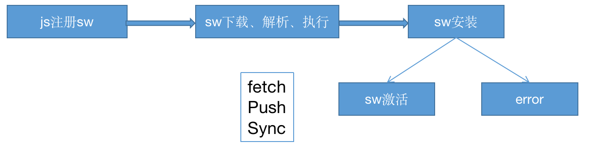

  在注册sw前，需要检查浏览器是否支持。如果支持，就使用navigator.serviceWorker.register函数注册。

  ```js
  // Registering Service Worker
  if ("serviceWorker" in navigator) {
    navigator.serviceWorker.register("./sw.js");
  }
  ```

  当调用register函数时，会通知浏览器下载sw文件并解析、运行sw，如果注册失败，该函数返回的Promise都会执行reject方法。

  ```js
  navigator.serviceWorker.register('./sw.js').then(reg => console.log('SW registered!', reg))
  .catch(err => console.log('Sorry,error occured', err));
  ```

  只要sw注册成功，install事件就会激活。

  ```js
  self.addEventListener("install", function (e) {
   //具体逻辑
  });
  ```

  安装完成后，sw回被激活，并开始控制范围内的所有页面。不过第一次在页面注册 sw 时不会控制页面，直到它再次加载。一旦 sw再生效,它会处于两种状态之一：一种终止sw来节省内存，另一种发起请求，处理请求获取和消息事件。

  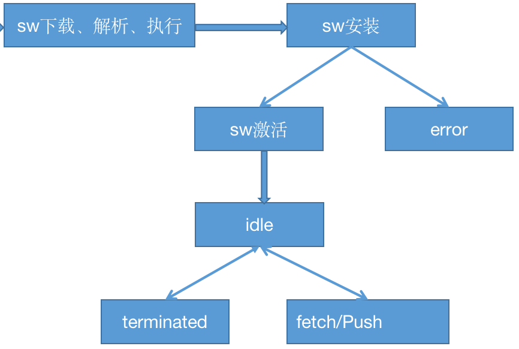

  上面我们介绍了sw的安装过程，那么sw是如何更新的呢？

  1、更新sw的JavaScript 文件
      用户浏览系统时，浏览器尝试在后台重新下载 sw 的脚本文件。经过对比，只要服务器上的文件和本地文件有不同，这个文件就认为是新的。

  2、更新sw脚本文件、启动并触发 install 事件。

  3、这时，当前系统生效的依然是老版本的 sw，新的sw处于 “waiting” 状态。

  4、当页面关闭之后，老的sw会被清掉，新的将接管页面。

  5、一旦新的sw生效，会触发 activate 事件。

  

  有了上面的理论，接下来，我们将以一个天气预报的例子来系统梳理下一个简单PWA应用的开发过程。在开始之前，我们还需要准备三样东西：

  1、UI 外壳 

  用户界面所需要的最小化的HTML，CSS和JavaScript文件，详细的请参考源码部分。ajax请求为了简单起见，借用下fetch库。

  

  2、城市代码

  中国气象局提供了一组API方便查询各城市、自治区、直辖市的代码。具体方法是这样的，首先使用`http://www.weather.com.cn/data/city3jdata/china.html`查询省会的代码，根据某一省会代码，比如说陕西的代码是10111，调用接口

  `http://www.weather.com.cn/data/city3jdata/provshi/10111.html` 获取城市列表，以西安01为例，那么西安市的城市代码即为1011101(省会代码+城市代码)。如果想进一步获得西安下属各区的代码，可以调用接口`http://www.weather.com.cn/data/city3jdata/station/1011101.html`，最终的城市代码是由西安市代码和某区代码联合组成。

  

  3、天气接口

  由易客云提供免费的天气API接口，但是前提是你需要注册一个账号。登录控制台获取APPID和APPSecret，这两项配置需要在查询天气的URL中指定。

现在我们先看下要实现一个什么样的功能，该页面的功能比较简单，选择框选择相应的城市，通过易客云提供的API查询所选城市近7天的天气情况，点击"发送通知"按钮发送通知，界面如下图所示：

> 注意：本实例代码没有

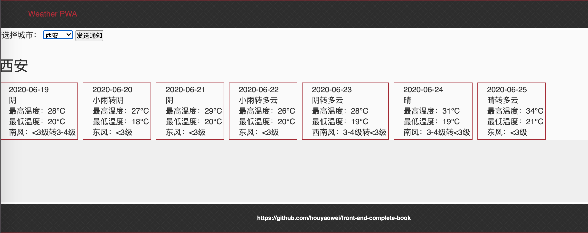

我们先通过上面中国气象局提供的API，查出几个城市的城市代码，西安 (101110101),上海(101020100), 杭州(101210101)等, 构造下拉框：

```html
<section >
  <label>请选择城市：</label>
  <select id="city">
    <option value="101110101">西安</option>
    <option value="101020100">上海</option>
    <option value="101210101">杭州</option>
  </select>
  <button id="notifications">发送通知</button>
 </section>
```

我们还是先看下工程的目录结构

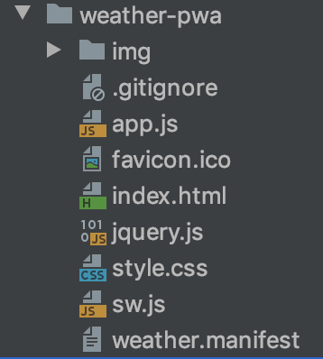

在项目开始，我们先配置下manifest文件、js入口文件和html。先定义weather.manifest文件，这个文件名并没有什么约束，也就是说不一定非要以manifest结尾。文件建好后并输入以下内容：

```json
{
    "name": "weather PWA",
    "short_name": "weather",
    "description": "show some places weather",
    "icons": [
        {
            "src": "./favicon.ico",
            "sizes": "16x16",
            "type": "image/png"
        }
    ],
    "start_url": "./index.html",
    "display": "fullscreen",
    "theme_color": "#B12A34",
    "background_color": "#B12A34"
}
```

在index.html 的header中加入以下，使manifest文件生效。

```js
<link rel="manifest" href="./weather.manifest" />
```

该例子业务部分的入口文件是app.js，主要实现业务逻辑、注册sw、发送通知等。

首先，项目启动自动注册sw：

```js
// Registering Service Worker
if ("serviceWorker" in navigator) {
  navigator.serviceWorker.register("./sw.js").then(res => {
      console.log('Registration succeeded. Scope is ' + res.scope);
  });
}
```

有一个特别要注意是 sw文件的路径问题。在这个例子中，sw文件被放在这个域的根目录下，这意味着 service worker是跟网站同源的。换句话说，这个 service worker 将会拦截到该域下的所有 的fetch 事件。比如 service worker文件被注册到/example/sw.js ，那么 service worker 只能收到 /example/ 路径下的 fetch 事件，这时就需要在注册sw文件时指定scope属性。

```js
navigator.serviceWorker.register('/example/sw.js', { scope: '/example/' })
```

在sw中，首先需要指定文件缓存版本号和需要缓存的文件：

```js
var cacheName = "weather-pwa-v1";
var appShellFiles = [
  "./index.html",
  "./app.js",
  "./style.css",
  "./jquery.js",
  "./favicon.ico",
  "./img/bg.png"
];
```

sw文件被注册后，会执行绑定的install事件，install事件一般是被用来填充你的浏览器的离线缓存能力。为了实现缓存能力，我们使用sw的新的标志性的全局Cache API。 主要有三个API：

open:  打开一个Cache 对象

match: 返回一个promise对象，resolve的结果是跟cache对象中匹配的第一个已经缓存的请求

addAll: 把指定的文件添加到指定cache对象

put：同时抓取一个请求及其响应，并将其添加到给定的cache

> Cache API: https://developer.mozilla.org/zh-CN/docs/Web/API/Cache

```js
// Installing Service Worker
self.addEventListener("install", function (e) {
  e.waitUntil(
    caches.open(cacheName).then(function (cache) {
      console.log("[Service Worker] Caching all: app shell and content");
      return cache.addAll(appShellFiles);
    })
  );
});
```

事件上接了一个ExtendableEvent.waitUntil()方法, 这样做的目的是确保sw不会在waitUntil()里面的代码执行完毕之前完成安装。

```js
self.addEventListener("fetch", function (e) {
  e.respondWith(
    caches.match(e.request).then(function (r) {
      console.log("[Service Worker] Fetching resource: " + e.request.url);
      return (
        r ||
        fetch(e.request).then(function (response) {
          return caches.open(cacheName).then(function (cache) {
            console.log(
              "[Service Worker] Caching new resource: " + e.request.url
            );
            cache.put(e.request, response.clone());
            return response;
          });
        })
      );
    })
  );
});
```

在fetch的事件监听器中，先匹配每个请求，如果在cache对象中能匹配到已经缓存的请求，就返回已缓存的内容，否则就重新发起请求，并将缓存的结果继续放入cache。

到这里，PWA核心部分已经配置完成，现在开始select框选择地区查询天气信息，

```js
document.getElementById("city").addEventListener("change", (e) => {
  //天气API
  let url = `https://www.tianqiapi.com/free/weekappid=68134783&appsecret=PblyiX1y&cityid=${e.target.value}`;
fetch(url).then((res) => {
   return res.json()
}).then(res => {
    currentPlace = res;
      document.getElementsByClassName("weather")[0].innerHTML = buildCard(res.data)
   })
});
```

是时候来看看效果了，初始化加载页面资源情况如下图。

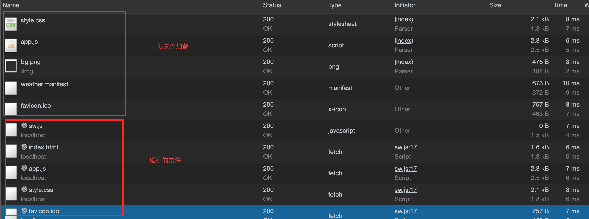

从资源加载情况来看，文件是从站点加载并进行缓存。现在我们刷新下页面或者断掉网络进行测试：

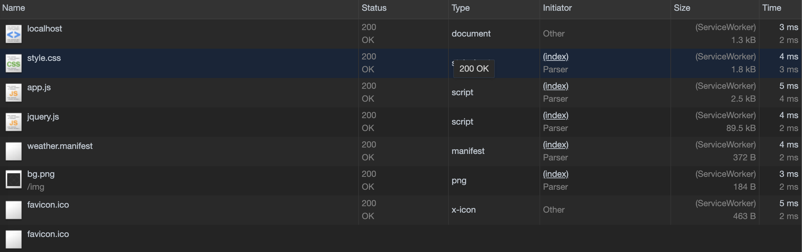

从size的情况来看，这些文件都是来自Service Worker缓存。

在select框中选择"杭州"，来看下数据请求的情况：

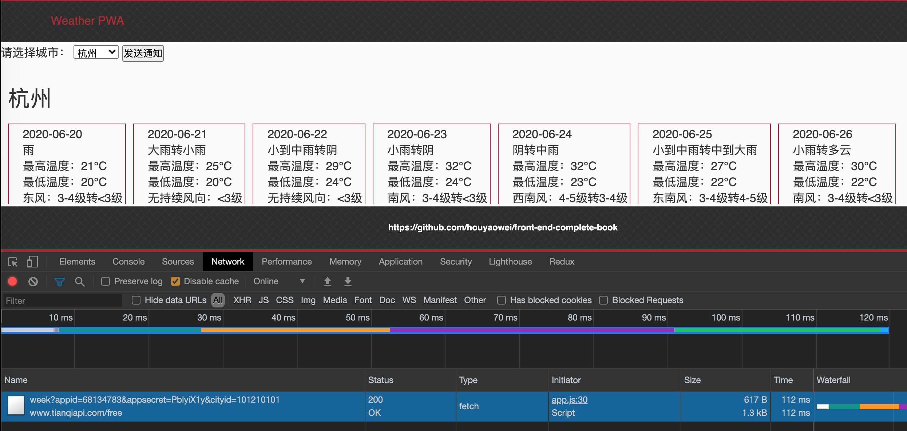

数据来自网络，并且数据正常返回，正常展示。接着，继续刷新页面或者断掉网络进行测试。

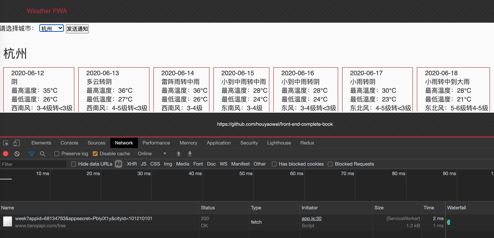

数据来自sw,并且正确返回。


##### 6.2 基于single-spa的微前端实践

single-spa是由JavaScript实现的微前端框架，官网：[https://single-spa.js.org/](https://single-spa.js.org/) 。这个概念是有ToughtWorks在2016年提出，微前端是和后端的微服务相对，将后端微服务的理念应用于浏览器端，即将 Web 应用由单一的单体应用转变为多个小型前端应用聚合为一的应用。各个前端应用还可以独立运行、独立开发、独立部署，从而不影响其他模块的开发、部署。 独立部署的能力为构建孤立、松散耦合的服务提供了可能。

在前端的圈子里，各种轮子在不停的飞，美团的Bifrost, 阿里的icestark,qiankun, 针对angular应用的Mooa,最后就是大名鼎鼎的single-spa。不过很多实践都是基于single-spa进行封装，包括在很多前端社区中能够看到的实现很多也都是基于single-spa的实践，所以我们也以这个实现作为蓝本实现微前端应用的基本骨架。

在介绍single-spa前，先介绍下微前端的实现方式有几种：

1、iframe方式

iframe实现可以让子应用独立开发、部署，然后方便地接入到主应用中，这个方案比较彻底并且用的也最多。但是很多问题去无法避免：页面加载变慢、内部蒙层无法完全覆盖外部页面、双向滚动条的问题、刷新后iframe回到首页的问题......

2、路由分发

路由分发式，即通过路由将不同的业务进行拆分，每个应用独立部署。通常可以通过 HTTP 服务器的反向代理来实现，又或者是应用框架自带的路由来解决。如图：

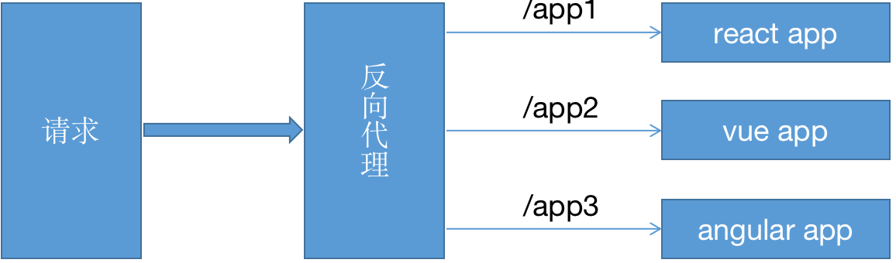

3、微件化

微件化（Widget）是一段可以直接嵌入应用上运行的代码，它由开发人员预先编译好bundle文件，在主应用启动时直接加载，不用做其他的处理。微前端下的微件化是指，每个业务线写自己的业务代码，并将编译好的bundle文件部署到指定的服务器上，运行时在特定模块加载相应的代码。

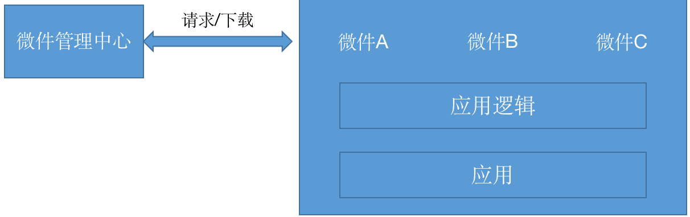

4、web components

它主要由四项技术组成：

- Custom Ellements，开发者可以创建自定义元素。
- Shadow DOM，通常是将 Shadow DOM 附加到主文档 DOM 中，并控制其关联的功能。为DOM和 CSS提供了封装。Shadow DOM 使得这些东西与主文档的DOM保持分离。
- HTML templates，即 `<template>` 和 `<slot>` 元素，用于编写不在页面中显示的标记模板。
- HTML Imports，用于引入自定义组件。

组件拥有自己独立的脚本和样式，以及对应的用于单独部署组件的域名。然而实现过程并不是那么顺利，要直接使用 Web Components来构建前端应用还有很多困难需要面对：

- 重写现有应用的挑战。这一点我想不用再过多解释，这么实现的工作量约等于应用重写的工作量。
- 生态系统不完善。三方组件支持的比较差。
- 系统架构复杂。当应用被拆分为一个又一个的组件时，组件间的通讯就成了一个特别大的麻烦。
- 不是所有浏览器都支持。已经习惯掉队的IE依然不支持，如果应用必须支持IE请绕行吧。

为了能详细介绍single-spa是怎么实现微前端，我们还需要介绍几个前置条件：

- 高性能通用模块加载器systemjs,可以在浏览器中使用各种通用规范(commonjs, AMD,CMD,UMD,ESM)。在single-spa中使用该加载其进行各模块进行动态导入。

- Single-spa: 微前端开发框架之一，支持在少量改造现有应用的基础提供微前端应用的接入能力。

- Import maps规范: 该规范允许控制js的import语句或者import()表达式导入库，并允许在非导入上下文中重用这个映射。

  > Import Maps规范：https://github.com/WICG/import-maps

  ```js
  <script type="importmap">
  {
    "imports": {
      "moment": "****/moment/src/moment.js", 
      "lodash": "****/lodash-es/lodash.js"
    }
  }
  </script>
  ```

  这里需要说明的是，这里配置三方库的地址可以是本地文件，也可以是CDN文件。通过上面的方式安装完import map后，就可以使用import方式导入了

  ```js
  import moment from "moment";
  import _ from "lodash";
  ```

  有时候，可能有这样的场景，在模块中可能要使用某个库的不同版本。这种情况下，有两种解决办法，第一个是在imports中声明两个key值，第二种是在import maps 中加入scopes配置：

  ```js
  {
    "imports": {
      "querystringify": "/node_modules/querystringify/index.js"
    },
    "scopes": {
      "/node_modules/socksjs-client/": {
        "querystringify": "/node_modules/socksjs-client/querystringify/index.js"
      }
    }
  }
  ```

  **querystringify**映射到**/node_modules/querystringify/index.js**,并且 **/node_modules/socksjs-client/querystringify**映射到**/node_modules/socksjs-client/querystringify/index.js**。从扩展性上看在scopes上添加配置的方式更加灵活、语义性也更好，所以推荐这种方式。

  

  有了上面的基础，是时候揭开single-spa的面纱了。在该实践中会接入React项目、vue项目、angularjs项目和angular项目，需要说明的是为了项目的快速集成，每个子项目提供最基础的功能，并且所有子项目和Portal都在同一个工程中，在后续的代码更新中会逐渐完善部署部分、样式隔离部分，......。

  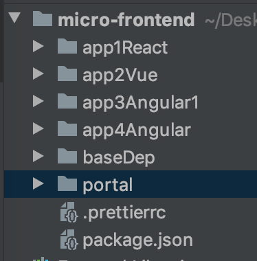

  

  项目的代码结果如上图所示，react、vue、angularjs和angular项目分别对应app1,app2,app3和app4。有一个baseDep需要说明一下，在前端开发中，我们不总是希望把三方的核心开发包打入到bundle文件中，所以就提供一个公共的工程，在工程启动的时候把三方包写入到Portal的systemjs-importmap中。

  在baseDep工程的根目录下新建一个base.js, 先定义需要写入的第三方包，为了区分开发环境或者是生产环境，所以我们分别进行定义

  ```js
  const devLibs = {
    imports: {
      react: "/libs/frameworks/react/react.development.js",
      vue: "https://www.unpkg.com/vue@2.6.10/dist/vue.js",
      "react-dom": "/libs/frameworks/react/react-dom.development.js",
      "single-spa": "/libs/systemjs/single-spa.js"
    }
  };
  const prodLibs = {
    imports: {
      react: "/dist/libs/framework/react/react.production.min.js",
      "react-dom": "/dist/libs/framework/react/react-dom.production.min.js",
      "single-spa": "/dist/libs/single-spa.min.js"
    }
  };
  ```

  定义三方包后，还需要定义一个方法，它需要有这么一种能力，工程启动动态创建script标签，并把上面的配置写入portal，比如方法名就叫做insertNewImportMap 吧,参数即为上面定义的配置对象。

  ```js
  function insertNewImportMap(mapJson) {
    const scriptObj = document.createElement("script");
    scriptObj.type = "systemjs-importmap";
    scriptObj.innerHTML = JSON.stringify(mapJson);
  
    const allImportMaps = document.querySelectorAll('script[type="systemjs-importmap"]');
    allImportMaps[allImportMaps.length - 1].insertAdjacentElement("afterEnd", scriptObj);
  }
  ```

  接下来就可以写Portal部分了,我们先实现一个简单的菜单，点击菜单加载应用，在Portal中，暂时没有提供框架支持，仅使用history的pushState方法进行路由切换。

  > single-spa官网也提供了一个叫navigateToUrl的方法进行路由切换，通过对它的源码进行分析，该方法也是在history的基础上进行封装。
  >
  > 
  
  
  
  页面导航部分：
  
  
  
  对应的HTML代码：
  
  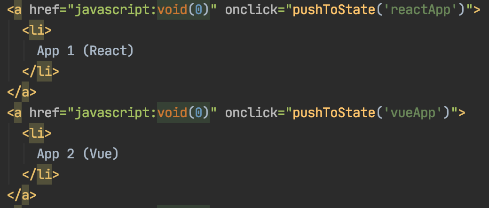
  
  实现一个js跳转的方法，该参数值有个比较重要的作用，就是在注册子应用时，需要一个检测是否激活某个子应用的方法，检测方法如果返回true，single-spa会激活该应用并挂载到相应的节点，如果为false则会unmount这个应用。我们稍后注册子应用时实现这个方法。
  
  ```js
  function pushToState(target) {
     window.history.pushState({}, "title", target);
  }
  ```
  
  在前面我们介绍过，前端的模块开发需要遵循几个规范，最常见的有AMD,CMD,UMD,commonjs，也更加通用。我们现在想一个问题，有了遵循这些规范开发的模块，我们应该已某种方式加载这种规范的实现。在本书的4-4章节中，我们详细地介绍过这四种规范的具体实现，如果有需要可以移步到那里。
  
  在微前端的开发中，官方提供了一个叫做Systemjs的通用模块加载器，可以运行在服务端和浏览器端。有了这个工具可以注册子应用了，single-spa官网提供了一个叫做registerApplication的API来进行子应用注册。
  
  我们先注册4个应用，并提供活动监测函数，函数实现如下：
  
  ```js
  export function prefix(location, ...prefixes) {
    return prefixes.some(prefix => location.href.indexOf(`${location.origin}/${prefix}`) !== -1);;
  }
  export function app1React(location) {
    return prefix(location, "reactApp");
  }
  export function app2Vue(location) {
    return prefix(location, "vueApp");
  }
  export function n1App(location) {
    return prefix(location, "a1App");
  }
  export function n7App(location) {
    return prefix(location, "a7App");
  }
  ```
  
  
  
  注册应用代码
  
  ```js
  import * as isActive from "./activityFns";
  singleSpa.registerApplication("reactApp", () => SystemJS.import ("@portal/reactApp"), isActive.app1React);
  singleSpa.registerApplication("vueApp", () => SystemJS.import ("@portal/vueApp"), isActive.app2Vue);
  singleSpa.registerApplication("a1App", () => SystemJS.import ("@portal/a1App"), isActive.n1App);
  singleSpa.registerApplication("a7App", () => SystemJS.import ("@portal/a7App"), isActive.n7App);
  ```
  
  调用该API注册后，single-spa会在数组中暂存这些应用,如下图源码所示，并把应用状态设置成NOT_LOADED。
  
  ```js
  apps.push({
      loadErrorTime: null,
      name: appName,
      loadImpl,
      activeWhen: activityFn,
      status: NOT_LOADED,
      parcels: {},
      devtools: {
        overlays: {
          options: {},
          selectors: [],
        }
      },
      customProps
    });
  ```
  
  接下来需要调用start方法来启动应用并根据当前URL判断要加载哪些应用，activeWhen保存的即为咱们定义的应用活动监测函数。
  
  ```js
  //app.helper.js
  export function shouldBeActive(app) {
    try {
      //app表示每个已经注册的应用
      return app.activeWhen(window.location);
    } catch (err) {
      handleAppError(err, app);
      app.status = SKIP_BECAUSE_BROKEN;
    }
  }
  ```
  
  试想，当我们切换应用时，single-spa是以什么样的方式呢，在这里做下简单的介绍。single-spa在路由层做了一层拦截，使用注册全局监听的方式。
  
  > 当然也可以通过window.onhashchange= function(){}的方式订阅。
  
  
  
  ```js
  //navigation-events.js
  window.addEventListener('hashchange', urlReroute);
  window.addEventListener('popstate', urlReroute);
  ```
  
  
  
  hashchange事件监听的是URL中锚点的变化，该变化也会导致历史记录栈的变化，常见的改变网页锚点的变化有以下几种方式：
  
  1、直接改变浏览器的地址，在后面拼接或者改变 #hash值。
  
  2、通过API修改 location.href或location.hash的值
  
  3、点击带有锚点的链接
  
  4、点击浏览器的前进、后退按钮
  
  
  
  对于pushState,有了前面的介绍再介绍这个会稍微容易一些。和该API相关的主要有replaceState API和onpopstate事件。pushState是在浏览器的历史记录栈中压入一条新的记录，然后把当前指针就移到这条新的条目上并且激活它，然后改变浏览器的地址。replaceState的用法和pushState一致，只不过它不会历史记录栈中增加新的条目。onpopstate事件的触发比较有特定：
  
  1、有history.pushState或者history.replaceState不触发该事件。
  
  2、在history.go,history.back,history.forward调用的时候触发。
  
  3、hashchange的时候触发。
  
  > 注意:在firefox和Chrome中首次打开页面都不会触发popstate事件，但是Safari会。
  

```js
function urlReroute() {
  reroute([], arguments)
}
```

reroute方法是single-spa的核心，这个方法中主要提供两个作用，第一是如果应用已经启动,就优化需要处理unload、unmount的应用；第二如果应用未启动就加载应用

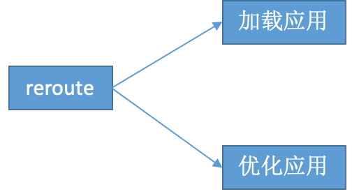

// src/navigation/reroute.js

```js
if (isStarted()) {
    appChangeUnderway = true;
    appsThatChanged = appsToUnload.concat(
      appsToLoad,
      appsToUnmount,
      appsToMount
    );
    return performAppChanges();
  } else {
    appsThatChanged = appsToLoad;
    return loadApps();
  }
```

在上面注册过子应用之后，可以使用singleSpa.start()启动应用

```js
export function start(opts) {
  ...
  if (isInBrowser) {
    reroute();
  }
}
```


##### 子应用加载探究

前面我们介绍过single-spa通过Systemjs加载器加载子应用代码。在内部，Single-spa提供约定声明周期的方法来对子应用进行管理。为了方便理解，我们先以React项目为例，看如何把一个普通的SPA应用改造成一个single-spa的子应用。

为了能加载React子应用，需要先引入react的适配包，single-spa-react,适配包主要的作用就是适配通用的声明周期钩子函数，保证应用可以正确地运行。

先看webpack配置，在entry配置中声明周期函数所在地文件作为入口

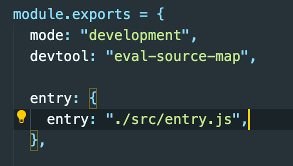

entry.js

```js
import React from "react";
import ReactDOM from "react-dom";
import singleSpaReact from "single-spa-react";
import Root from "./root.component.js";

const reactLifecycles = singleSpaReact({ React, ReactDOM, rootComponent: Root, domElementGetter });

export const bootstrap = [reactLifecycles.bootstrap];

export const mount = [reactLifecycles.mount];

export const unmount = [reactLifecycles.unmount];

function domElementGetter() {
  // Make sure there is a div for us to render into
  let el = document.getElementById("app1");
  if (!el) {
    el = document.createElement("div");
    el.id = "app1";
    document.body.appendChild(el);
  }
  return el;
}
```

在singleSpaReact的构造函数中，需要传入React的核心库、React-dom、rootComponent、和挂载节点的Getter函数。

在domElementGetter方法中，指定React应用挂载到子节点。实例化后会立即把页面挂载到该DOM节点上。

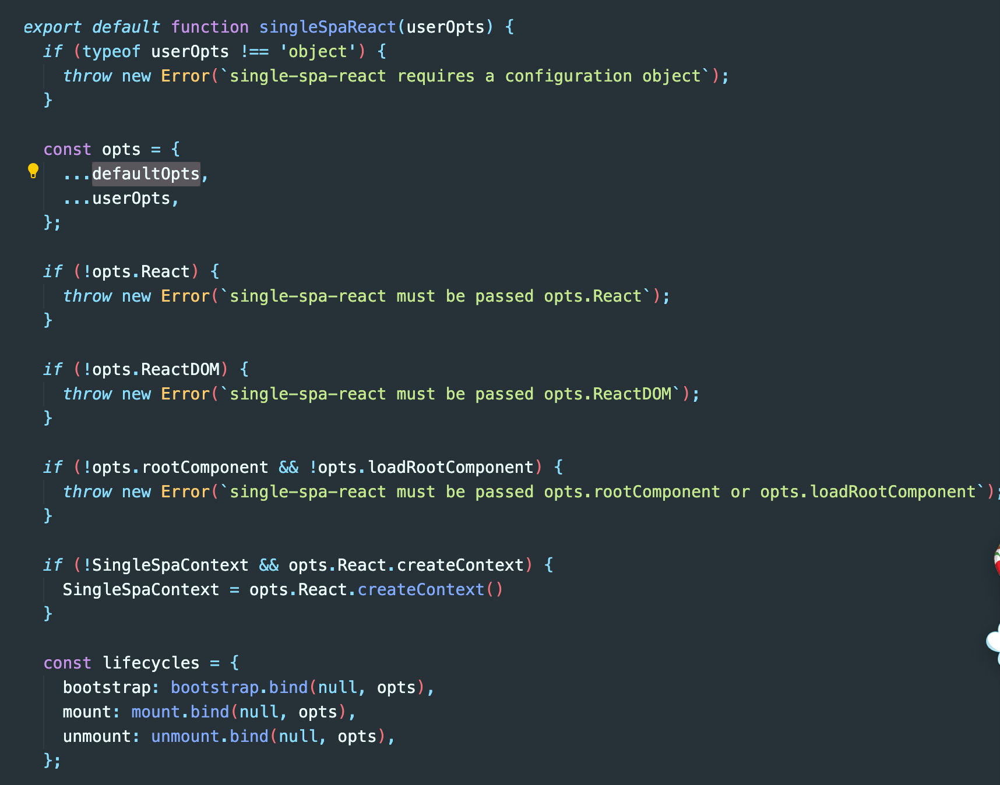

Systemjs是支持多种模块规范的代码加载器，可以支持AMD,CMD,commonjs,ES6等规范。在前面的html文件中我们引入了amd.js, named-reports.jshe use-default.js

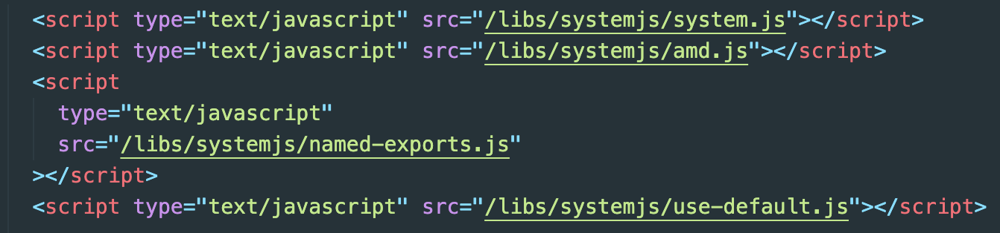

这些库究竟是要完成哪些功能呢，

- amd.js：支持AMD规范实现的模块加载。
- named-exports: 对AMD模块、全局导入的扩展，支持模块按需引入，如 `import {format} from '../tools.js' `,而不是 `import T from '../tools.js';T.format()`
- use-default: 直接返回AMD模块，而不是返回`{default: amdModule}`

> 在ES6 module中有相应的default命令，比如说把某个方法或者变量导出为默认的。
>
> 比如 export default function(){
>
> ​       return "default function" 
>
>    }
>
> 引入的时候就可以使用import func from "文件路径"
>
> func(). //返回 "default function"

通过上面的配置不难发现，各个子应用都会和AMD规范相关。为了使systemjs能够准确地加载子应用，我们就把各个应用打包(webpack)成AMD规范的。

首先需要在webpack的output中配置：

```js
libraryTarget: "amd",
```

libraryTarget是指设置library的暴露方式，具体的值有commonjs、commonjs2、umd,this、var等。

- libraryTarget:“assign”，暴露一个未定义的library设置的变量。在node环境不支持

- libraryTarget:“var”，暴露一个用var 定义的library设置的变量。在node环境下不支持

- libraryTarget:“window”，在window对象上定一个library设置的变量。在node环境下不支持

- libraryTarget:“global”，在global对象上定义一个library设置的变量。受target属性影响，当target为默认值web时，会在window上注册，如果你想在global上注册，必须修改target为node

- libraryTarget:“this”，在当前this对象上定义一个library设置的变量，如果this是window，就在window。在node的环境中，如果没指定require赋值的变量，并不会在指向global。

- libraryTarget:“commonjs”，在export对象上定义library设置的变量。在node中支持，浏览器中不支持。

- libraryTarget:“commonjs2”，直接用module.export导出export，会忽略library设置的变量。在node中支持，在浏览器中不支持。

- libraryTarget:“amd”，在define方法上定义library设置的变量，不能用script直接引用，必须通过第三方模块来时用。

  

  ##### 注意点：

  1、Systemjs不应该被转译：在single-spa实现的微前端应用中，Systemjs是扮演一个加载器的角色，而不应该被其他编译工具干扰，所以在webpack配置js文件加载时需要将此文件排除掉, 在rules中增加如下配置：

  ```js
{
    parser: {
    System: false,
    },
 }
  ```

  2、去掉webpack中splitChunks配置，这项配置我们在第五章性能优化的相关章节中做过相关的介绍，我们在这里再简单介绍一下，有些库包会比较大，如果一起打包的话会导致文件过大，所以应该利用浏览器的并发数，把大文件拆开来。
  
  ```js
  splitChunks: {
    chunks: "all",
    maxAsyncRequests: 5,
    maxInitialRequests: 3,
    cacheGroups: {
      vendor: {
        chunks: "all",
        test: path.resolve(__dirname, "../node_modules"),
        name: "duplication-[hash:5]",
        enforce: true
      }
    }
  }
  ```
  
  上面的配置，我们把所有node_modules中的配置最大加载次数为5的强制打包到 *duplication-[hash:5].js*中  ，以减少主js文件的大小。
  
  如果不去掉这项配置，single-spa是无法正确加载React应用的源文件。
  
  
  
  ##### 配置Vue项目
  
  在日常的web开发中，Vue及其全家桶的范围日益扩大，PC端、APP端都有好的选择，毕竟低门口的入门诱惑，良好的文档结构，强大的社区做支撑想不流行起来也是很难道。最近Vue3.0已进入RC阶段，相信不久就会出GA版。如此架构升级的版本，很是期待。
  
  回到主题，single-spa接入Vue应用无论如何也是一个绕不开的话题。
  
  在上面接入React的项目中，我们详细介绍了各个部分，所以在本小节中接入Vue应用会轻松很多。主要还是有几方面的修改：
  
  1、添加工程的入口文件，并引入single-spa和vue的连接库
  
  ```js
  yarn add single-spa-vue
  ```
  
  并进行实例化，然后添加mount和unmout 声明周期方法
  
  ```
  import singleSpaVue from "single-spa-vue";
  import App from "./App.vue";
  
  Vue.config.productionTip = false;
  const vueLifecycles = singleSpaVue({
    Vue,
    appOptions: {
      el: "#app4",
      render: h => h(App)
    }
  });
  export const bootstrap = [vueLifecycles.bootstrap];
  export function mount(props) {
    createDomElement();
    //window.store = props.globalEventDistributor;
    //window.globalEventDistributor = props.globalEventDistributor;
    return vueLifecycles.mount(props);
  }
  
  export const unmount = [vueLifecycles.unmount];
  function createDomElement() {
    // Make sure there is a div for us to render into
    let el = document.getElementById("app4");
    if (!el) {
      el = document.createElement("div");
      el.id = "app4";
      document.body.appendChild(el);
    }
    return el;
  }
  ```
  
  2、在webpack配置（如果是非vue-cli生成的工具）的module/rules中增加如下配置
  
  ```js
  {
    parser: {
      System: false
    }
  }
  ```
  
  如果是vue-cli生成的工程，需要在vue.config.js的chainWebPack中进行配置。
  
  3、在external中配置不打入bundle包中的三方库，前提是你在公共应用中已经把该三方库写入到import-maps中。
  
  
  
  
  
  #### 6.3 Docker部署前端应用
  
  Docker是dotCloud 开源的一个基于 LXC虚拟化技术使用Go语言开发的一款开源的应用容器引擎，可以轻便灵活地隔离环境，进行扩容，运维管理。
  
  > LXC: Linux Container容器是一种内核虚拟化技术，提供轻量级的虚拟化隔离进程和资源。
  
  Docker 在容器的基础上，进行了进一步的封装，从文件系统、网络连接到进程隔离等，极大的简化了容器的创建和维护。使得 Docker 技术比虚拟机技术更为轻便、快捷。传统虚拟机技术是虚拟出一套硬件后，在其上运行一个完整操作系统，在该系统上再运行所需应用进程，而容器内的应用进程是直接运行于宿主的内核，因为容器内没有自己的内核，从这个角度看容器更加轻量。
  
  现在Docker的应用也越来越多，应用范围也慢慢从运维、后端也慢慢向前端扩展。到底Docker有哪些优质特性做到如此广泛的应用呢，仔细总结一下可能有如下几条：
  
  1、新的虚拟化实现，比传统虚拟机更轻量级。
  
  2、资源利用更高效，因为Docker是直接运行在宿主机上，所以不需要进行硬件抽象。
  
  3、多环境配置一致，Docker的一个关键优势就是提供统一的环境配置，把应用的环境打成镜像的形式向外提供服务，而不用考虑各个环境的差异。
  
  4、持续交付和部署的能力，使用 Docker 可以通过定制应用镜像来实现持续集成、持续交付、部署。开发人员可以通过 Dockerfile 来进行镜像构建，并结合持续集成(CI) 系统进行集成测试，而运维人员则可以直接在生产环境中快速部署该镜像，甚至结合持续部署(CD) 进行自动部署。
  
  5、迁移更简单，该项特性得益于Docker的环境隔离机制。
  
  
  
  现在前、后端都在强调devops的理念，所以前后端的项目部署都趋向于自动化，接下来我们通过一个简单的实例说明借助Docker怎么实现前端的项目部署。
  
  在介绍自动化部署前，先简单回顾下是如何进行刀耕火种般部署的：
  
  首先，使用 `yarn install` 或者`npm install` 安装依赖。
  
  其次，`npm/yarn run build`编译、打包生成静态文件。
  
  最后，把静态文件拷贝到服务器相应的目录下，并配置nginx，如文件路径、端口、跨域请求等。
  
  
  
  这个流程是不是特别的复杂？
  
  编写既然要和Docker打交道，那么少不了要和Docker命令和Dockerfile打交道，为了操作的完整性，还是有必要介绍一下Docker的基本操作和Dockerfile的。
  
  Docker为主流操作系统(Linux,MacOS,windows)提供了安装包，请根据自己的操作系统自行下载。
  
  
  
  Docker架构
  
  Docker使用C/S架构，Client 通过接口与Server进程通信实现容器的构建，运行和发布。client和server可以运行在同一台集群，也可以通过跨主机实现远程通信。
  
  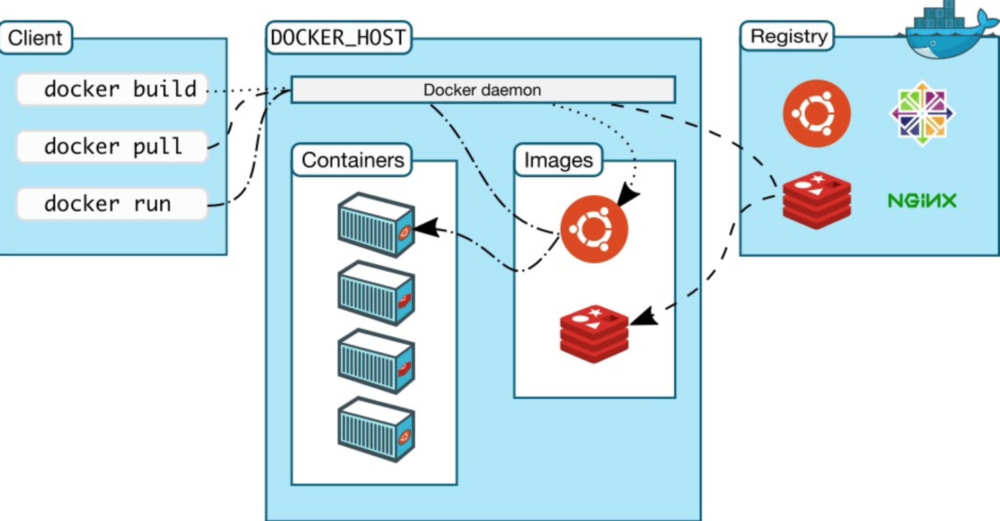
  
  
  
  Dorcker核心概念
  
  镜像（Image）、容器（Container）与仓库（Repository），这三个是Docker中最基本也是最核心的概念，对这三个概念的掌握与理解，是学习Docker的关键。
  
  - 镜像
  
  Docker 镜像（Image）就是一个包含有文件系统的面向Docker引擎的只读模板。任何应用程序运行都需要环境，而镜像就是用来提供这种运行环境的。镜像可以用来创建 Docker 容器，一个镜像可以创建很多容器。Docker 提供了一个很简单的机制来创建镜像或者更新现有的镜像，用户甚至可以直接从其他人那里下载一个已经做好的镜像来直接使用。
  
  - 容器
  
  Docker 利用容器（Container）独立运行的一个或一组应用。容器是从镜像创建的运行实例。它可以被启动、开始、停止、删除。每个容器都是相互隔离的、保证安全的平台。可以把容器看做是一个简易版的 Linux 环境（包括root用户权限、进程空间、用户空间和网络空间等）和运行在其中的应用程序。
  
  容器的定义和镜像几乎一模一样，也是一堆层的统一视角，唯一区别在于容器的最上面那一层是可读可写的。
  
  - 仓库
  
  仓库（Repository）是集中存放镜像文件的场所。有时候会把仓库和仓库注册服务器（Registry）混为一谈，并不严格区分。实际上，仓库注册服务器上往往存放着多个仓库，每个仓库中又包含了多个镜像，每个镜像有不同的标签（tag）。
  
  仓库分为公开仓库（Public）和私有仓库（Private）两种形式。最大的公开仓库是 Docker Hub，存放了数量庞大的镜像供用户下载。国内的公开仓库包括 阿里云 、网易云 ，腾讯云，时速云，daoCloud等，可以提供大陆用户更稳定快速的访问。当然，用户也可以在本地网络内创建一个私有仓库。
  
  当用户创建了自己的镜像之后就可以使用 push 命令将它上传到公有或者私有仓库，这样下次在另外一台机器上使用这个镜像时候，只需要从仓库上 pull 下来就可以了。
  
  
  
  ###### Docker中关于镜像的基本操作
  
  截止到这个章节，默认已经完整好Docker引擎，安装好可以使用命令看下具体的版本号
  
  ```do
  ~ docker -v
  Docker version 19.03.8, build afacb8b
  ```
  
  如果能正常显示版本号，证明已正确安装。
  
  先用docker images命令查看下本地镜像仓库有哪些镜像(如果是新安装的引擎，本地镜像未空)，
  
  ```js
  ~ docker images
  REPOSITORY          TAG                 IMAGE ID            CREATED             SIZE
  
  ```
  
  前面我们已经做过介绍，镜像文件都在镜像仓库中存放。如果想直接使用现成的，可以通过pull命令从hub中拉取现成的镜像文件。顺便提一下，可以在官方的景象仓库(https://hub.docker.com/)中查找是否有现成的镜像文件可以(当然也可以通过docker命令实现，后面会接收)，这就像在前端开发中，为了实现某一个功能在npm仓库中查找三方包一样。
  
  装npm包可以使用npm install xxx或者yarn add xxx，那么该怎么拉取镜像呢？docker中提供了pull命令可以达到这个目的。
  
  在docker hub中有一个hello-world镜像，帮助我们快速上手。这可能就是我们学习一门新语言的习惯吧。
  
  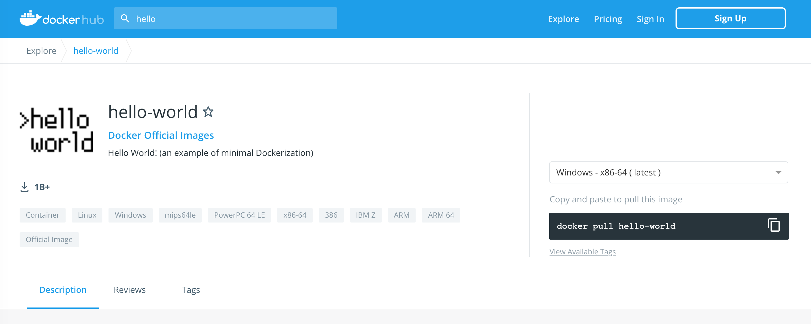
  
  ```js
  ~ docker pull hello-world 
  Using default tag: latest
  latest: Pulling from library/hello-world
  0e03bdcc26d7: Pull complete 
  Digest: sha256:4cf9c47f86df71d48364001ede3a4fcd85ae80ce02ebad74156906caff5378bc
  Status: Downloaded newer image for hello-world:latest
  docker.io/library/hello-world:latest
  ```
  
  拉取一个或多个镜像使用`docker pull`，如果没有指定镜像标签，docker默认使用`:latest`，上面的示例命令就会拉取最新的镜像文件，等同于：`docker pull hello-world:latest`。docker使用内存寻址方式来存储镜像文件，镜像文件ID是通过SHA256摘要方式包含其配置和镜像层。
  
  接下来可以通过`docker images`查看本地已存在的镜像文件：
  
  ```js
  ~ docker images
  REPOSITORY          TAG                 IMAGE ID            CREATED             SIZE
  hello-world         latest              bf756fb1ae65        8 months ago        13.3kB
  ```
  
  列表包含了 `仓库名`、`标签`、`镜像 ID`、`创建时间` 以及 `所占用的空间`。**镜像 ID** 则是镜像的唯一标识，一个镜像可以对应多个 **标签**, 每个仓库可以包含多个 **标签**（`Tag`）,每个标签对应一个镜像。
  
  我们运行一下看看效果：
  
  ```js
  ~ docker run hello-world
  
  Hello from Docker!
  This message shows that your installation appears to be working correctly.
  
  To generate this message, Docker took the following steps:
   1. The Docker client contacted the Docker daemon.
   2. The Docker daemon pulled the "hello-world" image from the Docker Hub.
      (amd64)
   3. The Docker daemon created a new container from that image which runs the
      executable that produces the output you are currently reading.
   4. The Docker daemon streamed that output to the Docker client, which sent it
      to your terminal.
  
  To try something more ambitious, you can run an Ubuntu container with:
   $ docker run -it ubuntu bash
  
  Share images, automate workflows, and more with a free Docker ID:
   https://hub.docker.com/
  
  For more examples and ideas, visit:
   https://docs.docker.com/get-started/
  ```
  
  根据上面的提示信息看，说明镜像文件已经正常工作了。
  
  如果想让启动的容器在后台应用，可以加上-d参数
  
  目前为止我们都是通过镜像名称或者加标签的方式拉取镜像文件，显然这是一种很方便的拉取镜像的方式。如果使用了标签拉取，当你再次使用`docker pull`的时候可以确保你能拉取到最新的镜像文件。例如：`docker pull ubuntu:18.04`便可以拉取最新的Ubuntu 18.04镜像。
  
  拉取一个镜像，需要指定`Docker Registry`的地址和端口号，默认是`Docker Hub`，还需要指定仓库名和标签，仓库名和标签唯一确定一个镜像，而标签是可能省略，如果省略，则默认使用latest作为标签名，另外，仓库名则由作者名和软件名组成。
  
  ```js
  docker pull [选项] [Docker Registry 地址[:端口号]/]仓库名[:标签]
  ```
  
  如果拉取非官方的第三方镜像，则需要指定完整仓库名，如下：
  
  ```js
  docker pull mysql/mysql-server:latest
  ```
  
  当本地有些镜像我们不需要时，那我们也可以删除该镜像，以节省存储空间，不过要注意，如果有使用该镜像创建的容器未删除，则不允许删除镜像。
  
  docker中有两个关于删除的命令，docker rm和docker rmi。docker rmi命令用于删除镜像，docker rm命令容器。
  
  我们先试着删除一下hello-world镜像，看看会有什么效果，是否能像我们预想的那样能直接删除吗？
  
  ```js
  ~ docker image rm hello-world
  Error response from daemon: conflict: unable to remove repository reference "hello-world" (must force) - container 20e8f92b12f5 is using its referenced image bf756fb1ae65
  ```
  
  这是因为在启动镜像的时候，使用`docker run`命令基于镜像创建一个全新的容器，并依据选项来控制该容器。因此需要在先删除容器的情况下才能成功删除镜像。当然，这两个子命令都提供了 -f 命令，可强制删除存在容器的镜像或启动中的容器。
  
  ```js
   ~ docker rmi -f hello-world
  Untagged: hello-world:latest
  Untagged: hello-world@sha256:4cf9c47f86df71d48364001ede3a4fcd85ae80ce02ebad74156906caff5378bc
  Deleted: sha256:bf756fb1ae65adf866bd8c456593cd24beb6a0a061dedf42b26a993176745f6b
  ```
  
  还有一个比较重要的命令就是docker ps，该命令可以查看容器的相关信息，默认只显示正在运行的容器信息，可以查看的信息包含CONTAINER ID, NAMES, IMAGES,STATUS,PORTS等。
  
  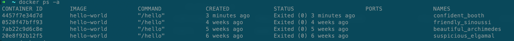
  
  
  
  有了上面的命令基础，下面我们介绍一下docker和前端怎么融合。
  
  构建镜像前，需要先构造一个Dockerfile文件。什么是 Dockerfile？Dockerfile 是一个用来构建镜像的文本文件，文本内容包含了一条条构建镜像所需的指令和说明。
  
  先看一个简单的Dockerfile文件描述
  
  ```js
  FROM node:12.19.0
  
  # 代表生产环境
  ENV PROJECT_ENV production
  
  # 许多场景下会根据此环境变量使用不同的配置。特别是在webpack中打包也会根据此环境变量做出优化
  ENV NODE_ENV production
  
  WORKDIR /code
  ADD . /code
  RUN npm install -g http-server
  RUN npm install && npm run build
  EXPOSE 80
  
  CMD http-server ./public -p 80
  ```
  
  > 注意：Dockerfile指令不区分大小写，但是为方便和参数做区分，通常指令使用大写字母 
  
  
  
  先解释一下每条命令都是用来做什么的，这样再写其他的dockerfile文件更会得心应手。
  
  From命令表示该镜像是基于什么来构建的，换句话说是基于 FROM 的镜像，在有些镜像文件中你看到的可能是`From ubuntu`或者是 `From centos`等，这两个就是基于Ubuntu和centos来构建镜像。
  
  Env命令用来设置环境变量，定义了环境变量，那么在后续的指令中，就可以使用了。设置格式是这个样子的
  
  ```
  ENV <key> <value>
  ENV <key1>=<value1> <key2>=<value2>.
  ```
  
  在上面中，我们设置了两个环境变量ROJECT_ENV 和NODE_ENV
  
  WORKDIR指定工作目录。作用同`docker run -w` 用 WORKDIR 指定的工作目录，会在构建镜像的每一层中都存在。工作目录可以指多个，每个WORKDIR只影响他下面的指令，直到遇见下一个WORKDIR为止。需要注意的是WORKDIR 指定的工作目录，必须是提前创建好的。
  
  Add命令，作用同copy命令，用法也一样，和copy命令不同的是，在执行 <源文件> 为 tar 包的时候，压缩格式为 gzip, bzip2 以及 xz 的情况下，会自动复制并解压到 <目标路径>。这就带来了一个弊端，在不解压的前提下，无法复制 tar 压缩文件。会令镜像构建缓存失效，从而可能会令镜像构建变得比较缓慢。具体是否使用，可以根据是否需要自动解压来决定。
  
  Run命令用于执行后面跟着的命令，如命令`RUN npm install -g http-server` ，等同在命令行全局安装http-server。如果是多条命令可以使用&&连接，到现在你有没有发现和shell命令写法如出一辙呢？其实在以某个基础镜像构建新的镜像时，就没有使用已该基础镜像的命令行。再看一个例子
  
  ```
  FROM centos
  RUN yum install wget
  RUN wget -O redis.tar.gz "http://download.redis.io/releases/redis-5.0.3.tar.gz"
  RUN tar -xvf redis.tar.gz
  ```
  
  现在以centos为基础镜像，在Run中就可以使用yum命令来操作。就像在Ubuntu中使用apt命令。
  
  
  
  EXPOSE仅仅只是声明端口，有两个作用：
  
  1、帮助镜像使用者理解这个镜像服务的守护端口，以方便配置映射
  
  2、运行时使用随机端口映射时，也就是 docker run -P 时，会自动随机映射 EXPOSE 的端口
  
  CMD命令，类似于 RUN 指令，用于运行程序，但二者运行的时间点稍有不同。CMD 在docker run 时运行，RUN 是在 docker build执行。为启动的容器指定默认要运行的程序，程序运行结束，容器也就结束。CMD 指令指定的程序可被 docker run 命令行参数中指定要运行的程序所覆盖。如果 Dockerfile 中如果存在多个 CMD 指令，仅最后一个生效。
  
  
  
  **实例**
  
  了解了上面的命令后，下面通过一个简单的实例来构建一个简单的镜像，显示一个静态html文件并在页面显示“Docker is running”。为了演示效果，我们不引入后台服务，只是通过前端服务器构建。
  
  Dockerfile描述如下
  
  ```dockerfile
  FROM node:12.19.0
  ADD ./index.html /
  RUN npm install -g http-server
  EXPOSE 9001
  CMD http-server -p 9001
  ```
  
  该镜像构建在node@12.19.0的基础上，安装前端http服务器http-server并暴露9001端口
  
  > http服务器可以从https://www.npmjs.com/package/http-server下载
  
  在Dockerfile的同级目录下建一个静态html文件
  
  ```html
  <!DOCTYPE html>
  <html lang="en">
  <head>
      <meta charset="UTF-8">
      <title>Docker test</title>
  </head>
  <body>
      <h3>Docker is running </h3>
  </body>
  </html>
  ```
  
  一切就绪，现在开始通过 Dockerfile 构建一个 test:v1。
  
  ```shell
  $ docker build -t test:v1 .
  ```
  
  > **注**：最后的 **.** 代表本次执行的上下文路径， 指的是 docker 在构建镜像，如果要使用到本机的文件，docker build 命令得到这个路径后，会将路径下查找文件并打包
  
  
  
  打包的过程如下图所示
  
  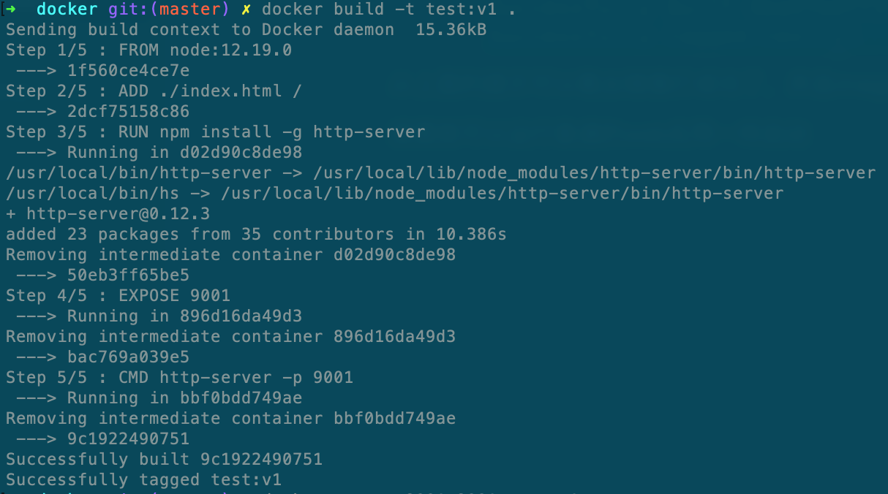
  
  从上面的提示可以看出镜像打成功了，并且image ID为 9c1922490751, tag为v1。我们先看下本地仓库的镜像情况，并确认下新容器
  
  ```shell
  docker images
  ```
  
  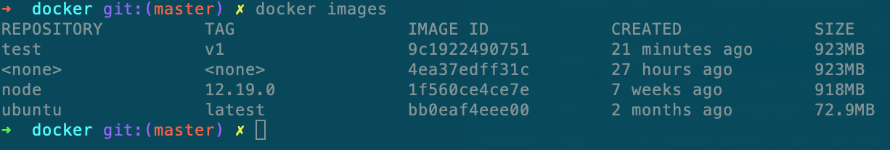确认过镜像没问题后，接着就可以运行看下能否实现我们最初的目标
  
  ```shell
  docker run -p 9001:9001 test:v1
  ```
  
  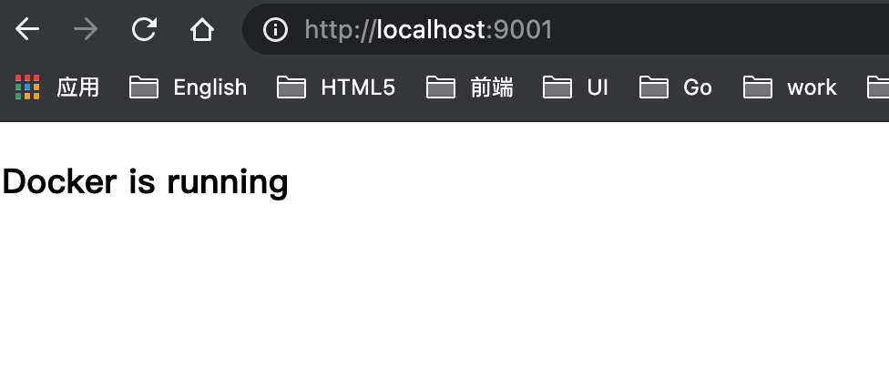
  
  
  
  6.4 聊聊WebAssembly
  
  2018年7月，WebAssembly1.0标准正式发布，使web开发进入到一个新的阶段，web能力有了进一步的延伸，解锁前端开发新技能。web端不再仅有HTML、CSS和JS，更可以加入C、C++、Rust、Go、Dart、Kotlin等开发语言，把中这些语言开发的代码转换成.wsam模块，然后又把`.wasm`模块转出base64，然后在浏览器里执行。
  
  WebAssembly诞生的意义非凡，它提供了一种可能性，使各种语言编写的代码都可以以接近原生的速度在 Web 端运行。
  
  WebAssembly是一种的新兴的网页虚拟机标准，是一个可移植、体积小、加载快并且兼容 Web 的全新格式。为什么该技术就能成为web端性能优化的关键技术之一呢？它的产生背景和过程大概是怎样的呢？
  
  众所周知，计算机只能识别机器代码，编程语言怎么转变成机器代码这就是编译器需要干的事情了。根据编译方式不同可以分为：编译型语言和解释型语言。
  
  对于解释型语言，每次执行程序都需要一边转换一边执行，代码执行到哪里就将哪些代码转换成机器码，用不到的不进行任何处理。
  
  正式因为每次执行程序都需要重新转换代码，所以解释型语言的执行效率天生就有缺陷
  
  Javascript 一开始就是解释性语言，解释性语言的一大特点就是慢，于是 Google 在 2009 年在 V8 中引入了 JIT 技术 (Just in time compiling 即时编译)。 有了这个,Javascript性能有了大幅的提升。
  
  编译型：编译器是把源代码整个编译成目标代码，执行时不再需要编译器，直接在支持目标代码的平台上运行，而且是无限次执行，比如像Java代码，会被编译成class文件。
  
  解释型和编译型这两种翻译方式各有利弊：
  
  解释器启动和执行得更快。不需要等待整个编译过程完成就可以运行代码。从第一行开始翻译，就可以依次继续执行了。
  
  正原因如此，解释器看起来才更加适合 JavaScript。对于一个 Web 开发人员来讲，能够快速执行代码并看到结果是非常过瘾的一件事情。如果像for循环那么频繁执行代码会咋样呢？每次执行都需要解释，这时候解释器的弊处就显现出来了。解释器就不得不一次又一次的“干活”，势必会影响代码的执行效率。
  
  编译器的问题则恰好相反。它需要花更多的时间对整个源代码进行编译，然后生成目标文件。即便是对于有循环的代码执行得也会很快，因为它不需要重复编译。
  
  
  
  JIT(Just-in-time)
  
  JIT结合了上面两种编译的优点，在 JavaScript 引擎中增加一个监视器（也叫分析器）。监视器监控着代码的运行情况，记录代码一共运行了多少次、如何运行的等信息。如果同一行代码运行了几次，这个代码段就被标记成了 “warm”，如果运行了很多次，则被标记成 “hot”。
  
  基线编译
  
  如果一段代码变成了 “warm”，那么 JIT 就把它送到编译器去编译，并且把编译结果存储起来。代码段的每一行都会被编译成一个“桩”（stub），同时给这个桩分配一个以“行号 + 变量类型”的索引。如果监视器监视到了执行同样的代码和同样的变量类型，那么就直接把这个已编译的版本 push 出来给浏览器。通过这样的做法可以加快执行速度，除了这个手段，编译器还可以通过“优化”更有效地执行代码。
  
  
  
  

